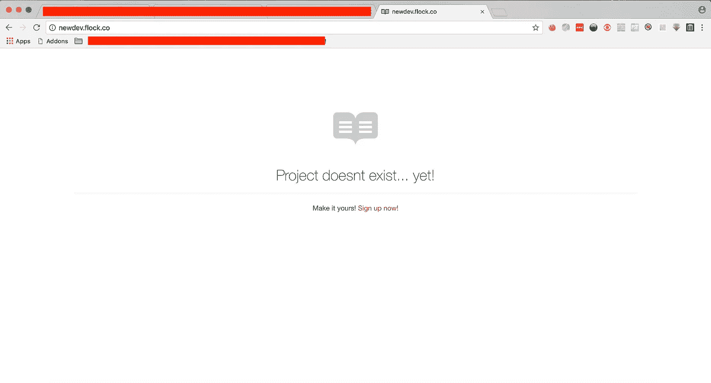
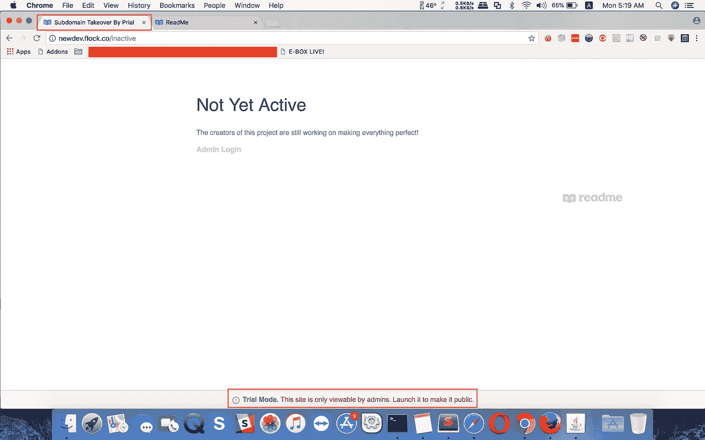

# 子域接管会导致自定义域的项目设置配置错误。

> 原文：<https://infosecwriteups.com/subdomain-takeover-dew-to-missconfigured-project-settings-for-custom-domain-46e90e702969?source=collection_archive---------0----------------------->

嗨，读者们，

今天我将写关于**子域接管**。这是一个常见的安全问题，实际上是开发人员的错误，他们留下了一个未使用/无人认领的第三方服务 DNS CNAME 记录作为他们的子域名，黑客可以在外部服务的帮助下声称这些子域名，这可能会导致严重的问题。你可以从 [detectify 博客](https://labs.detectify.com/2014/10/21/hostile-subdomain-takeover-using-herokugithubdesk-more/)了解更多关于子域接管的信息。

在测试 flock 的时候，我得到了一个 flock company 旗下的域名**flock.co**。所以我开始查看它的子域，得到了子域[newdev.flock.co](http://newdev.flock.co)。当我在浏览器中访问子域时，我得到了如下截图所示的错误



错误页面

这引起了我的注意。所以我查了这个域名的 DNS 记录。

```
**$ dig newdev.flock.co**; <<>> DiG 9.10.6 <<>> newdev.flock.co
;; global options: +cmd
;; Got answer:
;; ->>HEADER<<- opcode: QUERY, status: NOERROR, id: 13182
;; flags: qr rd ra; QUERY: 1, ANSWER: 4, AUTHORITY: 0, ADDITIONAL: 1;; OPT PSEUDOSECTION:
; EDNS: version: 0, flags:; udp: 512
;; QUESTION SECTION:
;newdev.flock.co. IN A;; ANSWER SECTION:
**newdev.flock.co. 299 IN CNAME cname.readme.io.**
cname.readme.io. 299 IN CNAME readme-cache-prod-1392018356.us-east-1.elb.amazonaws.com.
readme-cache-prod-1392018356.us-east-1.elb.amazonaws.com. 59 IN A 52.0.214.29
readme-cache-prod-1392018356.us-east-1.elb.amazonaws.com. 59 IN A 52.5.249.117;; Query time: 69 msec
;; SERVER: 8.8.8.8#53(8.8.8.8)
;; WHEN: Mon Jul 09 04:58:06 +06 2018
;; MSG SIZE rcvd: 175
```

根据上面的记录，我们可以说子域指向 **CNAME cname.readme.io。**所以我开始在 [readme.io](https://readme.readme.io/docs/setting-up-custom-domain) 网站上查看自定义域文档，以了解它们是如何工作的。从他们的文件中我了解到:-

*   您需要一个指向您的 **readme.io** 子域[**your subdomain . readme . io**]的子域。
*   您的子域应该在以下页面的域设置中进行配置**https://dash.readme.io/project/<项目
    _ Name>/v 1.0/domains**

因此，为了接管，我需要检查 **cname.readme.io** 是否已经被声明不存在。但不幸的是已经有人认领了:(。但是我看到许多这样的服务并不强迫用户通过使用相同的 CNAME txt 记录来验证他们的域名所有权，就像他们的服务子域一样。所以还有希望。

在 **readme.io** 开了一个账号，得到了一个子域 **newdev.readme.io** 。然后我去域设置[](https://dash.readme.io/project/newdev/v1.0/domains)****并在自定义域字段中使用作为值并**保存**的修改。****

****现在当我访问[newdev.flock.co](http://newdev.flock.co)时，它把我重定向到[http://newdev.flock.co/inactive](http://newdev.flock.co/inactive)这个页面，现在还没有激活。****

********

****见页面标题；)****

****这是因为我使用的是一个试用账户。在网页标题中，你会看到我的项目名称，我在创建项目时使用的名称。所以现在这个域名正在为我提供来自 **newdev.readme.io** 项目页面的内容。****

******如何避免此类问题？:-** 随时更新你的 DNS 记录。删除 CNAME 或任何其他不使用的 DNS 记录。****

****如果你发现一个安全漏洞，请随时通过 security@flock.com 联系他们****

****感谢阅读。你可以随时在脸书找到我:-[https://www.facebook.com/prial261](https://www.facebook.com/prial261)****