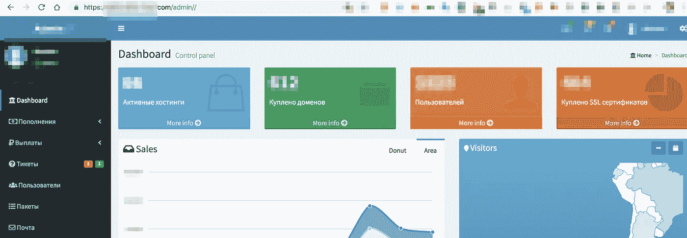
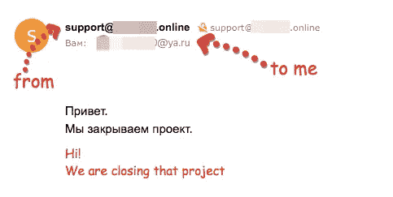
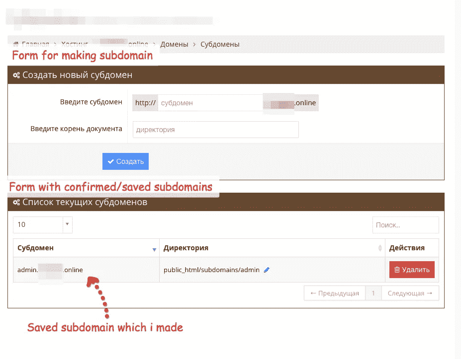

# 子域接管—新级别

> 原文：<https://infosecwriteups.com/subdomain-takeover-new-level-43f88b55e0b2?source=collection_archive---------1----------------------->

最近，我开始收到让 pentest 为一些项目工作的请求(又名私人 bug bounty)。在这样的项目中，我尽最大努力为客户创造成果，并从过程中获得最大的乐趣。但是最后一个项目的结果却让我震惊。

我被要求为一个主机提供商做一个 pentest。

我不会透露那家公司的名字。在我的故事中，我将使用“Hoster”这个名字。与托管服务网页一切都是标准。提供购买 VDS，域名，SSL 证书。

首先，我对用户的个人账户是如何实现的感到惊讶。注册时不需要证明电子邮件地址的所有权。Ie 可以用电子邮件地址[steve.jobs@apple.com](mailto:steve.jobs@apple.com)注册。或者更好——support@hoster.com。

但幸运的是，类比[这样的故事](https://medium.com/intigriti/how-i-hacked-hundreds-of-companies-through-their-helpdesk-b7680ddc2d4c)，敏感信息支持服务的泄露并没有发生。

然而，当我创建一个支持测试请求并立即检查其他支持请求的相邻 id 的可用性时，它确实发生了。令人惊讶的是，他们是可用的。并且可以观察到谁和什么在那个主人那里注册。以及用户面临什么样的问题。一般来说，这是一个常见的 IDOR 漏洞，目前没有人对此感到惊讶。已经尽快修好了。

还有几个地方储存了 XSS。还有一个盲人 XSS 把服务管理员的饼干还给了我。多亏了这个 XSS，我才能够找到管理员界面的位置，总体来说，我发现了很多有趣的信息。

*   有多少活跃用户。
*   控制了多少个域。
*   部署了多少 VDS？
*   支付记录。

还有一些其他的东西…

CSRF 令牌有各种各样的问题，允许代表用户在我的帐户上做许多危险的事情。如果有实施 CSRF 代币的地方。没有人计划在后台检查它们。根据我的发现，一些功能被完全禁用了。例如，2FA 身份验证由于没有很好地实现而被决定暂时删除。

在我的工作过程中，我不仅关注安全问题，还关注一些功能操作中的实现错误或问题。作为一名质量工程师，我不能错过这个机会。总之，我的问题追踪器达到了 22 个。我发现了很多问题。

结果非常令人信服。我已经计划完成这个项目。但出于某种原因，我又想起了注册时没有确认电子邮件地址所有者的问题。在这里，我开始发明一些情况，在这些情况下，这可能会给托管公司及其所有者带来最大的问题。在某些时候，我开始思考这个托管服务的所有者与同一公司的其他项目的联系。几分钟后，我用该公司另一个项目的邮箱地址注册了一个账户(就叫[support@example.com](mailto:support@example.com))。然后我设法将域名 example.com 链接到我创建的账户 suppot@example.com。但是我仍然无法控制链接域的内容。

但是完全可以代表 example.com 服务发送电子邮件。对网络钓鱼攻击来说是件好事。

我不知道回信是从哪里来的。因为我给自己回了一封这样的测试信。但是我没有得到答案。很可能它回到了邮箱的真正主人 support@example.com。

这里发生了一些有趣的事情，我决定写这篇文章。

我设法解决了被遗忘的子域。经典子域接管漏洞。你可以在这里阅读它的详细内容[。](https://labs.detectify.com/2014/10/21/hostile-subdomain-takeover-using-herokugithubdesk-more/)

我不知道为什么，但我试图添加一个绑定到一个不存在的域。

我做到了！！！子域已成功创建/添加，我可以控制这个子域的内容！！！并且显示了内容！

等一下。为什么毕竟，经典的子域接管漏洞只对已经存在的子域起作用。我们不允许制造新的…

这种情况还不清楚。也就是说，好吧，我能够绕过对我和 example.com 关系的验证，这从来就不是我的(可能要感谢我的账户名中的 example.com)。但是，在 DNS A、TXT、CNAME 记录中没有任何检查组件的情况下，怎么可能添加子域并控制它们呢？

通常是这样的——我们会给你加一个子域，只有你证明你能做到。转到 DNS，将散列 omnomnomtom0110 添加到 TXT。

但是没有这回事。你想要 admin.example.com 子域吗？没问题！

好像这个漏洞——子域接管 V2。

我能够与正在测试的托管服务的所有者交流，他们打开了一点潘多拉的盒子。

结果是这样的。通过 CloudFlare 进行托管。他以一种非常巧妙的方式工作。我会试着用简单的语言给你解释。

大致说来，我是告诉你，去找我，我会招待你的。把你的域名委托给我。
然后我将所有来电发送到 CloudFlare，认为它们是正确的。
如果我受托管理 president.com 的**域名，而一个邻居过来与 notour.president.com**一起做了一个网站**并交给我托管，那么我的服务器，可以访问 CloudFlare 并已经拥有 president.com**的所有权限**，将会毫无疑问地快速为一个邻居添加三级域名。来自 CloudFlare 的所有 DNS 信息都是正确的。CloudFlare 信任我作为托管人。**

当然，大多数主机提供商配置自己的 DNS 服务。但该公司只是将所有内容从一个已配置的用户转移到了 CloudFlare。

所以我们有一个子域接管 V2。当然，这只适用于那些已经被托管服务控制的地址。但是结合之前发现的管理服务——这可能会与托管者和托管服务客户端开一个昂贵的玩笑。

目前，几乎所有的关键漏洞和错误都已修复。我希望没有其他人在读完这个故事后会决定做出这样的建筑作品。