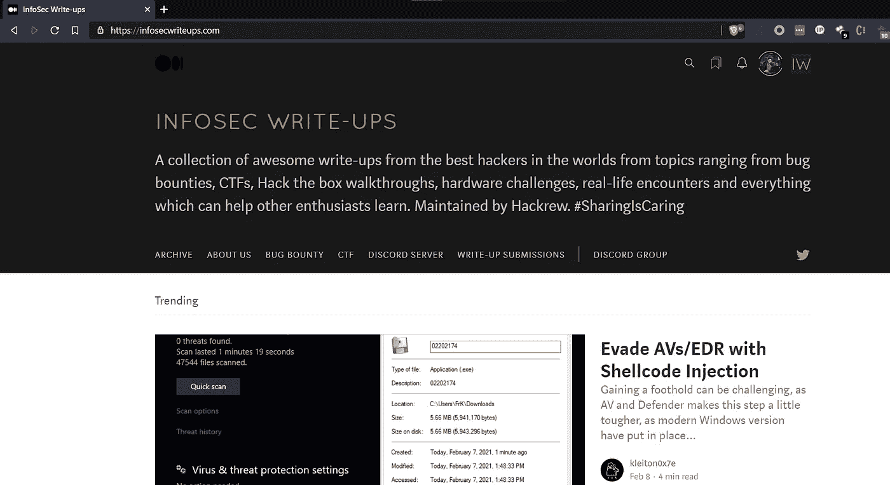

# 提交指南— InfoSec 报告

> 原文：<https://infosecwriteups.com/submission-guidelines-3952000f119?source=collection_archive---------0----------------------->

## 如何在 Medium 最大的 infosec 相关文章库中发表文章。

InfoSec 书面出版物

欢迎来到**。本出版物旨在为您提供一个去处，您可以在此找到一系列优秀黑客撰写的精彩文章，这些文章的主题从 bug 奖金和 CTF 到 vulnhub 机器、硬件挑战以及在 Medium 上发表的真实遭遇。它旨在帮助信息安全社区的人们分享和讨论新的想法和方法，并相互学习。**

**很多读者都没有意识到这一点，但你可以在任何帖子上鼓掌 50 次。所以，如果你喜欢一样东西，不要多想；多留点掌声。**

# **与 Infosec 联合发布意味着什么**

*   **该故事仍将出现在您的个人资料页面上。**
*   **作为作者，你保留你的故事的所有权利。**
*   **如果您在 Infoesec Writeups 上发布您的故事，除了您自己的关注者之外，我们的 20，000+关注者也会看到您的故事。**
*   **我们还在拥有 7000 多名粉丝的[活跃 Twitter 页面](https://twitter.com/InfoSecComm?ref_src=twsrc%5Egoogle%7Ctwcamp%5Eserp%7Ctwgr%5Eauthor)上分享了这个故事的链接。**
*   **我们还与我们的 [Discord 社区](https://discord.com/invite/4DZpgvV)分享我们的故事，该社区有大约 3000 多名来自 infosec 社区的活跃成员。**

# **如何提交？**

## **如果您没有被添加为作者**

**在你继续写这篇文章之前，这里有我们的**视频格式的投稿指南(有一些快速格式化技巧)**(由我们的编辑 [Anangsha Alammyan](https://medium.com/u/6e2475a6e38a?source=post_page-----3952000f119--------------------------------) 主讲):**

## **小贴士:**

1.  **试着在你的文章中嵌入图片，这样读者就能明白你到底想解释什么。**
2.  **使用中等文本编辑功能来突出显示、引用等。，并使其看起来更具视觉吸引力。**
3.  **如果你必须嵌入大块的代码，考虑使用[https://gist.github.com/](https://gist.github.com/)。**
4.  **如果你想更进一步，使其语法正确，你可以尝试使用[https://app.grammarly.com/](https://app.grammarly.com/)。**
5.  **尽量让报告简短(大约 6 分钟读完)。如果不可能，把它分成几个部分，把链接附加到其他部分的下面。**
6.  **上传视频到 Youtube，然后就可以嵌入了。**
7.  **如果你使用来自某个地方的图片，在图片标题区域给出正确的来源。**

**如果你认为这份出版物是你写文章的好地方，而你还不是这份出版物的作者，请发送一封邮件，附上你的媒体简介链接，主题为“【InfoSec 文章作者”至 contact@infosecwriteups.com**。****

## **如果我们的编辑选择了你的文章**

**我们的编辑总是寻找在媒体上发表的优秀作品，与我们的观众分享。如果我们的一位编辑在你的故事上留下了私人笔记，要求你提交它，以下是你可以做的。**

**根据 [Medium 的官方指南](https://help.medium.com/hc/en-us/articles/213904978-Add-draft-or-post-to-publication)，向 Infosec 投稿。**

1.  **打开您要提交的故事。点击右上角的**三点按钮**，然后**编辑故事**进入编辑模式。**
2.  **在编辑模式下，点击页面右上角的**三点按钮**打开你的故事设置。**
3.  **从下拉列表中选择**添加到出版物**。**
4.  **选择**信息安全记录**并点击**保存**。**

**最好提交草稿进行发布，而不是提交之前发布的帖子。提交的草稿将在 24 小时内发布。**

**我们开始规模很小，但获得了很大的吸引力，追随者的数量不断增加。所以我们也决定尽可能多的增加好的作者，继续提供好的、令人兴奋的内容。**

****请注意**Infosec Writeups 保留在文章底部添加相关文本和/或链接的权利。这不会影响你的可读性或上下文。只有提交文章给我们，如果你同意这一条款。**

**谢谢你。**