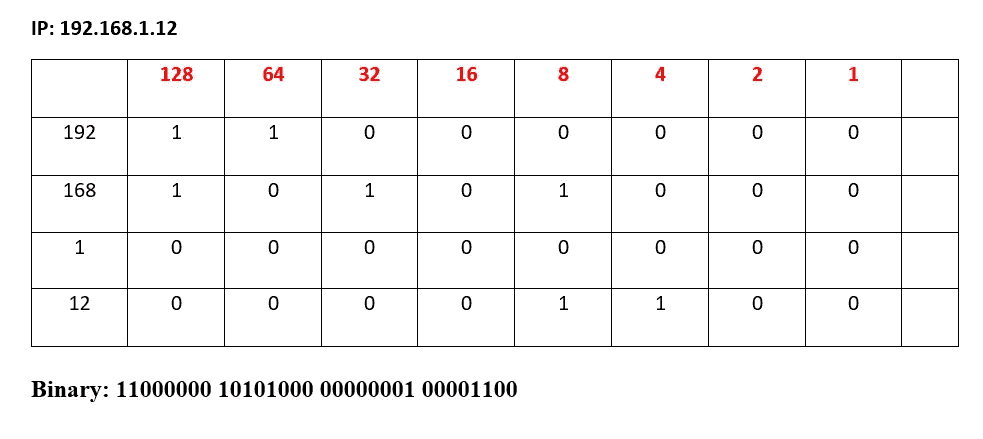
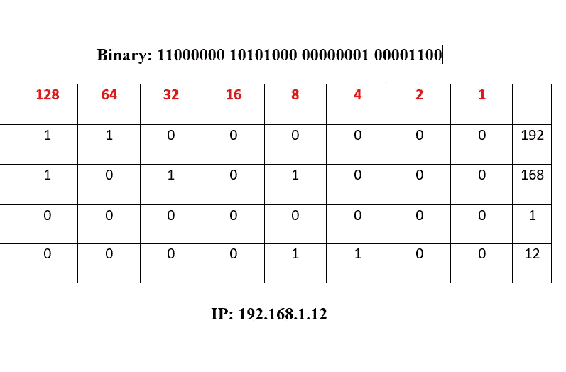
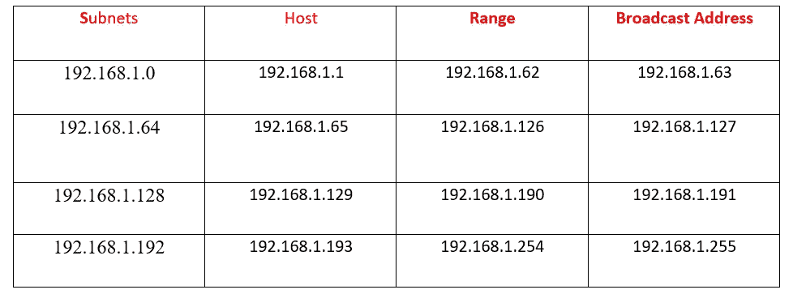

# 子网划分—一个网络概念

> 原文：<https://infosecwriteups.com/subnetting-a-networking-concept-161a82aff954?source=collection_archive---------0----------------------->

大家好，阿尤什这边，今天我要告诉你一个重要的网络概念，即**子网划分**。

在进一步阅读之前，您应该了解一些基本的网络概念，如 IP 地址、**、(/24、/16、/8)** 等。

所以不浪费时间，让我们开始吧:)

## 什么是子网划分？

> 子网划分就是将网络分成不同的部分，假设您的商店或公司有一个网络，您想将您的网络分成 4 个部分，因此我们使用子网划分。

在进入实际部分之前，你应该知道下面给出的备忘单，这将帮助你把 ip 转换成二进制和二进制转换成 ip。如果你知道 Ip 地址，你就会知道 IP 地址被分成 32 位的 1 和 0。

# 128 64 32 16 8 4 2 1 —备忘单

现在让我们举一个例子，假设你有一个 IP 地址 **192.168.1.12** ，它的二进制形式是**110000000 101000000000000100000000000010000010000001**

我们是如何做到这一点的，我们是在上述备忘单的帮助下做到的，看到了吗

这里 **192=128+64** ，那么我们就把 128 和 64 看成 1，其他看成 0。所以，192 的二进制形式将是: **11000000** 。接下来

168= **128+32+8** ，所以我们就把 128，32，64 看成 1，其他看成 0。所以，二进制形式的 168 将是 **10101000**

1= **1** 所以二进制将是 **00000001**

12= **8+4** ，所以我们将 8 和 4 视为 1，其他视为 0。所以，二进制形式将是 **00001100** 。

我希望知道它应该是清楚的。

现在，接下来我们必须将二进制转换为 ip，我们将考虑相同的 IP，您只需添加显示 1 的数字，这将给出您的 IP，如下所示:

现在，我们完成了转换，我们将看到实际的子网划分部分，因此，我们以一个网络为例: **192.168.1.0** ，我们必须将其划分为 4 个子网(4 个网络)。所以它是重击 24 IP (/24)并且对于/24 子网掩码将总是 **255.255.255.0**

现在，**第一步**:将给定的 IP 和子网掩码地址转换成二进制:

**192 . 168 . 1 . 0 = 110000000 101000000000000010000000000**

**255 . 255 . 255 . 0 = 111111111.11111111.0000000**

**第二步:**现在我们知道我们需要 4 个子网，然后根据子网的数量，我们使用一个公式 2^y，其中 y 是我们在子网掩码的最后一个八位字节中移动的位数。在这种情况下，我们将使用 2 =4，因此我们将在子网的最后一个八位位组中移动 2 位，但如果我们需要 5 个子网，那么我们将使用 2 = 8，然后我们将移动 3 位，但在这种情况下只有 2 位。

现在，我们将对网络 ID 做同样的事情，找到最后一个八位字节中的最小值，直到这条红线，然后将最小值添加到最大值。

现在我们将**在 IP 地址的最后一个八位字节中添加** **最小值**64，直到**最大值**192。

第一个子网:192.168.1.0

第二个子网:192.168.1.64

第三个子网:192.168.1.128

第四个子网:192.168.1.192

我希望你有子网划分的概念，如果你认为这是有价值的，那么请与你的朋友分享，并为之鼓掌:)

如果你想在 instagram 上关注我，点击[这里](https://instagram.com/_3xabyt3_)。

谢谢你

快乐学习！