# 日落-午夜-Ctf-穿越🌄

> 原文：<https://infosecwriteups.com/sunset-midnight-ctf-walkthrough-db742cb7ee04?source=collection_archive---------0----------------------->

今天我们要解决另一个名为“日落:午夜”的 boot2root 挑战。它可以在 VulnHub 进行渗透测试。在这里，我 Shreya Talukdar 介绍日落午夜 ctf 走过。让我们开始学习如何成功地分解它。

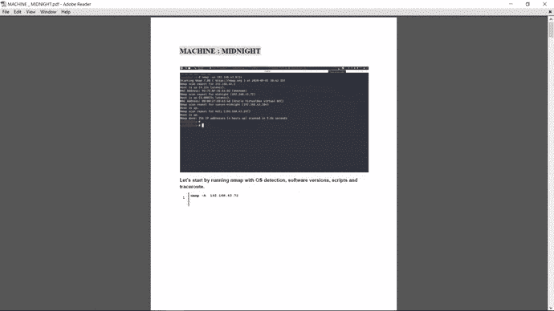

# 🐞渗透测试方法

# 侦察

▪️ Nmap

# 列举

▪️Hydra 强力 MySQL 服务

# **剥削**

▪️ WordPress 管理员的密码修改
▪️修改代码建立 web 外壳

# 权限提升

😎滥用回收密码
😎没有固定加载路径的二进制滥用
😎夺旗

# 用法！！

👻通过使用 nmap

## -sn 192.168.0/24

我们首先看到连接到主机的网络。基本上是 ping 扫描
👻在我们获得虚拟机的 ip(易受攻击的机器)后，我们使用

## nmap -A

👻之后，我们将 IP 地址和“sunset-midnight”主机添加到我们的“/etc/hosts”中，正如机器的创建者在描述中所指出的。就像我的情况一样:

## 日落时分至午夜

👻然后我们列举目标，看到它在 WordPress 中

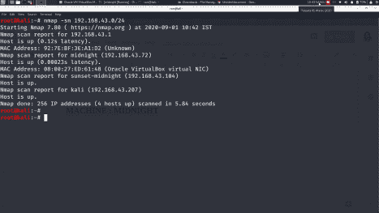

## 让我们从运行带有操作系统检测、软件版本、脚本和跟踪路由的 nmap 开始

**nmap -A 192.168.43.72**

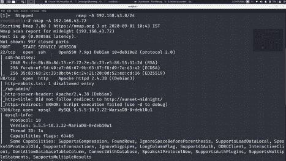

我们将 IP 地址和“sunset-midnight”主机添加到我们的“/etc/hosts”中，正如机器的创建者在描述中所指出的。

**枚举**

我们访问网络服务，找到一个用 CMS WordPress 开发的网站。

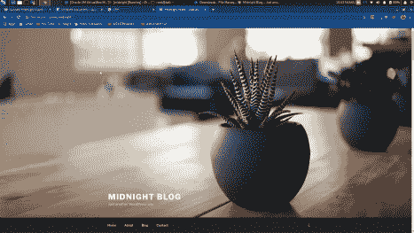

**我们通过 WPSscan 扫描一下吧。**

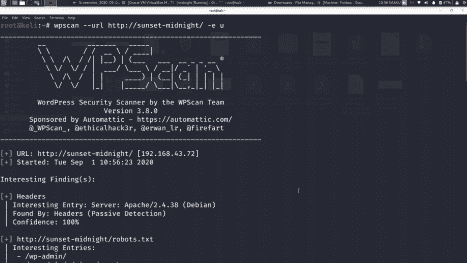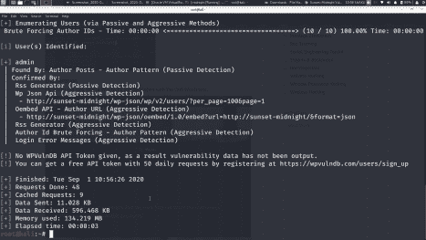

让我们尝试使用 kali 中的默认单词列表(即**/usr/share/word lists/rock you . txt**)通过 bruteforce 方法获取管理员登录凭据:

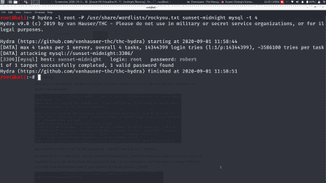

**现在，让我们登录 mysql 数据库:**

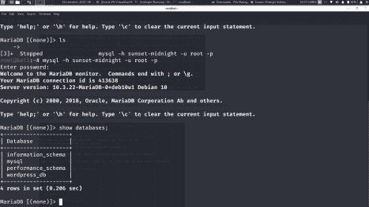

**可以看到，我们使用密码“robert”成功登录 mysql 数据库**

**让我们选择 wordpress_db 并列出表格:**

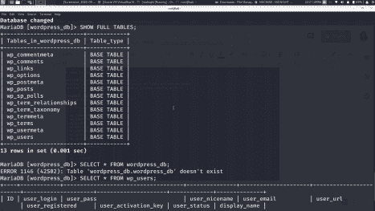

**下面给 wp_users 列出内容:**

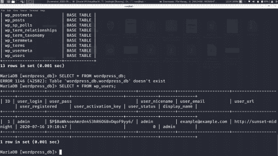

**让我们更新管理员密码，这样我们就可以成功登录:**

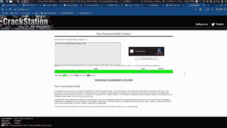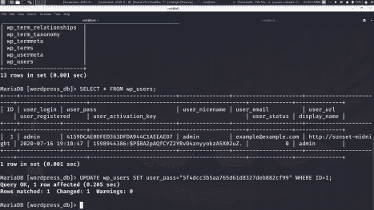

我们更新了单词“password”的散列形式，因此我们成功登录。用户名:管理员密码:密码:D

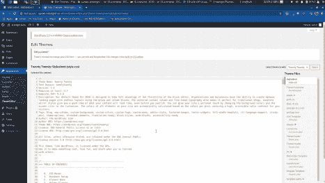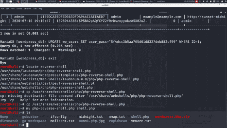

**现在我们需要编辑 shell.php 文件。将 ip 重新命名为您的基本操作系统的 ip，kali 即 192.168.43.104(对于我)和 port as 9001(如您所愿)。**

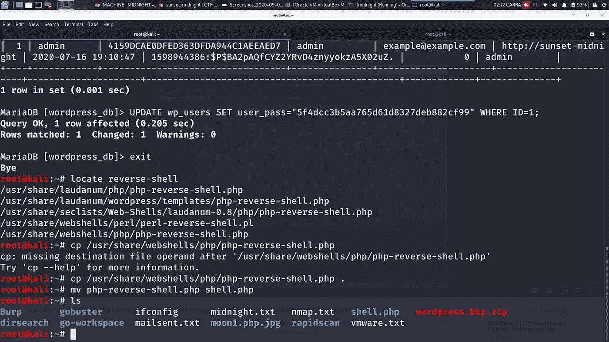

现在我们需要编辑 shell.php 文件。将 ip 重新命名为您的基本操作系统的 ip，kali 即 192.168.43.104(对于我)和 port as 9001(如您所愿)

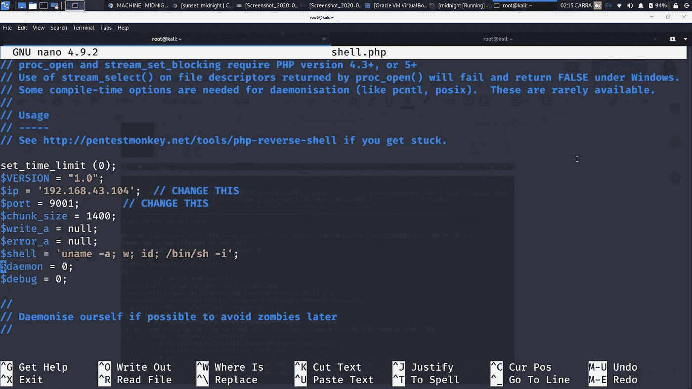

现在让我们复制 shell.php 的内容，并尝试上传到主题编辑器中。

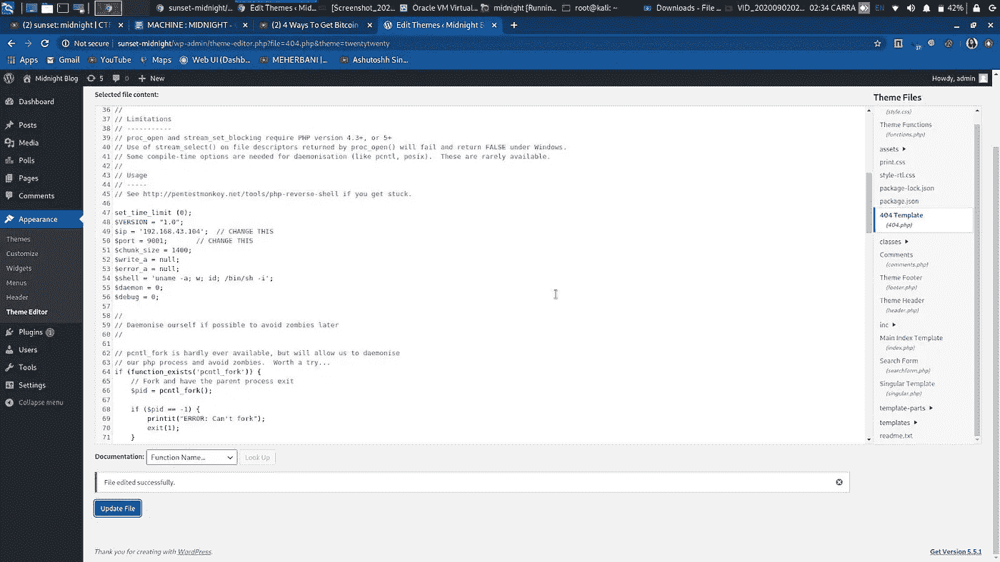

在这里，我们可以看到文件在 404 模板中被成功更新。

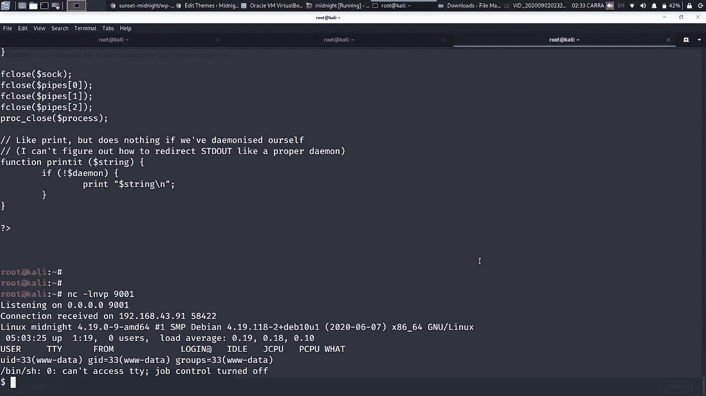

现在让我们访问 shell:

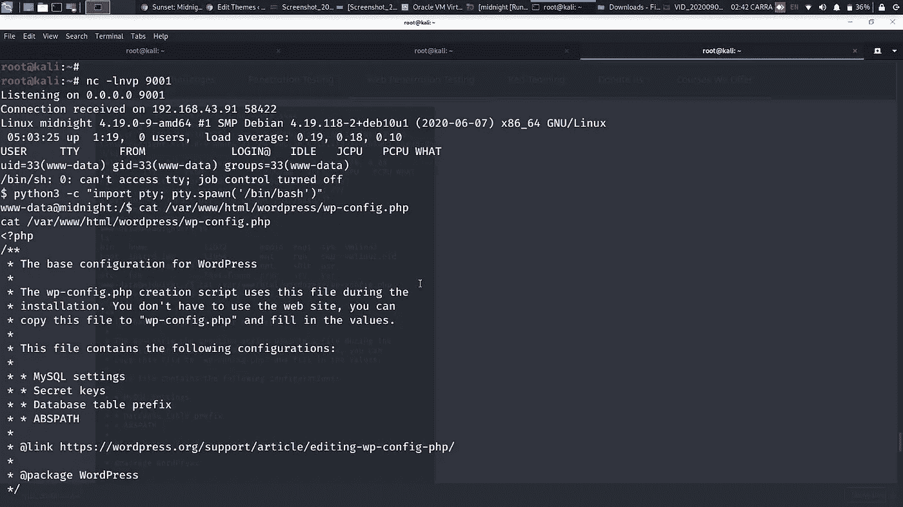

这里，我们得到了登录凭证:)

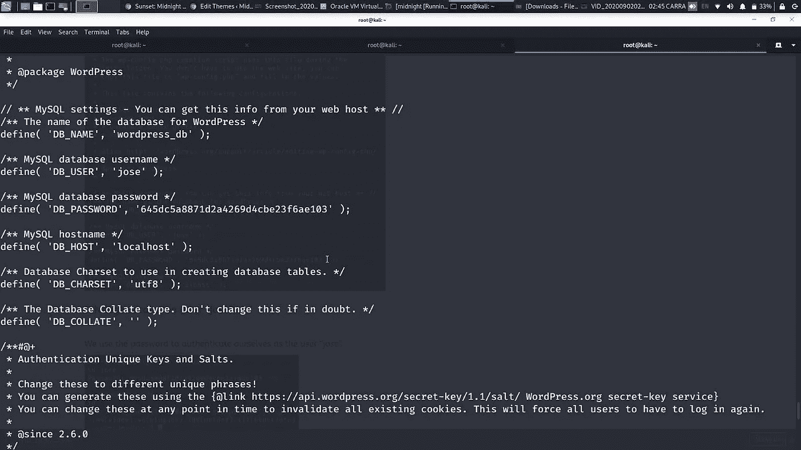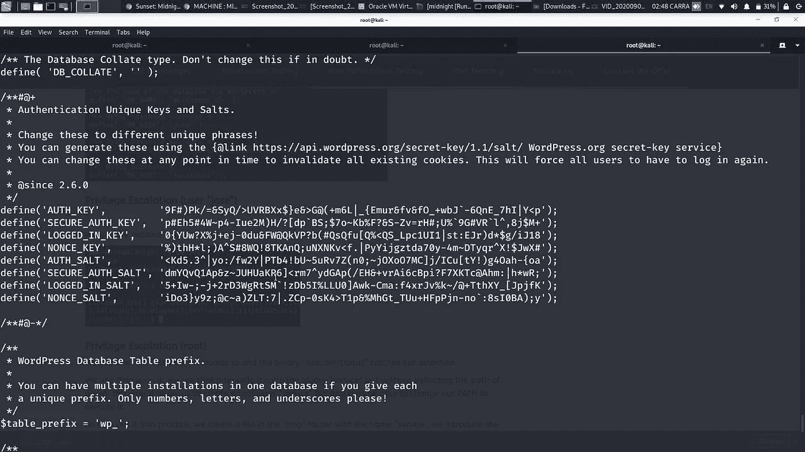

# **权限提升(用户“Jose”)**

我们使用密码验证自己是用户“jose”。

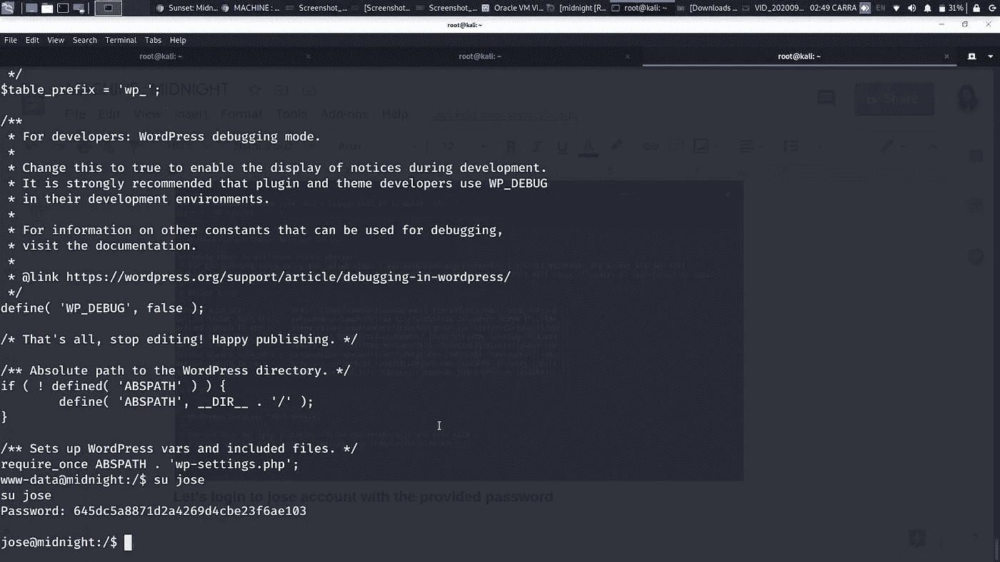

**登录成功。**

# **权限升级(root)**

我们检查我们可以访问哪些文件，二进制文件“/usr/bin/status”引起了我们的注意。我们在它上面使用字符串，我们看到它在内部调用二进制“服务”,但是没有指出起源的路径，这将允许我们创建一个恶意的“服务”文件，从而能够改变我们的路径来执行它。那么让我们把它付诸实践，我们在“tmp”文件夹中创建一个名为“service”的文件，我们引入序列“/bin/sh”，我们执行“/usr/bin/status”的二进制文件，我们得到一个 shell 作为 root。

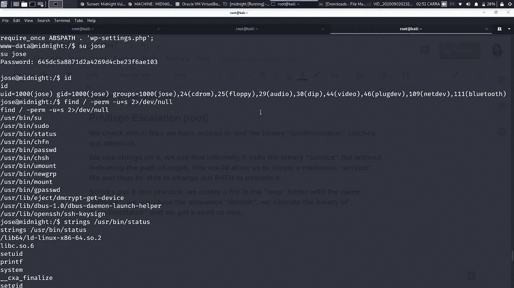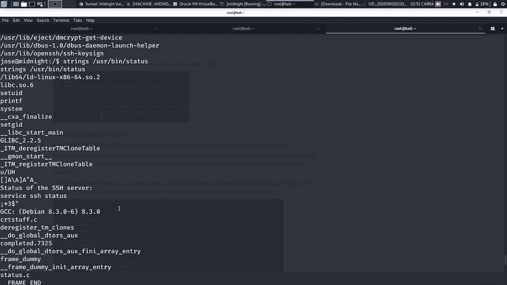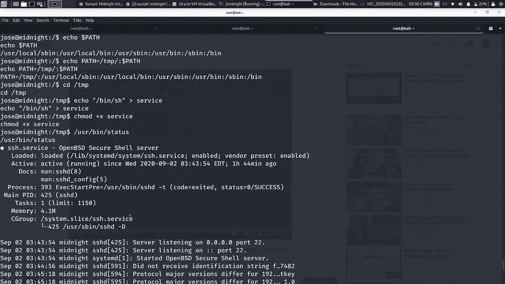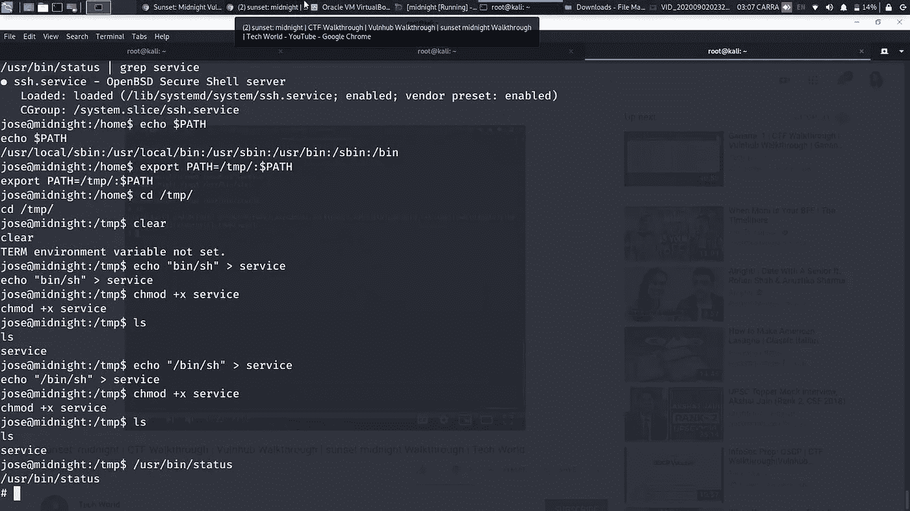

哦哦！！！终于解决了:D

享受😎在**推特(@ShreyaTalukdar9)** 上继续关注我