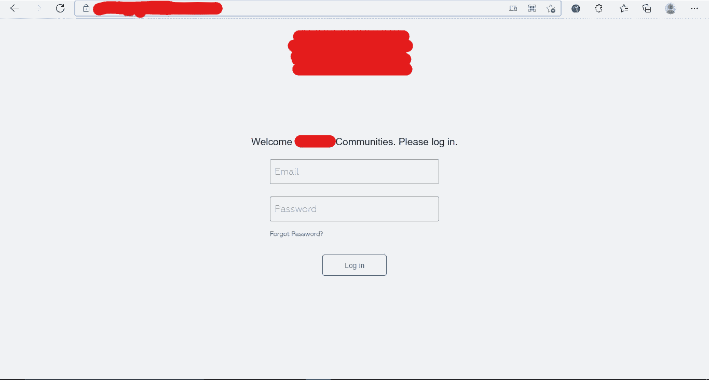

# 没有凭证的超级管理面板😎

> 原文：<https://infosecwriteups.com/super-admin-panel-without-credentials-c2022a23bb35?source=collection_archive---------0----------------------->

祝你平安。

我带着另一篇报道回来了，我希望你们正在狩猎并获得赏金。这一次，我能够在没有凭证的情况下访问超级管理面板😎。我们开始吧

# **场景**

我在寻找 vdp 计划，让我们称之为 vdp.com。使用 [httpx](https://github.com/projectdiscovery/httpx) 后有相邻范围 82k 的子域，变为 6k 的子域。我只是一个一个地滚动和检查每个子域，过了一会儿我才打开这个子域【i.vdp.com 。我有一个问题，每当我在任何程序上搜索时，我总是在后台打嗝，看看 URL 是如何打开的，以及在我打开该 URL 并看到这个登录页面后发生了什么变化。

登录页面

没有注册页面，只有登录页面。我就在这里等着，想想我能做些什么。我使用 waybackurls 和 gau nothing find。之后，我使用 gospider 工具，他们给了我一些 URL 一些 js 文件一些 CSS 文件，我只是滚动，找到了这个 URL http://admin.selectwifi.vdp.com/dashboard-super.html，我打开这个 URL，我看到了超级管理面板。但是，在看到 burp suit 并思考他们为什么将我重定向到登录页面之后，它将我重定向到登录页面。在客户端或服务器端有任何验证吗？想通了之后。它通过我在 gospider 上找到的 js 文件在客户端进行验证。我只需在浏览器中禁用 javascript，就可以使用完整的超级管理面板。还有很多像员工页面公告页面这样的东西，在那里我可以向所有员工发布公告。

拉朱。

# **再现步骤**

1.  首先在你的浏览器中禁用 javascript。
2.  转到这个网址:[https://admin.selectwifi.vdp.com/dashboard-super.html](https://admin.selectwifi.vdp.com/dashboard-super.html)
3.  享受完整的超级管理面板。

# 外卖食品

如果你看到登录页面，并且没有注册选项，请使用 gospider 工具或 waybackurls。