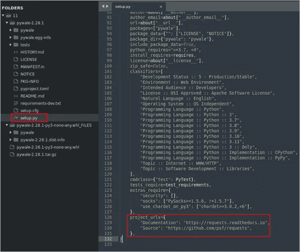
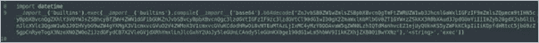
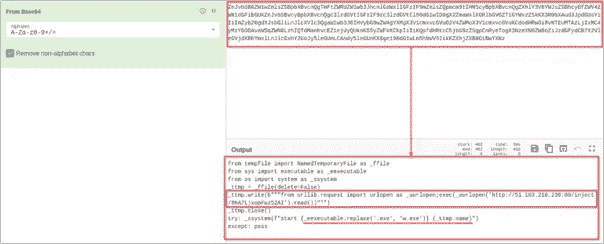
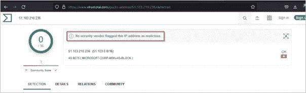
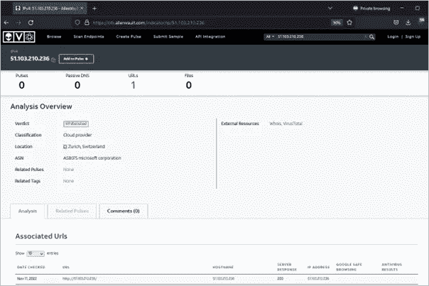
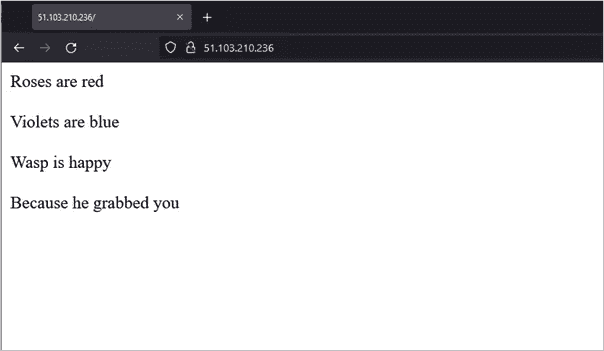
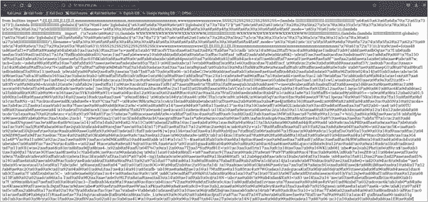
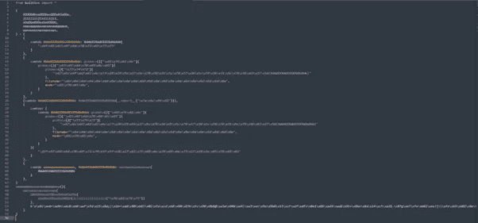

# 供应链攻击的风险——开源安全

> 原文：<https://infosecwriteups.com/supply-chain-attacks-on-the-risk-open-source-security-ee7a8cf1ec58?source=collection_archive---------4----------------------->

## 供应链攻击背景——WASP 对 Python 的攻击——多态恶意软件运送 WASP Stealer 感染了数百名受害者

## TL；速度三角形定位法(dead reckoning)

与恶意活动(WASP group)有关联的 [pywale](https://pypi.org/project/pywale/) 包的研究分析。黄蜂地面方法模仿著名的包[请求来自 python 的](https://github.com/psf/requests/stargazers)又名劫星技术。一个可疑文件[*models . py*](http://models.py/)*，其中包含 base64 编码的 stage1 有效负载，该有效负载获取高度混淆的 stage2 有效负载并执行恶意操作。*

*开源生态系统中的供应链安全已经成为更广泛的开源社区关注的焦点，包括许多依赖开源软件的公司和政府。*

*作为一个行业和社区，不良行为者接管用户帐户，破坏流行的开源依赖项，并利用一些最大的开源项目中的漏洞。*

*众所周知，我们的许多现代数字基础设施都是在开源上运行的。开源软件(OSS)的成功，在某种程度上，归结于全球开发者社区开发它的速度。但是，如果开发者继承了供应链中的漏洞，这种速度是有代价的。*

***观察:***

*包裹正在执行劫星。它模仿著名的请求库。该包指向著名的 python 库，即**请求**看起来合法。*

*[https://github.com/psf/requests/stargazers](https://github.com/psf/requests/stargazers)*

*[https://requests.readthedocs.io/en/latest/](https://requests.readthedocs.io/en/latest/)*

***分析概要:***

*这个包提到了一个需求列表，可以从 https://github.com/psf/requests'下载。*

*开源生态系统中的供应链安全已经成为更广泛的开源社区关注的焦点，包括许多依赖开源软件的公司和政府。*

*作为一个行业和社区，不良行为者接管用户帐户，破坏流行的开源依赖项，并利用一些最大的开源项目中的漏洞。*

*众所周知，我们的许多现代数字基础设施都是在开源上运行的。开源软件(OSS)的成功，在某种程度上，归结于全球开发者社区开发它的速度。但是，如果开发者继承了供应链中的漏洞，这种速度是有代价的。*

***观察:***

*包裹正在执行劫星。它模仿著名的请求库。这个包指向著名的 python 库，即**请求**看起来合法。*

*【https://github.com/psf/requests/stargazers *

*[https://requests.readthedocs.io/en/latest/](https://requests.readthedocs.io/en/latest/)*

***分析:***

*这个包提到了一个可以从 https://github.com/psf/requests'下载的需求列表。*

**

*附件 1.1*

*在检查代码时，可以观察到一个可疑文件'[**models . py**](http://models.py)**'**在第 8 行发现了一个 base64 编码的代码串，同样可以在附件 1.2 中引用。*

**

*附件 1.2*

*解码编码代码后，我们观察到代码从[http://51.103.210.236/inject/8HA7LjxopFuz52AI](http://51.103.210.236/inject/8HA7LjxopFuz52AI)获取一些有效载荷*

**

*附件 1.3*

*在寻找知识产权声誉后，注意到没有人报告它是恶意的。同样的情况可以在图表 1.4 和 1.5 中看到。*

**

*附件 1.4*

**

*附件 1.5*

*在 IP 上导航后，观察到以下消息。*

**

*附件 1.6*

*继续 base64 解码的代码，我们进一步导航到提到的 URL，从那里获取有效负载。似乎混淆代码已被托管。*

**

*附件 1.7*

*美化 python 代码。它看起来像进一步十六进制混淆是在有效载荷的多个部分使用。为了总结这段代码到底想做什么，我们需要解码十六进制编码的代码。*

**

*附件 1.8*

*在这一点上，我们能够注意到一个 **test.js** 文件被创建，同样的文件被执行，但是请注意它到底想做什么。*

*后来人们注意到，该包裹与 [Checkmarkx](https://checkmarx.com/supply-chain-security/) &检查站研究小组披露的威胁行动者**WASP’**又名**WASP steer**有关。大声疾呼 [Checkmarx](https://checkmarx.com/supply-chain-security/\) 开创了如此伟大的研究领域。一定要看看 Checkmarx 安全研究团队发表的博客 [WASP 对 Python 的攻击——多态恶意软件运输 WASP Stealer 感染数百名受害者](https://medium.com/checkmarx-security/wasp-attack-on-python-polymorphic-malware-shipping-wasp-stealer-infecting-hundreds-of-victims-10e92439d192)*

*另一名研究人员也分享了一份类似的分析，请观看这段 YouTube 视频。*

## *来自 Infosec 的报道:Infosec 每天都有很多内容，很难跟上。[加入我们的每周简讯](https://weekly.infosecwriteups.com/)以 5 篇文章、4 个线程、3 个视频、2 个 GitHub Repos 和工具以及 1 个工作提醒的形式免费获取所有最新的 Infosec 趋势！*