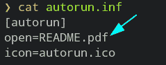
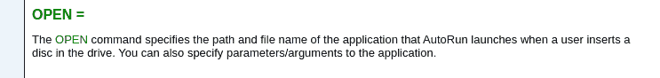
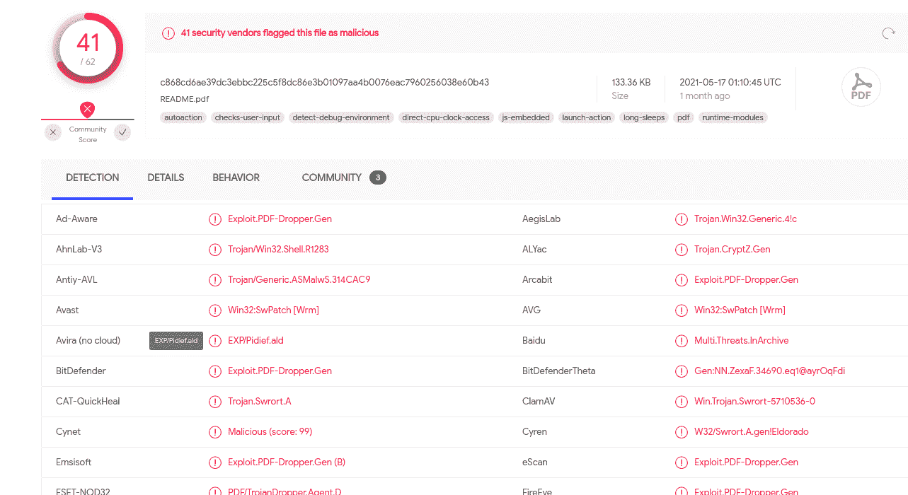
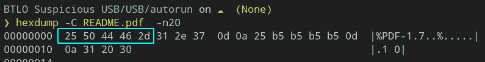
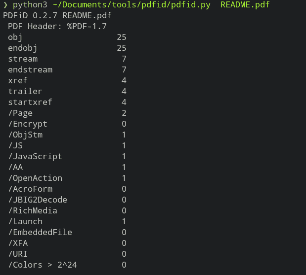
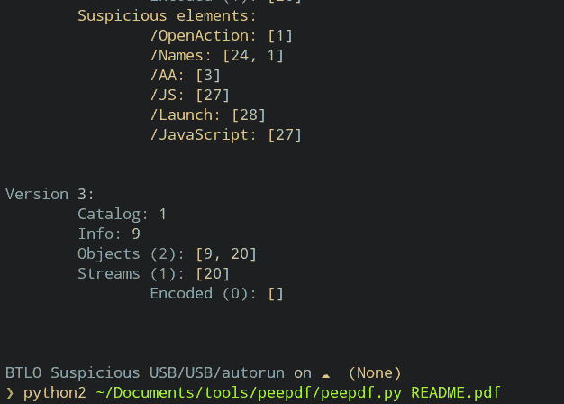
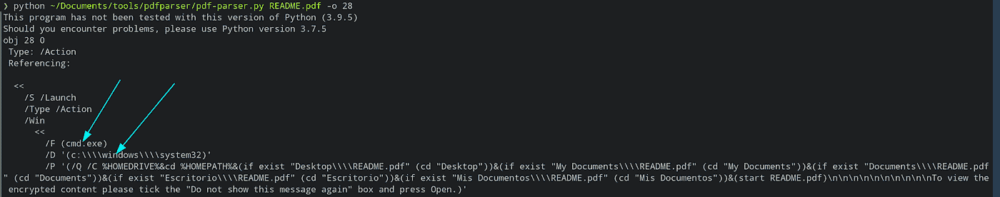

# 可疑的 u 盘

> 原文：<https://infosecwriteups.com/suspicious-usb-stick-ee4d758506e4?source=collection_archive---------2----------------------->

**挑战描述**

→我们的一个客户告诉我们，他们最近遭遇了一次员工数据泄露。作为一家初创公司，他们在安全和员工培训方面的预算有限。我拜访了他们，并与相关的利益相关者进行了交谈。我还收集了一些可疑的电子邮件和一个员工在其住所发现的 u 盘。我在分析可疑邮件的时候，你能检查一下 u 盘里的内容吗？

# 1.autorun.inf 运行的是什么文件？

→README.pdf

**autorun.inf** —这是一个文本文件，当插入 usb、cd/dvd 等介质时，它可以用来自动运行一些应用程序或加载。

欲了解更多信息，您可以访问此链接。【https://www.samlogic.net/articles/autorun-commands.htm 

— — — — — — — — — — — — — — — — — — — — — — — — — —

# 2.pdf 文件是否通过了 virustotal 扫描？(没有返回恶意结果)

→错误

因为它也扫描 pdf，这很明显。

pdf 被完全怀疑是恶意的。

— — — — — — — — — — — — — — — — — — — — — — — — — —

# 3.文件有正确的幻数吗？

→正确

要查看签名，请访问这里:[https://en.wikipedia.org/wiki/List_of_file_signatures](https://en.wikipedia.org/wiki/List_of_file_signatures)

魔术字节与 pdf 魔术字节匹配，因此文件有正确的魔术数字。

我们先用工具 **pdfid** 分析一下 pdf 文件。

[https://blog.didierstevens.com/programs/pdf-tools/](https://blog.didierstevens.com/programs/pdf-tools/)

前 7 个单词或更少，你可以在几乎每一个 pdf 中找到它们。

/Page—pdf 中的页数

/Encrypt —规定需要读取的密码

/ObjStm —对象流

/Js — pdf 文件可能包含可被恶意打开的 Js 代码

/AA 和/OpenAction —打开 pdf 文件时自动执行的操作。会自动启动恶意的 js 命令

/AcroForm —使用 Adobe Acrobat Pro/Standard 创作的 pdf 表单

/JBIG2Decode-表示 pdf 使用 jbig 2 decode 压缩

/RichMedia —用于在 pdf 上嵌入文件、视频等

/Launch —启动一些操作

/EmbeddedFile —包含一些外部文件

/XFA — XML 表单体系结构

/URI —要访问的 Url

正如我们所看到的，它有一些 js 内容会在打开 pdf 文件时自动打开，这似乎是特别恶意的。

通过 **peepdf** 工具可以获得相同类型的结果。

这里是这个工具的链接([https://eternal-todo.com/tools/peepdf-pdf-analysis-tool](https://eternal-todo.com/tools/peepdf-pdf-analysis-tool))啧啧。如果您愿意，也可以下载该工具。:)顺便说一下，它只在 python2 中运行。

**"pdf-parser** —该工具将解析 pdf 文档，以识别被分析文件中使用的基本元素。它不会呈现 PDF 文档。

在检查每个对象时，对象 28 似乎比其他对象更有趣。

这只是我的猜测可能是错误的。

/F —表示文件

/D —表示目录

/P —指示路径

— — — — — — — — — — — — — — — — — — — — — — — — — —

# 4.该文件可以利用什么操作系统类型？(Linux、MacOS、Windows 等)

→窗户

— — — — — — — — — — — — — — — — — — — — — — — — — —

# 5.pdf 文件中提到了一个 Windows 可执行文件，它是什么？

→cmd.exe

— — — — — — — — — — — — — — — — — — — — — — — — — —

# 6.文件有多少可疑/OpenAction 元素？

→ 1

谢谢:)

# 🔈 🔈Infosec Writeups 正在组织其首次虚拟会议和网络活动。如果你对信息安全感兴趣，这是最酷的地方，有 16 个令人难以置信的演讲者和 10 多个小时充满力量的讨论会议。[查看更多详情并在此注册。](https://iwcon.live/)

 [## IWCon2022 - Infosec 书面报告虚拟会议

### 与世界上最优秀的信息安全专家建立联系。了解网络安全专家如何取得成功。将新技能添加到您的…

iwcon.live](https://iwcon.live/)