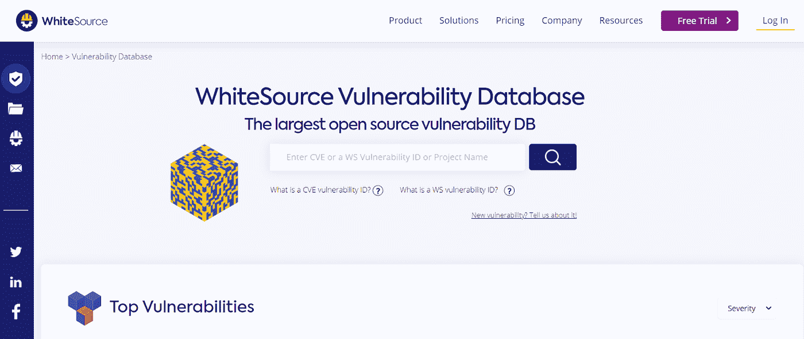
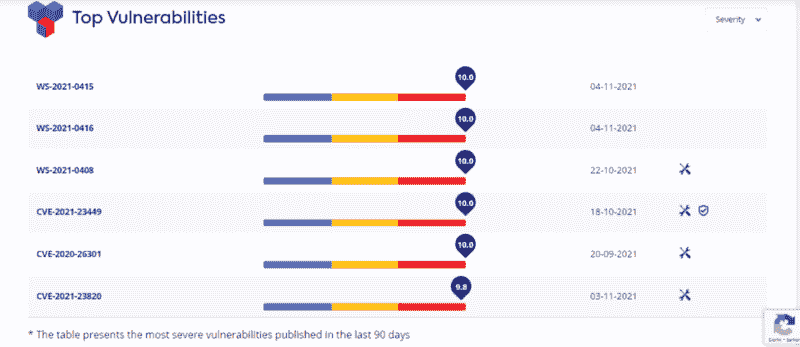
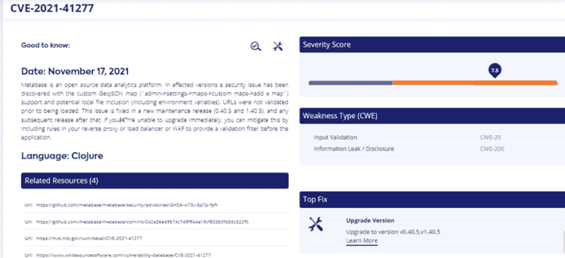
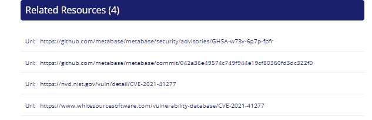
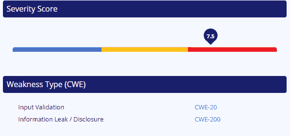
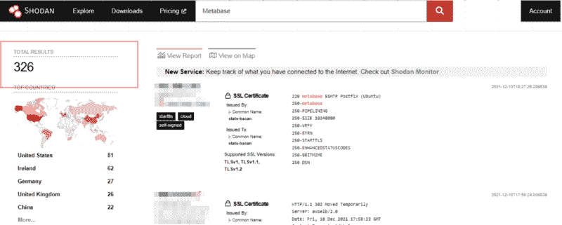
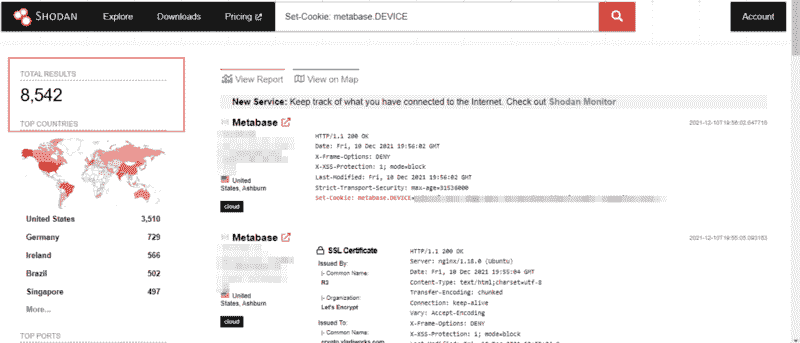
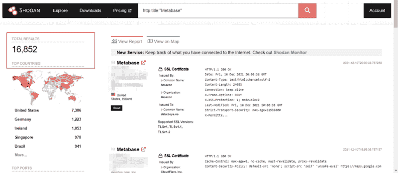
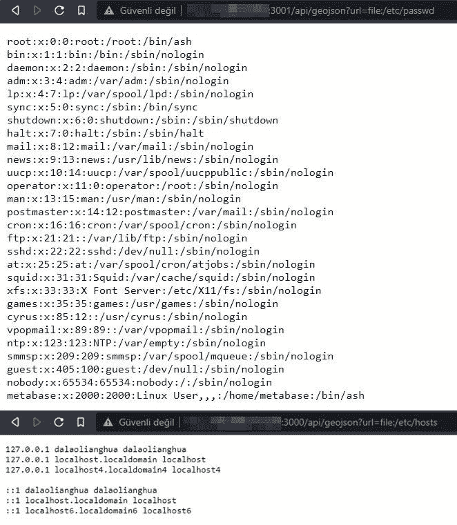
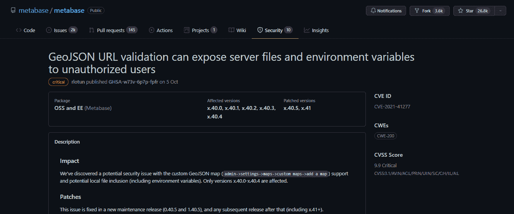

# 使用漏洞数据库应对 CVE-2021–41277

> 原文：<https://infosecwriteups.com/tackling-cve-2021-41277-using-a-vulnerability-database-5e960b8a07c5?source=collection_archive---------0----------------------->

沙哈达特·拉赫曼在 [Unsplash](https://unsplash.com/s/photos/cyber-security?utm_source=unsplash&utm_medium=referral&utm_content=creditCopyText) 上拍摄的照片

在这篇文章中，我将谈论一个安全漏洞(CVE-2021–41277)，它最近在信息安全委员会中很流行。我还会谈到一个流行的安全漏洞数据库，WhiteSource 漏洞数据库。所以让我们开始吧！

上个月，Twitter 上的一个帖子引起了我的注意。它包含了一个 14K 的受 CVE-2021–41277 影响的服务器列表，还有更多被发现。世界上可能有更多受影响的元数据库服务器。所以，我决定先用漏洞数据库研究一下[**【CVE-2021–41277**](https://nvd.nist.gov/vuln/detail/CVE-2021-41277)。

对于我的研究项目，我决定使用开源软件 white source Vulnerability Database，这似乎是最适合帮助我解决这个问题的平台。在我讨论我的发现之前，让我给你一些关于白源漏洞数据库的基本信息。

[白源漏洞数据库](https://www.whitesourcesoftware.com/vulnerability-database/)是一个非常受欢迎的开源平台，拥有一个大型漏洞数据库，为每个 CVE 提供详细信息和资源接口。

在 WhiteSource 漏洞实验室，您可以找到有关开源安全漏洞的信息。这些信息是由 WhiteSource 的全面开源漏洞数据库从数百个受欢迎和受关注的社区资源中汇总而来的。

[来源](https://www.whitesourcesoftware.com/)

他们还提供了定期更新的最严重的**“10 大 WS-CVE”**漏洞列表。

您还可以使用其[完整列表](https://www.whitesourcesoftware.com/vulnerability-database/full-listing)功能进行特定的 CVE 搜索。该列表按月分段。  现在，让我们在平台上搜索**CVE-2021–41277**，以了解我们目标的更多信息，并从技术上解决漏洞。

[来源](https://www.whitesourcesoftware.com/vulnerability-database/CVE-2021-41277)

激动人心的部分来了。首先，让我们从该工具的**【须知】**部分获取关于漏洞和发布日期的信息。

WhiteSource 对 CVE-2021–41277 的总结如下:

*“Metabase 是一个开源数据分析平台。在受影响的版本中，已发现自定义 GeoJSON 地图(` admin- >设置- >地图- >自定义地图- >添加地图`)支持和潜在本地文件包含(包括环境变量)的安全问题。URL 在加载之前没有经过验证。此问题已在新的维护版本(0.40.5 和 1.40.5)及其后的任何后续版本中修复。如果您无法立即升级，您可以通过在反向代理或负载平衡器或 WAF 中包含规则来缓解这一问题，以便在应用之前提供验证过滤器。”*

我们意识到漏洞的来源是经过特别调整的 **GeoJSON** 地图。因此，我们将使用的有效载荷将利用 GeoJSON 地图。

有关该漏洞的更多信息，您可以查看**‘相关资源’**部分。

进一步查看源代码，我发现了以下基于文件名或路径外部控制的有效负载类型:

/api/geojson？URL = file:/filename
/API/geo JSON？URL = file:/etc/passwd
/API/geo JSON？url=file:/etc/hosts

这意味着我们可以访问服务器上的敏感文件，如 etc/passwd。

同时，您可以在**‘严重性分数’**部分了解分配给漏洞的 [CVSS 分数](https://www.balbix.com/insights/understanding-cvss-scores/)以及**‘弱点类型’**部分了解漏洞的类别。

> **发现 **CVE 的脆弱目标**-2021–41277**

Shodan 是理想的搜索引擎。我就不说是什么了，因为你已经知道了。但是我将讨论如何使用 Shodan 返回更易受攻击的结果。

首先，让我们尝试找到我们的目标元数据库服务器。对此，我们基本上可以从搜索关键词“元数据库”开始。

总数:326。

就是 Shodan 能在全世界找到的所有元数据库服务器？当然不是！没人会相信。

所以让我们稍微扩展一下我们的查询。让我们使用“Set-Cookie: metabase。设备”。

好多了。

但是我们仍然可以做得更多。我们用 http . title:“Metabase”。

总共有 **16，852** 个结果涉及元数据库服务器。这样好多了。

> **开发 CVE-2021–41277**

我决定回顾一下 Shodan 的一些结果。我在目标上测试了有效载荷，下面是我得到的一些结果。

我们想让事情自动化，因为在这种情况下会产生很多结果。我想为此编写一个工具，但它已经存在了。[该工具](https://github.com/tahtaciburak/CVE-2021-41277)检查您为 CVE-2021–41277 漏洞创建的服务器列表。有些工具可能不总是返回准确的结果，在某些情况下，我们可能会遇到假阳性(误导的结果)。您可以搜索“root:”来找到它。

> **为**CVE-2021–41277**固定**

我们可以通过白源漏洞数据库获得如何修复漏洞的信息。

该修复基于升级。[元数据库](https://github.com/metabase/metabase/security/advisories/GHSA-w73v-6p7p-fpfr)将受影响的版本标记为 x.40.0-x.40.4，将修补的版本标记为 x.40.5、x.41。将您的元数据库版本升级到 x.40.5 或更高版本将修复漏洞。

[来源](https://github.com/metabase/metabase/security/advisories/GHSA-w73v-6p7p-fpfr)

在 WhiteSource 漏洞数据库提供的源中，我们可以看到元数据库的 CVE-2021–41277 的详细报告。

我希望本教程对白源漏洞数据库的漏洞检测和防范机制进行了充分的描述。它简单直观。因此，请确保您亲自尝试一下，看看如何将它整合到您的开发过程中，使它变得更简单。

目前就这些。感谢阅读。下次再见了！

你可以在推特上关注我:[https://twitter.com/canmustdie](https://twitter.com/canmustdie)