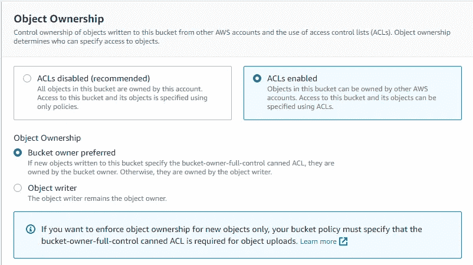
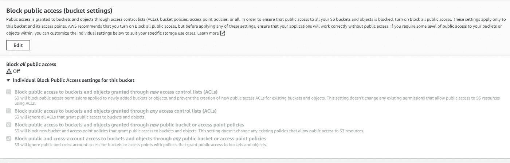

# 消除 IAM 政策、AWS S3 存储桶政策和 AWS S3 ACL 的混乱

> 原文：<https://infosecwriteups.com/take-confusion-out-of-iam-policies-aws-s3-bucket-policies-and-aws-s3-acls-61d8fa04a658?source=collection_archive---------0----------------------->


亚马逊 S3 是一个对象存储服务，将数据作为对象存储在桶中。一个*对象*是一个文件和任何描述该文件的元数据。每个对象都有一个唯一的标识符，称为*对象键*。一个*桶*是盛放物品的容器。使用亚马逊 S3 服务，客户需要管理对存储在 S3 存储桶中的对象的访问权限。

# 存储桶和对象所有权

在开始 S3 存储桶权限管理之前，有一个概念需要记住，那就是存储桶和对象所有权。一个 AWS 帐户中的 S3 存储桶允许其他 AWS 帐户或服务上传对象，存储桶所有者可能无法访问这些对象，因为它们属于不同的 AWS 帐户。默认情况下，所有亚马逊 S3 资源都是私有的。只有资源所有者才能访问资源。但是，资源所有者可以选择向其他资源和用户授予访问权限。值得一提的是，bucket 或 bucket 中的对象的所有者不是 IAM 用户，而是用于创建 bucket 和上传对象的 AWS 帐户。

**桶主**

> 用于创建存储桶的 AWS 帐户。
> 
> 存储桶所有者不能对不属于自己的对象授予权限。授予对象权限的存储桶策略仅适用于存储桶所有者拥有的对象。

**对象所有者**

> 如果使用 AWS 身份和访问管理(IAM)用户或角色凭据上载对象，则用户或角色所属的 AWS 帐户拥有该对象。
> 
> 如果存储桶所有者授予另一个 AWS 帐户跨帐户权限来上传对象，则存储桶所有者对这些对象没有权限。但是，对象所有权可以在上载期间或之后由对象所有者转移，也可以由存储桶所有者通过存储桶权限部分上的对象所有权设置转移。请参考[控制对象的所有权并为您的存储桶](https://docs.amazonaws.cn/en_us/AmazonS3/latest/userguide/about-object-ownership.html)禁用 ACL。

现在，了解了存储桶和对象所有权之后，让我们继续讨论对 S3 资源的访问控制。亚马逊 S3 有许多不同的 S3 访问策略选项:IAM 策略、S3 存储桶策略、S3 ACL。它们之间的区别让一些初学者感到困惑。

# 亚马逊 S3 访问政策

从最基本的意义上来说，用户或存储桶策略通常包含以下元素:

*   **效果:**安全许可(“允许”或“拒绝”)
*   **原则:**与策略相关联的用户、帐户、服务或其他实体
*   **动作:**权限映射到的特定亚马逊 S3 操作。有关亚马逊 S3 运营的更多信息，请参见操作。
*   **资源:**桶、对象等。对其应用访问权限。在这里可以找到为 S3 定义的资源类型的完整列表。
*   **条件:**具体条件键适用于上述资源。

通过用户或存储桶策略，您可以在特定条件下允许或限制特定 AWS 帐户内的 IAM 用户/服务访问亚马逊 S3 存储桶。

**用户政策**

> IAM 策略指定允许主体对任何 AWS 资源做什么。它可以附加到 IAM 用户、组或角色，这些用户、组或角色受您定义的权限的约束。如果您有许多具有不同权限要求的 S3 存储桶，则更详细、更少的 IAM 策略可以更容易地管理这些权限。

**存储桶策略**

> S3 存储桶策略仅控制对 S3 存储桶和对象的访问。如果您想实施 securityTransport 之类的安全控制，以确保无论谁读取对象都可以进行 HTTPS，那么 bucket 策略是一个不错的选择。有一些[桶策略示例](https://docs.aws.amazon.com/AmazonS3/latest/userguide/example-bucket-policies.html)来展示 S3 桶策略如何在许多使用案例中适合您。
> 
> 您可以在存储桶级别附加 S3 存储桶策略(即，您不能将存储桶策略附加到 S3 对象)，以控制对存储桶中所有对象的访问权限。
> 
> 存储桶策略仅适用于存储桶所有者拥有的对象。如果您的存储桶包含不属于存储桶所有者的对象，则该帐户(对象写入者)拥有该对象，可以访问它，并且可以通过 ACL 授予其他用户对它的访问权限。

**桶和对象 ACL**

> S3 访问控制列表(ACL)是 IAM 之前的遗留访问控制机制。S3 ACL 被附加到每个 S3 桶和对象。亚马逊 S3 支持一组权限。使用 ACL 有一些限制:
> 
> -您只能向 AWS 帐户授予权限，但不能向同一帐户内的实体授予权限。同样，您不能向自己帐户中的用户授予权限。
> 
> -您不能授予有条件的权限
> 
> -你不能明确拒绝许可
> 
> ACL 的一个合适场景是跨帐户对象上传。如果存储桶所有者允许其他 AWS 帐户上载启用了 ACL 的对象(如下图所示)，则只能由拥有这些对象的 AWS 帐户使用对象 ACL 来管理这些对象的权限。



# 访问控制机制

当一个以上的访问控制策略应用于 S3 存储桶/对象时，授权决定取决于上述策略的联合。决策默认为拒绝，除非有明确的允许，而明确的拒绝总是胜过允许。

在一个有趣的例子中，如果一个 IAM 策略拒绝特定的 IAM 用户访问一个对象，而一个 S3 存储桶策略允许公众访问同一个对象，组合的结果是 IAM 用户将被禁止访问 S3 对象，但他可以匿名访问该对象。

# 常见使用案例

**用例 1 —一个 IAM 用户访问 S3 存储桶/对象属于 IAM 用户的父帐户**

如果目标 S3 时段/对象由 IAM 用户的父帐户所有。IAM 用户的父帐户可以通过将 IAM 策略附加到 IAM 用户或定义存储桶策略，向其 IAM 用户授予 S3 存储桶/对象权限。

允许 IAM 用户访问 S3 存储桶中的对象的 IAM 策略示例:

```
{
    "Version": "2012-10-17",
    "Statement": [
        {
            "Sid": "PublicRead",
            "Effect": "Allow",
            "Action": [
                "s3:GetObject",
                "s3:PutObject",
                "s3:PutObjectAcl"
            ],
            "Resource": "arn:aws:s3:::<bucket-name>/*"
        },
        {
            "Sid": "PublicRead1",
            "Effect": "Allow",
            "Action": "s3:ListBucket",
            "Resource": "arn:aws:s3:::<bucket-name>"
        }
    ]
}
```

授予 IAM 用户访问 S3 的存储桶策略示例:

```
{
    "Version": "2012-10-17",
    "Statement": [
        {
            "Sid": "PublicRead",
            "Effect": "Allow",
            "Principal": {
                "AWS": "arn:aws:iam::<AWS-Account-Number>:user/<IAM-User>"
            },
            "Action": [
                "s3:GetObject",
                "s3:PutObject",
                "s3:PutObjectAcl"
            ],
            "Resource": "arn:aws:s3:::<bucket-name>/*"
        },
        {
            "Sid": "PublicRead1",
            "Effect": "Allow",
            "Principal": {
                "AWS": "arn:aws:iam::<AWS-Account-Number>:user/<IAM-User>"
            },
            "Action": "s3:ListBucket",
            "Resource": "arn:aws:s3:::<bucket-name>"
        }
    ]
}
```

*请注意在以上情况下* `*"AWS": "arn:aws:iam::<AWS-Account-Number>:root*` *不起作用。*

**用例 2 —一个 IAM 用户想要访问跨账户 S3 存储桶及其对象**

当 IAM 用户想要访问跨帐户 S3 时段时，AWS 会执行两次评估。AWS 评估两个帐户中的请求:拥有 IAM 用户的帐户和拥有 S3 存储桶的帐户。拥有 IAM 用户的 AWS 帐户必须通过 IAM 策略授予 IAM 用户 S3 存储桶权限。基于特定的用例，S3 存储桶所有者还必须通过存储桶策略或 ACL 授予权限。你可以在帖子[上找到更多关于我如何提供对亚马逊 S3 存储桶中对象的跨账户访问？](https://aws.amazon.com/premiumsupport/knowledge-center/cross-account-access-s3/)

请记住，如果 IAM 用户想要访问不属于存储桶所有者帐户的对象，存储桶所有者帐户不能授予对这些对象的访问权限。

**用例 3 —匿名访问 S3 存储桶中的对象**

您不能在 IAM 用户策略中授予匿名权限，因为该策略附加到用户/角色。

但是您可以添加一个存储桶策略来授予存储桶中所有对象的匿名权限。通过用通配符(`"*"`)指定`principal`作为`Principal`值，如`"Principal":"*"`或`"Principal":{"AWS":"*"}`(参见 IAM 用户指南中的[所有主体](https://docs.aws.amazon.com/IAM/latest/UserGuide/reference_policies_elements_principal.html#principal-anonymous))，该策略允许匿名访问，但是应该小心使用。

使对象可公开访问的存储桶策略示例如下:

```
{
    "Version":"2012-10-17",
    "Statement": [
        {
            "Sid":"GrantAnonymousReadPermissions",
            "Effect":"Allow",
            "Principal": "*",
            "Action":["s3:GetObject"],
            "Resource":["arn:aws:s3:::<bucket-name>/*"]
        }
    ]
}
```

对象 ACL 也可用于使对象可公开访问。要使存储在亚马逊 S3 的对象可公开访问，第一件事是将 bucket Permissions 部分的“阻止所有公共访问”设置为 off，如下所示。



作为对象所有者，您可以运行以下命令来更新其对象 ACL 以进行公共读取访问:

```
aws s3api put-object-acl --bucket <bucket-name> --key <key-name> --acl public-read
```

或者，您可以运行以下命令向其他所有人授予读取权限:

```
aws s3api put-object-acl --bucket <bucket-name> --key  <key-name> --grant-read uri=http://acs.amazonaws.com/groups/global/AllUsers
```

# 最后的想法

如果您对 AWS S3 访问政策感到困惑，我希望这对您有用。如果您有任何问题或反馈，请随时发表评论。

## 来自 Infosec 的报道:Infosec 每天都有很多内容，很难跟上。[加入我们的每周简讯](https://weekly.infosecwriteups.com/)以 5 篇文章、4 个线程、3 个视频、2 个 Github Repos 和工具以及 1 个工作提醒的形式免费获取所有最新的 Infosec 趋势！