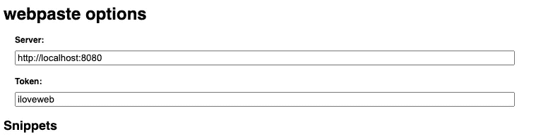
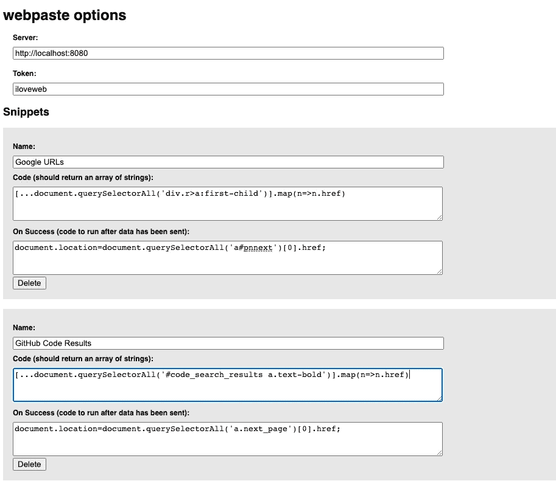

# 用这个工具把多金带到一个新的水平

> 原文：<https://infosecwriteups.com/take-dorking-to-the-next-level-with-this-tool-e0827571aced?source=collection_archive---------1----------------------->

## 这个工具将极大地提高你的写作效率


由[卡尔·海尔达尔](https://unsplash.com/@carlheyerdahl?utm_source=medium&utm_medium=referral)在 [Unsplash](https://unsplash.com?utm_source=medium&utm_medium=referral) 上拍摄

大家好，在我的[上一篇文章](https://medium.com/bugbountywriteup/bug-bounty-lets-bypass-an-entire-web-app-s-csrf-protection-friend-link-b69c43e9dcf7?source=collection_home---2------15-----------------------)中，我谈到了我如何能够使用会话固定绕过 web 应用程序上的 CSRF 保护，今天我将为大家带来一篇更具" *theoric* "的文章，如何使用来自[tomnom](https://medium.com/u/6dadd1681332?source=post_page-----e0827571aced--------------------------------)的 *webpaste* 工具提高你的写作效率。

呆呆很棒，你可以通过呆呆找到大量的错误。有什么工具可以让这更上一层楼？这与自动化工具无关，这只是你的经验和知识与生产力的混合。事实上， *webpaste* 将帮助你保持你的多金结果井井有条。

# webpaste 到底是什么？

好吧，我还没具体说，那 *webpaste* 在干什么？它基本上包括在终端上保存您的 Dorking 结果。以这种方式说，它听起来不像介绍中那样酷，对吗？然而，在跳过这篇文章之前，你一定要尝试一下。

我是在 Yt(12.45 分钟)上的一个 [Nahamcon 视频中发现这个工具的，从那以后我一直在大量使用它。](https://www.youtube.com/watch?v=W4_QCSIujQ4&list=PLKAaMVNxvLmAD0ZVUJ2IGFFC0APFZ5gzy&index=7&t=836s)

不用在 Dorking 之后手动保存所有的 URL，你可以使用 webpaste，它会帮你保存！这个工具还没有引起你的注意吗？让我告诉你，这个工具是完全可定制的，你可以把它用于谷歌多金，Github 多金等…

# 安装 webpaste

这个工具并没有被设计成在 Github 上公开(我猜)，所以 Tom 并没有让安装变得非常简单。然而，我会教你如何非常容易地安装 webpaste。

1.  克隆回购
2.  在终端上设置 webpaste
3.  设置 chrome 扩展
4.  使用网络粘贴

首先，我们需要克隆 hacks 回购:

```
git clone [https://github.com/tomnomnom/hacks](https://github.com/tomnomnom/hacks)
```

现在，进入 webpaste 目录(`hacks/webpaste`)，执行:`go build`。这将创建 webpaste 二进制文件。

现在，我们需要向 bash 配置文件添加一些内容:

```
alias webpaste='webpaste direcory here'
export WEBPASTE_TOKEN=iloveweb
```

在这里，我们为 webpaste 二进制文件创建一个别名，然后导出令牌。

更新你的 bash 配置:macOS 上的`source .bashrc`或`source .bash_profile`。

现在我们需要安装 Chrome 扩展。在 chrome 上打开 chrome://extensions/现在点击左上方的 Load Unpacked，在 webpaste 的文件夹中选择 extension 文件夹

扩展现在被加载了，但是，它现在不能工作…右键单击扩展，然后选择选项。您将看到类似这样的内容:



现在，如屏幕截图所示，您必须在令牌字段中输入`iloveweb`令牌。现在我们必须添加一些片段，例如 Google 和 Github Dorking。点击添加代码片段，并填写如下参数:

```
Name >>> Google URLsCode (should return an array of strings): >>> [...document.querySelectorAll('div.r>a:first-child')].map(n=>n.href)On Success (code to run after data has been sent):>>>document.location=document.querySelectorAll('a#pnnext')[0].href;
```

现在保存片段。要创建 Github 代码片段，再次单击 add snippet，并像这样填充参数:

```
Name >>> GitHub Code ResultsCode (should return an array of strings): >>>[...document.querySelectorAll('#code_search_results a.text-bold')].map(n=>n.href)On Success (code to run after data has been sent):>>>document.location=document.querySelectorAll('a.next_page')[0].href;
```

好的，这是流程，你也可以添加 Yandex，例如:

```
Name >>> YandexCode (should return an array of strings): >>>[...document.querySelectorAll('div.organic__path a.link[href]')].map(el => el.href)On Success (code to run after data has been sent):>>>document.location=document.querySelector('a.pager__item_kind_next').href
```

如你所见，你可以通过检查元素并从默认元素中获取灵感来创建自己的代码片段。

“选项”选项卡应如下所示:



# 将所有人聚集在一起

设置完毕，是时候看看 webpaste 的实际应用了。

保存配置后，回到终端并简单地输入:`webpaste`(我假设您已经按照我之前告诉您的那样编辑了 bash 配置)。现在，上 chrome，在谷歌上搜索:

```
site:google.com ext:php
```

现在，点击 chrome 上的网络粘贴图标，然后点击谷歌网址。这将把您带到下一个结果页面，在终端上，您将看到搜索结果中的所有 URL。为了在安装之前看到它的运行，我建议您在**分 12.45** 时观看此视频:

感谢阅读！