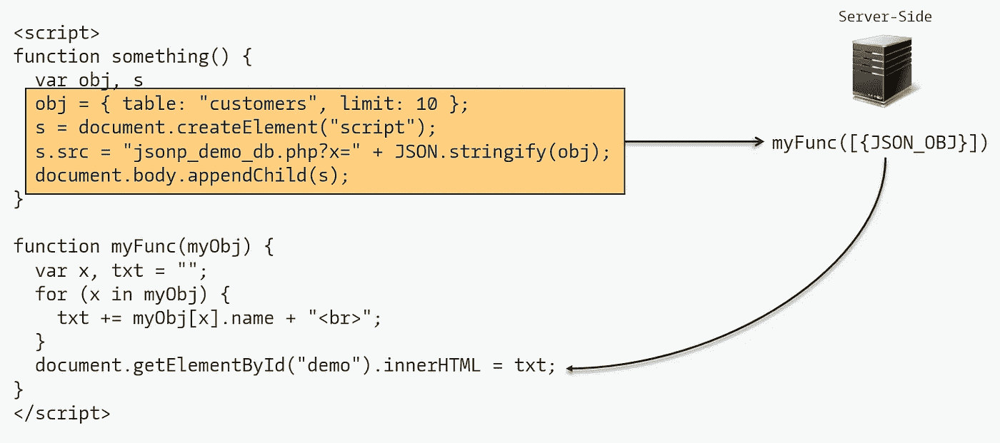
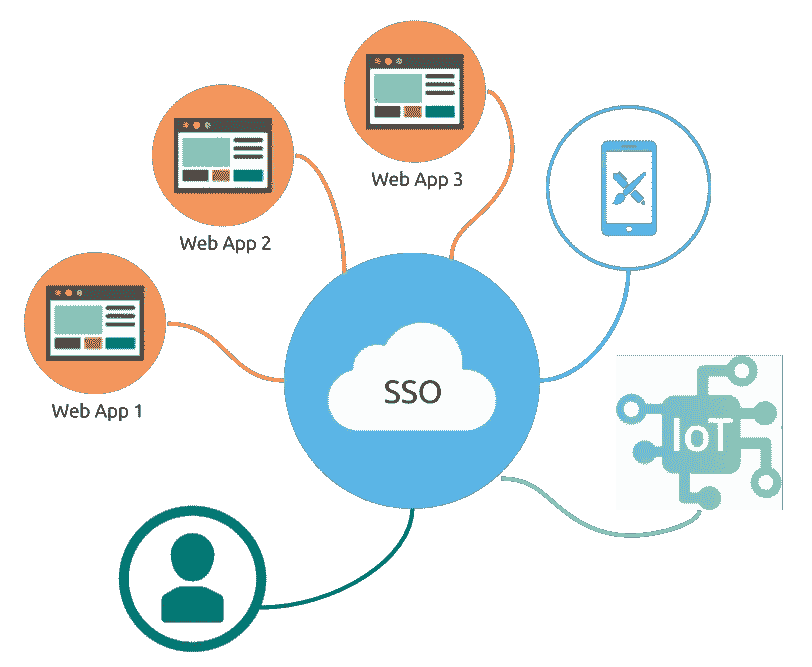
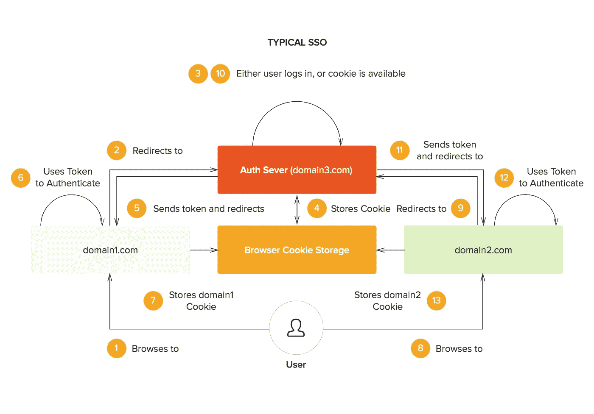
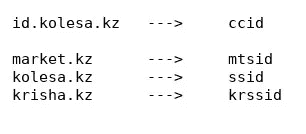
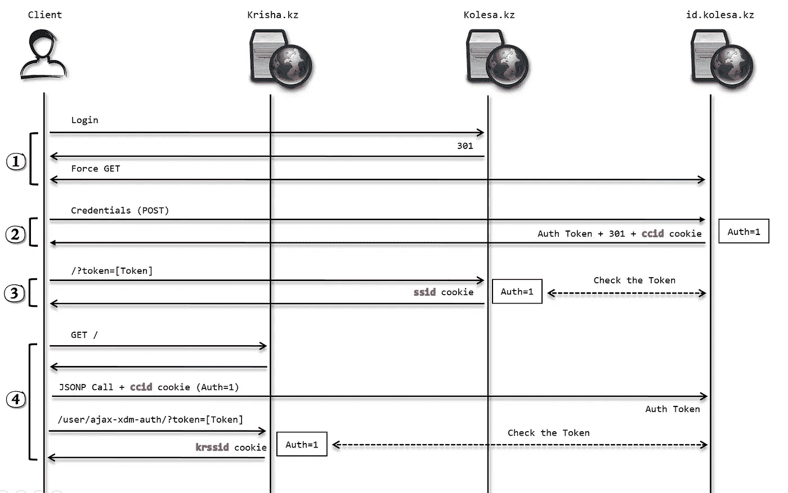
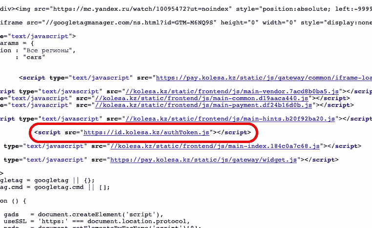
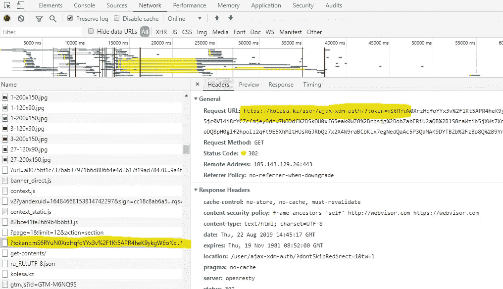
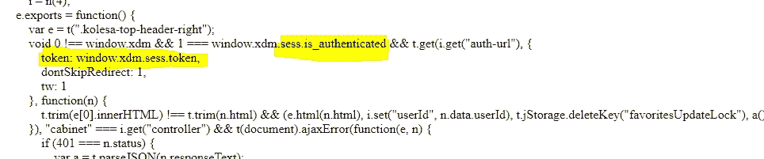
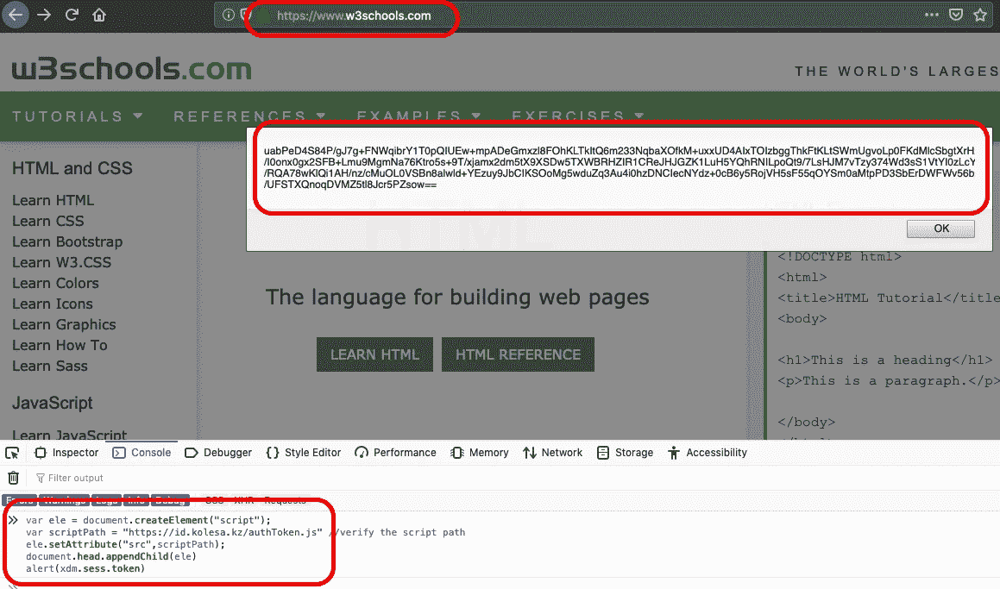

# 由于不安全的 JSONP 调用，Kolesa 网站中的 SSO、帐户被接管

> 原文：<https://infosecwriteups.com/taking-down-the-sso-account-takeover-in-3-websites-of-kolesa-due-to-insecure-jsonp-call-facd79732e45?source=collection_archive---------0----------------------->

你好，这篇文章是关于我如何使用单点登录接管 Kolesa 网站的任何帐户。有一个不安全的 JSONP 调用可能会破坏整个 SSO 机制的安全性。

# JSONP 是什么？

JSONP 是一种将 JSON 数据发送到其他域的方法。

*   可以加载外部 JavaScript 对象
*   不使用 XMLHttpRequest 对象
*   不太安全
*   在浏览器中绕过 SOP



JSONP 请求/响应示例

# 单点登录

信息收集显示 Kolesa 网站使用单点登录，认证服务器是:

```
https://id.kolesa.kz
```



使用单点登录的网站有:

1.  [https://market.kz](https://market.kz)
2.  [https://krisha.kz](https://krisha.kz)
3.  [https://kolesa.kz](https://kolesa.kz)

SSO 工作的一般工作流程:



在这个认证模型中，由于一个域不能为其他域设置一个`authentication cookie`，一个`authentication token`应该在`authentication server`和其他域之间传递。考虑到上图中的橙色框，每个站点应该在验证了`authentication token`之后保存一个 cookie。此外，`authentication server`还保存它的 cookie，所以在几次 HTTP 请求之后，我找到了每个 Kolesa 网站的认证 cookie 名称:



# 处理 SSO 的 JSONP 调用

JSONP 调用用于**进一步认证**。如果用户已经登录了三个网站中的任何一个，就会发出一个 JSONP 调用来验证用户的身份。这样做的原因是易于实现。由于域的来源不同，Kolesa 网站应该已经实现了`Cross Origin Resource Sharing`来传输认证，但是他们决定使用 JSONP 来避免 CORS 设置。



要点是，一旦用户登录，例如`kosela.kz`，他们在`id.kolesa.kz`中有一个`ccid` cookie，一个用于传输认证的认证令牌，在`kosela.kz`中有一个`ssid` cookie。之后，如果用户想要登录其他网站，只需点击一下，因为`id.kosela.kz`有认证 cookie，它会立即生成`authentication token`，用户将在网站上拥有相应的`authentication cookie`。

根据上图，阶段 4 展示了如何进行 JSONP 调用，以及如何将域中的`authentication token`转换为`authentication cookie`。JSONP 调用的原因:



如果用户已经通过了`id.kolesa.kz`的认证，将会得到以下响应:

```
HTTP/1.1 200 OK
Server: openresty/1.13.6.2
Date: Mon, 19 Aug 2019 16:43:26 GMT
Content-Type: text/javascript;charset=UTF-8
Connection: close
Expires: Thu, 19 Nov 1981 08:52:00 GMT
Cache-Control: no-store, no-cache, must-revalidate
Pragma: no-cache
Backend-Server: auth-be3.alaps.kz.prod.bash.kz
X-Bug-Bounty: Please report bugs and vulnerabilities to [bugs@kolesa.kz](mailto:bugs@kolesa.kz)
Content-Security-Policy: frame-ancestors 'self' [http://webvisor.com](http://webvisor.com) [https://webvisor.com](https://webvisor.com)
Strict-Transport-Security: max-age=31536000
Content-Length: 627window.xdm = {
    **sess: {
        is_authenticated: 1,
        token: 'xG3ROFWcb7pnXSnMr8MkaBvH01pLlCHqn0sPt0PVL6BBWYdQPdvA31tBi6dLB5njv5jhMW3y/cGBMRB9LC/69zv867wweaDhkxX6arGVzYDy2q+J52nkOQJ+62rR9wLPYJGyEpNGWeOBSp12vugXZUPq2RA6FMptbNkGQpJFjAclXSzduj7wJJgAUONMj3mkkElM1nWmIllrl5zDEz6s7077E4ibx//BvnfZ9AIC/9b2PB+QzVKOnSzzcr9wSXqta9TEDHvjopqbUd4UE2xSMRSj/zxPQlCba5632hcIXnzZB3A8fvahvf2Hm5ssuC+cwuKU8pAdE/qcGQSJKdhpYXxntGkQiLdEAliyCq+fahS4itb6HlFH/+H20RsZA+cjyaF7ntnW5tYY31vxJXovrR3oinaj9YDSzoCZYMDYPJMdk+HuZhRuxxEl8abuNlGD0aCt2GCPV7GY0J9Ma7AcPw=='
    }**
};(function ($) {
    "use strict";$.xdm = window.xdm;
}(jQuery));
```

正如我们所看到的，有一个名为`sess`的对象包含了名为`is_authenticated`和`token`的两个属性。该对象负责传输身份验证。此时用户有当前网站的`authentication token`但没有`authentication cookie`，所以进行第二次呼叫:



JavaScript 代码:



# 易受攻击的外部 JavaScript 对象

问题是，任意一个原点都能提取出`authentication token`？当然可以，因为 JSONP 调用绕过了**同源策略**。



发现漏洞，一键接管账户:)

# 开发阶段

场景很简单:

1.  设置代表任何用户调用 JSONP 的页面
2.  欺骗认证用户访问我们的恶意网站
3.  用户向我们的网站发送`authentication token`
4.  作为受害者登录并做坏事

漏洞代码(客户端+服务器端调用):

这是视频概念验证: