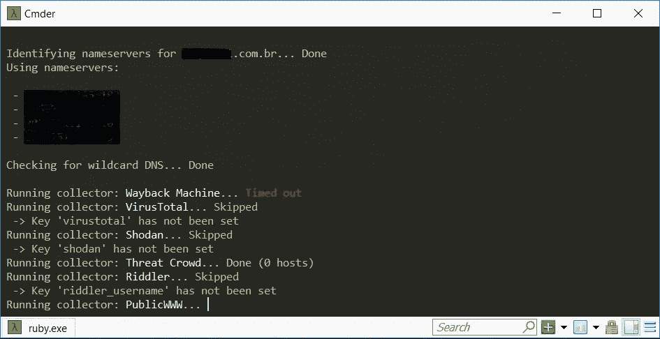
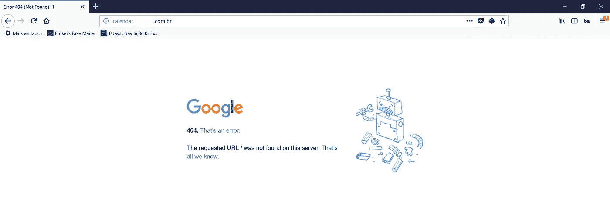
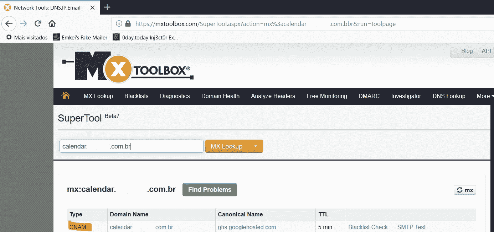
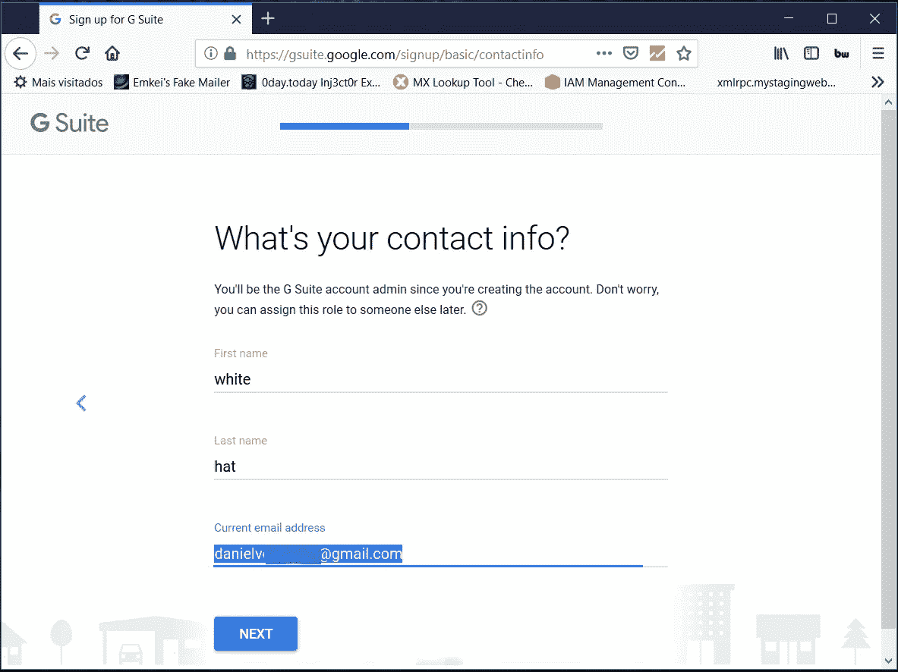
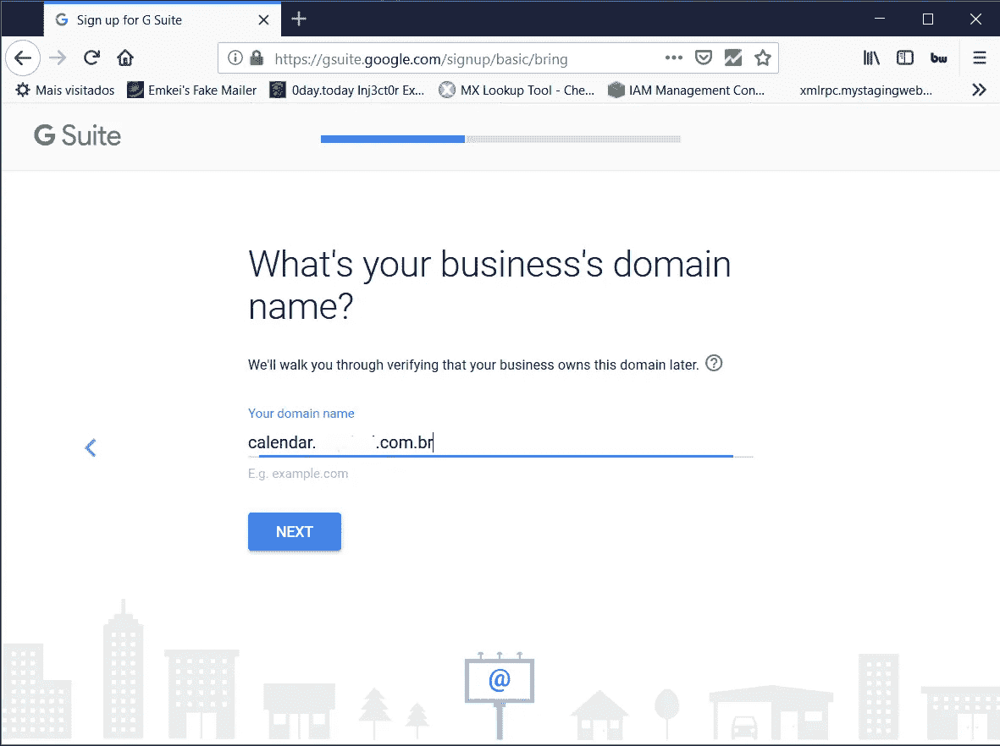
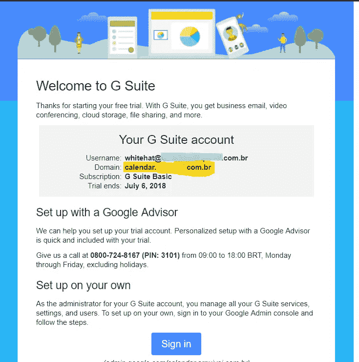

# 接管一家公司的谷歌日历

> 原文：<https://infosecwriteups.com/taking-over-google-calendar-of-a-company-1c49071f6a9?source=collection_archive---------0----------------------->

大家好。

这次我将展示我在一家拥有 30，000 名客户的公司中发现的一次不寻常的收购。

**概要:**

该缺陷允许你像普通收购一样接受谷歌 Gsuite 的服务，使该公司无法用该域本身创建新的 Gsuite 帐户。

**解释接管漏洞:**

> 子域接管被认为是一种高度严重的威胁，归结为有人(出于恶意)注册了一个域。通过这样做，黑客可以完全控制子域。子域接管可以通过使用外部服务来完成，如 Desk、Squarespace、Shopify、Github、Tumblr 和 Heroku。

你可以在这里了解更多关于[的信息。](https://blog.securitybreached.org/2017/10/11/what-is-subdomain-takeover-vulnerability/)

**发现阶段:**

列出所有域是发现阶段最耗时的部分(我使用自己的方法)，所以我使用的第一个工具是同时具有两个功能的“Aquatone ”,发现和接管。

```
aquatone-discover — domain company.com.br && aquatone-takeover — domain company.com.br
```



点击了解更多关于 Aquatone [的信息。](https://github.com/michenriksen/aquatone)

结果显示，其中一个子域“calendar.company.com.br”有一个指向“ghs.googlehosted.com”的 CNAME，当我试图访问时，我得到了以下错误:



为了确认 CNAME 关联，我使用了 mxtoolbox:



在此之前，我对该工具的误报感到沮丧，因为我已经发现了同样的缺陷，我知道在谷歌服务中执行接管是不可能的。不管怎样，我决定测试一下:

我创建了一个新的 Gsuite 帐户，并将我的公司域名指定为**‘calendar . company . com . br’**



下一个，下一个，下一个…然后… **完成！**

我收到一封电子邮件，说该帐户已成功注册:



我相信，如果你一直跟进到这里，你会意识到运行测试到最后的重要性，即使不能安排新的活动或用公司的 gsuite 发送电子邮件，也足以阻止平台上的新注册。

希望你喜欢。黑客快乐:)

在 [Linkedin](https://www.linkedin.com/in/daniel-morais-968463120/) 找到我。