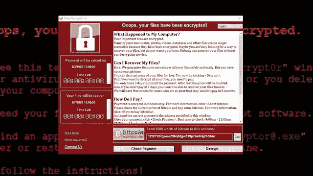

# 使用机器学习接管恶意软件。

> 原文：<https://infosecwriteups.com/taking-over-malware-using-machine-learning-979b5839adc3?source=collection_archive---------4----------------------->

## 克服恶意攻击的机器学习方法。


我们都知道网络攻击在过去几年里疯狂增长。由于新冠肺炎，与 2020 年相比，2021 年每周对公司网络的网络攻击数量增加了约 50%，导致远程工作，这意味着公司员工在办公室网络之外工作等。但是，困扰科技界每个人的一个问题是如何阻止他们？问题是我们不能。！但是，如果发生类似“恶意软件攻击”的事情，至少我们可以尝试保护我们的系统。又怎么了？

## ***勒索病毒行业！***

当然，谈论数字是因为这将会让人们兴奋地进一步阅读我的博客！🤌🏻

勒索软件在 2021 年给世界造成了 200 亿美元的损失。下一个 10 年(即直到 2031 年)的预测称，它可能会上升到 2650 亿美元。根据谷歌的数据，37%的企业和组织受到了勒索软件的影响。

黑客通过这种方式赚钱的一方，组织和企业，每次从勒索软件攻击中恢复需要花费 185 万美元。

是的，如果你开自己的公司，要处理的事情太多了！:D:但是如果我说，现在我们已经在技术领域取得了如此大的进步，我们实际上有办法摆脱这种局面，那会怎么样呢？YAYA！

在我们找到解决方案之前，让我们先分析一下问题，因为分析通常会使事情更容易理解。

> ***我们来了解一下恶意软件的类型:***

## **1。勒索软件:**

勒索软件是一种恶意软件，它采用加密来防止目标访问其数据，除非支付赎金。在付款之前，目标组织部分或完全不能运行，但是不能保证付款将产生必需的解密密钥，或者给定的解密密钥将正常工作。



说起勒索病毒，就想起了最丑陋的勒索病毒攻击，即 WannaCry 勒索病毒。

WannaCry 是一种针对 Windows PCs 的加密勒索病毒感染。它是一种恶意软件，可以通过网络在 PC 之间传播(因此是“蠕虫”组件)，然后在机器上加密一次关键数据(“加密”部分)。然后罪犯要求赎金来释放文件。

这种差异表明黑客们主要对制造混乱和恐怖感兴趣。然而，金钱损失超过了赎金本身。赛门铁克预测 WannaCry 恢复成本约为 40 亿美元，这非常接近 2020 年勒索软件总支出的近 49 亿美元。

如果你想了解更多关于 WannaCry 勒索软件: [***点击这里！***](https://www.blogger.com/blog/post/edit/5949999019306608237/3955454578752297794#)

[***卡巴斯基文章***](https://www.blogger.com/blog/post/edit/5949999019306608237/3955454578752297794#) 关于 WannaCry 勒索软件你需要知道的一切。

## **2。无文件恶意软件:**

无文件恶意软件最初不安装任何东西；相反，它修改操作系统固有的文件，如 PowerShell 或 WMI。防病毒软件检测不到无文件攻击，因为操作系统认为修改过的文件是真实的，而且因为这些攻击是隐蔽的，它们的成功率是常规恶意软件攻击的 10 倍。


短暂休息后，阿斯塔罗特在 2 月初重新露面，对其攻击链进行了相当大的改动。Astaroth 是一种数据窃取病毒，它利用各种无文件策略并利用合法程序，以便在受影响的 PC 上保持不被发现。

[***微软博客***](https://www.blogger.com/blog/post/edit/5949999019306608237/3955454578752297794#) 关于 Astaroth 无文件恶意软件。

## **3。间谍软件:**

[***间谍软件***](https://www.blogger.com/blog/post/edit/5949999019306608237/3955454578752297794#) 在用户不知情或未同意的情况下收集用户活动数据。密码、pin、财务信息和非结构化通信都是这样的例子。除了桌面浏览器之外，间谍软件还可以在关键应用程序或手机上运行。即使被盗的数据不重要，间谍软件的影响也会波及整个公司，降低性能和生产力。


一些最著名的间谍软件的例子如下:

AzorUlt——能够窃取银行信息，如密码和信用卡号码，以及比特币。AzorUlt 病毒主要通过勒索软件传播。

[***恶意软件字节***](https://www.blogger.com/blog/post/edit/5949999019306608237/3955454578752297794#) 有一个很短很甜的关于 AzorUlt 间谍软件的博客，有兴趣可以去看看。

TrickBot —针对金融信息盗窃。

下面是最常见的[](https://www.blogger.com/blog/post/edit/5949999019306608237/3955454578752297794#)*关于人们如何被操纵下载间谍软件的方法。要注意！*

## ***4。广告软件:***

*广告软件也可以被认为是一种间谍软件，而不同的是在广告软件，它显示不想要的或有害的广告。由于它通常是无害的，它可能会令人讨厌，因为当您工作时，“垃圾”广告会不断出现，大大降低您的计算机性能。此外，这些广告可能会不知不觉地驱使用户下载更危险的恶意软件。为了防范广告软件，请保持您的操作系统、网络浏览器和电子邮件客户端处于最新状态，以便它们可以防止已知的广告软件攻击下载和安装。*

**

*最著名的广告软件攻击发生在 2017 年，Fireball 广告软件影响了 2.5 亿台个人电脑和设备，劫持浏览器以改变默认搜索引擎并跟踪网络行为。另一方面，这种感染可能不仅仅是一种麻烦。*

*[***检查站***](https://www.blogger.com/blog/post/edit/5949999019306608237/3955454578752297794#) 有一个关于**火球广告软件**的很棒的帖子，他们在那里讲述和讨论了一些不寻常的事情，让人们更加了解整个事件。*

## ***5。病毒:***

*病毒是一种恶意软件，它以一段代码的形式存在于应用程序、程序或系统中，并由受害者自己传播。病毒是最常见的恶意软件形式之一，与生物病毒相似，它们需要主机(即设备)才能存在。*

*许多不同形式的计算机病毒能够窃取或破坏你的数据。以下是一些最流行的病毒及其特征。*

*这是一篇真正优秀的文章，涵盖了我们在寻找的关于病毒的所有内容。查看 7 种不同类型的计算机病毒:*

****快速提问？****

*如果有人意外告诉你，**“我爱你”怎么办？***

*听起来很奇怪，对吧？嗯，想象一下，如果现实生活中的一个人花了很长时间才回答你的“我爱你”，这个人会毫不犹豫地点击电脑屏幕上的“我爱你”弹出窗口:d .这很黑暗，也很有趣，但这不是一个笑话。这是一种病毒😭😂*

**

*ILOVEYOU 病毒能够破坏任何类型的内容，包括图像、音频文件和文件。没有备份副本的受影响用户将永久丢失这些副本。1999 年 3 月，Melissa 病毒像 ILOVEYOU 一样，通过 Outlook 通讯簿进行自我传播。*

*在这里阅读更多关于这种病毒的内容: [***我爱你是骗局***](https://www.blogger.com/blog/post/edit/5949999019306608237/3955454578752297794#)*

*你知道著名的 [***小丑病毒***](https://www.blogger.com/blog/post/edit/5949999019306608237/3955454578752297794#) 吗？*

*[***什么事情不能做***](https://www.blogger.com/blog/post/edit/5949999019306608237/3955454578752297794#)*

*[***你看条款和条件吗？***](https://www.blogger.com/blog/post/edit/5949999019306608237/3955454578752297794#)*

## ***6。木马***

*特洛伊木马程序伪装成正版程序，但实际上是有害的。与病毒或蠕虫不同，特洛伊木马不能自行传播，必须由目标执行。特洛伊木马通常通过电子邮件或网站上的链接进入您的网络。木马更难打击，因为它们依靠社会工程来传播和下载。避免特洛伊木马的最简单方法是永远不要下载或安装来源不明的软件。相反，要确保员工只从可信的开发者和你预先批准的应用市场下载软件。*

**

*让我想起了特洛伊木马风暴蠕虫*

*早在 2007 年 1 月初，欧洲大部分地区因风暴“基里尔”而陷入瘫痪。这种特洛伊木马最初是通过以风暴为主题的电子邮件对话传播的，因此被称为“风暴蠕虫”*

*想了解更多关于**风暴蠕虫木马** : [***点击这里！*T32**](https://www.blogger.com/blog/post/edit/5949999019306608237/3955454578752297794#)*

## ***7。机器人***

*机器人由帮助它们执行任务的算法组成。许多种类的机器人被不同地创建来执行广泛的任务。*

*机器人是一种计算机程序，它在没有人工干预的情况下执行自动任务。感染了 bot 的计算机可以将 bot 传播到其他机器，形成僵尸网络。这种被 bot 感染的个人电脑网络可能会被黑客管理和利用来进行大规模的攻击，而设备所有者通常不会意识到它的参与。机器人能够进行巨大的攻击，例如 2018 年的分布式拒绝服务(DDoS)攻击，该攻击导致美国东部大部分地区的互联网瘫痪。*

*赶紧在这里修改[***DDoS***T5！！！！](https://www.blogger.com/blog/post/edit/5949999019306608237/3955454578752297794#)*

**

*2018 年 3 月 5 日，美国服务提供商 Arbor Networks 的一个匿名客户成为当时最大的 DDoS 攻击的目标，峰值速率约为每秒 1.7 万亿比特。之前的记录是在几天前，即 2018 年 3 月 1 日建立的，当时 GitHub 受到了每秒 1.35 太比特的攻击。*

## ****理解问题！****

*问题是。我们在网络世界有 100 个问题，勒索软件只是其中的 10%，但这 10%足以让公司哭泣！*

*因此，跟上趋势，它表明，如今黑客正在寻找全新的方式来创建有利可图的恶意软件，使用人工智能和机器学习。勒索软件的问题是很难，几乎不可能停止，但我们所做的是对他们玩 UNO REVERSE。！*

## ***柜内你是怎么想的？😁***

*在这里，网络安全实际上遇到了机器学习方法，来解决我们的问题。我们还可以说，如果黑客足够聪明，能够利用机器学习来制造有利可图的恶意软件，那么我们已经领先他们一步，因为我们将了解恶意软件创建的确切模式，最终我们可以向前迈进，并尝试找到相同的解决方案！*

*现在让我们知道，当我们说机器学习将帮助我们阻止恶意软件攻击时，我们应该想到什么。*

## ***处理什么，为什么处理，如何处理？***

**

## ***机器学习到底是什么？***

*机器学习指的是使计算机能够**“无需显式编程就能学习”的一系列技术***

*换句话说，机器学习算法识别并形式化它遇到的数据背后的原则。该算法可以使用这些信息来分析以前未见过的样本的质量。以前未知的样本可能是恶意软件检测中的新文件。它隐藏的特征可能是恶意的，也可能是无害的。该模型是数据属性基础原则的数学结构化集合。*

*机器学习采用广泛的技术来解决问题，而不是单一的策略。这些技术有各种最适合的能力和任务。*

*就用于恶意软件检测的机器学习方法而言，这并不是第一种用于检测恶意软件的方法。最初，计算机上的恶意软件检测基于启发式特征，通过以下方式检测特定的恶意软件文件:*

1.  ***代码片段***
2.  ***代码片段或整个文件的哈希***
3.  ***文件属性***
4.  ***以及这些元素的组合。***

*我们已经知道网络攻击的迅猛增长，并且因为当今复杂的威胁攻击载体如此广泛，网络安全解决方案必须与数据科学相结合，以提供不同级别的保护。基于机器学习的检测与其他形式的恶意软件检测协同工作，以多层方式应对当前的网络安全防御。*

## ***为什么要机器学习？***

*保持简单:标准的机器学习算法不是直接处理原始恶意软件，而是对可执行文件进行预处理，以提取一系列特征，从而提供程序的抽象画面。然后利用这些特征训练一个模型来解决手头的问题。*

## ***如何？***

*让我们从 ALLL 代码和算法开始*

**

## ***问题陈述:***

*近年来，恶意软件市场发展如此之快，以至于辛迪加大量投资于技术以规避传统防御，促使反恶意软件团体/社区开发越来越强大的工具来识别和阻止这些攻击。保护计算机系统免受恶意软件攻击的最重要的方面是确定特定文件/软件是否是恶意软件。*

> ****依赖:****

## ***1。熊猫:***

*Pandas 一直是数据科学和机器学习最常用的工具之一，用于数据清洗和分析。*

```
*pip install pandas as pd*
```

## ***2。NUMPY:***

*NumPy 是一个 Python 库，用于处理数组。它还具有在线性代数、傅立叶变换和矩阵领域工作的功能*

```
*pip install numpy as np*
```

## ***3。泡菜:***

*要在未知文件上测试模型，必须提取所提供文件的特征。Python pefile。PE 库用于生成和构建特征向量，ML 模型用于基于已经为所提供的文件训练的模型来预测类别。*

```
*pip install pickle*
```

## ***4。SCIPY:***

*最流行的库之一 SciPy 用于更高级的计算。*

```
*scipy pip install scipy*
```

## ***5。SCIKIT:***

*Scikit 用于学习数据挖掘和数据分析。*

```
*scikit pip install -U scikit-learn*
```

# *从建模开始:*

## *导入库:*

```
*import os
import pandas as pd
import numpy as np
import pickle
import sys
print(sys.path)
import sklearn.ensemble as ek
from sklearn.model_selection import train_test_split
from sklearn.feature_selection import SelectFromModel
import joblib
from sklearn.naive_bayes import GaussianNB
from sklearn.metrics import confusion_matrix
from sklearn.pipeline import make_pipeline
from sklearn import preprocessing
from sklearn import svm
from sklearn.linear_model import LinearRegression*
```

## *正在加载数据集:*

```
*dataset = pd.read_csv(‘data.csv’)
#import the path if you are using google colab, and if you are a jupyter notebook person go with me)dataset.head() #Checking column-names and data offcourse.dataset.describe() #Pandas describe() is used to view some basic statistical details like percentile, mean, std etc. of a data frame or a series of numeric values.*
```

## *恶意文件与合法文件的数量:*

```
*dataset.groupby(dataset[‘legitimate’]).size() #Pandas’ groupby() allows us to split data into separate groups to perform computations for better analysis.*
```

## *删除不常用的列:*

```
*X = dataset.drop(['Name','md5','legitimate'],axis=1).valuesy = dataset['legitimate'].values*
```

## *树外分类器，为什么和如何？👇🏻*

*额外的树从
训练数据集生成大量未修剪的决策树。在回归的情况下，通过
对决策树的预测进行平均来形成预测，在
分类的情况下，通过采用多数投票来进行预测。*

*ExtraTreesClassifier 使用平均来提高预测精度，并通过在数据集的各个子样本上拟合多个随机决策树
(也称为额外树)来控制过拟合。*

*ExtraTreesClassifier 有助于识别将文件分类为恶意或合法的必要元素。ExtraTreesClassifier 根据需要确定了 14 个属性。*

```
*extratrees = ek.ExtraTreesClassifier().fit(X,y)
     model = SelectFromModel(extratrees, prefit=True)
     X_new = model.transform(X)
     nbfeatures = X_new.shape[1]nbfeatures. #To identify the total number of features.*
```

## *交叉验证:*

*交叉验证是一种验证模型效率的策略，其中
涉及在一部分输入数据上训练模型，并在之前未知的输入数据子集上测试
。它也是
确定一个统计模型如何推广到一个独立的
数据集的工具。*

*使用交叉
验证将数据集分为随机训练和测试子组。包含在测试分割
中的数据集比例由测试大小= 0.2 表示。*

```
*X_train, X_test, y_train, y_test = cross_validation.train_test_split
(X_new, y ,test_size=0.2) #Spliting and dividing the dataset*
```

## *特征提取-由树外分类器识别:*

```
*for f in range(nbfeatures):
    print("%d. feature %s (%f)" % (f + 1, dataset.columns[2+index[f]], 
          extratrees.feature_importances_[index[f]]))
    features.append(dataset.columns[2+f])*
```

## *构建机器学习模型:*

```
*model = { "DecisionTree":tree.DecisionTreeClassifier(max_depth=10),
      "RandomForest":ek.RandomForestClassifier(n_estimators=50),
      "Adaboost":ek.AdaBoostClassifier(n_estimators=50),
      "GradientBoosting":ek.GradientBoostingClassifier(n_estimators=50),
      "GNB":GaussianNB(),
      "LinearRegression":LinearRegression()   
}*
```

## *现在，我们将使用 X_TRAIN 训练每个模型，并使用 X_TEST 测试每个模型:*

```
*results = {}
for algo in model:
    clf = model[algo]
    clf.fit(X_train,y_train)
    score = clf.score(X_test,y_test)
    print ("%s : %s " %(algo, score))
    results[algo] = scorewinner = max(results, key=results.get)*
```

## *计算数据集的假阳性和假阴性:*

*[***推荐博客***](https://towardsdatascience.com/false-positives-vs-false-negatives-4184c2ff941a) 对于理解假阳性和假阴性的重要性，在处理数据集时:*

```
*clf = model[winner]
res = clf.predict(X_new)
mt = confusion_matrix(y, res)*
```

*接下来是测试阶段，我们实际测试恶意软件文件，并确定我们的模型是否能够检测到它。您可以尝试构建我们自己的测试模型，并让我们知道它的进展情况。*

******1。***[](https://www.blogger.com/blog/post/edit/5949999019306608237/3955454578752297794#)***

*******2。***[***https://github.com/manish-vi/malware_detection***](https://github.com/manish-vi/malware_detection)****

****[***研究论文-1***](https://www.blogger.com/blog/post/edit/5949999019306608237/3955454578752297794#)****

****[***研究论文-2***](https://www.blogger.com/blog/post/edit/5949999019306608237/3955454578752297794#)****

****如果您有任何问题，请联系我们，我们将很乐意为您提供帮助！❤️****

********

## ******-团队数据科学遇上网络安全❤️💙******