# 多个网站账户被接管的故事

> 原文：<https://infosecwriteups.com/tale-of-account-takeover-in-multiple-website-5d6e5e4eda04?source=collection_archive---------0----------------------->

## 这篇文章是关于我在私人渗透测试期间在多个网站观察到的帐户接管漏洞。

在 web 应用程序测试时，我在寻找更新电子邮件或密码更新的功能，以及密码重置功能。因为此功能是导致帐户被接管的关键漏洞的关键。由于私人项目和错误的严重性，这是不可能透露项目的名称。所以我们举个例子[id]。以了解目的。

> **Tale-1**#临时访问受害者帐户的更新电子邮件中的业务逻辑错误会导致永久的帐户接管。

**说明:**
应用程序的密码更改和电子邮件功能允许任何用户在没有管理员干预的情况下更改或重置其密码并更新电子邮件。当电子邮件被更改时，应用程序应该提示输入密码，但在我们的例子中，由于逻辑错误，它从来没有这样做。
因此，即使在帐户恢复后，攻击者也可以访问完整的帐户并永久重置用户密码。

**场景:**
我们假设无辜的朋友:*rgmail @ mail . my site .*
1)攻击者朋友 1:*rotlu @ my . site .*
2)黑客:*hacker@lo.com。3)网址:[https://example1.com/profile](https://example1.com/profile)*

**复制步骤:**
注:暂时需要物理访问。

*   假设用户使用 email*rgmail @ mail . my site*登录帐户，但忘记注销，甚至让计算机开着，而您可能实际上可以访问它。

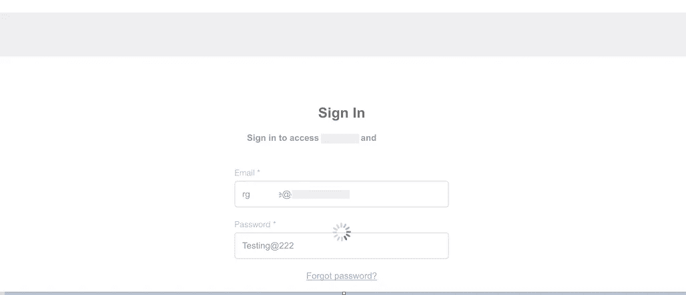

用户的登录页面

*   恶意的朋友/黑客利用这个机会更改电子邮件。
*   点击编辑电子邮件，**恶意好友一**从他的电子邮件即 *rotlu@my.site 和 s* aves 中更新无辜好友的电子邮件。
*   恶意朋友再次将电子邮件回复回原始电子邮件，即从他的电子邮件***rotlu @ my . site****回复到他无辜朋友的电子邮件****rgmail @ mail . my site****。*
*   之后，他们让电脑敞开着，另一个黑客进入了画面。

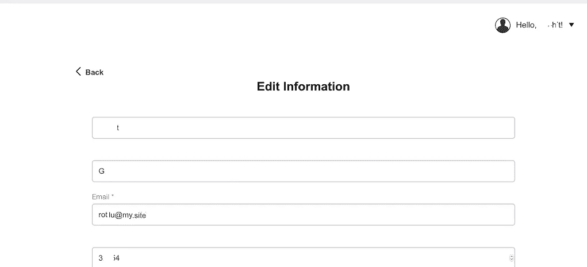

恶意朋友更新了电子邮件并回复到用户的电子邮件

这是有趣的部分！！！

*   现在，黑客获得了物理访问权，并将电子邮件更改为他的电子邮件，即*hacker@lo.com*。

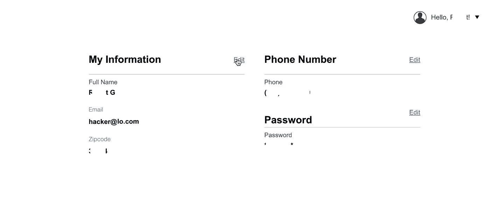

Hacker 更新了他的电子邮件并将其回复

*   现在保存电子邮件，并再次将电子邮件更改为用户的原始电子邮件地址，即 *rgmail@mail.mysite* 。
*   从**到****rgmail @ mail . my site****然后再还原成原来的样子，这样用户就不会知道发生了什么事。*
    ***Tadaa！！！账户被永久黑了。****

*让我来分解一下。这是这里的 bug。我正在检查应用程序是否发送任何邮件或令牌来验证帐户中的更改。但是根本没有发生。然后我开始测试密码重置。*

*现在点击密码重置，并输入攻击者的电子邮件，即*hacker@lo.com*。
黑客在*hacker@lo.com*上收到一个密码重置链接。但是该帐户与任何帐户都没有关联。
点击密码重置，修改密码，但是这里我们还是不知道是谁的密码被修改了。*

*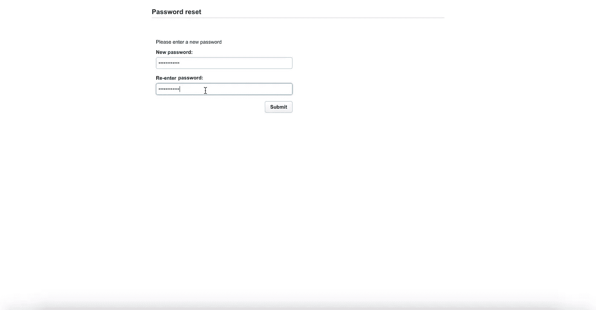*

*未注册或关联电子邮件的黑客的密码重置页面*

*现在尝试使用黑客的邮箱 id 和更新后的密码
登录，查看个人资料中的邮箱，它是用户原来的邮箱即***rgmail @ mail . my site***。之后，如果 *rotlu@my.site* 尝试使用密码重置登录，它也可以登录到 *rgmail@mail.mysite* 。*

*在测试密码重置时，我在寻找注册和非注册电子邮件的成功和失败的响应。但对于任何注册或使用编辑电子邮件功能更改电子邮件的用户来说，他们都可以获得密码重置链接，并更改保存或编辑电子邮件的帐户的密码。*

*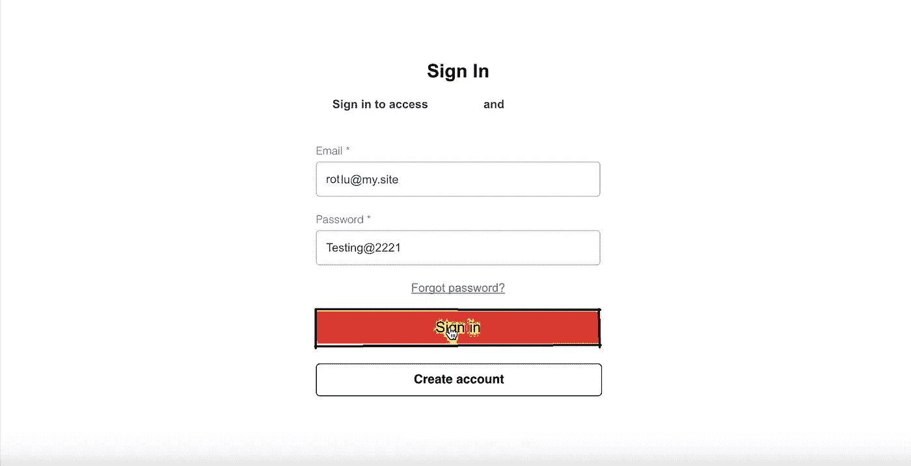*

*恶意朋友试图登录，尽管他的电子邮件没有注册，但保存到受害者/用户的个人资料一次*

*基本上，我们有三个帐户，一个是拥有 **rgmail@mail.mysite** 的用户。另一个第二账户，即 **rotlu@my.site** 是一个**恶意好友**和**hacker@lo.com**是一个**黑客。**所以首先**罗特鲁**改变了电子邮件，并保存了它的电子邮件，然后再次恢复成用户原来的电子邮件。
然后另一个第三账户**黑客**将用户的原始电子邮件更改为他的电子邮件，然后将其还原为**用户的原始电子邮件**。
于是共有两个恶意实体一个朋友和另一个黑客将电子邮件更改为他们的电子邮件，然后将其还原为用户的原始电子邮件。因此，由于失败的业务逻辑，所有三个能够登录到一个帐户通过电子邮件在配置文件是一个普通用户 **rgmail。***

*当攻击者保存他的电子邮件时，它被保存在数据库中，并与用户 id 对应。但是，一旦它再次变回用户的，应用程序没有从数据库中删除它，现在一个用户 id 被映射到两个电子邮件，或者它可以是多个电子邮件，在我们的例子中是三个(我后来检查了)。
因为它是永久存储的，所以即使用户通过密码重置恢复帐户，它也可能再次被黑客攻击，因为任何人都可以在将电子邮件保存到配置文件后重置密码，然后将其更改回原始密码。另一个失败是黑客使用他的电子邮件登录到其他人的帐户，在我们的案例中是 ***rgmail*** *。**

> ***Tale-2**#密码更新字段中不正确的验证会导致永久帐户被接管。*

*在网站中，[https://example2.com/](https://example1.com/profile)有一个密码重置功能，将密码重置链接发送到用户的邮箱。通过拦截请求，然后更改电子邮件地址，攻击者可以重置另一个电子邮件的密码，从而获得对其他用户帐户的完全访问权限。*

***场景:**
1)攻击者从重置页面请求密码重置，并在其邮件中获得密码重置链接。
2)通过使用 web 代理，他试图重置密码，但是能够将他自己的电子邮件修改为另一个用户的电子邮件，并且密码重置将用于重置另一个电子邮件的密码。完成了。*

***复制步骤:***

*   *一旦任何注册用户点击更新密码。*
*   *用户需要输入旧密码和新密码，并确认密码。*
*   *拦截对***/用户/系统用户*** 的 POST 请求。*

*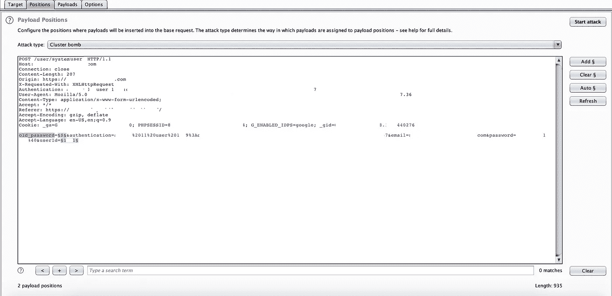*

*捕获密码更改请求并发送给入侵者*

*   *发送请求到打嗝入侵者，并选择攻击类型为集束炸弹。这里我第一次使用集束炸弹，因为需要列举两个参数。*
*   *在 [**集束炸弹**](https://www.trustedsec.com/2017/12/complex-intruder-attacks-burp/) 中添加 ***old_password*** 和 ***userid*** 参数作为 payload1 和 payload2。*

*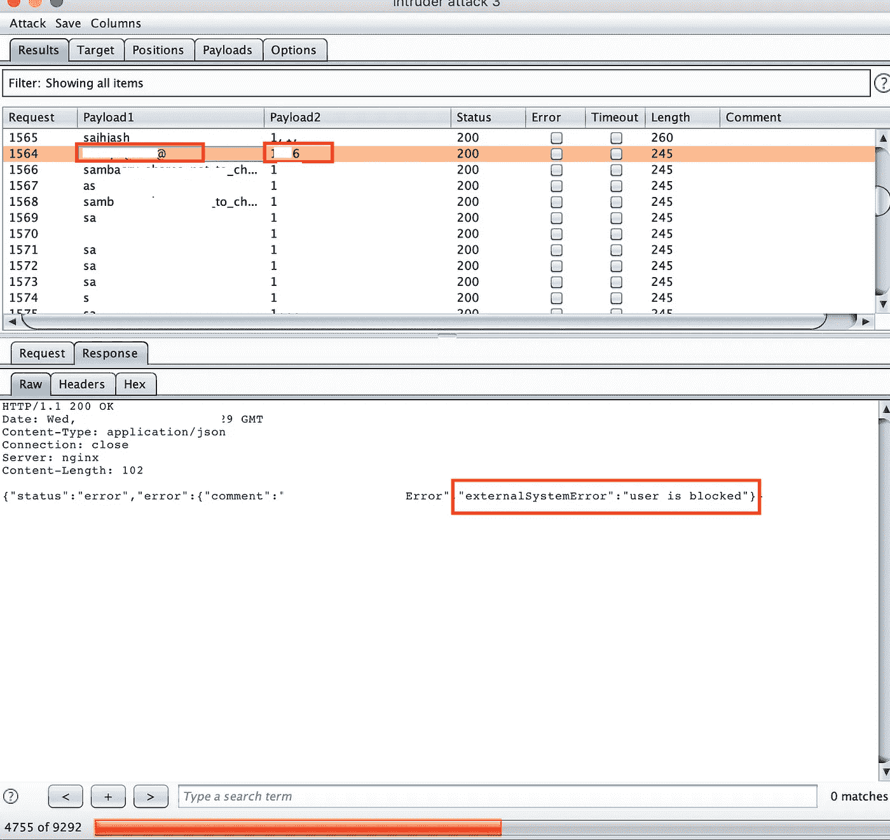*

*密码重置的集束炸弹攻击*

*   *对于 old_password，选择任意单词列表或自定义单词列表，对于 userid，设置一个 4 位数的范围。*
*   *还可以枚举有效的用户 id，然后使用它们来强制使用 old_password 字段。*
*   *当入侵者同时点击旧密码和用户名时，它将点击 200 OK，响应长度也会改变。*

*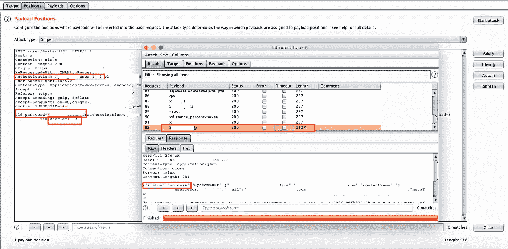*

*用户 id 和旧密码强制后成功*

*   *因为不存在速率限制，所以很容易将线程数增加到 100 并加快进程。*

> ***Tale-3**#密码重置 API 中的不正确验证会导致永久帐户接管。*

*密码恢复功能可能导致用户名枚举、敏感信息泄露和密码重置漏洞。
攻击者请求密码重置，并在其电子邮件中获得有效的密码重置链接。通过拦截，攻击者可以使用密码重置令牌，将自己的电子邮件修改为受害者的电子邮件，受害者而不是攻击者将使用相同的密码重置。*

***场景:**1)假设用户:user@gmail.com
2)ABC 黑客:abc@gmail.com
3)网址:[https://example3.com/password_reset/forgot.html](https://example3.com/password_reset/forgot.php)*

***再现步骤:***

*   *攻击者访问网站并注册他的帐户。*
*   *现在，在密码重置中，他输入了自己的电子邮件。*
*   *重置链接被发送到黑客邮箱，他访问该链接。*
*   *他登陆到[https://example3.com/password_reset/forgot.](https://example3.com/password_reset/forgot.php)html，输入新密码并确认密码，同时打开代理拦截。*
*   *然后黑客在请求中将邮件修改为受害者的邮件并提交。*
*   *提交请求后，受害者帐户的密码成功更改为黑客所需的密码。*

*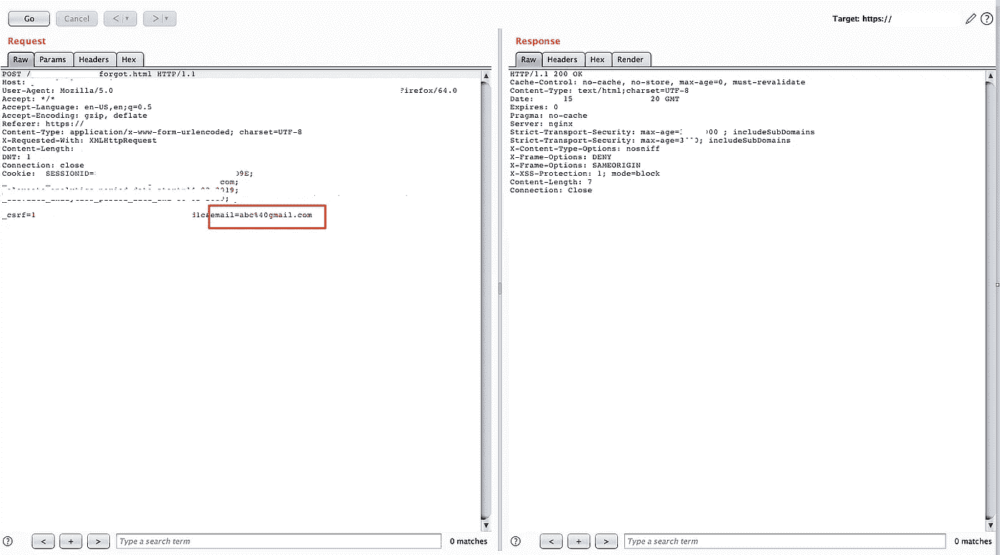*

*将攻击者的电子邮件改为受害者的电子邮件*

*这是在各种易受攻击的 web 应用程序中最常见的场景。这将导致一个完整的帐户接管。*

> ***Tale-4**#配置文件中密码更新字段的访问控制被破坏会导致帐户被接管。*

*重置密码时，访问控制不到位，所以我尝试重置密码，但这需要用于验证和更新每个用户密码的关键 auth 参数。*

*但是，由于访问控制被破坏，这个问题得到了解决，很容易获取包含 auth 参数的用户详细信息，该参数是十六进制 userid，用于创建 JWT 令牌、cookie 和登录后接收的其他关键字段。
该验证参数与新密码一起以补丁形式发送，没有新密码就无法重置密码，并且当输入错误的验证参数时，显示*错误:* ***用户 id 的重复密钥:xxxx 存在*** *。**

***场景:**
1)API:[https://example4.com/api/users/idxxx](https://example4.com/api/users/idxxx)
2)受害者用户名被获取:9991
3)攻击者用户名被获取:7777*

***复制步骤:***

**第一部**

*   *将带有授权头的 get 请求发送到 GET /api/users/7777。*
*   *拦截对/api/users 的 API 请求，并将 userid 更改为受害者的用户 id，即 9991。*
*   *复制密码更新中需要的 auth 参数。*

*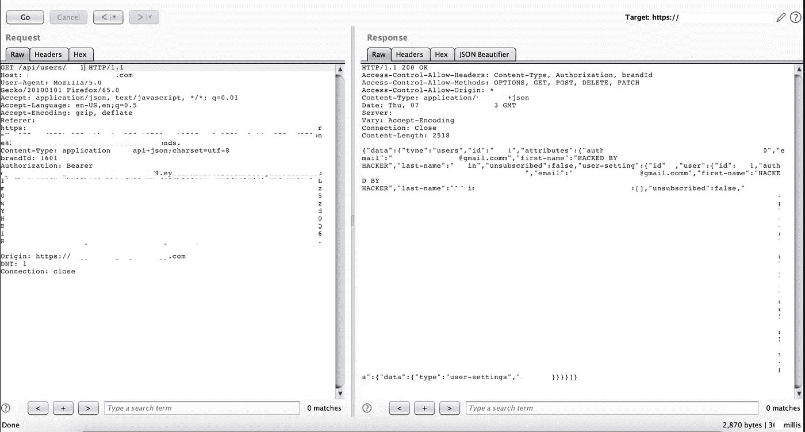*

*由于访问控制被破坏，获取用户数据的请求*

**第二部**

*   *登录任何帐户。*
*   *转到配置文件设置*
*   *输入新密码并确认密码*
*   *通过设置新密码提交并拦截请求。*
*   *代替 POST/PUT，我们可以看到我们有 [***PATCH***](https://developer.mozilla.org/en-US/docs/Web/HTTP/Methods/PATCH) 请求用于部分修改。*
*   *将 userid 更改为受害者的 userid，并将请求主体中的 auth 参数从攻击者的 auth 参数更改为受害者的 auth 参数。*
*   *发送请求并检查响应是否成功。*

*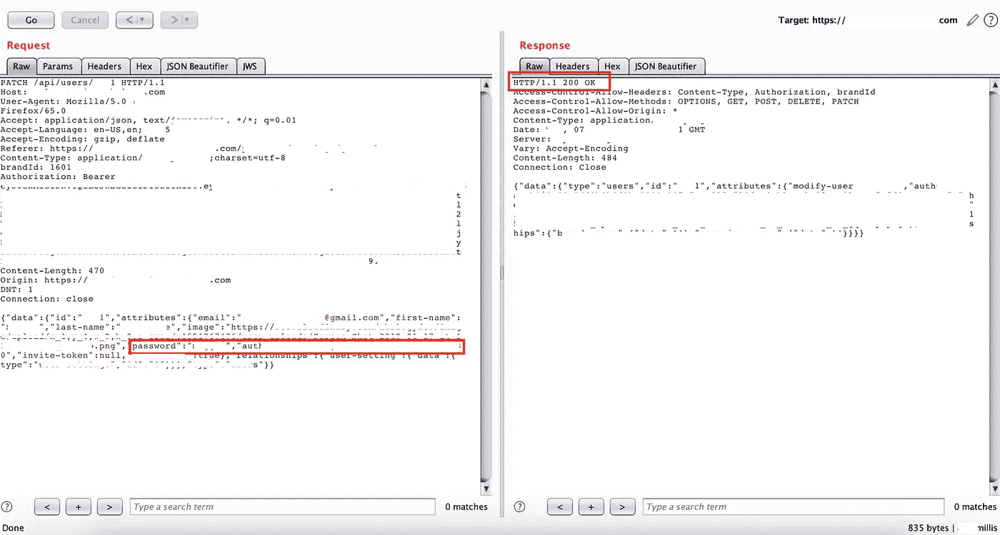*

*添加有效的身份验证参数后成功重置密码*

*除此之外，伪造 JWT 令牌是为了通过 API 调用获取有效的用户数据，从而使此攻击成功。*

***补救:***

1.  *一旦用户更改其电子邮件地址，所有以前的密码重置链接将自动过期。*
2.  *即使用户不应该被允许登录任何其他电子邮件除了一个电子邮件是在配置文件中添加的。*
3.  *缓解重置漏洞的方法是进行一些强加密。发送加密令牌，并将其与特定用户绑定。*
4.  *不要在 JWT 令牌或用户数据中包含关键令牌参数，如身份验证 id，这些参数很容易在访问控制被破坏的情况下获取。*
5.  *在多个地方使用了 JWT 令牌，但使用[无算法](https://www.sjoerdlangkemper.nl/2016/09/28/attacking-jwt-authentication/)很容易伪造*
6.  *由于 Csrf 令牌与会话绑定，因此可以多次使用它来重置密码。所以一个令牌可以用来改变多个帐户的密码。因此，这个令牌应该是有状态的(同步器令牌模式)或无状态的(基于加密/散列的令牌模式)。*
7.  *始终提供速率限制，以便用户 id 枚举和暴力破解不会发生。*

***参考:**
[https://www . trustwave . com/en-us/resources/blogs/spider labs-blog/exploining-password-recovery-functionalities/](https://www.trustwave.com/en-us/resources/blogs/spiderlabs-blog/exploiting-password-recovery-functionalities/)*

*[https://www . sjoerdlangkemper . nl/2016/09/28/attaking-jwt-authentic ation/](https://www.sjoerdlangkemper.nl/2016/09/28/attacking-jwt-authentication/)*

*[https://github . com/OWASP/Cheat sheetseries/blob/master/Cheat sheets/Cross-Site _ Request _ Forgery _ Prevention _ Cheat _ sheet . MD](https://github.com/OWASP/CheatSheetSeries/blob/master/cheatsheets/Cross-Site_Request_Forgery_Prevention_Cheat_Sheet.md)*

*[https://medium . com/bugbountywriteup/bugbounty-how-I-can-compromise-any-user-account-via-reset-password-functionality-a 11 bb 5 f 863 b 3](https://medium.com/bugbountywriteup/bugbounty-how-i-was-able-to-compromise-any-user-account-via-reset-password-functionality-a11bb5f863b3)*

*[https://developer . Mozilla . org/en-US/docs/Web/HTTP/Methods/PATCH](https://developer.mozilla.org/en-US/docs/Web/HTTP/Methods/PATCH)*

* [## 专家的网络安全教育| TrustedSec 博客文章

### 到目前为止，这是我最常被问到的问题:我如何开始从事 IT/InfoSec？许多人似乎对…感兴趣

www.trustedsec.com](https://www.trustedsec.com/2017/12/complex-intruder-attacks-burp/) *