# 中医安全“学院”——演练

> 原文：<https://infosecwriteups.com/tcm-security-academy-walkthrough-51b292cf337b?source=collection_archive---------3----------------------->

## TCM 安全学院机器挑战演练

每个人的一天回顾。在今天的文章中，我们将从实用的道德黑客课程中演练 TCM 安全顶点挑战的最佳机器之一。我使用 VMWare Workstation 作为虚拟机管理程序技术，Kali Linux 作为攻击机器，academy vulnerable machine 作为受害者。

 [## 学院. 7z

TCM 安全学院顶点挑战易受攻击的机器](https://drive.google.com/file/d/1u4628J7AwEzFCS3gWZbJgv-lhGzwmrvf/view?usp=share_link) 

您可以下载并设置环境，因为我们不关注环境设置和安装。


www.dreamstime.com

在你开始之前，**你可以加入我们的 discord 服务器，与志同道合的人交流，分享你能与人分享的一切，帮助他们，让他们回答你的问题。**

[](https://discord.gg/VKJSmqDN5P) [## 加入赛博空间不和谐服务器！

### 查看 Discord 上的 CyberVerse 社区——与 106 名其他成员一起玩，享受免费语音和文本聊天。

不和谐. ggg](https://discord.gg/VKJSmqDN5P) 

# 初始信息

***用户名*** *: root* ***密码*** *: tcm*

由于 academy 机器基于旧版本，因此它没有自动 DHCP(动态主机配置协议)。我们必须手动运行 *dhclient* 命令来获取 IP 地址，然后通过输入 *ip addr* 命令来检查它。

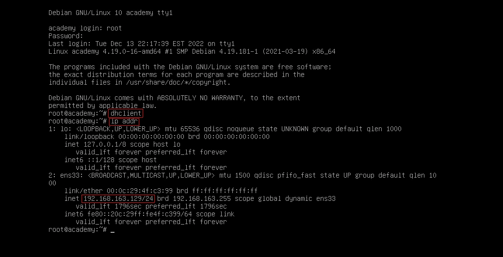

# 扫描和信息收集

信息收集和扫描是解决挑战和获取目标弱点信息以劫持系统并获得控制权的第一步，也是必不可少的一步。首先，我们将进行一次快速的 nmap 扫描，找出所有打开的端口和正在运行的服务及其版本信息。

```
sudo nmap -sV -sC -T4 -p- 192.168.163.129 -oN nmap.scan

#Replace IP address with your ones.
```

如果您不理解上面的命令，我建议您在 medium 上浏览我关于 nmap 的文章。

[](/network-mapping-part-1-112116ce6555) [## 理解 NMAP 方法—第一部分

### 从初级到高级理解 NMAP 方法论。

infosecwriteups.com](/network-mapping-part-1-112116ce6555) 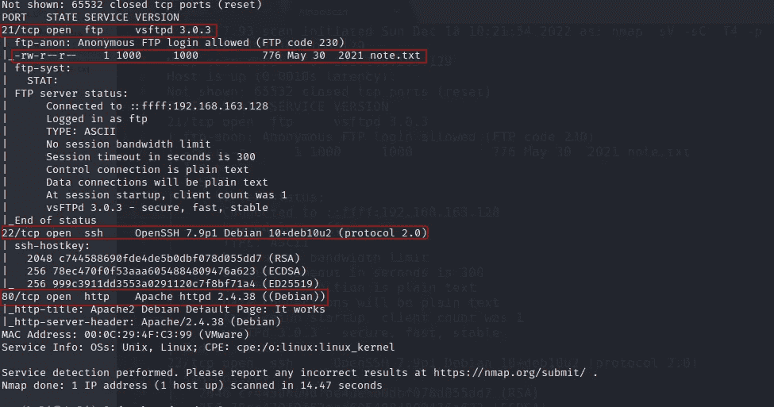

Nmap 扫描结果

根据 nmap 扫描结果，我们在受害机器上打开了三个端口。每个端口都有一些正在运行的服务，其版本显示在中。在端口号 21 上，一个 ftp 服务器正在运行，允许匿名登录该服务器。太好了，我们有发现了。让我们使用 FTP 端口登录到机器。

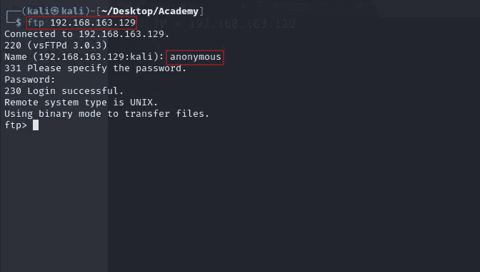

FTP 登录

输入上面的命令，给用户名 **anonymous，**把密码留空，然后回车。很好，你登录了 FTP 服务器。您可以键入 **help** 来显示所有可在系统上运行的命令。现在键入 **ls** 列出服务器上所有可用的文件。

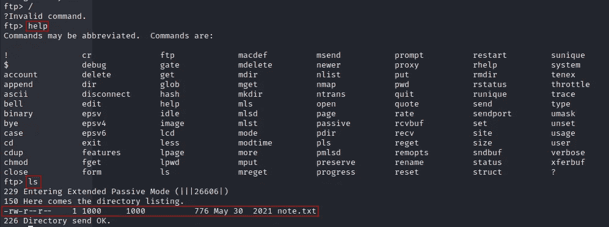

FTP 列表

我们在服务器上得到一个名为 **note.txt** 的文件。看起来很可疑，让我们在服务器上使用 **get note.txt** 命令下载文件，文件将被下载到我们系统的当前目录。

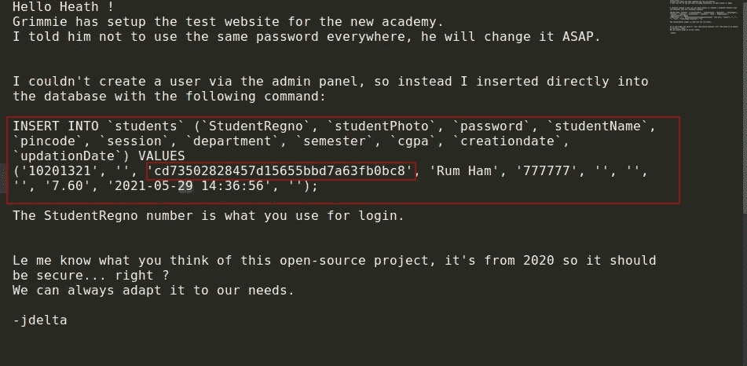

note.txt

太好了，note.txt 文件暴露了如此多的数据库查询信息和学生信息，如学号和密码哈希。我们这里有这么多有趣的信息。另一个开放端口是 22 (SSH)，在 CTFs 中，SSH 服务受到攻击的可能性非常小，所以我们不会浪费时间收集这方面的信息。相反，我们可以在端口 80 上继续移动。作为 nmap 结果，默认页面正在服务器上运行，这意味着可能会有一些有趣的内容。

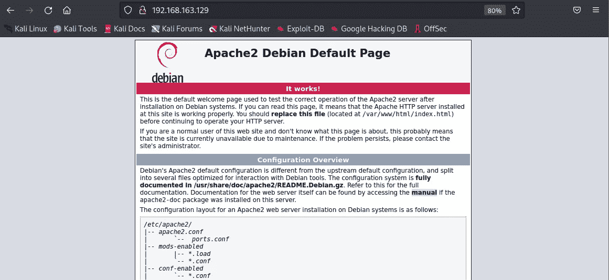

端口 80 上的默认页面

由于只有默认页面在运行，我们必须深入挖掘它，以收集更多的信息和服务器上运行的更多页面。我们将使用一个名为 **gobuster** 的目录破坏工具来完成这项工作。如果你没有安装 gobuster，用 **sudo 来安装 gobuster** 命令。您可以阅读 gobuster 手册页来查看该工具的用法。

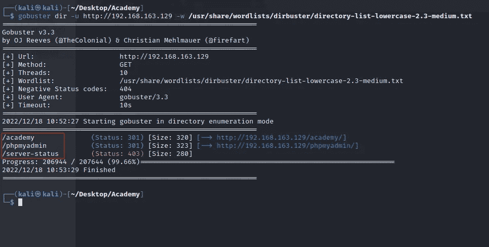

Gobuster 扫描

太好了，我们在网络服务器上找到了一些端点。**/学院**端点看起来可疑如机器名所示。去终点看看那里有什么好玩的。服务器上正在运行学生管理门户。它有一个登录表单，现在记住我们在 FTP 服务器的 note.txt 文件中找到的查询。我们有学生证和密码。

# 初始访问

现在我们有很多信息要输入机器。我们必须破解在 FTP 服务器的 note.txt 中找到的密码散列。我们将使用 **hashcat** 工具来破解密码。按照说明破解密码。首先创建一个名为 **hash.txt** 的文件，并将密码散列存储在其中。

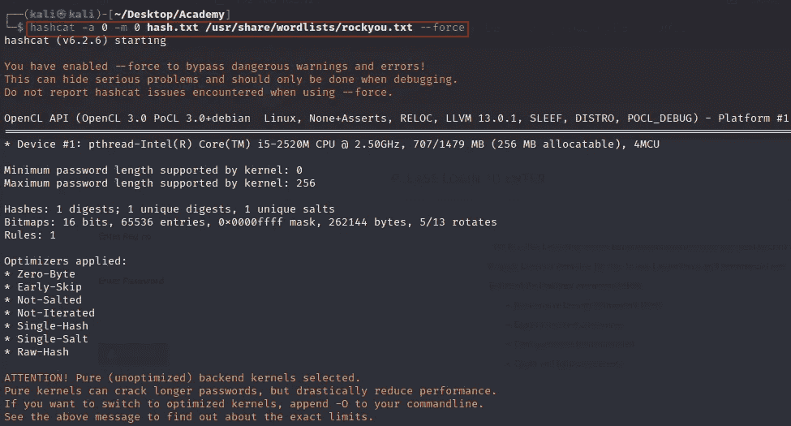

Hashcat 密码破解

使用上述命令启动密码破解过程。你很快就会得到密码。在这篇文章中，我展示了散列的密码。太好了，现在我们有了用户名和密码。我们现在可以登录学生门户网站。

在门户网站中，我们发现了一个学生资料页面，它为我们提供了一个上传文件的选项。让我们检查它是否容易受到文件上传漏洞的攻击。该网站是基于 PHP 技术运行的。我们从 github 下载 PHP 反向 shell，上传到服务器。

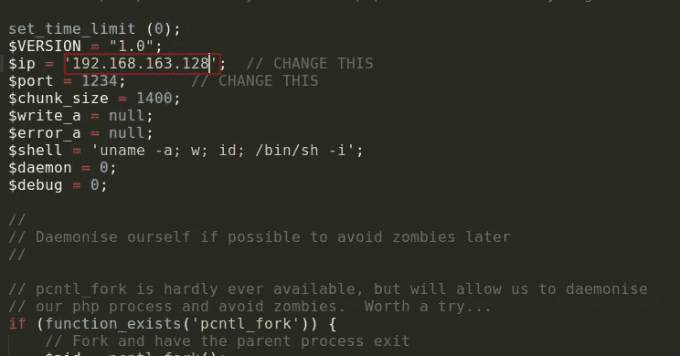

PHP 外壳

现在，在上传 shell 文件之前，将＄IP 变量更改为您的 Kali Linux IP 地址，并在与 shell.php＄端口相同的端口上启动一个 **netcat** 侦听服务器，用于侦听来自受害机器的传入连接。

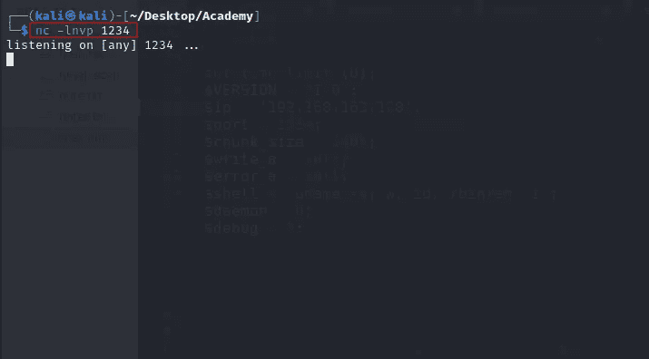

Netcat

完美，我们准备上传一个 shell 到学生资料部分。选择一个 shell.php，更新配置文件，并检查我们是否从服务器获得任何连接。


Netcat Shell

很好，我们从受害者服务器上恢复了连接，现在我们是 www-data 的用户。现在我们有了读取服务器配置文件和数据的特权。找出/ **var/www/html/academy** 文件夹下的 PHP 配置文件，看看有没有什么有趣的信息。

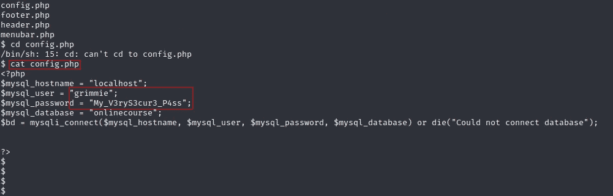

config.php

嘣，我们从 PHP 配置文件中找到了用户名和密码。现在让我们使用这些信息通过 SSH 协议登录用户帐户。使用 **ssh grimmie@ < ip >** 连接到服务器，然后键入 yes 并提供登录密码。


嘘

嘣，现在我们作为一个 grimmie 用户在受害者机器中。我们已经黑进了机器。但这不是最后一件事，我们必须尝试提升我们的特权到根用户。

# 权限提升

权限提升是 CTFs 中一个非常重要的方面。有许多方法可以做到这一点。在这里，我们将看到一种方法，以及我们如何利用它来获得机器的 root 访问权限，这将为我们提供系统的最高权限。

在这里，我们将看到如何使用计划任务来提升用户权限。用户 grimmie 的主文件夹中有一个 backup.sh 文件。这个脚本正在对系统进行备份。我们可以看到关于脚本何时在系统上运行的信息(该信息可以在 **/etc/crontab** 文件中找到),并使用 reverse shell 更改脚本内容以提升权限。

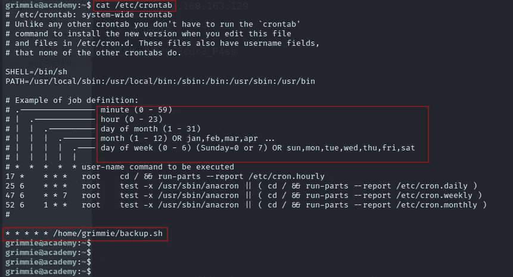

crontab

该脚本文件每分钟、每小时、每天、每月、每周运行一次，以进行备份。现在用我们的 rev shell 修改脚本，并启动一个 netcat 监听器来获取 root 权限。

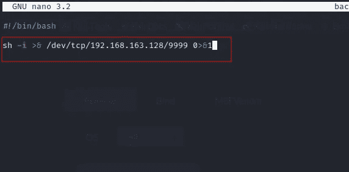

Rev 外壳

替换 backup.sh 中的以下代码，并在端口 9999 上启动 netcat 监听服务器，然后等待连接。用上面的代码替换你的 kali linux IP。

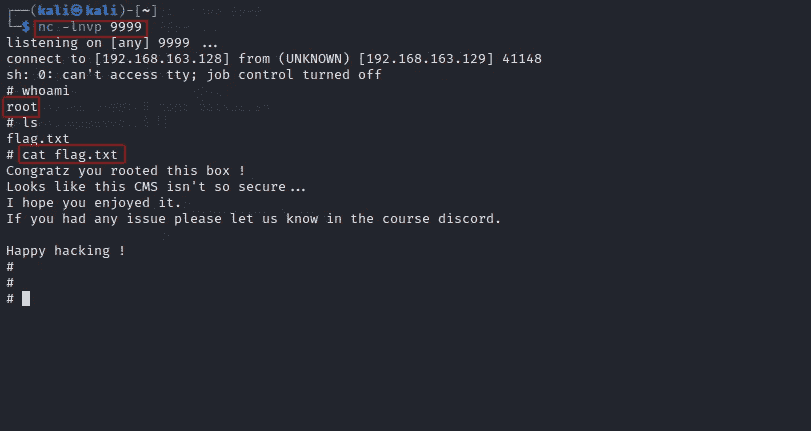

根

嘣，我们得到了一个根特权反向外壳。现在我们有了系统的根源，我们可以对受害者做任何事情。黑客快乐！

这就是今天的文章。如果你觉得它很有趣，很有启发性，那就和你的朋友分享吧。谢谢你读到这里。让我知道你想在评论区阅读文章的问题或主题。

你可以在社交媒体上关注: [LinkedIn](https://www.linkedin.com/in/jay-vadhaiya-3b74531b1/) ， [Instagram](https://www.instagram.com/mr.jv_2407/) ， [Twitter](https://twitter.com/sudo0x18)

## 来自 Infosec 的报道:Infosec 每天都有很多内容，很难跟上。[加入我们的每周简讯](https://weekly.infosecwriteups.com/)以 5 篇文章、4 个线程、3 个视频、2 个 GitHub Repos 和工具以及 1 个工作提醒的形式免费获取所有最新的 Infosec 趋势！