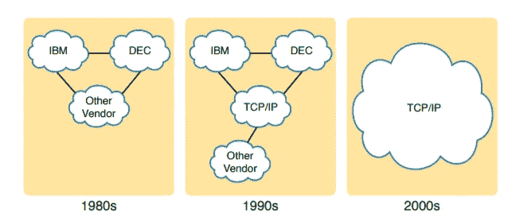

# TCP/IP 网络模型

> 原文：<https://infosecwriteups.com/tcp-ip-networking-model-69686f893569?source=collection_archive---------6----------------------->

大家好，欢迎回到阿尤什这边，在上一篇文章中，我们了解了什么是网络，现在我们将从 TCP/IP 模型开始。

## 什么是 TCP/IP 模型？

TCP/IP 模型只不过是一个网络蓝图，其中所有的文档都在那里，如何创建或设置任何网络，在哪里使用哪些设备，或者在不同的层中应该有什么协议。

就像一个房子的蓝图，当你想建造你的家，然后你得到整个房子的蓝图，建筑工人根据蓝图工作，比如什么类型的基础，两个不同的房间之间有多少空间等等。

所以这个网络模型只是一个蓝图。

## TCP/IP 模型的历史

首先，让我告诉你为什么 TCP/IP 模型发挥作用为什么蓝图发挥作用，让我们开始吧。

在 20 世纪早期，许多公司都在创建自己的模型，例如在 1974 年，IBM 发布了其系统网络架构(SNA)网络模型，其他供应商也开始发布他们自己的网络模型，假设如果一家公司购买了三台计算机，那么一名网络工程师将需要创建三个不同的网络，然后他/她将尝试相互连接并创建一个单一的网络。在这种情况下，每个人都在创建自己的模型，因此建立网络会非常复杂。

这就是为什么为了解决这个问题，国际标准化组织(ISO)为每个人创建了一个模型，即 OSI(开放系统互连)模型，然后公司开始使用 TCP/IP 模型以及 OSI 模型。然后在 2000 年代，TCP/IP 模型完全进入市场，现在仍在使用，但为了学习，我们还将学习 OSI 模型，因为两者大致相似。

来源:思科

在这里，您可以看到网络是如何在 20 世纪 80 年代创建的，当时所有公司都在创建自己的模型，然后在 20 世纪 90 年代，TCP/IP 开始发挥作用，然后在 21 世纪初，TCP/IP 主导了整个市场。

在下一篇文章中，我们将学习 TCP/IP 的概述

感谢您阅读到现在:)