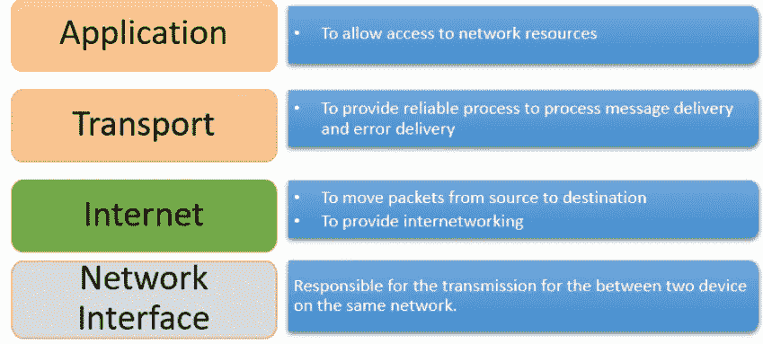
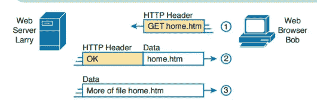
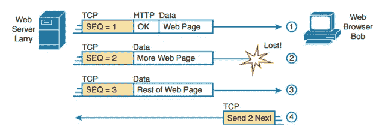
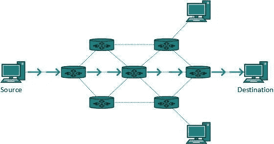

# TCP/IP 网络模型(第二部分)

> 原文：<https://infosecwriteups.com/tcp-ip-networking-model-part-2-efcc9de9ad40?source=collection_archive---------2----------------------->

大家好，Ayush 这边在这个博客的第一部分，我们了解了什么是 TCP/IP 网络模型，以及它的历史，这个模型是如何发挥作用的。

所以今天我们将更详细地讨论，让我们开始吧

首先，我们再来看一下什么是 TCP/IP 网络模型，TCP/IP 网络模型是一种规则，不同的供应商在创建任何硬件或软件以将该设备或软件连接到互联网时都会遵循这种规则。

TCP/IP 模型分为四个部分，称为层，整个网络依赖于这四层，所以让我们看看这四层是什么。

资料来源:guru99.com

现在，我们将逐一了解每一层的解释，我们将学习自上而下的方法，即从应用层到网络层向接收器发送数据。

注意:在每一层都添加了一些信息，称为报头。

**应用层:**在 TCP/IP 网络模型中，这是第一层，为了理解这一点，我们来看一个场景，您打开了浏览器，它是一个将在应用层为您创建数据的应用程序，您浏览了一个网站，比如说 example.com/index.html**，这里您使用的是应用层 **http** 的一个协议，它运行在**端口 80** 上，用于获取网页内容。所以这里你用 get 请求服务器 index.html 页面，然后服务器给你发送那个网页作为响应并显示在桌面上。在这一层，所有的数据都被加密，会话也被创建。**

****

****传输层:**这是 OSI 模型的第二层，上面的数据被分成不同的部分，然后给每个部分加上序列号。在这一层 TCP 和 UDP 协议工作，现在让我们说，如果服务器在不同的部分发送回数据，其中一部分丢失，然后客户端再次请求该部分，然后服务器将其发送回。这被称为 TCP 错误恢复。**

****

****网络层:**在这一层进行 IP 寻址，这意味着无论何时我们想要向远程服务器发送数据，都要经过许多路由器。在 IP 寻址或路由中，就像邮政服务一样，我们只需将信件放在信箱中，然后邮政服务根据他们的规则或媒介发送信件。IP 寻址就像这样，在数据中附上目的地 IP 地址，然后每个路由器将目的地 IP 地址与它们自己的地址匹配，如果匹配，则接受该数据或数据包，如果不匹配，则将该数据包转发到该路由器知道其 IP 地址的附近路由器。然后数据包最终到达目的地。**

****

**来源:网络百科**

****数据链路层/物理层:**在这一层，如果数据/数据包到达目的地，那么在许多情况下，最终路由器通过 LAN 电缆或以太网连接，然后在 mac 寻址的帮助下将数据传输到实际主机，并将数据转换为比特，然后添加一些报头信息，最后解密所有加密数据，然后主机获得实际信息或数据。**

****

**来源:开发者帮助**

**我希望通过上面的图片，你会有一个想法，如果你没有一些概念，那么没有问题，所有这些东西都将在未来的博客中出现，如 mac 地址，不同网络设备的 ip 地址等等。**

**我希望你喜欢这个博客，谢谢你的阅读！**

**快乐学习！**