# TCS Hackquest 4.0 CTF

> 原文：<https://infosecwriteups.com/tcs-hackquest-ctf-aeb52c92083c?source=collection_archive---------0----------------------->

这是来自 TCS hackquest 的挑战的书面记录。

总共有 10 个挑战，我赢了 7 个。

# 挑战:-外星信息

给定的文本是 base64 的，因为在字符串的末尾有一个“==”符号，该符号通常用于 base64 填充。

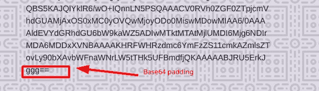

txt 消息

我使用$base64 命令来解码消息。

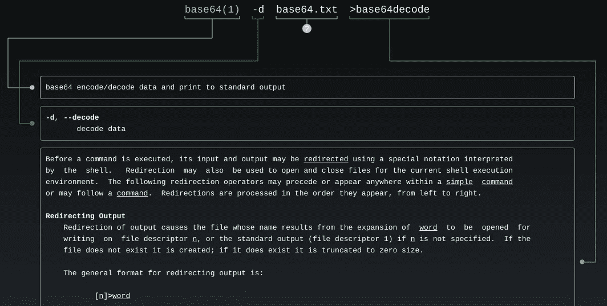

男子 base64

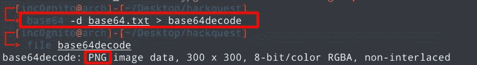

寻找味精

解码 msg 一个 PNG 文件，并使用任何 Qr 解码器工具找出结果。

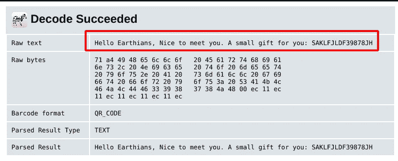

解码消息

# 挑战:-迷失的蝙蝠侠

给定的文件没有扩展名，所以要找出文件的类型，使用 **$file** 命令( *google about magic numbers* )。

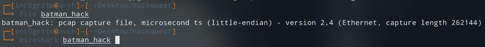

该文件是一个 tcpdump 文件，我们可以使用 Wireshark 打开该 pcap 文件。

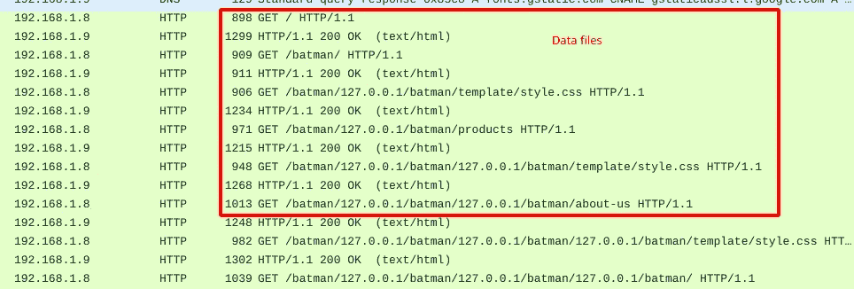

快速分析后，我发现捕获的数据是某种网站。

要导出所有文件，进入文件菜单→导出对象→HTTP，然后全部保存。

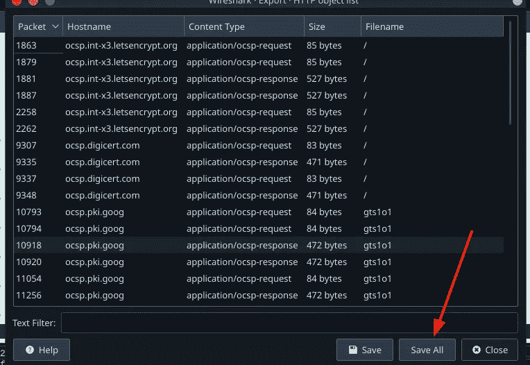

有许多文本和图像文件，并执行字符串对 joker.jpg 给我们的旗帜。

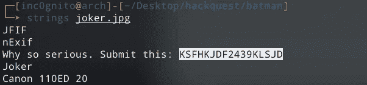

# 挑战名称:-呼叫查理

给文件是。wav 文件，在列表中，我们发现这是莫尔斯电码，并用在线工具解密。

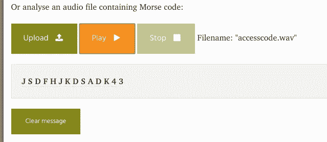

# 挑战:-重置密码

有一个用于更新密码的登录页面，需要旧密码。我只是使用 inspect element 删除元素。，并提交表单。

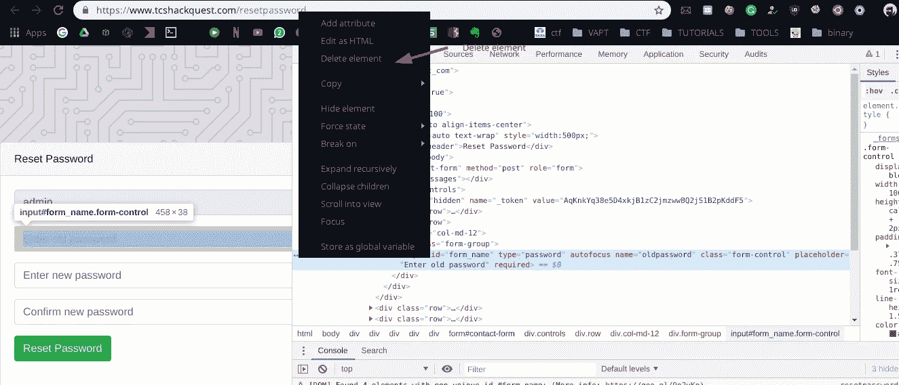

有许多方法可以完成这项挑战，我们可以使用 burp 来捕获请求并删除旧的密码字段。

# 挑战:-泄漏和泄露

给定的描述给了我们暗示，它与某种 aws 或 AWS 键有关。

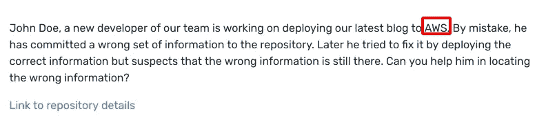

给定的文件是 git 文件。因此，我们可以找出所有以前的提交和角色，以找出所做的更改。

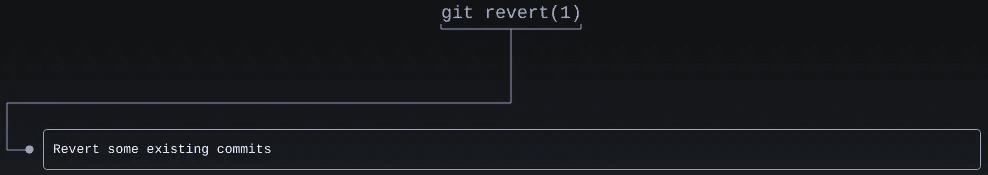

```
git revert (Double tab to find out all the possible values ,fancy stuff :P)
```

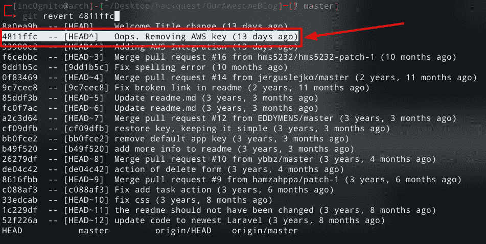

在这个 revert 命令之后，它将打开提交文件，其中显示了发生更改的位置。在我们的情况下。环境文件被修改。

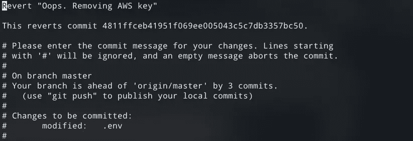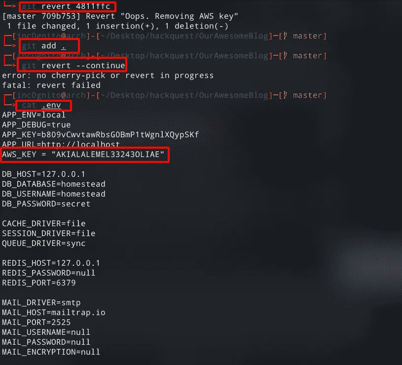

我们可以使用 git revert 4811fc 和 cat。env 也给出了标志。

# 挑战:-人才过剩

挑战提示我们的请求被一些特殊的浏览器看到。

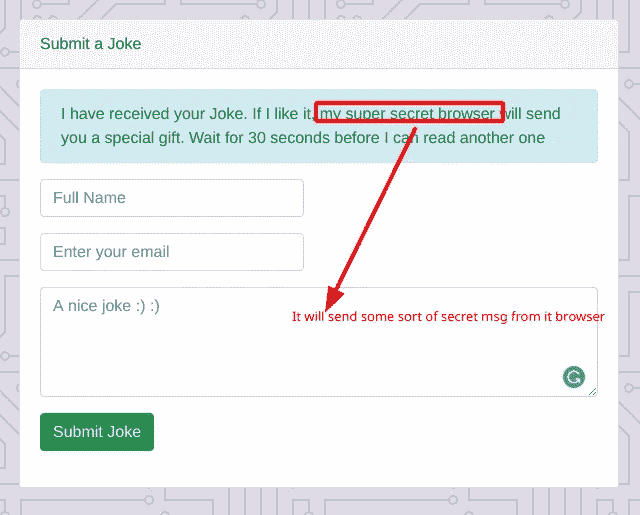

看起来像某种注射。所以我启动了一个 ngrok 服务器并发送了一些有效载荷。经过一些尝试，我得到了回应。

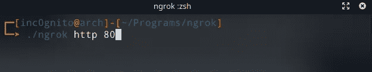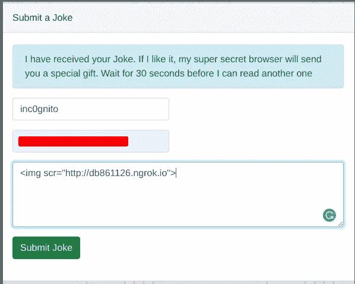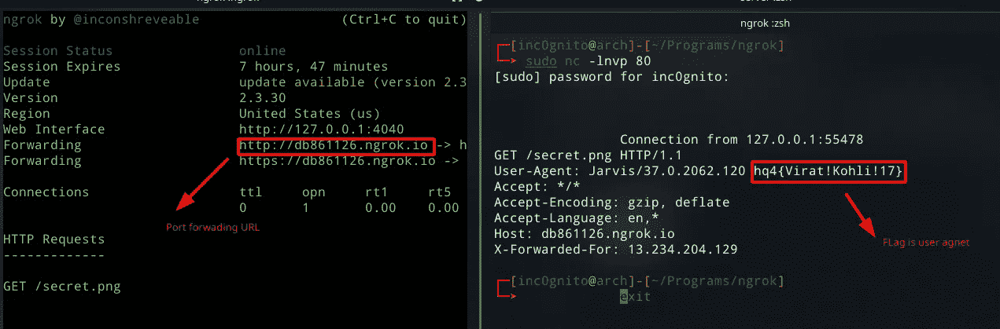

在左侧，ngrok 正在运行，在右侧，我们从 nc 中列出，在左侧，我们在用户代理字段中获得了标志。

*总结:- Ctf 相当容易，有些挑战是好的，有些需要猜测。*

*感谢阅读！如果你喜欢这个故事，请点击**👏 ***按钮和*** *分享它来帮助别人！欢迎留言*💬*下图。有反馈？下面我们连线上* [*推特*](https://twitter.com/yashanand155) *。**

# *❤️由[增加到](https://twitter.com/yashanand155)*

**关注* [*Infosec 报道*](https://medium.com/bugbountywriteup) *获取更多此类精彩报道。**

*[](https://medium.com/bugbountywriteup) [## 信息安全报道

### 收集了世界上最好的黑客的文章，主题从 bug 奖金和 CTF 到 vulnhub…

medium.com](https://medium.com/bugbountywriteup)*