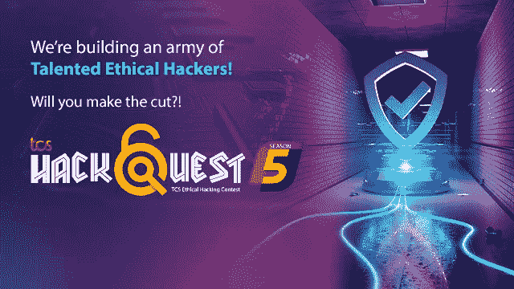
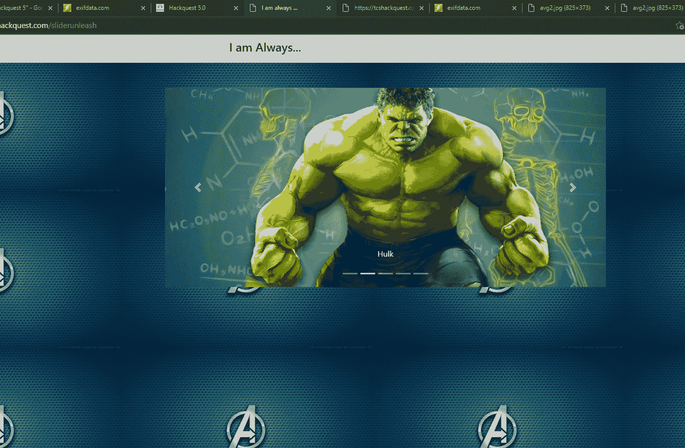
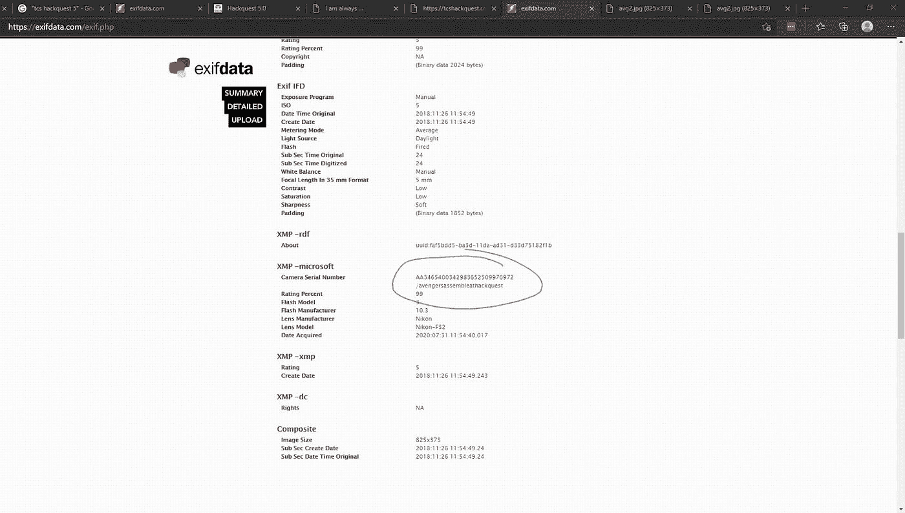
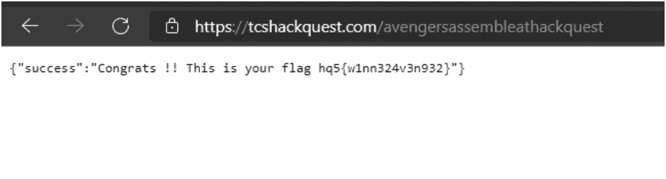
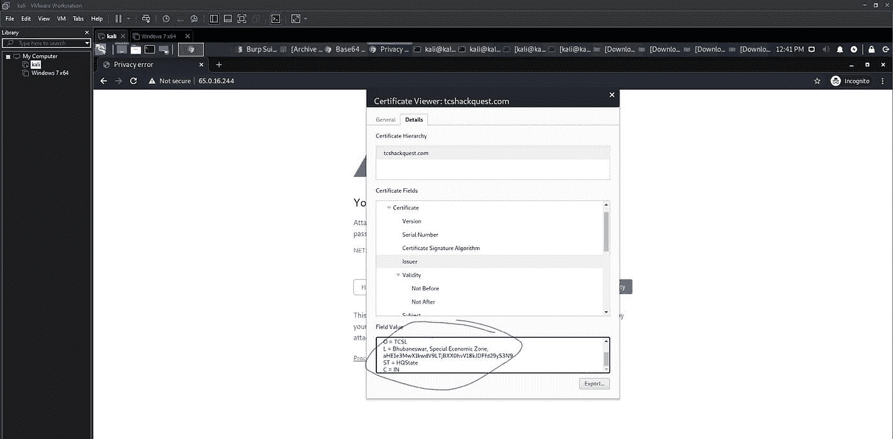
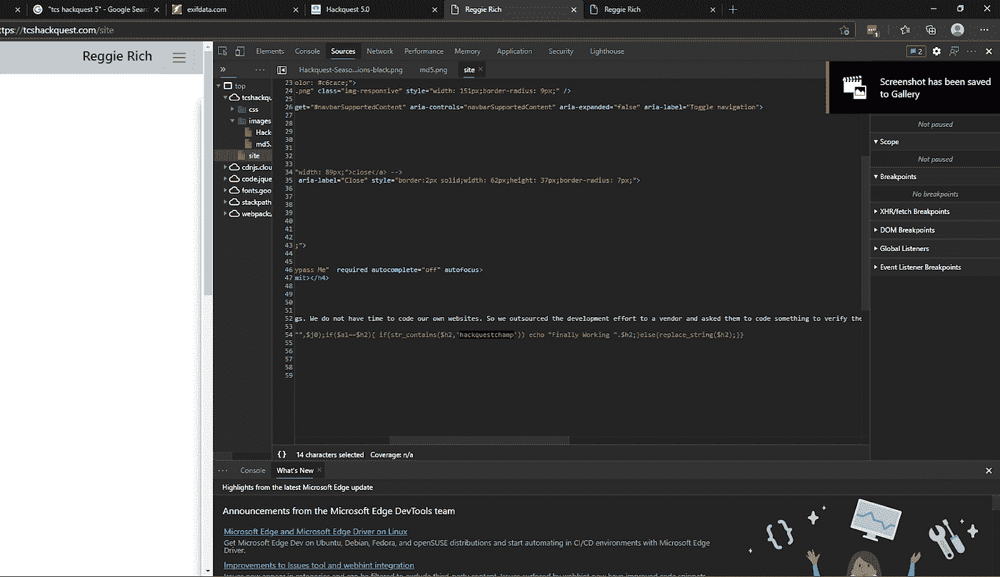
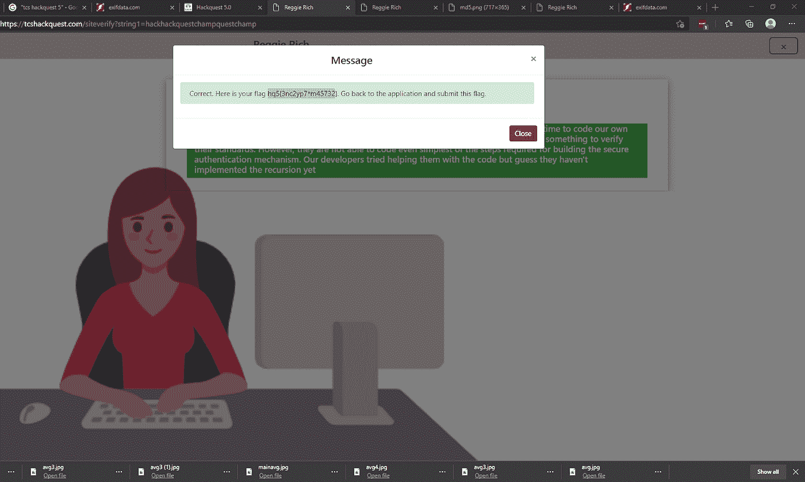
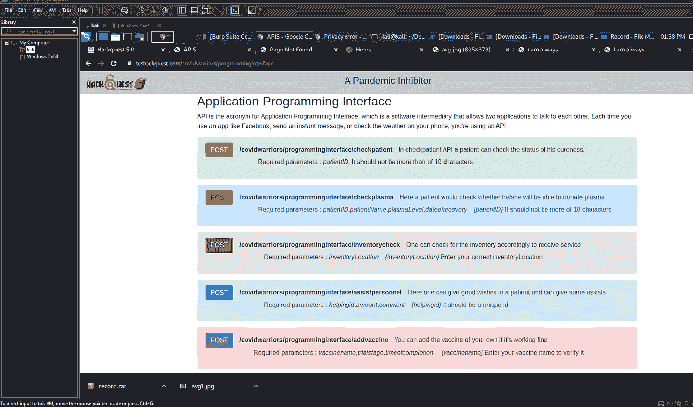
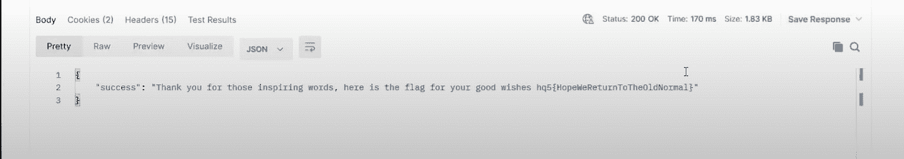

# TCS 黑客任务第 5 季-第一轮 CTF 写

> 原文：<https://infosecwriteups.com/tcs-hackquest-season-5-first-round-ctf-write-up-75c9ccbd3438?source=collection_archive---------0----------------------->

TCS 黑客任务第五季

**TCS HackQuest 第五季**是由 TCS 公司从 2021 年 1 月 23 日开始举办的 CTF 竞赛。

这场竞赛与网络安全及其在当今网络世界中的重要性有关。

我参加了这个比赛，这是我第一次参加如此大规模的 CTF 比赛，我习惯了在 2020 年做一些 CTFs，pentesting 和漏洞研究，这都要感谢 HackTheBox.eu 和 TryHackMe 上的锁定。

因此，随着昨天结果的公布，我将分享我的想法和我在第一轮中找到这些标志的方法，因为它可能会帮助到一些人！

我只拿到了 **4 个挑战** (3 个辅修，1 个主修)，加起来 **700 分。**

第一项挑战:我总是…

**Flag:** hq5{w1nn324v3n932}

**点数:** 100

**描述:**将绿巨人的愤怒问题与隐藏的旗帜联系起来。

**解决方案/方法:**

1.  众所周知，浩克是最强的复仇者，这立刻使他的形象细节变得有意义，我还将他与其他复仇者进行了比较，以进行复查。

2.我对其中的数据进行了 EXIF 处理，发现它有一些文件位置(目录/路径)。

3.然后，我只需输入主域，后跟我收到的目录 url 格式的路径。(tcshackquest.com/avengersassembleathackquest)

4.最后，我找到了所需的主旗。

**挑战 2 :** 数码魔术(该挑战在一段时间后被移除)

**Flag:**hq5 { s0 _ Y0u _ kn 0 whow $ $ 1 _ worKs }

**点数:** 100

**描述:**提示就在挑战题目本身:**数字证书**是一个东西。

**解决方案/方法:**

1.在这里，我注意到在描述中它说数字证书是必要的，并且它立即点击可能与数字证书本身有关。

2.然后通过 NIKTO 扫描，我获得了详细信息，并跟踪了远程 IP，大约是 62。XX…默认情况下，它使用 HTTP(不安全)协议，并向我显示了一个提示。

3.然后，我研究了证书，发现在 ISSUER 部分隐藏了一个 base 64 字符串，以及其他详细信息，如下所示:

4.最后，我解码了 base64 字符串并获得了所需的标志，如下所示:

第三项挑战:雷吉·里奇

**Flag:**hq5 { 3n C2 yp 7 * m 45732 }

**点数:** 100

**描述:**使用 preg_match()匹配 PHP 字符串。

**解决方案/方法:**

1.在这里，我注意到在源代码中，通过使用 inspect 元素，它说它使用了一个使用 php preg_match()函数的特定模式。

2.所以我使用了，首先以前缀的方式使用初始字符串，然后是原始字符串，以后缀的方式使用字符串，就像我们通过引用下面的函数得到 hackhackquestchampquestchamp 作为神奇的字符串。

3.所以，这里我们可以说模式 1 是 **hack** 然后模式 2 是**原声**最后模式 3 是 **questchamp** 。

4.最后，在使用了神奇的字符串后，我得到了如下的旗帜:

**挑战四:**疫情抑制剂

**Flag:**hq5 { hopewereturntoheldnormal }

**积分:** 400(当时我得到的唯一一个重大挑战)

**描述:**疫苗生产厂家和帖子请求是我看完后得到的唯一线索。

**解决方案/方法:**

1.在这种情况下，我发现我们需要向外部转发一个 API 请求，所以我使用了 postman，因为我对它有基本的了解。

2.我使用了 tcshackquest portal 中给出的参数，通过定位到 API 参数的主目录。(下面是目录片段)

3.然后我意识到我需要传递几个参数，比如 SQL 注入模式。

4.然后，我使用了之前的 cookie，我们将它用于主登录(对于 hackquest portal ),如下所示:

5.最后，在 **Covaxin** 值之后，我得到了我的标志，当我使用辉瑞疫苗作为该值时，它向我显示了一个可疑的警告(它真的能治愈它吗？)***# atmanirbharbharat***

> 谢谢你读到这里，请分享这篇文章，并为它的可见性鼓掌，因为它可能也会帮助别人！
> 
> 我希望这有所帮助，并以某种方式给你一个想法，继续学习，第二轮见！

注意安全！保持祝福！

**可能对你们有用的资源:**

[enaqx/awesome-pentest:一个令人敬畏的渗透测试资源、工具和其他闪亮东西的集合(github.com)](https://github.com/enaqx/awesome-pentest)

[阿格瑙-阿卜杜勒贾利勒/CTF-图尔斯(github.com)](https://github.com/agnaou-abdeljalil/CTF-Tools)