# 团队 Tryhackme 记录

> 原文：<https://infosecwriteups.com/team-tryhackme-writeup-f36f26289b44?source=collection_archive---------2----------------------->

## 由沙姆谢尔汗这是一个 Tryhackme 室“团队”Tryhackme 写

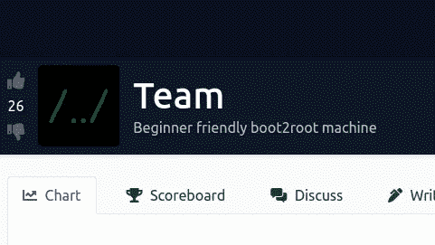

[https://tryhackme.com/room/teamcw](https://tryhackme.com/room/teamcw)

**房间链接:**[https://tryhackme.com/room/teamcw](https://tryhackme.com/room/teamcw)
**注:此房免费**

# 列举

将目标添加到/etc/hosts 文件

```
echo "10.10.132.103      team.thm" >> /etc/hosts
```


开放港口是

FTP 21

SSH 22

**HTTP 80**

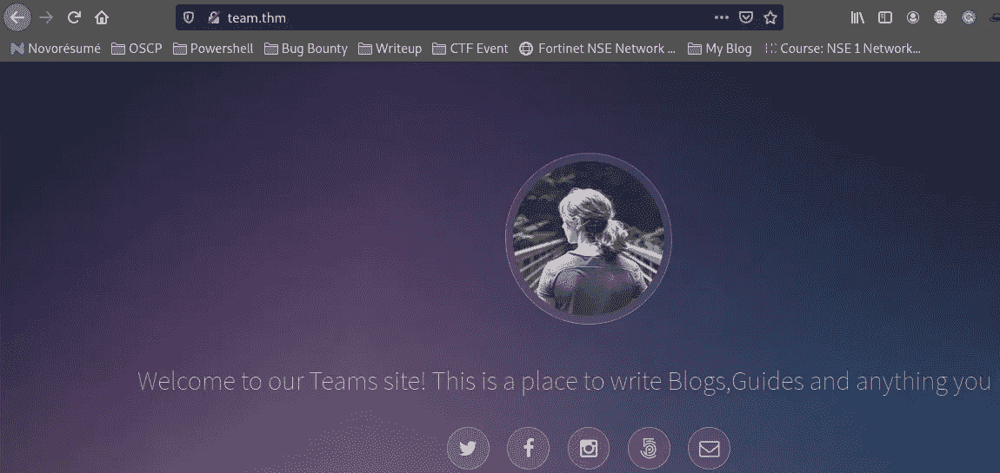

# Gobuster

```
gobuster dir -u [http://team.thm/](http://team.thm/) -w directory-list-2.3-medium.txt -x php,html,txt
```

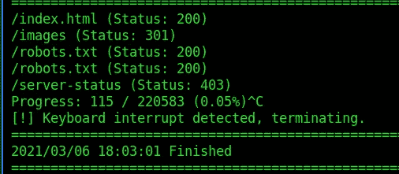

让我们检查 robots.txt 文件

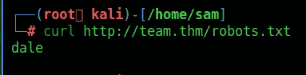

也许它的用户名，但什么 FTP 或 SSH

**子域暴力破解**

```
wfuzz -c --hw 977 -u [http://team.thm](http://team.thm) -H "Host: FUZZ.team.thm" -w /usr/share/wordlists/seclists/Discovery/DNS/subdomains-top1million-5000.txt
```

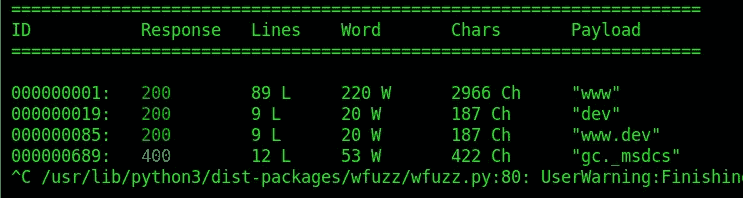

查看 wfuzz 的结果，我们得到了一个额外的虚拟主机，我将它添加到了 hosts 文件中

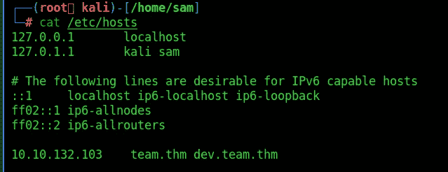

并试图导航到虚拟主机


单击占位符链接，我们看到它使用了某种 include 来包含 teamshare.php 文件

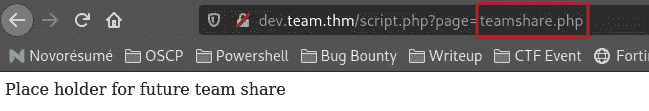

让我们检查一下 **LFI 漏洞**

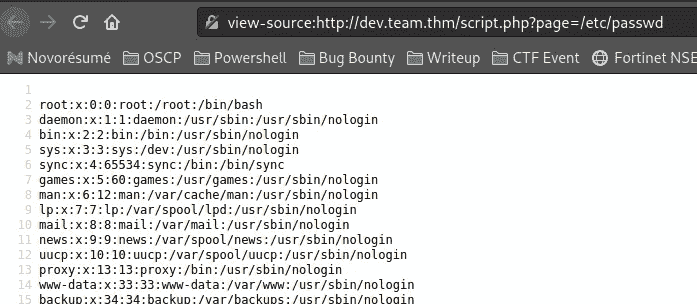

我们现在确定 web 应用程序存在文件包含漏洞。考虑到这种脆弱性，我们想到了两件事:

1.  我们可能不得不利用 LFI 漏洞通过各种方法远程执行代码，例如远程文件包含、php 包装( **expect://，php://input)** 代码执行、日志中毒、泄露 phpinfo 文件等。
2.  利用这个漏洞读取一些敏感文件，这将导致我们危及盒子

让我们尝试获取 **User.txt**

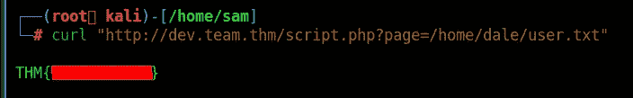

首先，我决定用一个单词表运行 intruder(它是 BurpSuite 的 fuzzer 内建版本),以检查 Linux 系统上的常见文件

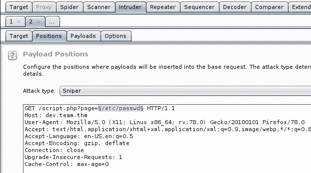

我使用的单词表来自 Seclists。

```
SecLists/Fuzzing/LFI/LFI-gracefulsecurity-linux.txt
```

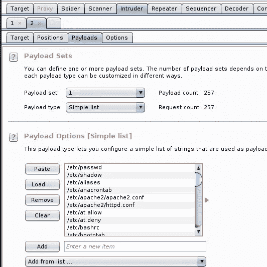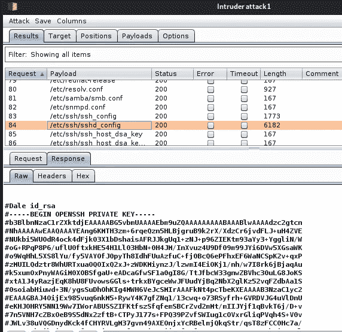

不带打嗝套件

```
curl "[http://dev.team.thm/script.php?page=/etc/ssh/sshd_config](http://dev.team.thm/script.php?page=/etc/ssh/sshd_config)"
```

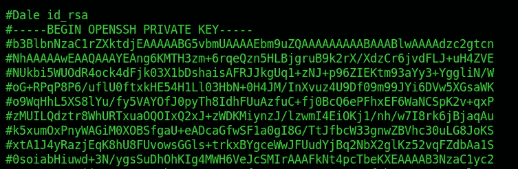

我们为用户 Dale 获得一个 SSH 私有密钥。

我将密钥复制到我的 kali 中，编辑删除了井号，并使用命令赋予它写权限

```
chmod 600 dale.key
ssh
```

试着用钥匙登录盒子

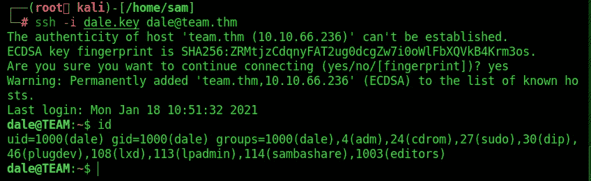

# 权限提升

运行 sudo -l，我们看到我们可以在用户 Gyles 时运行特定的 bash 脚本

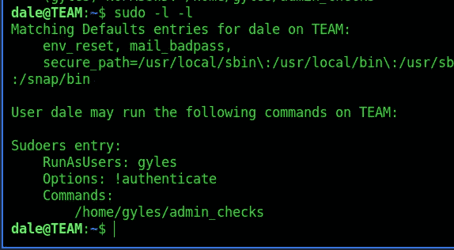

查看该脚本，我们可以看到在脚本中有三个可能的地方可以插入系统命令

检查文件**/home/gyles/admin _ checks**的内容

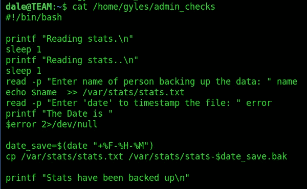

我将注入错误变量，因为我们看到该变量被直接传递给系统调用

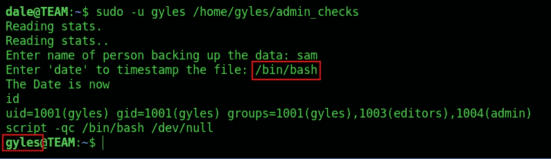

现在我们有一个外壳作为 gyles 的用户。查看用户的主目录，我们看到作者离开了。bash_history 意味着我们可以追踪作者在创建盒子时做了什么

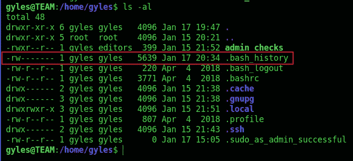

浏览该文件，我们看到/usr/local/share 中名为 main_backup.sh 的文件正在被编辑

```
cat .bash_history
```

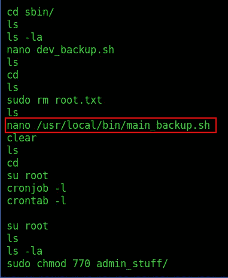

我们还看到一些提到 crontabs，这意味着可能有一个 cronjob 正在运行

查看该文件的权限，我们看到它只能由根用户和管理组中的成员写入。gyles 用户在管理组中，如下面的截图所示，这意味着我们可以修改文件的内容

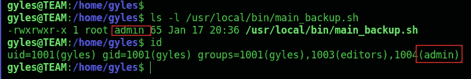

用 vim 文本编辑器查看该文件，我们看到这是一个 bash 脚本，它复制了一些备份，我决定编辑该文件并添加一个反向 shell，因为我知道有一个 cronjob 正在执行

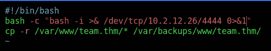

接下来，我设置了一个 netcat 监听器

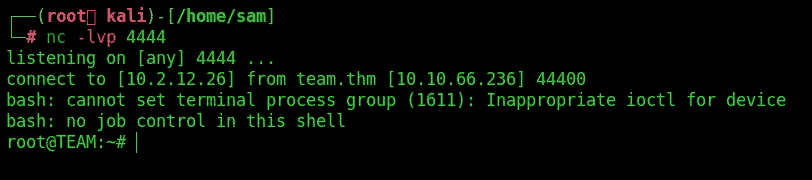

嘣！我们有根壳

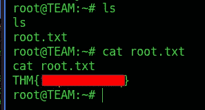

你可以在:
**LinkedIn:-**[https://www.linkedin.com/in/shamsher-khan-651a35162/](https://www.linkedin.com/in/shamsher-khan-651a35162/)
**Twitter:-**[https://twitter.com/shamsherkhannn](https://twitter.com/shamsherkhannn)
**Tryhackme:-**[https://tryhackme.com/p/Shamsher](https://tryhackme.com/p/Shamsher)


如需更多演练，请在出发前继续关注…
…

访问我的其他演练:-

感谢您花时间阅读我的演练。
如果您觉得有帮助，请点击👏按钮👏(高达 40 倍)并分享
给有类似兴趣的人帮助！+随时欢迎反馈！