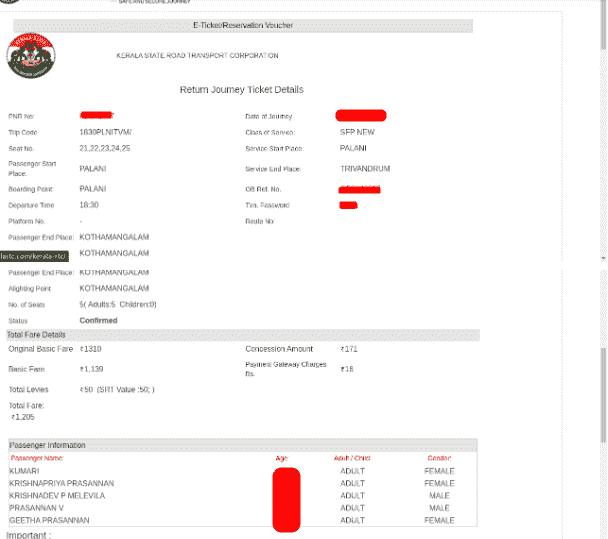
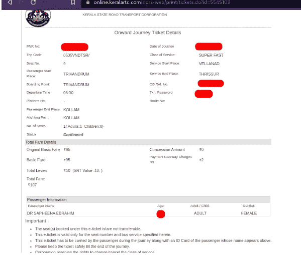
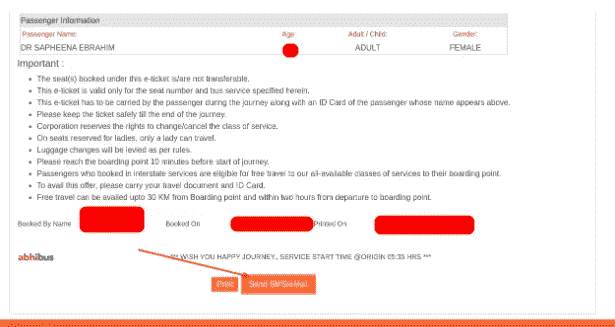
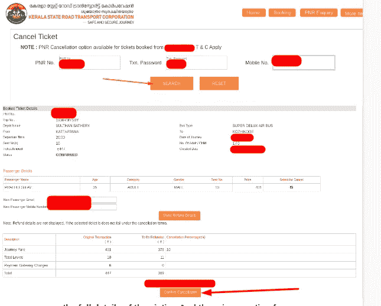

# 特伦甘纳邦、安得拉邦、卡纳塔克邦、喜马偕尔邦和喀拉拉邦——所有政府公共汽车服务都遭到黑客攻击

> 原文：<https://infosecwriteups.com/telangana-andhra-pradesh-karnataka-himachal-pradesh-kerala-all-government-bus-services-were-885b44c21a?source=collection_archive---------2----------------------->

嗨黑客们！欢迎回到我的新报道。我的名字是克里希纳德夫·P·梅勒维拉。我是一个 20 岁自学成才的道德黑客。

要了解我更多，请在谷歌上搜索我的名字。

今天的报道是关于印度 5 个邦政府为其公路运输公司使用的订票软件。

所以不浪费时间，让我们开始吧。

> 漏洞:IDOR 和敏感信息泄露
> 
> 影响:关键
> 
> 风险:数据泄露和不正确的身份验证
> 
> 优先级:P0
> 
> 范围:电子邮件、电话、PNR、预订 ID 等..泄露，取消其他用户的票，获取其他用户的票等…

在攻击者视点中复制的步骤:
1。在 ksr TC([https://online.keralartc.com/](https://online.keralartc.com/))
上注册一个账号 2。然后用新创建的 id 登录并访问 https://online.keralartc.com/oprs-web/print/tickets.do?的链接
id=5545107



**3。无需任何身份验证，您就可以看到票证详细信息。通过更改 URL 上的“Id”参数，我们还可以看到其他用户的票证。(也就是说 id 是**[**5545107**](https://online.keralartc.com/oprs-web/print/tickets.do?id=5545107)**通过改变到任何一个数字附近我们都可以看到那个用户的票。).id 为 5545109 的车票如下图为证。**



**现在是下一个环节——取消机票**

1.  **首先，获取攻击者要取消其机票的所有受害者详细信息。细节如 PNR 号，Txn。密码、手机号码(这三个只有注销才需要)**
2.  **此处 Txn。密码和 PNR 可直接从第一部分漏洞获得。现在我们只需要受害者的手机号码。**
3.  **按照以下步骤获取受害者的手机号码。**
4.  在票证的最后一页(我们从第一部分中提取了受害者票证)，有一个名为“发送短信/电子邮件”的选项。点击它，在一个像 burp suite 这样的网络拦截工具上拦截请求



```
**GET /oprs-web/booking/ticket/sendSMS.do?id=<REDACTED>&mobileNo=<REDACTED> HTTP/2
Host: online.keralartc.com
Cookie: <REDACTED>
Upgrade-Insecure-Requests: 1
User-Agent: <REDACTED>
Accept: text/html,application/xhtml+xml,application/xml;q=0.9,image/avif,image/webp,image/apng,*/*;q=0.8,application/signed-exchange;v=b3;q=0.9
Sec-Gpc: 1
Sec-Fetch-Site: same-origin
Sec-Fetch-Mode: navigate
Sec-Fetch-User: ?1
Sec-Fetch-Dest: document
Referer: https://online.keralartc.com/oprs-web/print/tickets.do?id=<REDACTED>
Accept-Encoding: gzip, deflate
Accept-Language: en-GB,en;q=0.9**
```

**5。在这个请求中，我们可以看到名为“mobileNo”的参数，它显示了受害者的手机号码。(出于安全原因，本文中的<被编辑为>。)**

6。现在我们有了取消受害者机票的所有证据。

**7。现在访问**[**https://online . keralartc . com/oprs-web/guest/ticket/cancel . do**](https://online.keralartc.com/oprs-web/guest/ticket/cancel.do)**并输入我们所有的三个详细信息(PNR、TXN 密码、手机号码)并点击搜索。**



**现在我们可以看到受害者的全部细节。还有一个取消的选项...如果我们点击，受害者的机票将被取消。**

这款网络应用在印度的 5 个邦的公路运输公司中很常见——特伦甘纳邦、安得拉邦、卡纳塔克邦、喜马偕尔邦和喀拉拉邦。所以漏洞也很普遍。

报告并修补漏洞。

想知道更多关于我的信息，只需在谷歌上搜索:“克里希纳德夫·梅莱维拉”

还有，

***别忘了在 medium 等社交媒体上关注我。也请为这篇文章鼓掌 50 次，这是我写更多的灵感！！***

我需要你的支持来写更多，请给我买杯咖啡吧:[https://www.buymeacoffee.com/krishnadevpm](https://www.buymeacoffee.com/krishnadevpm)

*我的 Instagram 手柄:*[*https://instagram.com/krishnadev_p_melevila*](https://instagram.com/krishnadev_p_melevila)

*我的推特手柄:*[*https://twitter.com/Krishnadev_P_M*](https://twitter.com/Krishnadev_P_M)

*我的 LinkedIn 手柄:*[*https://www.linkedin.com/in/krishnadevpmelevila/*](https://www.linkedin.com/in/krishnadevpmelevila/)

*我的人事网站:*[*http://krishnadevpmelevila.com/*](http://krishnadevpmelevila.com/)