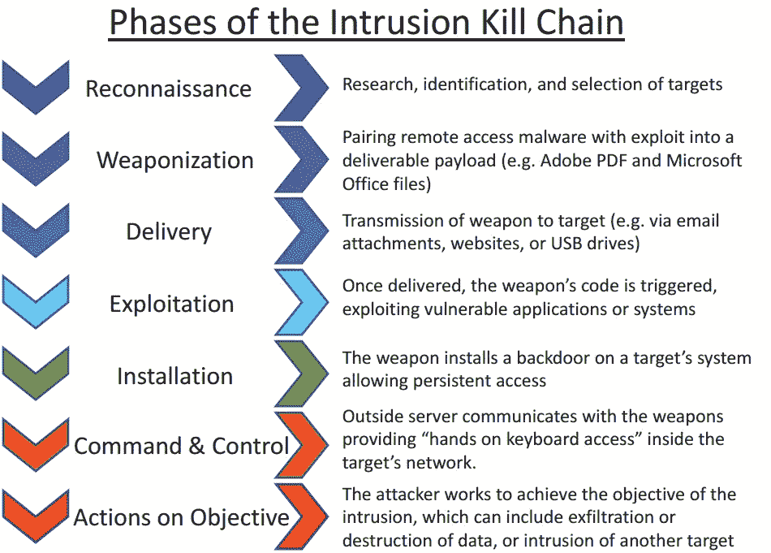

# 为 Linux 测试 EDRs 我希望在开始之前就知道的事情

> 原文：<https://infosecwriteups.com/testing-edrs-for-linux-things-i-wish-i-knew-before-getting-started-3ab15112c183?source=collection_archive---------0----------------------->

这些天来，我开始重新考虑发布可能对攻击者有用的信息。所以这次我会尝试一些不同的东西。我不会具体告诉你我们在 Linux 上发现了哪些特定 EDRs 的功能。如果你感兴趣，请随时联系我，一旦我知道这些信息会被妥善保管，我很乐意与你分享。

然而，我会用一个简单的[基础测试用例](https://github.com/gmatuz/npm-initial-access)来帮助你，你可以用它来大致了解一下，并有希望容易地扩展到一个适当的测试。我还添加了一些我们所做的观察，如果您决定自己测试它，可以减少一些复杂性。

我决定选择这种形式的另一个原因是，如今安全工具经常被非安全人员选择，他们不一定具有建立真实测试用例的专业背景，也不一定能在比较产品时有效地集中精力。类似地，安全团队通常没有时间深入调查。有了[库](https://github.com/gmatuz/npm-initial-access)中的测试用例，我相信你可以用很少的背景知识进入后开发部分，这在很多方面对大多数人来说更容易理解和简单明了。

我鼓励你，如果你有一台 EDR，并且你的商店运行 Linux 或 macOS，花几天时间，带它去兜风！

这是 TLDR，如果你在 Linux 上测试 EDR，你不必关心这些:

*   绝大多数检测都是基于原子操作，而不是过程树和评分:如果您想简化测试，只需直接从 shell 运行它们，并分别测试各个步骤。有点像[原子红队](https://github.com/redcanaryco/atomic-red-team)做的那样。
*   EDRs 强调的不是网络的内容:从简单的 HTTP 开始，重用你的 C2，直到遇到问题
*   功能的动态加载远不如 Windows 重要:只需从完整的有效负载开始，并在需要时添加
*   提供商对您的测试是公平的，代理并不像人们想象的那样适应:您可以让您的测试机器只运行恶意行为。如果你想再次检查，只需重新运行测试用例，这避免了早期的检测，以查看盒子是否被污染。

# 为什么测试安全产品很耗时

当你在测试一些东西的时候，你想要确定你的测试用例代表了现实并且足够复杂。您不希望您的整个场景在开始时因为一个简单的文件哈希而被检测到，但是您也希望避免因为他们运气不好，没有检测到您的单个变体而得出产品无用的结论。

> 如果你测试 EDRs，你理想地建立一个现实的基线环境，并通过[杀伤链](https://en.wikipedia.org/wiki/Kill_chain)或[米特里 ATT & CK](https://attack.mitre.org/) 的战术中的每一步，对于每一个阶段，你有相同步骤的不同版本，每一个都有不同的规避复杂程度。

显然，这导致了巨大的组合和巨大的工作量。所以你开始减少一些复杂性。

您可以省略一些步骤或一些复杂程度。问题是，要么你因为切错了地方而浪费了时间，最后你得出的结论是工具比实际情况要好，要么你达到了产品的极限，最后你的自我批评，或者来自供应商的不可避免的抵制，会提醒你:事情没有被发现的原因可能是因为场景不够现实。对此有很好的论据:reverse shell 本身没有恶意；你所做的事情并不是一种在野外实际使用的技术，也不是对真实行为的检测。这些都是公平点，所以现在你卡住了。你必须花更多的时间进行进一步的测试，或者相信表面上的论点。

# 我是来帮你解决头痛的

基于我们在测试中艰难学到的观察，你可以减少很多复杂性。如果你希望你的结果受到外部挑战，我也给你一个简单的测试案例，它可以解决你将要遇到的大多数争论。

[在这个库中](https://github.com/gmatuz/npm-initial-access)你会发现一个初始访问和执行的基本案例，结合了一些使用开源工具的基本 C2 设置。我相信你最好把时间花在剩下的事情上。

> **测试场景如下:**攻击者发布和后门 NPM 包，这是你的依赖。该软件包使用恶意的预安装脚本来下载并运行一个脚本，该脚本会丢弃一个后门，该后门与常见的开源 C2 框架建立通信。

这个场景在现实中确实发生了:包[确实使用完全相同的方法被后门](https://www.zdnet.com/article/malicious-npm-package-opens-backdoors-on-programmers-computers/)，攻击者——我们从 [conti leaks](https://www.redscan.com/news/key-insights-from-the-conti-ransomware-playbook-leak-foothold/) 中非常清楚地知道——确实使用了例如 Metasploit。唯一的例外是，在 Linux 上，这些恶意软件包通常会窃取机密(包括 ssh 密钥)，但是您可以很容易地将其添加到开发后步骤中。

我还添加了一个易受攻击的 VM，它使用了一些提升权限的方法，所以你也不必担心这个问题。

> 祝你考试顺利！

特别感谢安朵斯、基思、马库斯、马克和索特一路上的帮助和指导，这使我能够为你总结一个相当广泛的研究，并在最简单的场景中提炼出许多技术工作，你可以用它们来测试 EDRs。