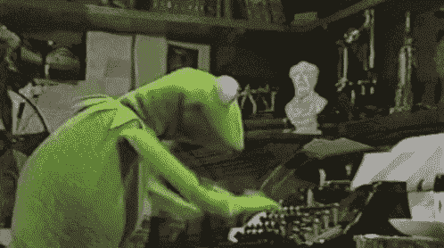
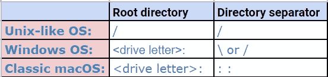

# 测试目录或路径遍历漏洞

> 原文：<https://infosecwriteups.com/testing-for-directory-or-path-traversal-vulnerabilities-dfbe49fdfe92?source=collection_archive---------0----------------------->

在本文中，我们将讨论如何执行目录遍历或路径遍历攻击，又名**、【点-点-斜线】、**、**、【回溯】。**

## 什么是路径遍历漏洞？

> 简而言之:*当应用程序* ***使用用户可控制的数据以不安全的方式访问应用服务器或另一个后端文件系统上的文件和目录*** *时，就会出现路径遍历漏洞。*

通过提交精心编制的输入，攻击者可能能够**在被访问的文件系统的任何位置读取或写入任意内容，从服务器读取敏感信息，或覆盖敏感文件**，最终导致在服务器上执行任意命令。


> 用技术术语来说:*路径遍历攻击旨在访问存储在 webroot 文件夹之外的文件和目录。* ***通过操纵引用文件的变量，用“点-点-斜线(../)"序列及其变体，或者通过使用绝对文件路径*** *，就有可能访问存储在文件系统上的任意文件和目录，包括应用程序源代码或配置和关键系统文件。*

*注:*对文件的访问受到系统操作访问控制的限制(例如在微软视窗操作系统上锁定或使用文件的情况下)。

让我们考虑下面的例子

这里，应用程序**使用动态页面将静态图像**返回给客户端。请求图像的名称在查询字符串参数中指定:
`https://testsite/image/8/getfile.ashx?filename=profile1.jpg`

当服务器处理这个请求时，它遵循以下步骤:
1 .从查询字符串中提取 filename 参数的值。
2。将该值附加到前缀`C:\filedirectory\`上。
3。以此名称打开文件。
4。读取文件内容并将其返回给客户端。

攻击者可以将 p 个遍历序列(../)放入文件名中，以便从指定的目录&向上回溯，从而从应用程序使用的用户上下文有权访问的服务器上的任何位置访问文件。`https://testsite/image/8/getfile.ashx?filename=..\windows\win.ini`
当应用程序将 filename 参数的值附加到图像目录的名称上时，它获得以下路径:
`C:\filedirectory\..\windows\win.ini`
这两个遍历序列实际上是从图像目录返回到`C:`驱动器的根目录，因此前面的路径相当于:
`C:\windows\win.ini`

因此，**服务器实际上返回了一个默认的 Windows 配置文件，而不是返回一个镜像文件。**


# 如何测试路径遍历漏洞？

## 步骤:

1.请注意**请求参数似乎包含文件或目录的名称**，例如`include=main.inc`或`template=/en/sidebar`。
其实现可能**涉及从服务器文件系统中检索数据的任何功能**，例如显示办公文档或图像。
2。寻找错误消息或其他感兴趣的异常事件，或者**用户提供的数据被传递到文件 API 或作为操作系统命令**的参数的实例。
" *如果您可以本地访问应用程序(白盒测试),请监控应用程序执行的所有文件系统交互。*
3。修改参数值为**插入任意子目录**和**单遍历序列**。
例如:

如果应用程序提交这个参数:`file=foo/file1.txt`
尝试提交:`file=foo/bar/../file1.txt`
如果应用程序的**行为在两种情况下是相同的**，那么它**可能是易受攻击的**。尝试通过遍历起始目录来访问不同的文件。
4。如果应用程序的**行为在两种情况下不同于**，那么**可能是阻塞、剥离或清理遍历序列，导致无效的文件路径**。

检查是否有任何方法可以避开应用程序的验证过滤器。
5。如果您发现提交遍历序列而不遍历起始目录并不影响应用程序的行为，那么**会尝试遍历起始目录并从服务器文件系统的其他地方访问文件**。
6。如果您攻击的应用程序函数提供了对文件的**读取权限，那么
会尝试访问操作系统**上的一个已知全球可读文件
问题。提交以下值之一作为您控制的文件名参数
:
`../../../../../../../../../../../../etc/passwd
../../../../../../../../../../../../windows/win.ini`
如果成功，您的浏览器会显示您所请求文件的内容。
7。如果您攻击的函数提供了对某个文件的**写权限，请尝试写两个文件**，一个应该对任何用户都是可写的**，另一个甚至对 root 或管理员都是不可写的**。

例如，在 **Windows 平台**上试试这个:
`../../../../../../../../../../../../writetest.txt
../../../../../../../../../../../../windows/system32/config/sam`
在**基于 UNIX 的平台**上，root 可能不写的文件是版本相关的，但是试图用一个文件覆盖一个目录应该总是失败，所以你可以试试这个:
`../../../../../../../../../../../../tmp/writetest.txt
../../../../../../../../../../../../tmp`
如果应用程序的行为在响应第一个和第二个请求时是不同的，那么这个应用程序可能是易受攻击的。

8.或者用**写访问**验证遍历缺陷是**尝试在 web 服务器的 webroot 中写一个新文件，然后尝试用浏览器**检索它。但是，如果您知道 webroot 目录的位置，或者如果发生文件访问的用户上下文没有权限写入该目录，则此方法将有效。



> **温馨提示:**
> 
> 在探测缺陷时提交大量的遍历序列。数据附加到的起始目录可能位于文件系统的深处，因此使用过多的序列有助于避免误判。
> 
> 此外，Windows 平台允许使用正斜杠和反斜杠作为目录分隔符，而基于 UNIX 的平台只允许使用正斜杠。
> 
> 此外，一些 web 应用程序过滤一个版本，但不过滤另一个版本。即使您确定 web 服务器运行的是基于 UNIX 的操作系统，应用程序仍可能调用基于 Windows 的后端组件。因此，在探测遍历缺陷时，尝试这两个版本总是明智的。

**如果您最初执行遍历攻击的尝试不成功，这并不意味着应用程序没有漏洞。**

许多应用程序开发人员意识到了路径遍历漏洞，并实现了各种类型的输入验证检查，试图阻止它们。然而，这些防御措施通常是有缺陷的，可以被熟练的攻击者绕过。

1.通常遇到的第一种类型的输入过滤器包括**检查 filename 参数是否包含任何路径遍历序列**。如果是，过滤器要么拒绝请求，要么尝试清理输入以删除序列。这种类型的过滤器通常容易受到各种攻击，这些攻击使用替代编码和其他技巧来破坏过滤器。
1.1。使用下面的编码尝试遍历序列的简单的 URL 编码表示。**确保对你输入的每一个斜线和点进行编码** :
`Dot — %2e Forward slash — %2f Backslash — %5c`
1.2。尝试使用 **16 位 Unicode 编码** :
`Dot — %u002e Forward slash — %u2215 Backslash — %u2216`
1.3。试试**双 URL 编码**:1.4
`Dot — %252e Forward slash — %252f Backslash — %255c`
。试试**超长 UTF-8 Unicode 编码** :
`Dot — %c0%2e, %e0%40%ae, %c0ae,`等等
`Forward slash — %c0%af, %e0%80%af, %c0%2f,`等等
`Backslash — %c0%5c, %c0%80%5c,`等等。

您可以在 Burp Intruder 中使用**非法的 Unicode 有效载荷**类型来
生成任意给定字符的大量替代表示，并将其提交到目标参数中的相关位置。
这些表示严格违反了 Unicode 表示的规则，但仍然被许多 Unicode 解码器的实现所接受，尤其是在 Windows 平台上。
1.5。如果应用程序试图通过删除遍历序列来净化用户输入，并且没有递归地应用该过滤器，则可以通过将一个序列放在另一个序列中来绕过该过滤器。例如:
`….//
….\/
…./\
….\\`

2.在防御路径遍历攻击中经常遇到的第二种类型的输入过滤器包括**验证用户提供的文件名是否包含应用程序期望的后缀(文件类型)或前缀(起始目录)**。这种类型的防御可以与已经描述的过滤器一起使用。

2.1。一些应用程序**检查用户提供的文件名是否以
特定文件类型或一组文件类型**结尾，并拒绝访问
任何其他内容的尝试。有时，这种检查可以通过**将一个 URLencoded 空字节**放在您请求的文件名的末尾，后面跟着一个应用程序接受的
文件类型来破坏。例如:
`../../../../../boot.ini%00.jpg`

> 这种攻击有时会成功的原因是，文件类型检查是在允许字符串包含空字符的托管执行环境中使用 API 实现的(如 Java 中的 String.endswith())。但是，当实际检索文件时，应用程序最终会在非托管环境中使用 API，在该环境中，字符串以 null 结尾。因此，您的文件名实际上被截断为您想要的值。

2.一些应用程序试图通过**在用户**提供的文件名后添加自己的文件类型后缀来控制正在访问的文件类型。
在这种情况下，出于同样的原因，上述任何一种利用都可能有效。
3。一些应用程序检查用户提供的**文件名是否以起始目录的特定子目录开始，或者甚至以特定的文件名**开始。当然，这种检查很容易被绕过，如下:
`filestore/../../../../../../../etc/passwd`
4 .如果前面针对输入过滤器的攻击都没有成功，那么**应用程序可能正在实现多种类型的过滤器**。因此，您需要同时结合这些攻击(针对遍历序列过滤器和文件类型或目录过滤器)。试着把问题分成不同的阶段。

例如，如果对:`diagram1.jpg`的请求成功，但对:
`foo/../diagram1.jpg`的请求失败，则尝试所有可能的遍历序列旁路，直到第二个请求的变化成功。

如果这些成功的遍历序列绕过不能使您访问`/etc/passwd`，则探查是否实现了任何文件类型过滤，并且可以通过请求绕过:`diagram1.jpg%00.jpg`
完全在应用程序定义的开始目录内工作，尝试探查以了解所有正在实现的过滤器，并且查看是否可以使用所描述的技术单独绕过每个过滤器。


5.您可以利用读取访问路径遍历缺陷来**从服务器**检索感兴趣的文件，这些文件可能包含直接有用的信息，或者帮助您针对其他漏洞改进攻击。例如:
a)用于操作系统和应用程序的密码文件
b)用于发现其他漏洞或微调不同攻击的服务器和应用程序配置文件
c)包括可能包含数据库凭证的文件
d)应用程序使用的数据源，如 MySQL 数据库文件或
XML 文件
e)服务器可执行页面的源代码，以在
中执行代码审查，搜索错误(例如`GetImage.aspx?file=GetImage.aspx` )
f)可能

如果您发现一个允许写访问的路径遍历漏洞，利用这个漏洞使**在服务器**上任意执行命令。这里有一些利用这个漏洞的方法。在用户的启动文件夹中创建脚本。
2。修改`.ftpd`中的文件，以便在用户连接时执行任意命令。
3。使用执行权限将脚本写入 web 目录，并从浏览器中调用它们
。

针对 **web 服务器**
`https://testsite/../../../../../etc/passwd
https://testsite/..%255c..%255c..%255cboot.ini
https://testsite/..%u2216..%u2216someother/file`的路径遍历攻击

针对一个 **web 应用**
的路径遍历攻击原文:`https://testsite/foo.cgi?home=index.htm`
攻击:`https://testsite/foo.cgi?home=foo.cgi`

在上面的例子中，web 应用程序揭示了`foo.cgi` 文件的源代码。

针对使用特殊字符序列的 **web 应用的路径遍历攻击:**
原始:`https://testsite/scripts/foo.cgi?page=menu.txt`
攻击:`http://testsite/scripts/foo.cgi?page=../scripts/foo.cgi%00txt`

在上面的例子中，web 应用程序通过使用特殊字符序列揭示了`foo.cgi`文件的源代码。“`../`”序列用于遍历当前目录之上的一个目录，并进入`/`脚本目录。“`%00`”序列用于绕过文件扩展名检查，并在读入文件时剪掉扩展名。

# 绝对路径遍历

以下 URL 可能容易受到此攻击:

```
https://testsite/get.php?f=list
https://testsite/get.cgi?f=5
https://testsite/get.asp?f=test
```

攻击者可以像这样执行攻击:

```
https://testsite/get.php?f=/var/www/html/get.php
https://testsite/get.cgi?f=/var/www/html/admin/get.inc
https://testsite/get.asp?f=/etc/passwd
```

当 web 服务器返回关于 web 应用程序中的错误的信息时，攻击者更容易猜出正确的位置(例如，带有源代码的文件的路径，然后可能会显示出来)。

# 考虑以下字符编码机制:

**URL 编码和双重 URL 编码**

```
%2e%2e%2f represents ../
%2e%2e/ represents ../
..%2f represents ../
%2e%2e%5c represents ..\
%2e%2e\ represents ..\
..%5c represents ..\
%252e%252e%255c represents ..\
..%255c represents ..\ and so on.
```

**Unicode/UTF-8 编码**(仅适用于能够接受超长 UTF-8 序列的系统)

```
.%c0%af represents ../
..%c1%9c represents ..\
```



还有其他特定于操作系统和应用程序框架的注意事项。例如，Windows 在解析文件路径时非常灵活。

**Windows shell:** 在 shell 命令中使用的路径上添加以下任何一项都不会导致功能上的差异:
1 .路径
2 末端的尖括号`<`和`>`。路径
3 末尾的双引号(正确结束)。无关的当前目录标记，如`./`或`.\\`
4。带有可能存在也可能不存在的任意项目的无关父目录标记:

```
file.txt
file.txt…
file.txt<spaces>
file.txt””””
file.txt<<<>>><
./././file.txt
nonexistant/../file.txt
```

**Windows API** :当在任何 shell 命令或 API 调用中使用字符串作为文件名时，`periods or spaces`被丢弃。

**Windows UNC 文件路径**:用于引用 SMB 共享上的文件。有时，可以让应用程序引用远程 UNC 文件路径上的文件。如果是这样，Windows SMB 服务器可能会将存储的凭据发送给攻击者，攻击者可以捕获并破解这些凭据。它们还可以与自引用 IP 地址或域名一起使用，以避开过滤器，或者用于访问攻击者无法访问但可以从 web 服务器访问的 SMB 共享上的文件。

*   `\\server_or_ip\path\to\file.abc`
*   `\\?\server_or_ip\path\to\file.abc`

**Windows NT 设备命名空间:**用于指 Windows 设备命名空间。某些引用将允许使用不同的路径访问文件系统。

*   可能相当于一个驱动器号，如`c:\`，甚至是一个没有分配驱动器号的驱动器卷:`\\.\GLOBALROOT\Device\HarddiskVolume1\`
*   指机器上的第一个光盘驱动器:`\\.\CdRom0\`


**推荐人:**

[网络应用:黑客手册- 2](https://www.amazon.in/Web-Application-Hackers-Handbook-Exploiting-ebook/dp/B005LVQA9S/ref=asc_df_B005LVQA9S/?tag=googleshopdes-21&linkCode=df0&hvadid=399149299095&hvpos=&hvnetw=g&hvrand=1877591999365636626&hvpone=&hvptwo=&hvqmt=&hvdev=c&hvdvcmdl=&hvlocint=&hvlocphy=1007818&hvtargid=pla-405660971168&psc=1&ext_vrnc=hi)

[](https://github.com/OWASP/wstg/blob/master/document/4-Web_Application_Security_Testing/05-Authorization_Testing/01-Testing_Directory_Traversal_File_Include.md) [## OWASP/wstg

### 许多 web 应用程序在日常操作中使用和管理文件。使用具有以下特点的输入验证方法…

github.com](https://github.com/OWASP/wstg/blob/master/document/4-Web_Application_Security_Testing/05-Authorization_Testing/01-Testing_Directory_Traversal_File_Include.md)