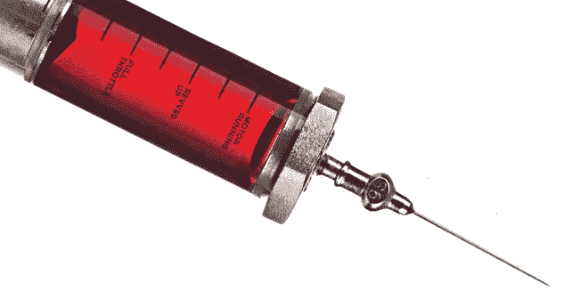
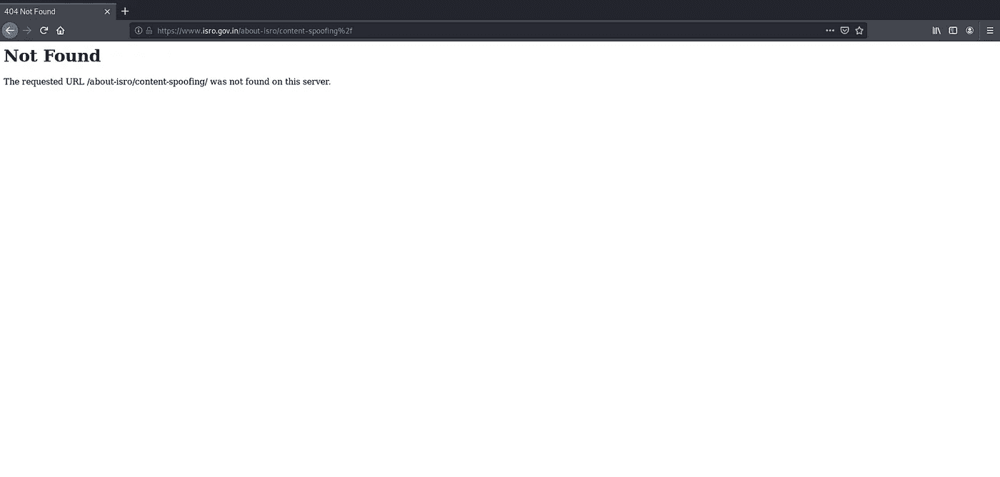
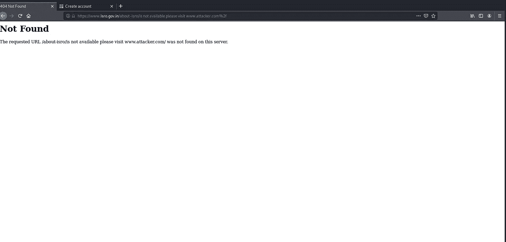

# 基于文本的注入| ISRO 网站上的内容欺骗

> 原文：<https://infosecwriteups.com/text-based-injection-content-spoofing-96e9eb1615d8?source=collection_archive---------2----------------------->

[**文字基础注入——内容欺骗**](http://www.twitter.com/deep_marketer_)

内容欺骗，也称为*内容注入*、*任意文本注入或*虚拟篡改，是一种针对用户的攻击，可能是由 web 应用程序中的注入漏洞造成的。当应用程序不能正确处理用户提供的数据时，攻击者可以向 web 应用程序提供内容，通常是通过参数值，该参数值会反射回给用户。这向用户呈现了在受信任域的上下文下修改的页面。这种攻击通常用作社交工程，或者与社交工程结合使用，因为这种攻击利用了基于代码的漏洞和用户的信任。顺便提一下，这种攻击被广泛误解为一种不会带来任何影响的错误。

# 文本注入

内容欺骗攻击是通过文本操作向用户提供虚假信息。下面演示了一个攻击场景。

1.  攻击者识别一个 web 应用程序，该应用程序向其用户提供关于他们是否应该购买或出售特定股票的建议
2.  攻击者识别易受攻击的参数
3.  攻击者通过稍微修改有效请求来创建恶意链接
4.  包含修改后的请求的链接被发送给用户，用户点击该链接
5.  使用攻击者的恶意推荐创建了一个有效的网页，并且用户认为该推荐来自股票网站

**有效页面**

`[http://vulnerablesite/suggestions.php?stockid=123&stockrecommendation=We+Recommend+You+Buy+Now](http://vulnerablesite/suggestions.php?stockid=123&stockrecommendation=We+Recommend+You+Buy+Now)`

**修改页面**

`[http://vulnerablesite/suggestions.php?stockid=123&stockrecommendation=Our+site+has+experienced+major+hacking+incident.Please+use+our+competitor+site+http://www.competitor.com+until+we+further+announced+for+update.](http://vulnerablesite/suggestions.php?stockid=123&stockrecommendation=Our+site+has+experienced+major+hacking+incident.Please+use+our+competitor+site+http://www.competitor.com+until+we+further+announced+for+update.)`

# 概念证明

如果你稍微多研究一下，了解一下为什么会这样，这里的问题是什么。您将会得到一个“这是什么问题”的答案，即应用程序给出了一个默认的错误页面。

对于“为什么会发生”，我们知道答案，对吗？

不管怎样，答案是用户通过参数输入或者直接在 URL 中反映在页面响应中。

**错误页面**

网址-[https://www.isro.gov.in](https://www.isro.gov.in/about-isro/content-spoofing%2f)/

错误页面

**修改错误页面**

网址-【https://www.isro.gov.in/about-isro/is%20not%20available%20\. 请% 20 访问% 20 http://www . attack . com % 2f

修改的错误页面

# 影响

这种攻击通常用作社交工程，或者与社交工程结合使用，因为这种攻击利用了基于代码的漏洞和用户的信任。顺便提一下，这种攻击被广泛误解为一种不会带来任何影响的错误。

# 推荐

应用程序应该只接受为参数定义的值和类型，并且应该在服务器端检查是否有更改内容，如果有更改，则应用程序应该拒绝该请求。此外，不要在页面响应中通过 URL 构造和发送消息。首选使用属性文件中预定义的消息。

对于默认错误页面

应用程序配置应该指定一个默认的错误页面，以保证应用程序永远不会向攻击者泄漏错误消息。处理标准的 HTTP 错误代码不仅是一种良好的安全实践，而且是用户友好的，可以通过为错误代码(如 404、403、500 等)指定自定义错误页面来实现。

# 参考

 [## 内容欺骗

### 威胁类型:攻击参考 ID: WASC-12 内容欺骗是一种攻击技术，它允许攻击者注入…

projects.webappsec.org](http://projects.webappsec.org/w/page/13246917/Content%20Spoofing)  [## HackerOne 上披露的 Smule:错误页面内容欺骗或文本...

### 描述:-内容欺骗，也称为内容注入，“任意文本注入”或…

hackerone.com](https://hackerone.com/reports/498562)  [## 内容欺骗-信息安全资源

### 根据怀特哈特安全公司对大约 15，000 个网站的年度研究，86%的网站至少有一个严重的漏洞，黑客…

resources.infosecinstitute.com](https://resources.infosecinstitute.com/topic/content-spoofing/#gref)  [## HackerOne 上披露的 withinsecurity:可以使用文本注入...

### 你好，我想报告一个文本注入和 404 页面的错误配置，这可用于网络钓鱼的错误…

hackerone.com](https://hackerone.com/reports/106350) 

***来自 Infosec 的报道:****Infosec 上每天都有很多内容，很难跟上。加入我们的* ***每周简讯*** *以 5 篇文章、4 个线程、3 个视频、2 个 Github Repos 和工具以及 1 个* ***工作提醒的形式免费获取所有最新的信息安全趋势！*【https://weekly.infosecwriteups.com/】****