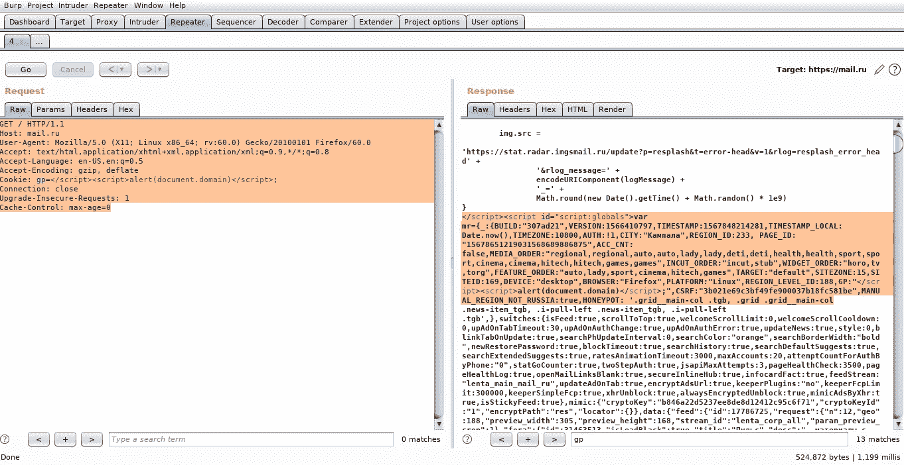
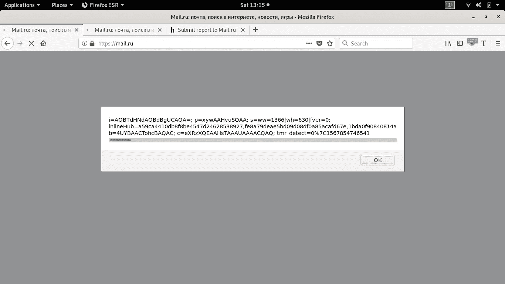

# 价值 1000 美元的饼干

> 原文：<https://infosecwriteups.com/the-1-000-worth-cookie-6cf48af08e08?source=collection_archive---------0----------------------->

# 多姆·XSS 的故事

直到加入 HackerOne 平台一年后，我才开始积极寻找 bug。当时，我对每天向平台上的程序报告的各种服务器和客户端错误类别完全陌生。在当时披露的漏洞中，跨站点脚本，通常被称为 XSS，似乎是一个非常受欢迎的漏洞，许多猎人都在寻找。因此，当我着手在俄罗斯最大的互联网公司的顶级域名中寻找一个跨站脚本漏洞时，我一点也不知道我的新手运气会让我在搜索的几分钟内发现一个易受攻击的头参数，并在这个过程中为我赢得第一笔奖金。


## 寻找易受攻击的参数。

在浏览 [https://mail.ru.](https://mail.ru.) 时，我在 burpsuite 中处理请求并观察它们的响应。为了找到隐藏的参数，我使用了这个名为 param miner 的有用扩展([https://ports wigger . net/bapp store/17d 2949 a 985 C4 b 7 ca 092728 DBA 871943](https://portswigger.net/bappstore/17d2949a985c4b7ca092728dba871943))，作者是 PortSwigger Web Security 的 James‘albino wax’Kettle。在 burpsuite 中查看该问题的标签显示了一些参数，这些参数被该扩展强行使用并发现是有效的。其中之一是名为“gp”的 cookie HTTP 请求头。这一点特别令人感兴趣，因为它的价值反映在对任何包含它的请求的响应中，从而使它成为 XSS 的潜在候选人。

## 验证 XSS 漏洞。

测试反射 XSS 时，一个有用的技巧是一次一个地向易受攻击的参数抛出危险字符，以便确定哪些字符被 Web 应用程序防火墙过滤掉(如果存在)。一旦你知道哪些字符被过滤掉，哪些字符被接受，你就能更好地设计一个绕过 WAF 的有效载荷。幸运的是，我测试的应用程序并非如此。作为当时的新手，我不理解与跨站脚本漏洞相关的上下文的概念。我试图通过在 Cookie 参数的值中插入以下有效负载来测试它。

`<script>alert(document.cookie)</script>`

我在 burpsuite 中点击响应，选择“在浏览器中显示响应”，然后在 Firefox 中加载生成的链接。我给了它几秒钟的加载时间，但是一旦它加载，就没有弹出提示框显示我的 cookies 了。在我决定休息一天之前，我在我的有效载荷上尝试了几个变化，在脸书 bug bounty 论坛上发布了我的问题，试图寻求帮助。

这是请求和响应的样子

```
GET / HTTP/1.1 
Host: mail.ru 
User-Agent: Mozilla/5.0 (X11; Linux x86_64; rv:60.0) Gecko/20100101 Firefox/60.0 
Accept: text/html,application/xhtml+xml,application/xml;q=0.9,*/*;q=0.8 Accept-Language: en-US,en;q=0.5 Accept-Encoding: gzip, deflate Cookie: **gp= some alpha numeric string**; 
Connection: close 
Upgrade-Insecure-Requests: 1 
Cache-Control: max-age=0200 OK
</script><script id="script:globals">var mr={:{BUILD:"307ad21",VERSION:1566410797,TIMESTAMP:1567848214281,TIMESTAMP_LOCAL: Date.now(),TIMEZONE:10800,AUTH:!1,CITY:"Кампала",REGION_ID:233, PAGE_ID: "15678651219031568689886875",ACC_CNT: false,MEDIA_ORDER:"regional,regional,auto,auto,lady,lady,deti,deti,health,health,sport,sport,cinema,cinema,hitech,hitech,games,games",INCUT_ORDER:"incut,stub",WIDGET_ORDER:"horo,tv,torg",FEATURE_ORDER:"auto,lady,sport,cinema,hitech,games",TARGET:"default",SITEZONE:15,SITEID:169,DEVICE:"desktop",BROWSER:"Firefox",PLATFORM:"Linux",REGION_LEVEL_ID:188,**GP:"Payload gets reflected here ;**",CSRF:"3b021e69c3bf49fe900037b18fc581be",MANUAL_REGION_NOT_RUSSIA:true,HONEYPOT: '.gridmain-col .tgb, .grid .grid_main-col
```

第二天我回到测试中，突然想到我必须关闭最初的脚本标签，然后引入一个新标签。我迅速将我的有效载荷修改为`</script><script>alert(document.domain)</script>`

激发请求，并观察它在响应中得到正确的反映。



在浏览器中加载响应最终弹出了警告框和域名，上面的有效负载在该域名上触发了 XSS。



显示用户 cookies 的有效负载的输出


我向 Mail.ru 报告了这一点，并对它是否会得到奖励表示怀疑，因为这充其量只是一个自我 XSS 的问题。然而，在阅读了一些报告后，我的希望增加了，在这些报告中，bug bounty hunters 向 Mail.ru 展示了中间人攻击载体可用于向合法用户发起攻击——利用他们网站基础设施中易受攻击的 cookie 参数。我在这篇文章的结尾提供了一个进一步阅读的链接。

***时间轴:***

*2019 年 9 月 7 日—已上报。*

*2019 年 9 月 8 日—分庭。*

*2019 年 9 月 26 日——奖金发放*

*2019 年 9 月 27 日—问题已修复*

链接到我的黑客报告[https://hackerone.com/reports/690072](https://hackerone.com/reports/690072)

如需进一步阅读，请查看以下来自 [Max](https://medium.com/u/8801da5fc3a6?source=post_page-----6cf48af08e08--------------------------------) 的信息媒体报道:

[](https://medium.com/@iSecMax/%D1%81ookie-based-xss-exploitation-2300-bug-bounty-story-9bc532ffa564) [## 基于 ookie 的 XSS 开发|＄2300 Bug 赏金故事

### 很长一段时间以来，我一直在寻找 HackerOne 平台上的漏洞，分配了一定数量的…

medium.com](https://medium.com/@iSecMax/%D1%81ookie-based-xss-exploitation-2300-bug-bounty-story-9bc532ffa564)