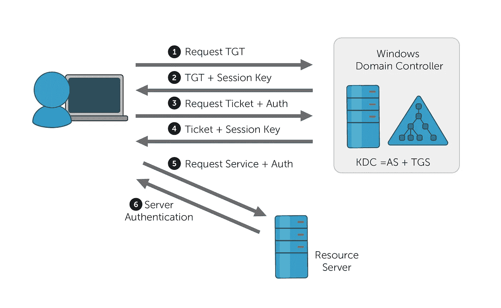
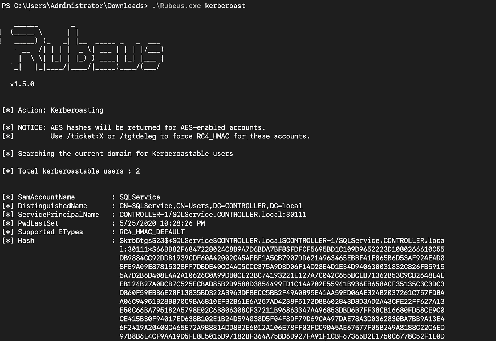

# Kerberoasting 认证的基础知识

> 原文：<https://infosecwriteups.com/the-abcs-of-kerberoasting-4b192e6a9fb4?source=collection_archive---------0----------------------->


[张杰](https://unsplash.com/@jay_zhang?utm_source=medium&utm_medium=referral)在 [Unsplash](https://unsplash.com?utm_source=medium&utm_medium=referral) 上的照片

# **简介**

Kerberos 是一种计算机网络安全协议，它通过不可信网络(如 internet)验证两个或多个可信主机之间的服务请求。Kerberos 用于保护计算机网络。它对客户机-服务器应用程序进行身份验证，并通过使用密钥加密和可信任的第三方来验证用户的身份。它旨在促进两个目的，安全和认证。

它在 Active Directory 环境中用于向用户提供快速身份验证，使他们无需通过网络共享/传输密码即可访问资源。

成功利用后，kerberoasting 是一种利用后策略，攻击者通过利用权限提升和其他横向移动技术，集中精力访问组织内部网络中托管的其他目标。当在最基本的级别使用 Kerberos 时，攻击者可以从内存中请求与服务相关的 TGS 票证，同时伪装成具有预定义 SPN 属性的非特权域用户，试图破解与特定服务帐户相关联的明文密码的 NTLM 哈希。

在这篇博文中，我们将通过一个演示来学习 Kerberos 和 Kerberoasting，以便更好地掌握它。

# **Kerberos**



[来源](https://www.manageengine.com/products/active-directory-audit/kb/windows-security-log-event-id-4768.html)

正如我们刚刚了解到的，Kerberos 是一种身份验证协议。它通常用于 Active Directory 环境中。Kerberos 背后的机制及其工作原理非常复杂，所以我们只是对其进行概述。

涉及三个实体。

1.  需要访问资源(服务器)的客户端。这可能是一个 FTP 服务器等。
2.  资源服务器。这是客户端需要访问的服务器。
3.  关键配送中心(KDC)。这可以称为 Kerberos 的核心。这包含了两个有助于身份验证的主要实体。
4.  认证服务器(AS)
5.  票证生成服务器(TGS)

如果一个客户端需要访问一个特定的资源，比如一个 FTP 服务器，它必须首先访问认证服务器(as)。认证服务器向客户端提供票据授予票据(TGT ),它可以使用该票据授予票据与票据生成服务器(TGS)进行通信。一旦用户和服务器相互验证，TGT 文件可以提供安全的数据安全性。一旦通过身份验证并收到 TGT (TGS)，用户就可以使用他们的 TGT 向票证授予服务请求服务票证。然后，他们可以访问受保护的资源。

TGT 文件被加密以防止中间人(MITM)攻击。它们还包含诸如会话密钥(及其到期日期)和用户的 IP 地址等信息。

然后，TGS 服务器将发出一个名为 TGS 票证的令牌，客户端将使用它来通信和访问 FTP 服务器的资源。

在任何时候，我们都不需要提交凭据。如果深入研究，您会发现我们的密码和资源服务器的密码的散列是用来加密发出的请求的。

# **Kerberos 认证**

对于 Active Directory 服务帐户凭据，kerberoasting 是一种常用的攻击策略。事实上，Kerberoasting 认证可以由域中的任何用户执行，而不仅仅是管理员，这使得它成为高级和低级攻击者的最爱。此外，它是一种“离线”攻击，这意味着它不需要向目标服务传输任何数据包，否则会导致流量被记录并可能触发警报。另一方面，虽然 Kerberos 认证利用了针对 Active Directory 的 Kerberos 身份验证中的已知漏洞，但它也在类似程度上利用了人性。Kerberoasting 认证是一种密码破解攻击，它从内存中获取凭证，然后离线破解。

Kerberoasting 认证的好处:

1.  不会专门发出/发送额外的数据包。
2.  这确保了我们的尝试不会发出任何警报或警告。
3.  不需要任何特权。所有你需要的是进入一个领域帐户。
4.  它通常用于权限提升和横向网络移动。

# **背景**

**TGS** 门票是访问各种域名资源的钥匙。这些 TGS 票证是由服务帐户的(NTML)哈希加密的，资源服务器使用该服务帐户的权限进行操作。因此，在得到 TGS 门票并破解它，我们将获得一个服务帐户的密码。我们可以用它来喷射其他用户帐户，或者从服务帐户本身过滤信息。

**发红**

Rubeus 是攻击 Kerberos 的强大工具。使用 Rubeus 可以完成许多攻击，尤其是在 Active Directory 环境中。

一些可能的攻击包括获取、Kerberos 认证、AS-REP 烘烤、票据提取、票据请求和更新等。

要执行 Kerberos 认证攻击，只需从 GitHub 库下载 Rubeus.exe 文件，可以在这里找到。将其上传到您的受害者主机，然后键入以下内容

```
.\Rubeus.exe kerberoast
```



使用 Rubeus 进行 Kerberos 认证

使用 impacket 工具也可以达到同样的效果。你可以在这里从[下载这个包。](https://github.com/SecureAuthCorp/impacket/releases/tag/impacket_0_9_19)

我们需要的是用户名、密码、域名和域控制器的 IP 地址。

要通过 impacket 执行 Kerberos 认证，只需从刚刚克隆的存储库中切换到 impacket 目录。

```
**python3** **GetUserSPNs.py** mydomaincontroller.local/Alice:SupserSecure123 –dc-ip 10.10.10.10 -request
```

这里，

*mydomaincontroller.local* 是域控制器的名称

Alice 是用户名，SupseSecure 是密码

*10.10.10.10* 是域控制器的 IP

一旦下载了散列，就可以使用 **hashcat** 来破解它们。破解这种哈希的方式是 **13100** 。你需要一份可以从网上下载的密码列表。

```
hashcat -m 13100 Password_hashes.txt samplePasswordlist.txt
```

# **结论**

在这篇博客文章中，我们探讨了一种后利用策略，这种策略被红队和攻击者广泛用来获得对系统的控制。我们大致了解了 Kerberos，并通过演示了解了什么是 Kerberos。这是一种利用技术，通常用于控制计算机系统和广告。