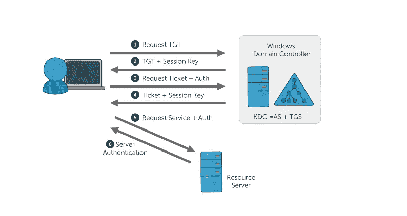
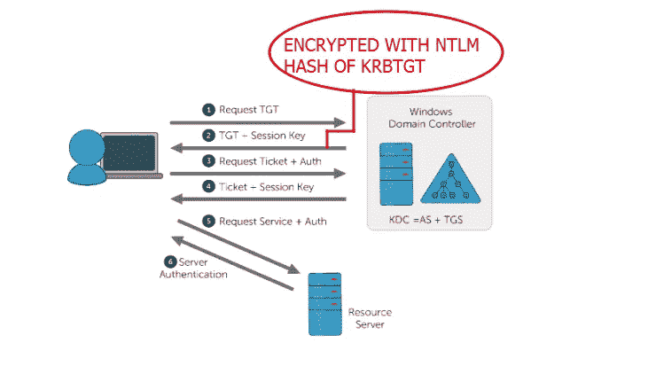
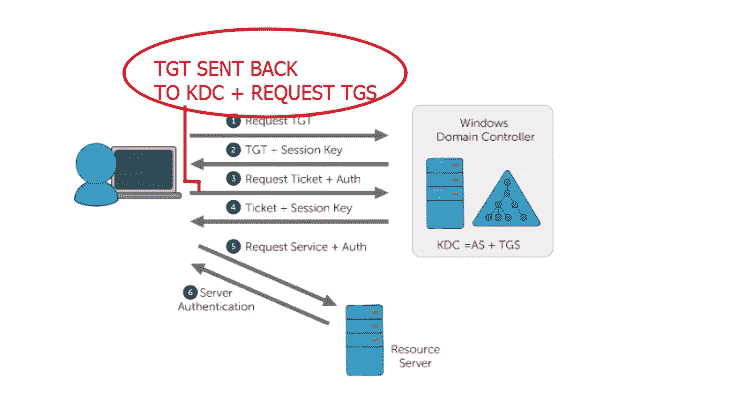
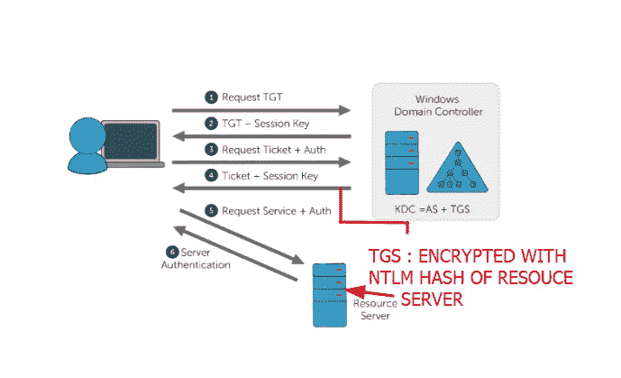
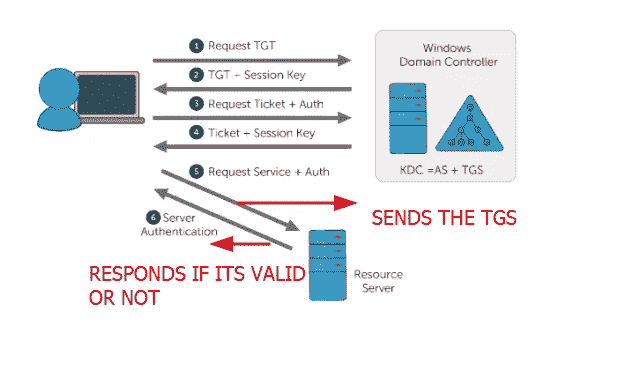

# KERBEROS 身份验证剖析(AD 基础 0x1)

> 原文：<https://infosecwriteups.com/the-anatomy-of-kerberos-authentication-ad-basics-0x1-1532305a18a3?source=collection_archive---------1----------------------->

嗨！我的名字是 Hashar Mujahid，今天我们将了解 Kerberos 身份验证是如何工作的。

## 什么是 Kerberos？

Kerberos 是微软在其活动目录服务中广泛实施的一种身份验证协议。它允许用户在不可信的网络上访问服务或数据，方法是在票证的帮助下证明他们的身份。像 macOS、Linux 等所有主流操作系统也支持 Kerberos。

## 为什么要了解 Kerberos？

“知己知彼，百战不殆”(孙子)

从渗透测试者的角度来看，几乎 90%的大公司都使用活动目录环境。Kerberos 是 AD 服务中使用的主要身份验证系统。因此，对于每个想要成为 pentester 或 red teamer 的人来说，理解 Kerberos 身份验证是有害的。

## KERBEROS 认证剖析。

现在，我们将了解这个身份验证系统是如何工作的，以及这个过程中涉及哪些组件或实体。

## 步骤 1:认证服务器请求(AS-REQ)

假设一个客户机想要访问资源服务器上的一些资源，首先它需要向密钥分发中心(KDC)发送一个请求。这个请求将包含客户端密码 的 ***NTLM 散列和用那个 NTLM 散列*** 加密的 ***时间戳。这是为了确定请求实际上来自它所声称的用户。***

在第一步的最后。KDC 接收用户的请求并解密。

## 步骤 2:认证服务器响应(AS-REP)

密钥分发中心主要由两部分组成。

*   认证服务器
*   票据授予服务器

KDC 接收用户的请求并解密。如果请求通过验证，KDC 将使用 TGT(票据授予票据)进行响应。TGT 用域控制器名为“KRBTGT”的特殊帐户的哈希进行加密和签名。只有 KRBTGT 帐户可以打开和读取票证。

**步骤 3:票据授予服务请求(TGS-请求)**

现在客户有了一个 TGT，但是他不能解密它，因为它是用 krbtgt 帐户的散列加密的。因此，客户端将 TGT 发送回 KDC，并请求 TGS 票证。TGS 票证是一种票证，它授予对 AD 域环境中特定服务的访问权限。在步骤 3 结束时，KDC 收到请求并解密 TGT。这是这一步中唯一的验证，如果 TGT 被验证，KDC 假定 TGT 中返回的任何内容都是有效的。

## 步骤 4:票证授予服务器响应(TGS 代表)

一旦 TGT 得到确认，KDC 将对 TGS 做出回应。TGS 是使用目标服务器或资源服务器的 NTLM 散列加密的。因此客户端无法解密，只有资源服务器可以解密。

## 步骤 5:连接到资源服务器(AP-REQ)

> 资源服务器也可以称为应用服务器

现在，客户端拥有了一个 TGS，客户端或用户可以连接到资源服务器，并将他们的 TGS 呈现给资源服务器。

**步骤 6:来自资源服务器(AP-REP)的响应**

因为 TGS 是使用应用服务器或资源服务器的 NTLM 散列加密的。它对其进行解密，并决定用户是否可以访问该服务。

这就是 Kerberos 身份验证协议中所发生的一切。

我希望你能理解。我将会发表更多的博客，从一个测试者的角度讲述如何接近一个活动目录环境。如果你想了解更多关于系统和 Web 应用渗透测试的知识，请关注我。

我会在下一个博客中看到你，直到那时快乐的黑客！❤

## 来自 Infosec 的报道:Infosec 每天都有很多内容，很难跟上。[加入我们的每周简讯](https://weekly.infosecwriteups.com/)以 5 篇文章、4 个线程、3 个视频、2 个 GitHub Repos 和工具以及 1 个工作提醒的形式免费获取所有最新的 Infosec 趋势！