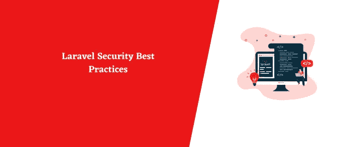

# Laravel 的最大危险是。环境文件)

> 原文：<https://infosecwriteups.com/the-big-danger-with-laravel-env-file-403ca60aaf14?source=collection_archive---------0----------------------->



Laravel 的最大危险是。环境文件)

在本文中，我将讨论 Laravel 带来的一种危险。Laravel 中的`.env`文件是一个配置文件，包含数据库凭证和 API 密钥等敏感信息。确保该文件的安全并防止未经授权的用户接触是非常重要的。

Laravel 中的`.env`文件的一个潜在安全漏洞是，默认情况下，它不包含在版本控制系统(例如 Git)中。这意味着，如果您对您的 Laravel 项目使用版本控制，那么`.env`文件将不会被跟踪，对它所做的任何更改都不会反映在版本控制历史中。这使得跟踪对`.env`文件的更改并使其在不同环境(如开发、试运行、生产)之间保持同步变得困难。

为了解决这个问题，您可以将`.env`文件添加到带有`!`前缀的`.gitignore`文件中，从而将它包含在版本控制中。这将告诉 Git 跟踪`.env`文件，即使它通常被忽略。

> **例如:**

```
# Ignore everything in the root except the .env file
/*
!.env
```

将`.env`文件放在 web 服务器的文档根目录之外也是一个很好的做法。这将防止未经授权的用户能够通过 web 直接访问该文件。

除了这些措施，您还应该确保保持您的 Laravel 安装和所有依赖项是最新的，以确保您免受已知漏洞的攻击。您可以使用诸如 Laravel 安全检查器([https://security.laravel.com/](https://security.laravel.com/))之类的工具来检查您的应用程序是否存在已知漏洞，并在发现新漏洞时接收相关通知。

总之，Laravel 中的`.env`文件包含敏感信息，确保其安全非常重要。您可以将`.env`文件包含在版本控制中，将其保存在 web 服务器的文档根目录之外，并保持您的 Laravel 安装和依赖项是最新的，以帮助防范潜在的安全漏洞。

> 安里面有什么。env 文件？

```
APP_NAME=My App
APP_ENV=local
APP_KEY=base64:yN/2x7bTc/KG/T0BZvL8s1W4N4+Y87PXRvJm8iPWzE=
APP_DEBUG=true
APP_URL=http://localhost

LOG_CHANNEL=stack

DB_CONNECTION=mysql
DB_HOST=127.0.0.1
DB_PORT=3306
DB_DATABASE=my_database
DB_USERNAME=root
DB_PASSWORD=password

BROADCAST_DRIVER=log
CACHE_DRIVER=file
QUEUE_CONNECTION=sync
SESSION_DRIVER=file
SESSION_LIFETIME=120

REDIS_HOST=127.0.0.1
REDIS_PASSWORD=null
REDIS_PORT=6379

MAIL_MAILER=smtp
MAIL_HOST=smtp.mailtrap.io
MAIL_PORT=2525
MAIL_USERNAME=null
MAIL_PASSWORD=null
MAIL_ENCRYPTION=null
MAIL_FROM_ADDRESS=null
MAIL_FROM_NAME="${APP_NAME}"

AWS_ACCESS_KEY_ID=
AWS_SECRET_ACCESS_KEY=
AWS_DEFAULT_REGION=us-east-1
AWS_BUCKET=

PUSHER_APP_ID=
PUSHER_APP_KEY=
PUSHER_APP_SECRET=
PUSHER_APP_CLUSTER=mt1

MIX_PUSHER_APP_KEY="${PUSHER_APP_KEY}"
MIX_PUSHER_APP_CLUSTER="${PUSHER_APP_CLUSTER}"
```

保持该文件的安全很重要，以防止对应用程序敏感数据的未授权访问。

以下是您可以采取的一些步骤来修复您的`.env`文件中的漏洞:

1.  确保您的`.env`文件不会被公开访问。这意味着它不应该存储在可公开访问的目录中，比如 Laravel 项目中的`public`文件夹。
2.  对所有数据库和第三方 API 帐户使用强而唯一的密码。
3.  通过在您的`.env`文件中添加下面一行来使用 Laravel 的内置环境变量保护:

```
APP_KEY=
```

4.通过在 Laravel 项目的根目录下运行以下命令来生成新的应用程序密钥:

```
php artisan key:generate
```

5.定期检查应用程序的环境变量，并删除任何不再需要的变量。

通过遵循这些步骤，您可以帮助保护您的 Laravel 应用程序的敏感数据，并防止您的`.env`文件中的漏洞。

如果 env 文件不是安全问题。如果你认为这是一篇很垃圾的博文。我推荐阅读一篇关于昆虫赏金的文章。

[](https://rudrasarkar.medium.com/how-i-takeover-a-company-whole-database-after-got-laravel-env-file-and-protect-to-breach-data-e999148ed4d4) [## 我是如何在得到 Laravel 后接管整个公司数据库的。env 文件和保护以防止数据泄露

### 这是我的第二次大黑客攻击，之前我发布了另一篇文章“我是如何利用……

rudrasarkar.medium.com](https://rudrasarkar.medium.com/how-i-takeover-a-company-whole-database-after-got-laravel-env-file-and-protect-to-breach-data-e999148ed4d4) 

杰克·斯派洛船长——加勒比海盗

在这篇文章中，我一直在谈论 Laravel 带来的一种危险。保重，在我的下一篇文章中再见。

## 来自 Infosec 的报道:Infosec 每天都有很多内容，很难跟上。[加入我们的每周时事通讯](https://weekly.infosecwriteups.com/)以 5 篇文章、4 个线程、3 个视频、2 个 GitHub Repos 和工具以及 1 个工作提醒的形式免费获取所有最新的 Infosec 趋势！