# 鳕鱼雀跃试跳演练

> 原文：<https://infosecwriteups.com/the-cod-caper-tryhackme-walkthrough-e4e92e760e0c?source=collection_archive---------1----------------------->

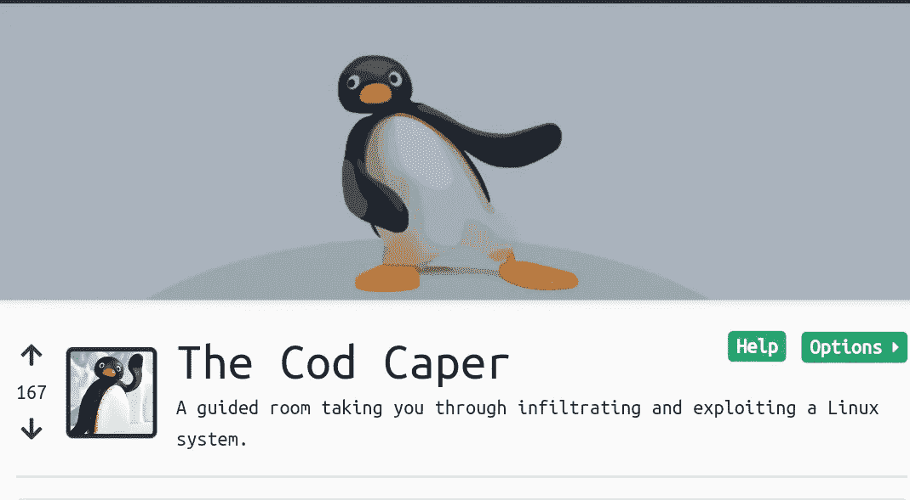

在这篇文章中，我们将解决来自 Tryhackme 的 Cod Caper room。

## 主机枚举

因此，我们首先从 Nmap 扫描开始，以查看打开的端口和机器上正在运行的服务。

> 我们用来扫描目标机器的标志
> 
> "-P1–1000 "用于指定要检查的端口。
> 
> "-sC "在端口上运行默认脚本。“-A”攻击性模式，试图获取尽可能多的信息。

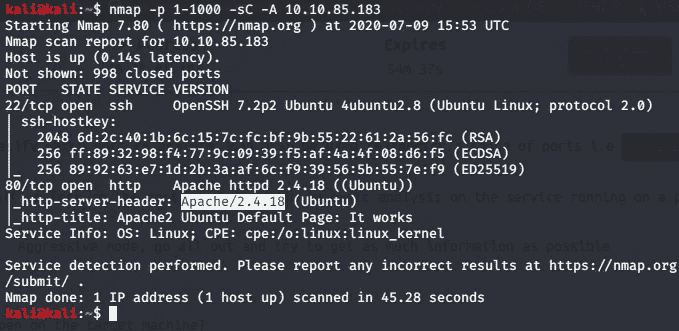

目标计算机上有两个开放的端口，我们可以看到“ssh”服务版本、web 服务器版本。

## Web 枚举

端口 80 是打开的，所以我们在浏览器中检查。

Apache 的默认网页就在那里，所以我们可以尝试从“gobuster”工具中获取目录。

> 我们使用的标志:
> 
> “— URL”来指定 URL
> 
> “—单词列表”单词列表的路径
> 
> “-x”指定文件扩展名

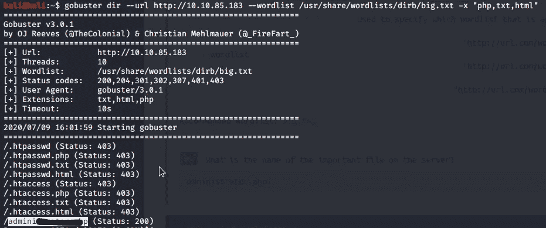

## 网络开发

我们得到了管理员登录页面，但我们没有登录的凭证，所以我们尝试使用“sqlmap”工具做 SQL 注入。

> 我们使用的旗帜
> 
> “-u”来指定 URL。
> 
> "— forms "来自动选择参数。
> 
> “—转储”以在找到 SQLI 后获取数据。

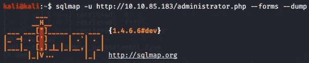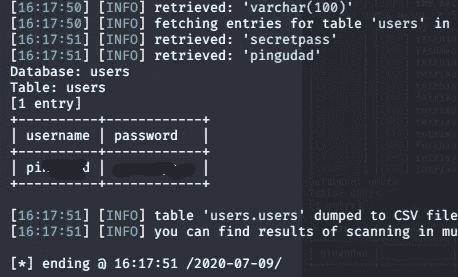

## 命令执行

我们得到了登录的用户名和密码

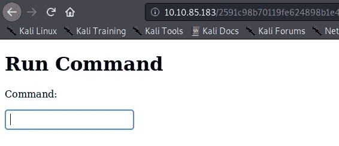

登录后，我们有一个命令提示，似乎我们已经有能力运行命令。我们执行了一个命令“id ”,我们得到了正确的结果，所以我们尝试执行 [python reverse](http://pentestmonkey.net/cheat-sheet/shells/reverse-shell-cheat-sheet) shell。在执行完命令后，我们得到了一个 reverse shell。

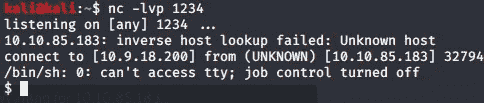

所以我们使用这个命令来检查用户的 CD/home；ls "

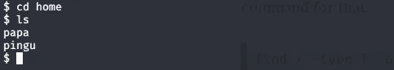

所以我们有两个用户，现在我们必须找到用户 Pingu 的密码

> find/-用户" www-data "-名称" *" 2>/dev/null

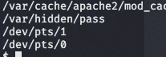

执行该命令后，我们发现密码存储在/var/hidden/pass 中

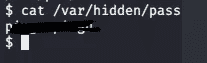

在获得了位于“/home/pingu/中的文件后，我们获得了 Pingu 的 SSH 的密码。ssh/id_rsa "

将我们保存为“ssh_key”的“id_rsa”文件内容复制并保存在您的桌面上

所以现在我们可以通过 SSH 登录

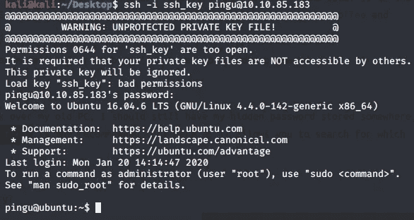

我们以用户 Pingu 的身份登录。现在，我们检查了特权，但我们什么也没有，所以我们检查了“SUID”二进制文件。

> find/-perm-u = s-type F2 >/dev/null

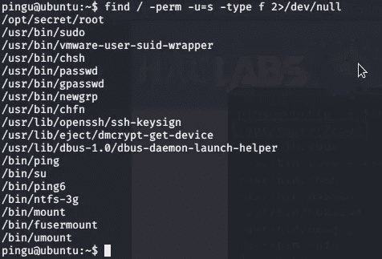

我们发现了一个有趣的文件“/opt/secret/root ”,正如 Tryhackme 中所解释的，这个文件期望输入 32 个字符，现在我们使用“gdb”来分析。

运行“gdb /opt/secret/root ”,您应该会看到这样的结果

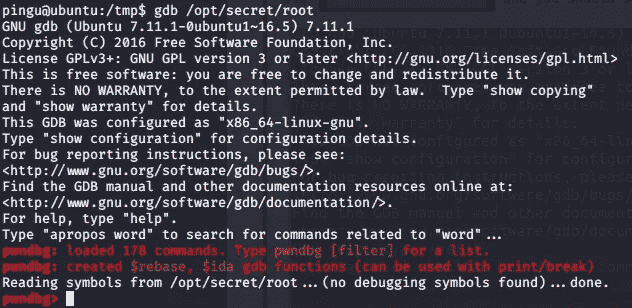

下一个过程是检查当我们发送超过 32 个字符时是否发生了什么，因此要这样做，请键入“r <

运行该命令后，您会看到类似这样的内容

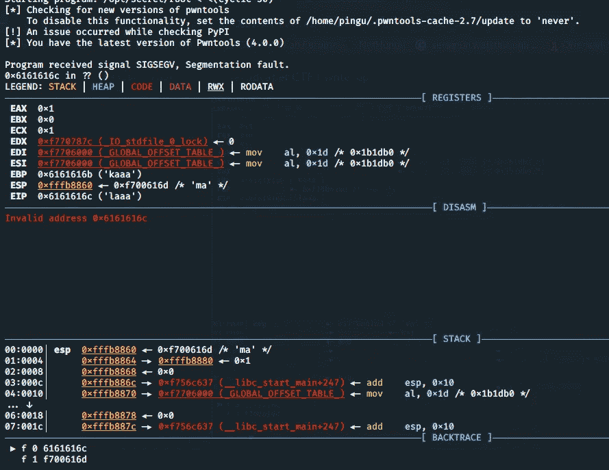

似乎我们已经改写了 EIP。EIP 是一个指导指针，它告诉程序接下来要执行哪个内存位，我们可以覆盖它，这样我们就可以执行程序的任何部分。回想一下源代码中的 shell 函数，如果我们可以重写 EIP 来指向 shell 函数，我们就可以让它执行。回想一下，循环输入是 4 个字符/字节序列，我们能够准确地找到在覆盖 EIP 之前我们想要提供多少个字符。

Cyclic 使用“-l”标志来提供这种质量，运行“cyclic -l 0x6161616c”将告诉我们要提供多少字符来覆盖 EIP。

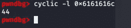

我们可以用 44 个字符覆盖 EIP。

现在我们必须找出 shell 函数在内存中的位置，这样我们就知道要把 EIP 设置成什么了。GDB 支持这一点，也“拆解”命令。

输入“拆卸外壳”

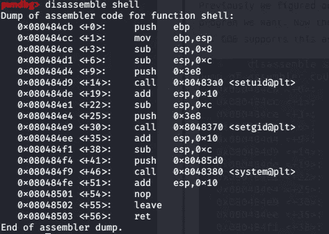

我们对十六进制内存地址感兴趣，我们知道在 shell 函数应该执行之后，我们必须输入 44 个字符和“0x080484cb”。

注意:-现代 CPU 架构是“小端”的，意味着字节是向后的。例如“0x080484cb”将变成“cb840408 ”,我们可以用 python 来实现。

输入退出

和类型

> python-c ' print " A " * 44+" \ xcb \ x84 \ x04 \ x08 " '

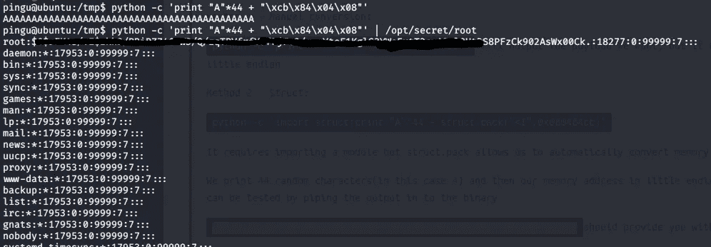

我们做到了！

现在我们有了散列中的密码，所以您可以使用“hashcat”来破解它。

黑客快乐！

推特- [阿克谢·卡卡尔](https://twitter.com/akshaykerkar13)