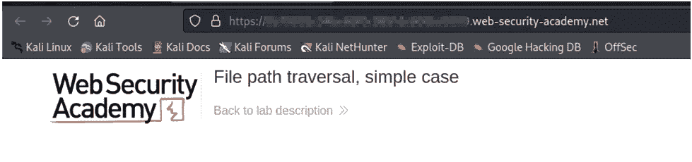
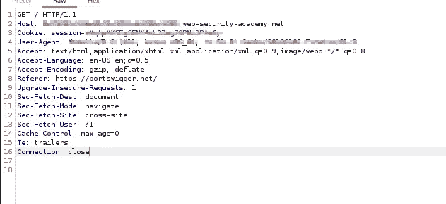
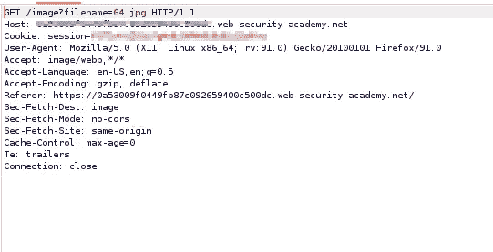
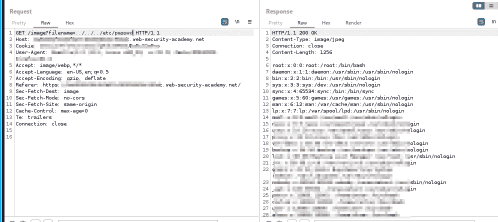

# PortSwigger 目录遍历及如何防止目录遍历的完整指南

> 原文：<https://infosecwriteups.com/the-complete-guide-to-portswigger-directory-traversal-and-how-to-prevent-it-f6309d5aec94?source=collection_archive---------2----------------------->

PortSwigger 是一家专门从事漏洞研究和安全工具开发的公司。这是一家在开发 Burp Suite(一个用于 web 应用程序安全测试的集成平台)方面发挥了重要作用的公司。

在本教程中，我们将研究 PortSwigger 目录遍历以及如何防止它。

当攻击者能够通过发送带有巧尽心思构建的 URL 的请求来访问他们不应该能够访问的文件或目录时，就会发生 PortSwigger 目录遍历。这可能是因为 web 服务器的配置问题或者 web 应用程序本身存在漏洞。

有两种方法可以防止 PortSwigger 目录遍历:-使用 Apache 的 mod_rewrite 模块-使用。缺省情况下，Apache 2.4 中的 mod 重写模块是禁用的。htaccess 文件仅在 Apache 2.2 和更低版本中可用。在 Linux 服务器上，可以使用以下命令来启用 mod 重写:Ubuntu/Debian:Apache 2 CTL-e Apache 2 CTL-e enable rewrite 或 apache2ctl -S on

**什么是目录遍历攻击**

目录遍历攻击是对计算机系统的攻击，它使用文件名和路径名来访问系统上的数据。这种类型的攻击利用了这样一个事实，即许多操作系统允许用户在引用文件时在文件名中输入任意字符串。目录遍历攻击包括使用这些字符串中的一个来访问不应该访问的文件或目录，如 web 服务器根目录、配置文件和应用程序源代码。

目录遍历攻击也称为“目录攀爬”或“目录跳转”。

目录遍历是一种计算机安全漏洞，由不充分的输入清理导致，允许访问存储在受影响计算机的文件系统中的任意文件。

**如何防止目录遍历攻击**

目录遍历或路径遍历是 web 应用程序中常见的一种计算机安全漏洞。

这种攻击是可能的，因为一些编程语言允许文件名中有空格，而操作系统并不总是检查这些空格。这可以通过使用 web 应用程序防火墙(WAF)过滤掉带有双点的请求，或者通过阻止用户上传文件名中带有空格的文件来防止。

在当今的数字世界中，网站安全是公司的一大担忧。Portswigger 的目录遍历防御服务将有效地保护您的网站免受黑客和其他网络攻击。

**实现目录遍历攻击的不同方法**

目录遍历是一种攻击，它利用了许多操作系统和编程语言使用“/”来分隔路径中的目录这一事实。这使得攻击者能够通过提供巧尽心思构建的路径来访问系统中的任意文件和目录。

实现这种目录遍历攻击的方法有很多种，但只要最终结果相同，使用哪种方法并不重要。以下是一些最常用的方法:

-使用包含“../"

-使用../../

Portswigger 是一个开源的免费项目，它使得在 web 应用程序中发现和利用安全漏洞变得很容易。

**我遵循的步骤发现了这个漏洞:**

步骤 1:我使用 burp suite 捕获请求并进行分析。

第二步:然后我发现“？filename= "图像文件的参数(。jpg)

步骤 3:我将这个请求发送给中继器，并将 filename 参数值改为../../../etc/passwd

终于解决了。如果你喜欢这个视频，请订阅并点赞。

## 来自 Infosec 的报道:Infosec 每天都有很多内容，很难跟上。[加入我们的每周简讯](https://weekly.infosecwriteups.com/)以 5 篇文章、4 个线程、3 个视频、2 个 GitHub Repos 和工具以及 1 个工作提醒的形式免费获取所有最新的 Infosec 趋势！