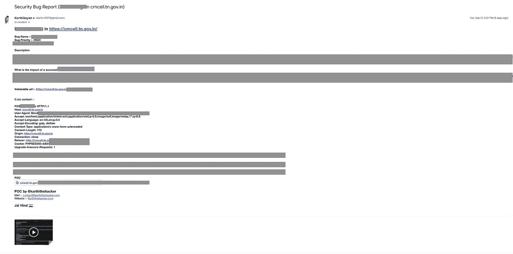
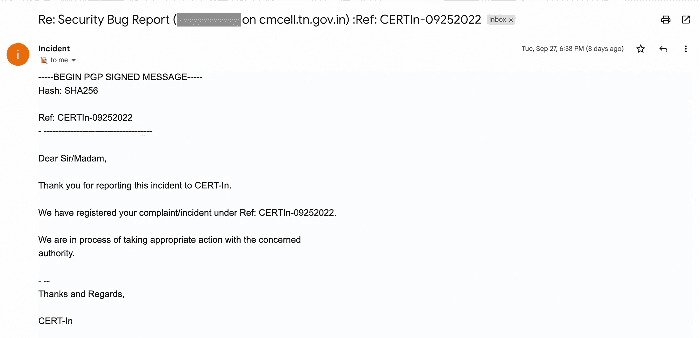

# 那天我发现 CM Cell(TN)应用程序上的关键数据库信息泄露了

> 原文：<https://infosecwriteups.com/the-day-i-end-up-finding-that-critical-database-info-leaking-on-cm-cell-tn-application-b6c126687f13?source=collection_archive---------2----------------------->

如你看过标题，是的！ [Karthikeyan。V](https://www.karthithehacker.com/) 测试 CM Cell 应用程序的人，幸运地发现了数据库在应用程序中出现问题的临界点。深入挖掘后，他发现存在一个漏洞。现在让我们深入技术部分→

这是一个 web 安全漏洞，使得攻击者能够干扰应用程序对其数据库所做的恶意代码。它通常允许攻击者查看他们通常无法检索的数据。这可能包括属于其他用户的数据，或者应用程序本身能够访问的任何其他数据。在许多情况下，攻击者可以修改或删除这些数据，从而导致应用程序的内容或行为发生持久变化。

# 脆弱请求

> POST /xxx.abc HTTP/1.1

主持人:【cmcell.tn.gov.in】T2

用户代理:Mozilla/5.0(Macintosh；英特尔 Mac OS X 10.15；rv:103.0)壁虎/20100101 火狐/103.0

接受:text/html，application/xhtml+xml，application/XML；q=0.9，image/avif，image/webp，*/*；q=0.8

接受-语言:en-US，en；q=0.5

接受编码:gzip，deflate

内容类型:application/x-www-form-urlencoded

内容长度:172

产地:【http://cmcell.tn.gov.in 

连接:关闭

推荐人:http://cmcell.tn.gov.in/xxx.abc

升级-不安全-请求:1

VulnerableParameters = **恶意代码* *

## 此漏洞的影响

成功的攻击可导致对敏感数据的未经授权的访问，如密码、信用卡详细信息或其他个人用户信息。近年来，许多引人注目的数据泄露都是这些攻击的结果，导致声誉受损和监管罚款。在某些情况下，攻击者可以获得进入组织系统的持久后门，从而导致长期危害，而这种危害可能在很长一段时间内都不会被注意到。

# 注意:

由于高度隐私的原因，我没有提到任何名字和概念，在这个过程后继续攻击是非法的。

**本文仅为教育目的而写* *

**斋后**

提交给 cmcell.tn.gov.in 的报告

来自证书的回复

# 学分:

发现人: [Karthikeyan。v](https://www.linkedin.com/in/cyberspartan/)([Cappricio Securities](https://cappriciosec.com/)创始人&首席执行官)

报告作者: [Karthikeyan。k](https://www.linkedin.com/in/karthikeyank-d4rkl3g4cy/)([Cappricio 证券的 CIO](https://cappriciosec.com/)

## 来自 Infosec 的报道:Infosec 每天都有很多内容，很难跟上。[加入我们的每周时事通讯](https://weekly.infosecwriteups.com/)以 5 篇文章、4 个线程、3 个视频、2 个 GitHub Repos 和工具以及 1 个工作提醒的形式免费获取所有最新的 Infosec 趋势！