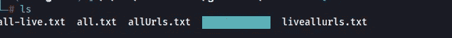
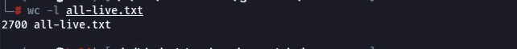
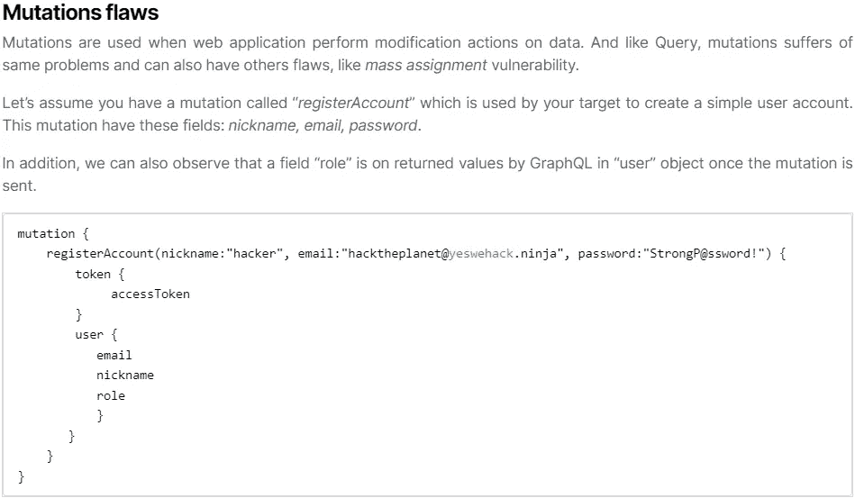
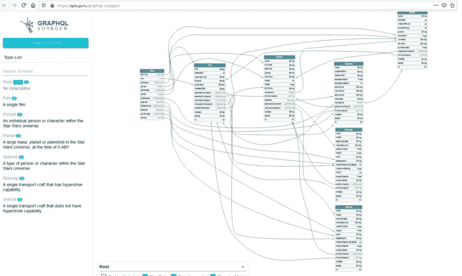
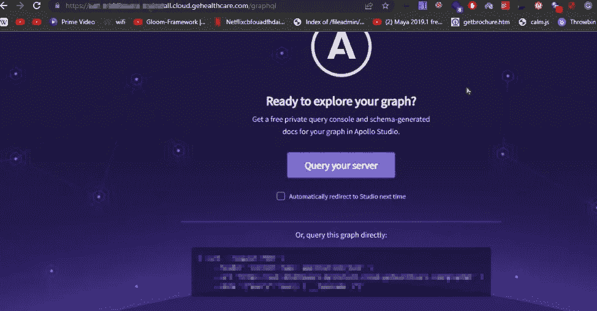
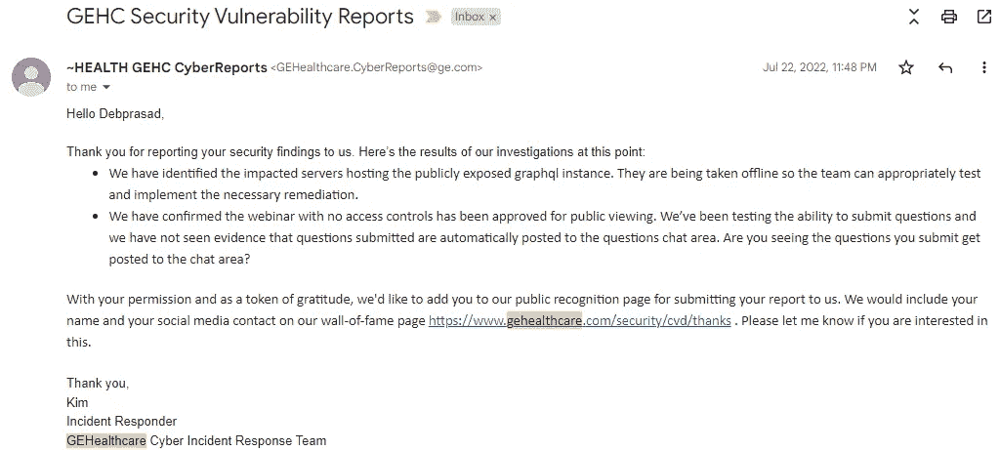
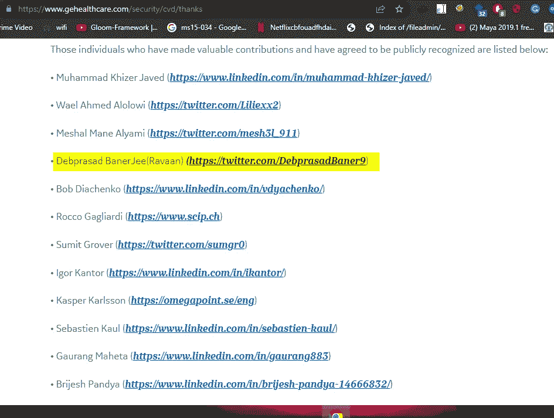

# 从十亿美元公司获得名人堂的最简单的错误。

> 原文：<https://infosecwriteups.com/the-easiest-bug-to-get-a-hall-of-fame-from-a-billion-dollar-company-8278fd7b3035?source=collection_archive---------1----------------------->

GeHealthcare 是一家很多人可能都没有听说过的公司。这家公司主要支持医疗保健相关的电子机械。长话短说-我想黑他们。

如果你已经关注我一段时间了，你一定明白我的主要方法论是围绕着我自己构建的一个特定工具。

顺便看看:[即时奖金](https://debprasadbanerjee502.medium.com/gauing-nuclei-for-instant-bounties-7a8a07979fff)



所以我运行我的工具，找到所有的子域。

下一步是我访问了大部分的子域名，有几个三级域名脱颖而出，其中一个是 https://Redacted-myinstall.cloud.gehealthcare.com/的



我访问这个页面，它是一个白色的页面。有趣的是，我以前有过使用微软 bug bounty 和 Adobe bug bounty 的经验，其中大多数页面都有运行服务的隐藏位置，所以，你可能已经猜到我用的是什么了。

FFUFing:

## GraphQL 端点的示例

很难列出所有可能的端点来找到一个 GraphQL 实例，但它们中的许多都使用类似“Appollo”的框架，并且它们使用常见的 GraphQL 端点:

```
/v1/explorer
/v1/graphiql
/graph
/graphql
/graphql/console/
/graphql.php
/graphiql
/graphiql.php
(...)
```

你可以在 [*SecLists*](https://github.com/danielmiessler/SecLists/blob/fe2aa9e7b04b98d94432320d09b5987f39a17de8/Discovery/Web-Content/graphql.txt) 上找到更完整的列表。另一种识别隐藏端点的方法是在 JavaScripts 文件中搜索一些关键字，如" *query* "、" *mutation* "、" *graphql* "，这可能会揭示 graphql 退役/非官方端点的存在。

我用 ffuf，碰到/graphql 的时候试着找文件。如果你不知道的话，Graphql 有助于通过模式查询 API。人们可以询问我做过的事情，并提取敏感信息。



这里有一篇文章解释一下。同时，让我知道你是否想要高级 API 黑客的东西。

你也可以使用 Graphql Voyager，尽管它现在还不可用。



## 调查结果和名人堂:



所以我报告了另一个潜在的问题，这是他们正在测试的一个新东西，他们关闭了整个服务器几个小时，然后它又重新启动了。



我被安排在他们的**名人堂里:**

[](https://www.gehealthcare.com/security/cvd/thanks) [## 通用电气医疗网络指南-感谢

### 通用电气医疗网络指南-感谢

通用电气医疗保健公司对赛博 Thankswww.gehealthcare.com 的指导](https://www.gehealthcare.com/security/cvd/thanks) 

## 公告:

差不多有 1000 个用户。当我达到 1000 名订户时，我将会分发 2 张 **Tryhackme Premium VIP+** 代金券。感谢您的阅读，很抱歉由于我目前正在进行的项目，我没有回复您的邮件。

鼓掌不止一次是可能的，并做评论进入赠品。和平—拉瓦安:)

## 来自 Infosec 的报道:Infosec 每天都有很多内容，很难跟上。[加入我们的每周简讯](https://weekly.infosecwriteups.com/)以 5 篇文章、4 条线索、3 个视频、2 个 GitHub Repos 和工具以及 1 个工作提醒的形式免费获取所有最新的 Infosec 趋势！