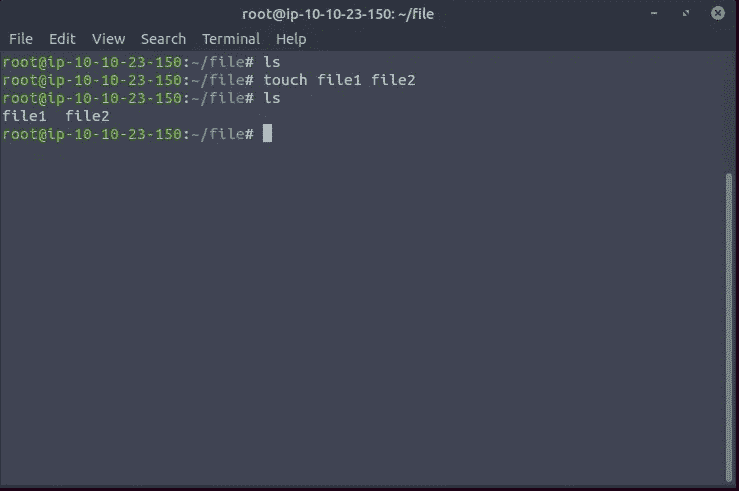
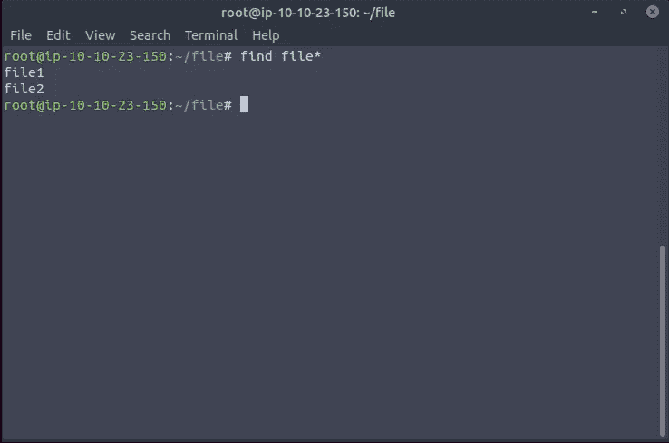
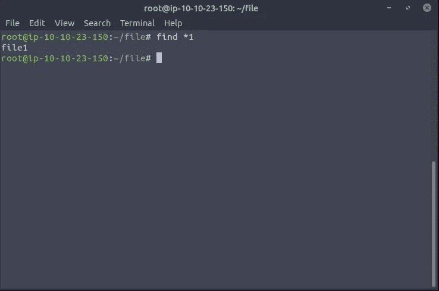

# find 命令-TryHackme

> 原文：<https://infosecwriteups.com/the-find-command-tryhackme-19b16d052753?source=collection_archive---------0----------------------->

## 写文章

嗨，神奇的黑客们，在这个博客中我们将看到关于 ***Find Command。*** 你要搜索什么比如说任何文件用户权限与任何特定的无论是什么通过使用 find 这个命令你可以直接搜索特定的内容。

在你的终端上执行命令**触摸文件 1 文件 2**

现在执行:查找文件*

现在这次执行:find *1

> **查找所有文件名以“.”结尾的文件。xml"**

*Ans: find / -type f -name "*。xml"*

> **查找/home 目录(递归)中名称为“user.txt”的所有文件(不区分大小写)**

*Ans:find/home-type f-iname user . txt*

> **查找名称中包含单词“exploits”的所有目录**

*Ans:find/-type d-name " * exploits * "*

> **查找用户“kittycat”拥有的所有文件**

*Ans:find/-type f-user kitty cat*

> **查找所有大小正好为 150 字节的文件**

*Ans:find/-type f-size 150 c*

> **查找/home 目录(递归)中大小小于 2 KiB 且扩展名为的所有文件。txt"**

*Ans:find/home-type f-size-2k-name " *。txt"*

> **找到所有对所有者完全可读和可写的文件，以及其他所有人都可读的文件(使用八进制格式)**

*Ans:find/-type f-perm 644*

> **找到所有只对任何人可读的文件(使用八进制格式)**

*Ans:find/-type f-perm/444*

> **查找对组“其他”具有写权限的所有文件，不考虑任何其他权限，扩展名为”。sh "(使用符号格式)**

*Ans:find/-type f-perm-o = w-name " *。sh"*

> **在/usr/bin 目录(递归)中找到所有文件，这些文件归 root 所有，并且至少拥有 SUID 权限(使用符号格式)**

*Ans:find/usr/bin-type f-user root-perm-u = s*

> **查找最近 10 天内未被访问的所有文件，扩展名为”。png"**

*Ans:find/-type f-atime+10-name " *。png"*

> **查找/usr/bin 目录(递归)中所有在过去 2 小时内被修改的文件**

*Ans:find/usr/bin-type f-mmin-120*

# 🔈 🔈Infosec Writeups 正在组织其首次虚拟会议和网络活动。如果你对信息安全感兴趣，这是最酷的地方，有 16 个令人难以置信的演讲者和 10 多个小时充满力量的讨论会议。[查看更多详情并在此注册。](https://iwcon.live/)

 [## IWCon2022 - Infosec 书面报告虚拟会议

### 与世界上最优秀的信息安全专家建立联系。了解网络安全专家如何取得成功。将新技能添加到您的…

iwcon.live](https://iwcon.live/)