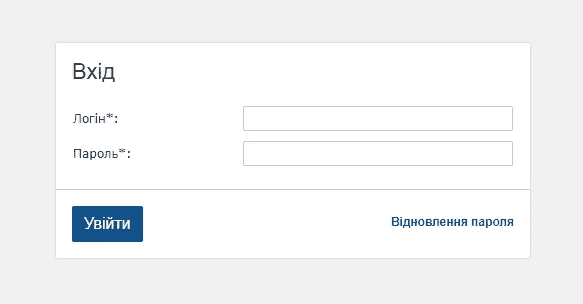
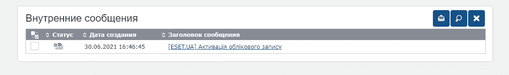
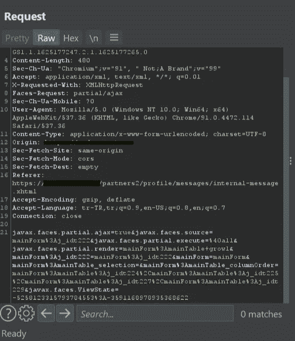
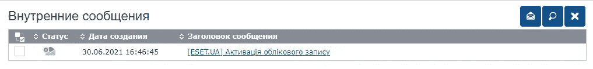
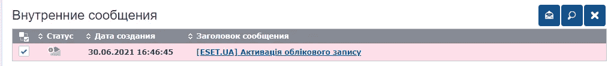
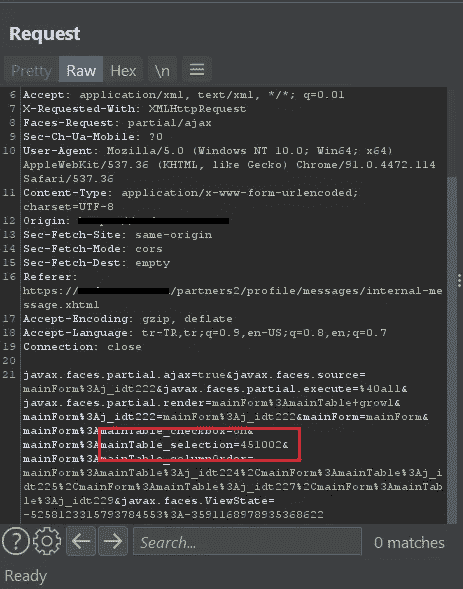

# 伊多尔的细线(ESET $WAG)

> 原文：<https://infosecwriteups.com/the-fine-line-of-idor-eset-wag-c5689a38690d?source=collection_archive---------1----------------------->

大家好，

今天我们来谈谈几个月前我在 ESET 上发现的漏洞。漏洞已被修复，我已获准将其公之于众，所以我们可以自由交谈！

在我谈论这个漏洞之前，我准备这篇文章的目的不是解释 IDOR，所以我假设您已经有了 IDOR 的基本信息。
那么让我们开始吧！

> **基本侦察**

我会把这部分讲得很短，因为没有多余的东西。简而言之，我正在检查 ESET 服务中的子域，我找到了以下类型的应用程序面板。

> **开战吧！**

我注册了应用程序，并试图了解这是怎么回事。没有太多，基本上下面这条信息引起了我的注意。

它看起来像一个欢迎信息。我打开拦截，试图通过点击十字按钮直接删除消息。

我遇到过这种请求。乍一看，没有什么引起我的注意。我没有看到任何对象 id。我发送了请求，邮件被成功删除。我甚至无法接近伊多尔。
几分钟后，我再次查看请求，参数**“mainTable _ selection = "**为空。我以为是关于对象 id，但我不确定。我成功地再次提交了请求，消息已被删除，但看起来我没有选择任何对象。

> **这里是伊多的细线！**

我回到应用程序面板来查找任何对象 id，我在寻找一个可以更改请求的属性。当然，我不确定这里是否有一个 IDOR，我只是在碰碰运气。

是的，你注意到了，对吧？我重复删除过程，看看我错过了什么，然后我也注意到了。

我重新提交了请求，看看会有什么变化。

正如我们预测的:)

我立即创建了一个受害者用户，并用它的欢迎消息替换了对象 id。我的受害者的欢迎信息已被删除，宾果！电子邮件编号在特定值之间增加，这意味着系统中的所有电子邮件都可以删除。

消息选择按钮直接在后台使用参数 **"mainTable_selection="** 工作，并不真正检查对象属于哪个用户。

我向 ESET 安全团队报告了这个漏洞，并获得了奖品。我希望你喜欢！

举报—2020 年 12 月 5 日
奖励—2020 年 12 月 23 日
修复—2021 年 4 月 27 日