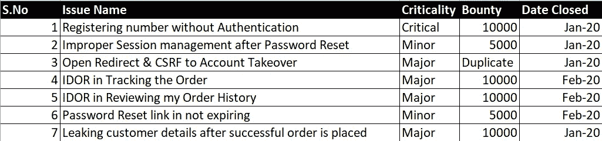
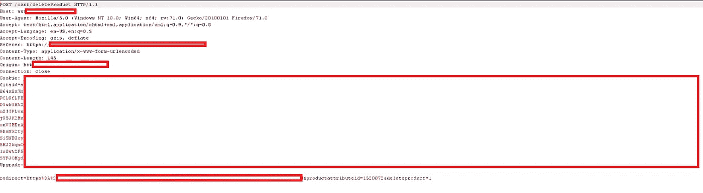
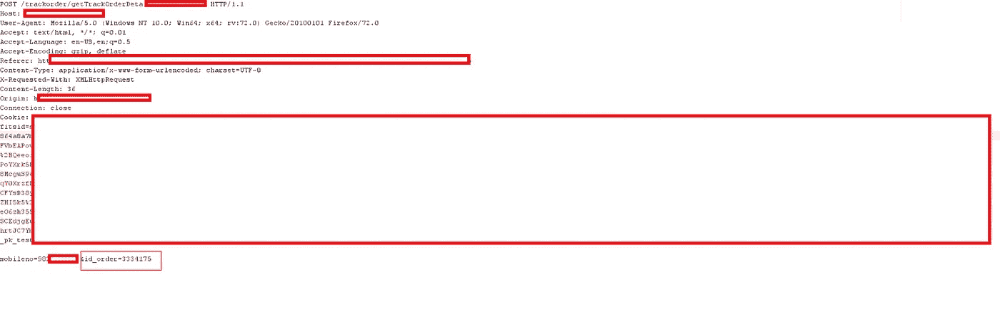
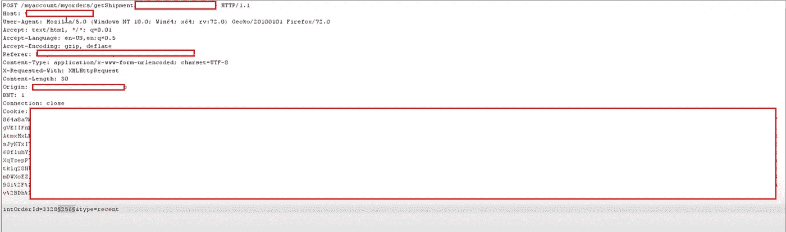

# 第一个赏金目标(披露多份报告)

> 原文：<https://infosecwriteups.com/the-first-bounty-target-disclosing-multiple-reports-b963bffb36cd?source=collection_archive---------0----------------------->

你好，

首先，很抱歉这么长时间没有发帖。我真的很忙，在这个封闭推销我的黑客声誉和其他东西。我写这篇博客是想谈谈我的方法，以及在不使用任何工具的情况下，我是如何在我的第一个目标上发现多个漏洞的。

无论如何，让我们回到我们的话题，我不会透露公司的名字，因为这是一个私人项目，但会称之为**shopping.com**，因为这是一个购物网站。

# 案例研究索引

这是我第一个获得赏金的目标，因为第一笔赏金总是很特别的。我继续攻击目标，报道更多的报道，获得更多的奖金

总共 50，000 印度卢比的奖金:P

# 案例研究:1

(未经认证的注册号码)

这是我今年早些时候写的关于这个的博客:

 [## 监察元素是如何让我得到赏金的

### 您好家伙，我最近遇到了一个惊人的绕过改变我的电话号码在一个应用程序，不允许…

medium.com](https://medium.com/bugbountywriteup/how-inspect-element-got-me-a-bounty-58d3a9946225) 

# 案例研究:2

(密码重置后不正确的会话管理)

在这个场景中，我创建了一个帐户，并在两个浏览器中登录。我在一个浏览器中更改了帐户的密码，并试图在第二个浏览器上进行编辑，成功了，因此出现了不正确的会话管理缺陷，这显然是一个小问题。

# 案例研究:3

(打开重定向和 CSRF 到帐户接管)

这里的情况有点不同，我注意到当我从购物车中删除一些东西时，会发送一个 POST 请求，其中请求正文中有一个 **redirect** 参数，我很快将参数值更改为我的服务器，它会重定向到我的服务器，有趣的是它会附带用户 Cookies。

我通过打嗝套件将其转换为 CSRF POC，并使用不同的帐户发出请求，我成功地将受害者重定向到攻击者的网站，并窃取了他们的 cookies

发布请求(案例研究:3)

# 案例研究:4

(IDOR 按跟踪顺序)

所以在这个 hopping.com 的网站上，有一个“跟踪我的订单”选项，在成功下订单后，人们可以用订单 id 跟踪订单。因此，利用这一功能，如果攻击者知道受害者的电话号码，他就可以获取任何受害者的详细信息，而他不需要知道订单号，因为在 Burp Suite 入侵者的帮助下(为了更好地理解，请参考下面的截图)，他可以强行找到正确的订单号，并获得他的订单的详细信息，从而泄露受害者的地址和其他个人信息

案例研究:4

在这里，我用我的另一个帐户的手机号码强制使用 id_order 参数，并获得第二个帐户下的所有订单。

# 案例研究:5

(我在查看我的订单历史)

特别说明:这些功能只有我在 shopping.com 上购买后才能使用

这里的情况非常简单，我进入我的“我的订单”页面，当我单击我的订单时，它会刷新页面并显示订购的产品，我拦截了请求并再次单击订购的产品&令我惊讶的是，在请求正文中再次出现了一个"**into orderid "**参数，我很快将它发送到 Burp intruder，并猜测我有多个订单细节泄露了他们客户的 PII

案例研究:5

# 案例研究:6

(密码重置链接不会过期)

嗯，这也是一个小错误，而且非常简单。作为参考，我贴出一份黑客报告，它会给你一个想法(也可能因程序而异)

 [## HackerOne 上披露的 Shopify:密码重置链接未在过期...

### 您可以使用密码重置链接多次重置密码。步骤:1。转到…

hackerone.com](https://hackerone.com/reports/898841) 

# **案例分析:7**

(成功下单后泄露客户详细信息)

同样，这个问题也是在成功订购后发现的，在这里，当我下订单时，URL 是这样的:**[**https://www.shopping.com/orderconfirm?secretkey=**](https://www.allensolly.com/orderconfirmation?securekey=)**<some-key>&orderid =<orderid>** 我按降序更改了订单，PII 开始披露其中包括姓名、地址、电话号码和付款方式。**

****外卖—****

**我想说我从这次经历中得到的收获是停留在一个目标上并理解它，让自己感觉舒服，不要匆忙。如果你有资格购买，那就买吧！！肯定会带点东西的。**

**这个博客到此为止。希望你喜欢。**

**在 [LinkedIn](https://www.linkedin.com/in/adtyasoni) 、 [Twitter](https://twitter.com/hetroublemakr) 上与我联系**

**如果你喜欢这个博客，请点击👏按钮，并分享它以帮助其他人找到它。**