# 2018 年 BSNL 印度黑客的完整故事

> 原文：<https://infosecwriteups.com/the-full-story-of-the-2018-bsnl-india-hack-85c98e3f10f8?source=collection_archive---------0----------------------->

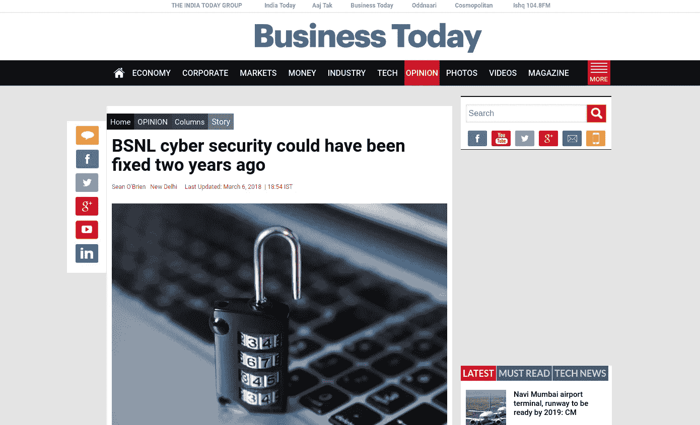

**今日商业**新闻[链接](https://www.businesstoday.in/opinion/columns/bsnl-cyber-security-could-have-been-fixed-two-years-ago/story/272034.html)

他的帖子将是关于最近新闻广泛报道的 BSNL 黑客事件。它试图描绘整个故事，而不是媒体报道的零碎片段。

2016 年 2 月 20 日，当我在 IIT·古瓦哈蒂大学攻读工程学三年级时，我正准备参加一个黑客竞赛，这时我和一个朋友偶然发现了 BSNL 内部网网站的一个漏洞。通过利用这一点，任何黑客都可以访问整个 BSNL 内联网数据库，其中包含大量不应该公开的数据，如用户详细信息和 BSNL 所有现任和退休员工的信息。

## 关于漏洞

这是一个非常简单的漏洞，叫做盲目 SQL 注入。你可以在这里 了解更多 [**。**](https://www.owasp.org/index.php/Blind_SQL_Injection)

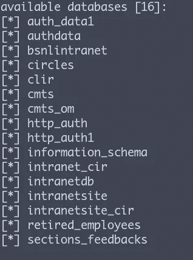

16 个数据库可用

这个简单的漏洞存在于 BSNL 内部网站的登录页面上，我认为并不难发现。不仅如此，许多印度网站充斥着许多简单的漏洞，如果被黑客攻击，将会产生巨大的影响。关键是，发现这个漏洞不需要太多的黑客知识或技术专业知识。另一方面，被泄露的数据具有很高的价值。

# 我做了什么？

我最初注意到这一点时感到震惊，因为黑客攻击如此简单，但 BSNL 员工的所有个人用户数据都岌岌可危。不管我的朋友们如何劝我不要报案，因为这可能会带来被起诉的风险，我还是决定报案。

毕竟，我只是在帮助我的国家变得更加安全

## 尝试 1:

我去了 BSNL [网站](http://www.bsnl.co.in/opencms/bsnl/BSNL/about_us/hrd/organization.html)的“关于我们”版块，在那里我找到了 BSNL C[hairman&董事总经理](http://www.bsnl.co.in/opencms/bsnl/BSNL/about_us/company/Anupamshrivastava_cmd.html)(负责人)的邮箱 ID。我给他们发了一封邮件，如果同样的事情发生在其他私人公司，我通常会这么做。

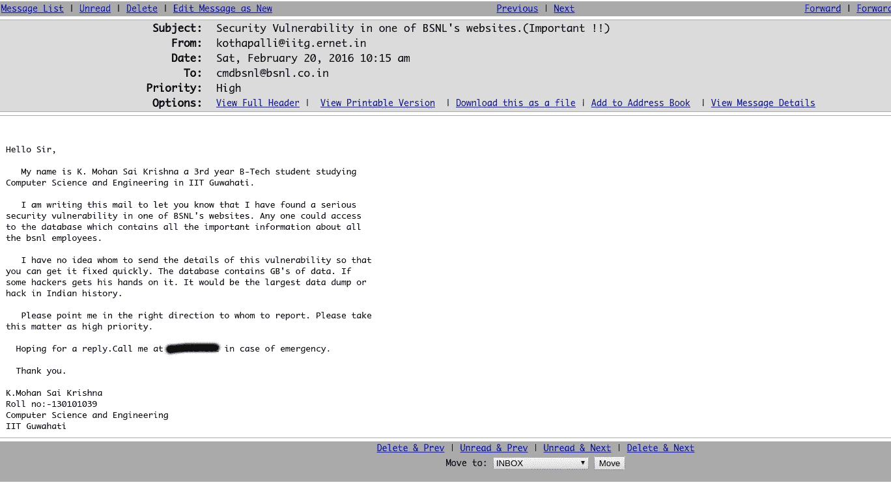

邮件发送至 BSNL CMD

我不确定他是否会看我的邮件，所以我写了一个强烈的主题来确认。我想我错了，因为两年后我还没有收到回复。

## 尝试 2:

我不太记得我是从哪里得到这些电子邮件 id 的——大部分是在谷歌搜索 BSNL 的负责人之后。在我发出第一封邮件五天后，我又发了一封。

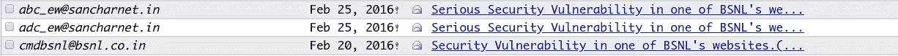

其他电子邮件

这一次也没有回答。

## 尝试 3:

一个朋友告诉我，公司在 Twitter 上反应很快。我也在那里碰了碰运气:

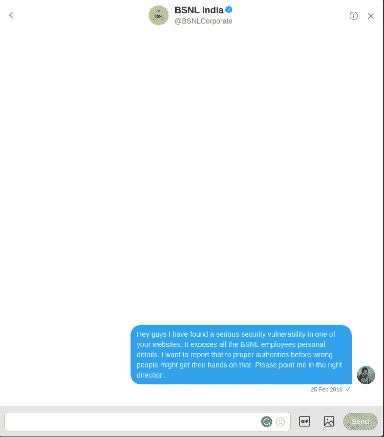

与 BSNL 的推特聊天

又一样。没有回复。

## 尝试 4:

脸书。

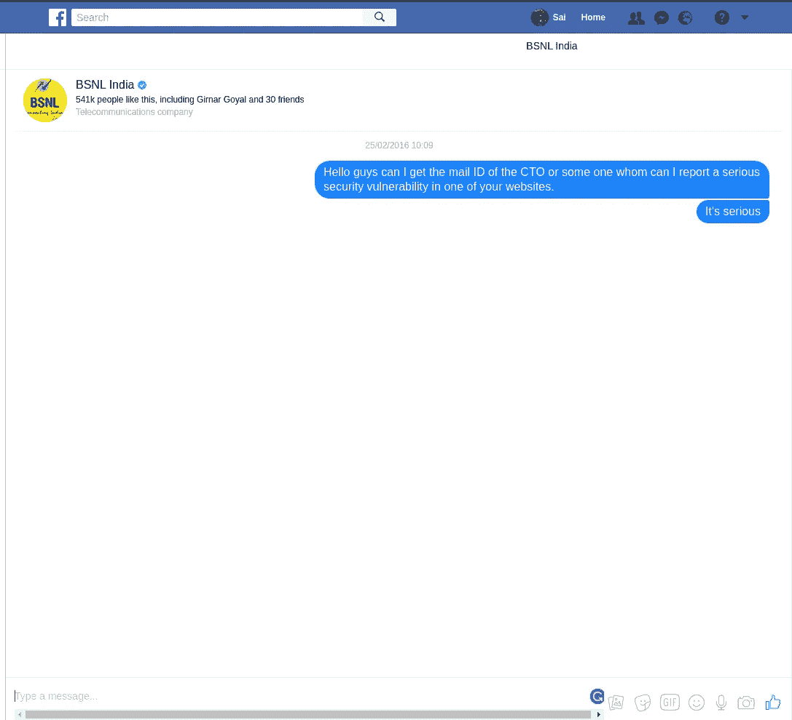

BSNL 脸书聊天

没有回复。

## 尝试 5:

三天后，我想到给总理纳伦德拉·莫迪发推特。在那段时间，他的推特账号非常活跃，我希望我能得到回复。仔细想想，我盲目的乐观似乎很愚蠢。

他为什么要回复我？

## 尝试 6: **给导演发邮件。**

我决定给 IIITG 的主管发邮件，当我加入的时候，他是 IITG 的主管。他是计算机科学与工程系的教员。这是在我发现善治中心网站的另一个漏洞并在推特上发布之后。我曾经亲眼目睹很多印度网站在那个时候被黑，再也受不了了。所以，我决定把事情掌握在自己手中。

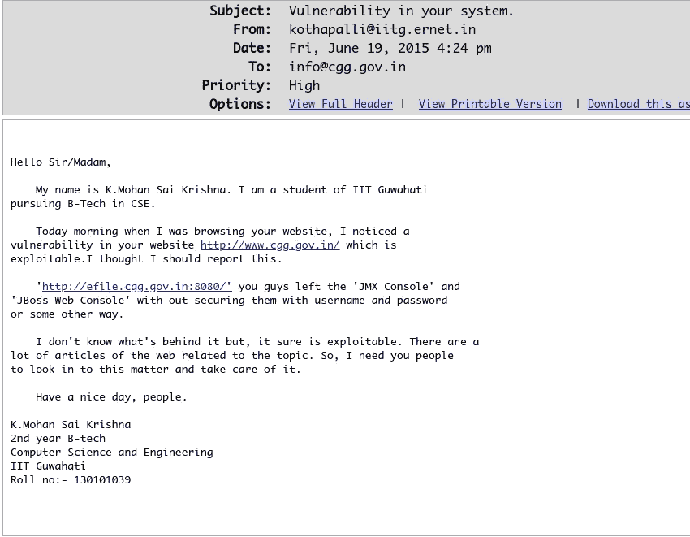

我发给 CGG 的邮件报告了一个漏洞

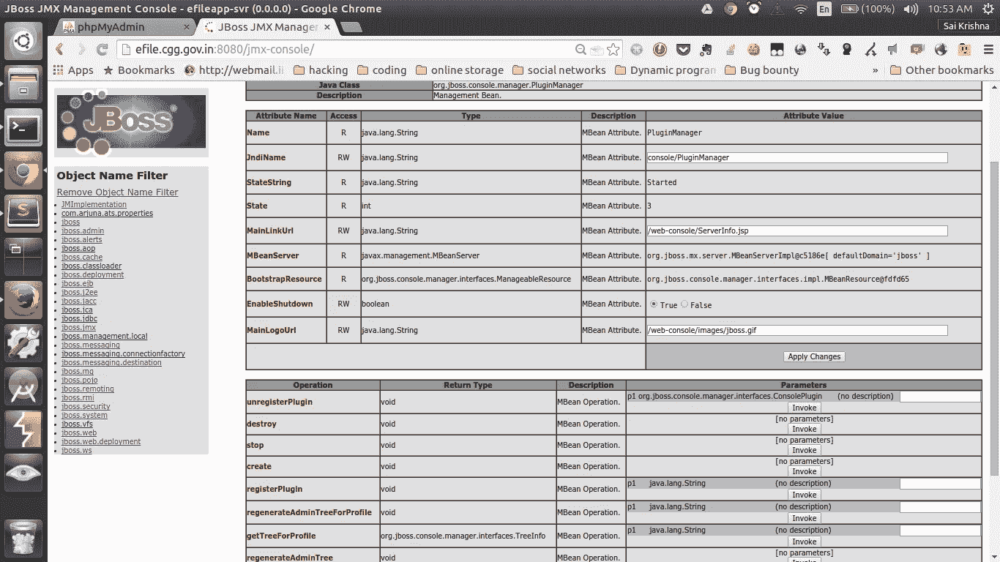

善治中心。

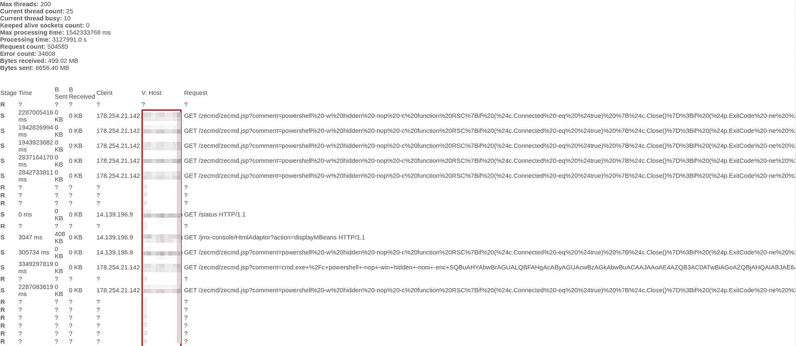

网站上的日志也是公开的。:五

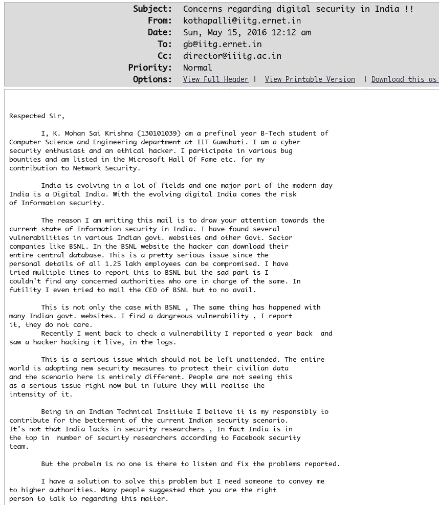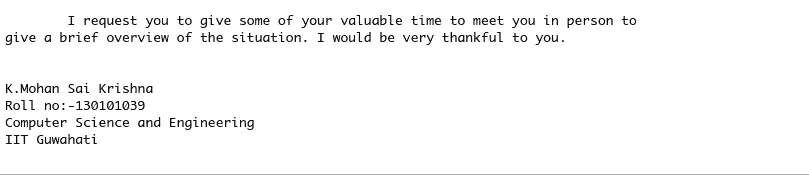

给导演的邮件

他回复说让我联系负责处理印度安全事件的 CERT-IN。

这是他们的网站现在(2018)的样子

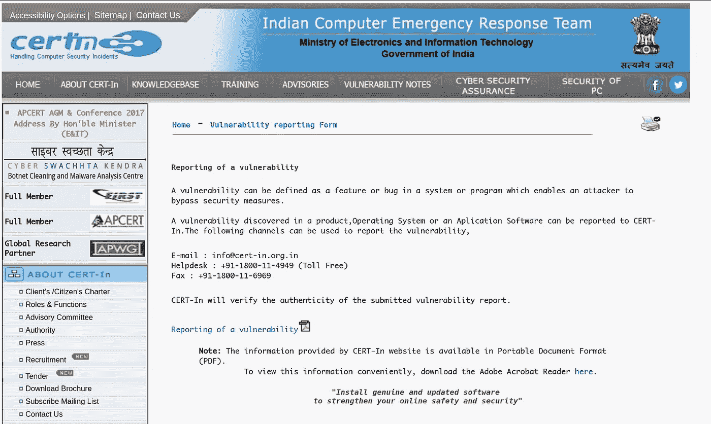

网站中的证书

抛开我的失望，我去了“漏洞报告”页面，令我惊讶的是我看到了 [**这个**](http://www.cert-in.org.in/PDF/Vul_Report.pdf) 。

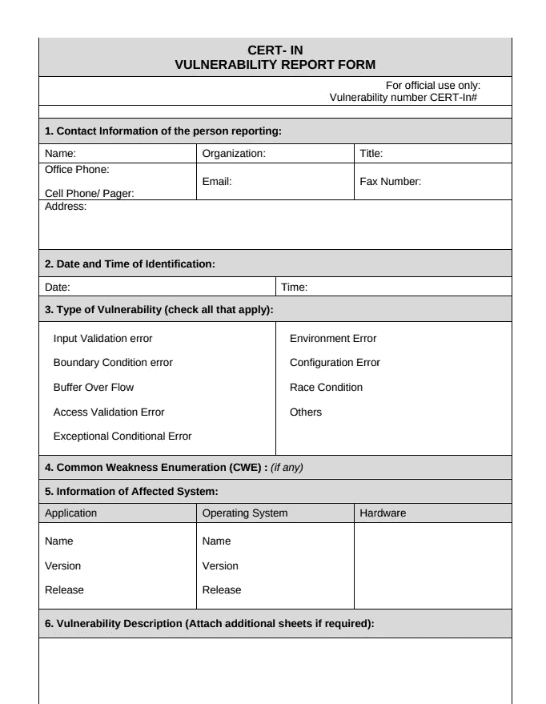

PDF 报告

**我必须下载这份 PDF 文件，打印出来，填好，扫描，然后再发给他们。我很困惑——到底是谁会这样使用技术？？哦，我知道了，没问题！！**

我去了宿舍的文具店，但是已经关门了。第二天，他们没有墨水来打印了。第三天，我忘了带笔盘。在那之后，一些考试开始了，事实证明，我从来没有真正去报告这个漏洞。

这一天，我意识到报告印度政府网站的安全漏洞是多么困难。

发现这个漏洞四个月后，我对修复它不抱希望，我放弃了报告单个漏洞，开始专注于修复系统。

一年后，我在我的大学 IIT·古瓦哈蒂开始了一项负责任的信息披露政策。

 [## its 古瓦哈蒂是如何开始自己的昆虫赏金计划的

### 这篇文章是我对 its 古瓦哈蒂如何成为印度第一个开办自己的 bug 的教育机构的看法…

medium.com](https://medium.com/@kmskrishna/how-did-iit-guwahati-start-its-own-bug-bounty-program-f81a152fecb9) 

现在，在发现并报告该漏洞失败两年后，[埃利奥特·奥尔德逊](https://twitter.com/fs0c131y)再次发现并报告了该漏洞

在他最初的推文中，他说他在 BSNL 发现了一些漏洞，我很好奇并发表了评论。

后来我才知道，这和他刚才发现的漏洞是一样的。我和他分享了一些截图来证明我的说法。

埃利奥特·奥尔德逊的推特

尽管这个问题最终得到了解决，但直到这条新闻在媒体上引起的波澜平息后，BSNL 方面才发表评论。因为一名印度安全研究人员报道了此事，没有人愿意回复，甚至看一眼。但直到一位在 Twitter 上颇有名气的法国安全研究人员报告后，才采取了行动。

BSNL 解决了这个引起媒体注意的特殊问题，但是就目前公开的情况来看，他们还没有采取任何措施来解决问题的根源。他们也没有注意解决其他尚未成为焦点的问题。

这只是一个孤立的案例。每天都有无数像我一样的赛克里希纳试图让印度的网络空间更加安全，但是没有得到印度政府的回复。所以他们所做的就是参与国外公司的 bug 奖励计划，因为他们得到了更好的回应、认可和回报。

我们经常听到“人才外流”这样的说法，并声称印度的年轻人才倾向于出国赚钱，而不是留在国内帮助自己的国家。但是，如果我们辛勤工作换来的只是顽固的沉默，我们印度安全研究人员该怎么办呢？

> 就算我们想帮国家，国家不让我们帮又能怎么样呢？

媒体对此问题的报道:

 [## BSNL 雇员数据库易受黑客攻击:法国研究员罗伯特·巴普蒂斯特

### 海德拉巴:法国网络安全研究员罗伯特·巴普蒂斯特发现超过 40 GB 的敏感数据属于…

www.newindianexpress.com](http://www.newindianexpress.com/states/telangana/2018/mar/05/telangana-bsnl-employee-database-vulnerable-to-hacking-french-researcher-robert-baptiste-1782219.html)  [## BSNL 内网被黑；研究人员发出警报后，公司修复泄漏

### 一位匿名的法国安全研究员声称已经获得了巴拉特的私人数据库…

m.economictimes.com](https://m.economictimes.com/tech/internet/bsnl-intranet-hacked-company-fixes-leak-after-alert-by-researcher/amp_articleshow/63158522.cms?__twitter_impression=true)  [## 法国安全研究人员侵入 BSNL 内部网，揭露影响 47，000 名员工的缺陷

### 道德黑客发现过去和现在的 BSNL 雇员的个人资料处于危险之中。电信公司也不知道…

yourstory.com](https://yourstory.com/2018/03/french-security-researcher-hacks-bsnl-intranet-exposes-flaws-impacting-47000-employees/)  [## 安全研究员入侵 BSNL 内部网；泄露 47，000 名员工的详细信息

### 3 月 4 日周日，安全研究员埃利奥特·奥尔德逊在一系列推文中分享了他是如何入侵 BSNL 的(Bharat…

计算机世界](http://www.computerworld.in/news/security-researcher-hacks-bsnl-intranet-leaks-details-47000-employees)  [## 法国安全研究人员黑了 BSNL 内部网，暴露了严重的安全缺陷

### 法国网络安全研究员巴蒂斯特·罗伯特声称已经获得了国营 Bharat 的私人数据库…

www.newsbytesapp.com](https://www.newsbytesapp.com/timeline/Science/17275/84954/bsnl-intranet-hacked-researcher-highlights-several-security-vulnerabilities)  [## BSNL 的网络安全问题两年前就可以解决了

### 两年多前，纳伦德拉·莫迪总理宣称，“全世界面临的最大挑战是如何……

商业日报](https://www.businesstoday.in/opinion/columns/bsnl-cyber-security-could-have-been-fixed-two-years-ago/story/272034.html) 

这在媒体上引起了几天的喧嚣，但就像所有“突发新闻”一样，很快就被遗忘了。我很难过地说，没有采取任何步骤从根本上纠正这个问题，以便这种事情不会在未来不断重复。

这篇文章无意诽谤或伤害或指责任何人。我只是想告诉大家，我们应该从错误中吸取教训，不要重蹈覆辙，我们国家有很多黑客愿意提供帮助。我们的政府需要做的就是保持开放的心态，承认这些安全报告，这样这样的惨败就可以在未来避免。

和平。❤