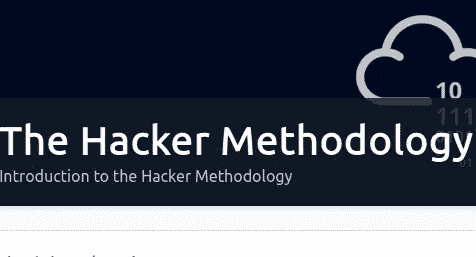
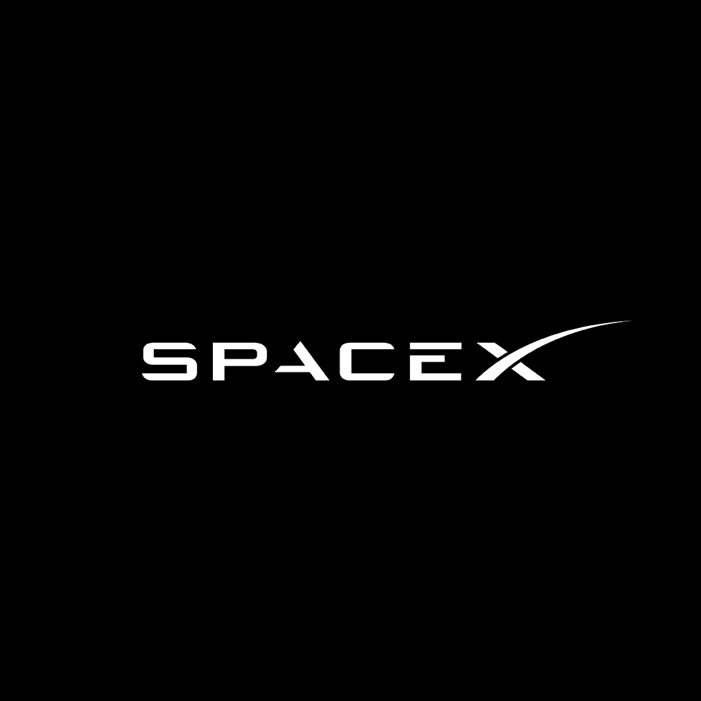
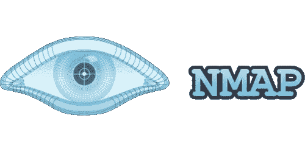
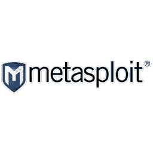
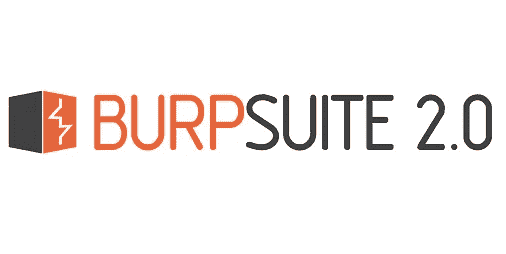
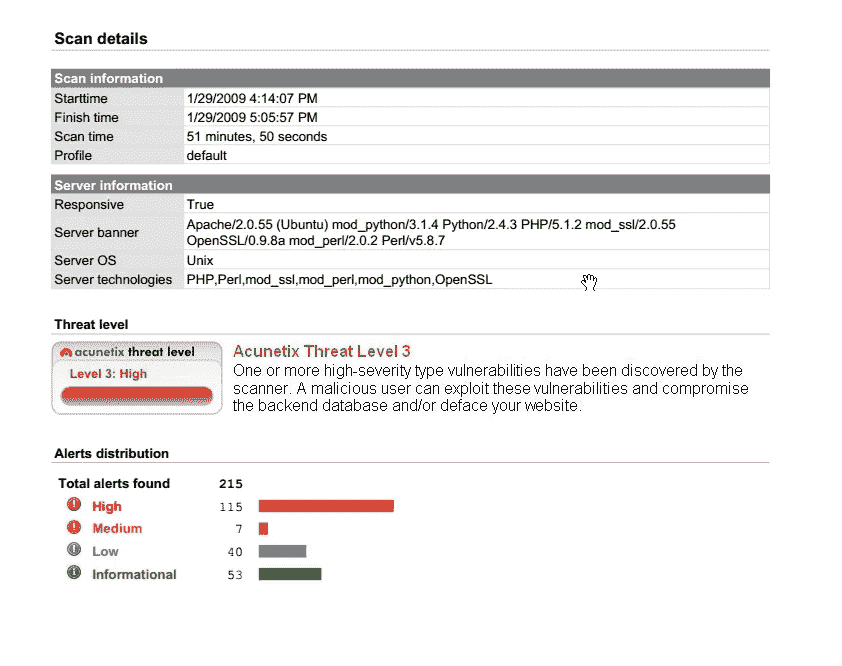

# 黑客方法论

> 原文：<https://infosecwriteups.com/the-hacker-methodology-tryhackme-writeup-e81ff7822f17?source=collection_archive---------3----------------------->

**这是 Tryhackme room“黑客方法论”的一篇文章**

https://tryhackme.com/room/hackermethodology

**房间链接:**[https://tryhackme.com/room/hackermethodology](https://tryhackme.com/room/hackermethodology)
**注:此房免费**

**黑客遵循什么流程？**

虽然您可能认为黑客可以为所欲为，但实际上，专业黑客/渗透测试人员通常遵循既定的流程来理解和利用他们的目标。这确保了整个行业内评估方式的一致性，也是推动评估的方法。

**pen testers 遵循的流程总结如下:**

1.  **侦察**
2.  **枚举/扫描**
3.  **获得访问权限**
4.  **特权升级**
5.  **覆盖轨道**
6.  **举报**

在接下来的章节中，我们将更详细地介绍这一过程的各个方面。

回答下面的问题继续。

**Q.1** 黑客方法论的第一阶段是什么？

> **答案:侦察**

# 任务 2:侦察概述

道德黑客方法论的第一阶段是**侦察。**

侦察就是收集关于你的目标的信息。

一般来说，侦察通常不涉及与目标或系统的互动。

侦察是一个非常简单的概念，想想我们可以在互联网上使用什么工具来收集人们的信息。

想到了哪些网站和技术来收集关于目标组织、技术或一组个人的信息？

在这种情况下，让我们使用公司:SpaceX。在这里停下来，花 2 分钟时间在 SpaceX 上做一些研究，并记下您用来进行研究的任何网站。

**你开始研究 SpaceX 的地方在哪里？**

最有可能的是，您从黑客拥有的最有用的工具之一开始:

*   **谷歌**

**Google** 是一个非常有用的工具，有一整个房间( [Google Dorking Room](https://tryhackme.com/room/googledorking) )可以有效地使用它来进行研究。

你可能还会使用网站，如**维基百科**来了解 SpaceX 的历史，使用该公司的**推特/YouTube** 来查看他们最新的新闻发布或“sizzle-reels”，甚至使用 **LinkedIn 个人资料**来研究公司的职位空缺和/或公司的组织结构。

酷的是，所有这些非常简单的工具都是有效的侦察工具。

*你可能认为黑客使用特殊的工具来进行研究(在某些情况下确实如此)，但总体而言，他们使用像这样的简单工具来进行研究。*

侦察通常包括使用谷歌等公开可用的工具来研究你的目标。

尽管看起来很简单，侦察是渗透测试中最重要的一个阶段。

**我们可以利用一些专门的工具，但对于本简介，最好了解以下工具。**

*   **谷歌(特指谷歌多金)**
*   **维基百科**
*   **PeopleFinder.com**
*   **谁是**
*   **子列表 3r**
*   **hunter.io**
*   **builtwith.com**
*   **wappalyzer**

**q . 1**SpaceX 的 CEO 是谁？

> **答案:埃隆马斯克**

**问题 2** 研究一下这个工具:sublist3r，它列出了什么？

> **回答:子域名**

**问题 3** 当你使用谷歌寻找特定的漏洞或研究感兴趣的特定主题时，它被称为什么？

> **答案:谷歌多金**

# 任务 3:枚举和扫描概述

**黑客方法的第二阶段是扫描和枚举。**

黑客将从这里开始与目标进行交互(扫描和枚举)，试图找到与目标相关的漏洞。

这是更多专业工具开始进入武器库的地方。像 nmap、dirb、metasploit、exploit-db、Burp Suite 等工具对于帮助我们找到目标中的漏洞非常有用。(现在不要担心它们，您可以稍后再深入了解细节)

在扫描和枚举阶段，攻击者正在与目标进行交互，以确定其整体**攻击面。**

**攻击面决定了在攻击阶段目标可能易受什么攻击。**这些漏洞可能是一系列的事情:从网页未被正确锁定、网站泄露信息、SQL 注入、跨站脚本或任何数量的其他漏洞。

**简单来说——枚举和扫描阶段是我们试图确定目标可能易受攻击的地方。**

例如，我们武器库中的一个重要工具是一个叫做 **Nmap** 的工具(我建议在你完成这个房间后去看看 [nmap 房间](https://tryhackme.com/room/rpnmap))。

*   **Nmap 是一个可以扫描目标并告诉我们各种信息的工具:**
*   **开放哪些港口**(如果你对港口一无所知，我强烈推荐你看这个:[https://www.youtube.com/watch?v=PpsEaqJV_A0](https://www.youtube.com/watch?v=PpsEaqJV_A0)和[https://www.youtube.com/watch?v=qsZ8Qcm6_8k](https://www.youtube.com/watch?v=qsZ8Qcm6_8k))
*   **目标的操作系统** (Windows、Linux、MacOS 等。包括什么版本的操作系统)
*   **哪些服务正在运行，服务的版本是什么**(例如，仅仅说 FTP(文件传输协议)是不够的，nmap 可以尝试采集指纹并确定 FTP 的确切版本，这可能使我们能够找到目标中的特定漏洞)

虽然这听起来像是很多信息(足以 pwn 任何人和任何事，对吗？)还有其他工具也将用于侦察武器库。

这里有一个你可以在 TryHackMe 上学习的其他工具的快速示例:

*   **dirb(用于查找网站上常用的命名目录——像** [**下的 how https://www.tesla.com**](https://www.tesla.com)**还有**[https://www.tesla.com/about](https://www.tesla.com/about)[https://www.tesla.com/model3](https://www.tesla.com/model3)[https://www.tesla.com/modely](https://www.tesla.com/modely)，最重要的是[https://www.tesla.com/models](https://www.tesla.com/models)的滑稽模式！！♥)
*   **dirbuster(类似于 dirb，但名字更酷，有用户界面)**
*   **enum4linux(专门用于 linux 查找漏洞的工具)**
*   **metasploit(该工具主要用于漏洞利用，但也有一些内置的枚举工具)**
*   **Burp 套件(该工具可用于扫描网站的子目录并拦截网络流量)**

**问题 1** 枚举对确定目标有什么帮助？

> **答案:攻击面**

**Q.2** 侦察一下工具:Metasploit，是哪个公司开发的？

> **答案:rapid7**

**问题 3** 什么公司开发了工具 Burp Suite 背后的技术？

> **答案:portswigger**

# 任务 4:剥削

既然我们已经讨论了圣灵降临节的其他三个阶段，现在是时候来谈谈那个经常被描绘成“最酷”的阶段了。

在新闻中，他们经常谈论“这种黑客行为”或“这种漏洞”，但事实是，通常 pentest 的“利用”阶段并不像它看起来那样迷人。利用阶段只能和之前的侦察和枚举阶段一样好，如果你没有枚举所有的漏洞，你可能会错过机会，或者如果你没有足够努力地寻找目标，你选择的利用可能会完全失败！

一个用于开发的常用工具叫做 **Metasploit** ，它有许多内置的脚本来保持简单。

你也可以使用像 **Burp Suite** 和 **SQLMap** 这样的工具来开发网络应用。有一些工具，如 **msfvenom(用于构建定制的有效负载)、BeEF(基于浏览器的开发)、**和许多其他工具。

TryHackMe 有很多房间专门用来学习这些工具的基础知识，我建议向他们学习！

现在，我认为你已经很好地理解了“利用”的含义——只要记住一个专业的渗透测试人员不会在没有进行充分的**侦察**和**枚举**的情况下跳入利用阶段。

**问题 1**pentester 使用的主要开发工具之一是什么？

> **答案:metasploit**

# 任务 5:权限提升

在我们通过**利用**阶段获得对受害机器的访问权后，下一步是**将权限**提升到更高的用户帐户。以下是我们作为圣灵降临节的成员想要达到的目标:

*   **在 Windows 世界里，目标账号通常是:管理员或者系统。**
*   **在 Linux 世界中，目标帐户通常是:root**

正如您所知，发现设备运行在什么操作系统上对于决定我们以后如何提升我们的权限非常重要。一旦我们以较低级别用户的身份获得访问权限，我们将尝试运行另一个漏洞或找到成为 root 或管理员的方法。

**权限提升可以采取多种形式，例如:**

*   在目标上发现的破解密码哈希
*   查找易受攻击的服务或服务版本，这将允许您通过服务提升权限
*   先前发现的凭证的密码喷射(密码重复使用)
*   使用默认凭据
*   查找存储在设备上的秘密密钥或 SSH 密钥，这将允许旋转到另一台机器
*   运行脚本或命令来枚举系统设置，如“ifconfig”来查找网络设置，或者运行命令“find/-perm
    -4000-type F2>/dev/null”来查看用户是否有权访问他们可以作为根用户运行的任何命令

这些只是特权提升如何工作的一些例子，还有更多特权提升的方式。只需将这部分方法视为获得更高级别的用户帐户或转向另一台机器，最终目标是“拥有”该机器。

**Q.1** 在 Windows 中，除了 Administrator 之外，另一个目标帐户通常是什么？

> **答案:系统**

与 SSH 相关的什么东西可以让你登录到另一台机器(即使不知道用户名或密码)

> **答案:按键**

# 任务 6:报告

pentest 方法的最后阶段是报告阶段。

这是最重要的阶段之一，在这里你将概述你所发现的一切。**报告阶段通常包括以下内容:**

*   **发现的问题或漏洞**
*   **调查结果的关键程度**
*   **对发现结果的描述或简要概述**
*   **解决调查结果的补救建议**

根据 pentester 参与的业务类型，报告文档的数量会有很大差异。调查报告通常有三种格式:

*   漏洞扫描结果(漏洞的简单列表)
*   调查结果摘要(如上所述的调查结果列表)
*   完整的正式报告。

如前所述，最终书面报告有许多不同级别的文档。下面是每种类型的报告在实践中的样子:

*   漏洞报告通常如下所示:

*   调查结果总结通常如下:
*   **发现:**cat 页面 ID 参数中的 SQL 注入
*   **关键性:关键**
*   **描述:**将 *1 或‘1’=‘1*的有效载荷放入网站的 ID 参数中，允许查看数据库的猫表中的所有猫名。此外，UNION SELECT SQL 语句允许攻击者查看 Accounts 表中存储的所有用户名和密码。
*   **补救建议:**利用准备好的 SQL 语句来阻止 SQL 注入攻击
*   完整的正式报告样本可以在这里找到:**[https://github . com/hmaverickadams/TCM-Security-Sample-Pentest-Report](https://github.com/hmaverickadams/TCM-Security-Sample-Pentest-Report)**。****

**cyber mentor**有很多其他好的内容，比如简历示例、YouTube 视频和一些非常好的 Udemy 课程(http://udemy.com/course/practical-ethical-hacking/ ),它们将带你超越这个方法论大纲的基础。****

****问题 1** 在正式文件中包含所有调查结果的完整记录的报告类型是什么？**

> ****回答:完整的正式报告****

****问题 2** 除了调查结果名称、调查结果描述、调查结果关键程度之外，pentester 还应在报告中提供什么**

> ****答案:整治建议****

**你可以在:
**LinkedIn:-**[https://www.linkedin.com/in/shamsher-khan-651a35162/](https://www.linkedin.com/in/shamsher-khan-651a35162/)
**Twitter:-**[https://twitter.com/shamsherkhannn](https://twitter.com/shamsherkhannn)
**Tryhackme:-**[https://tryhackme.com/p/Shamsher](https://tryhackme.com/p/Shamsher)**

****

**如需更多演练，请在出发前继续关注…** 

**访问我的其他演练:-**

**感谢您花时间阅读我的演练。
如果你觉得有用，请点击👏按钮👏(高达 40 倍)并分享
它来帮助其他有类似兴趣的人！+随时欢迎反馈！**