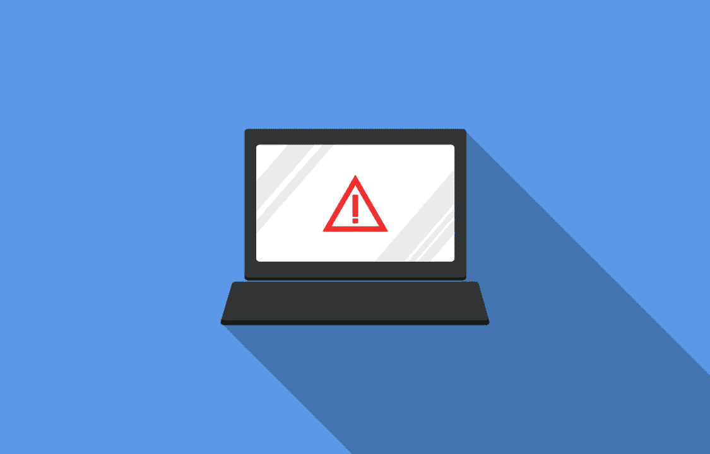
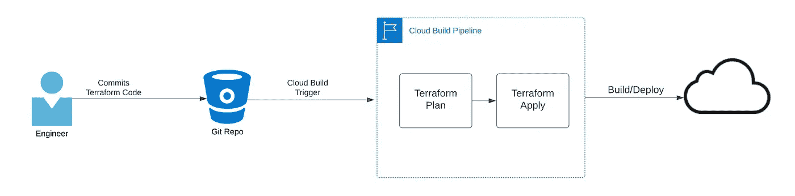
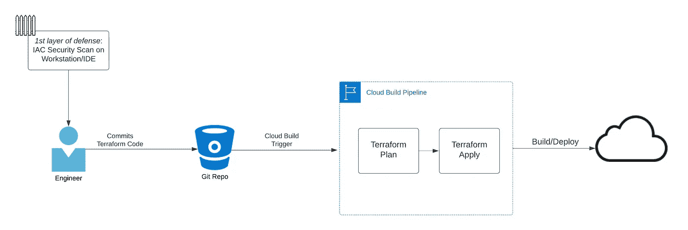
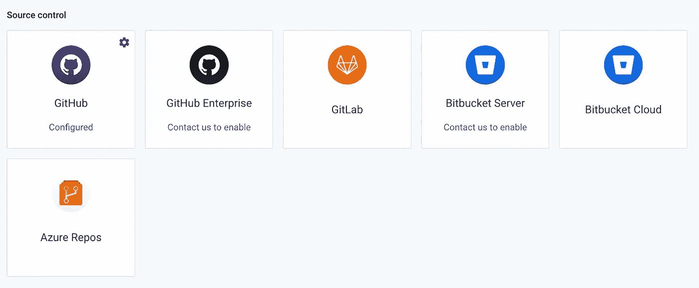
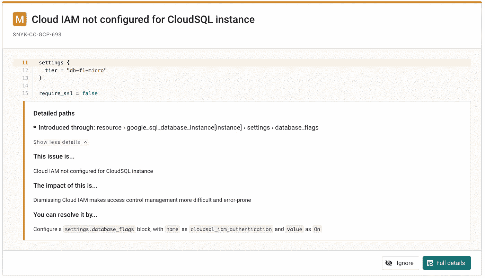
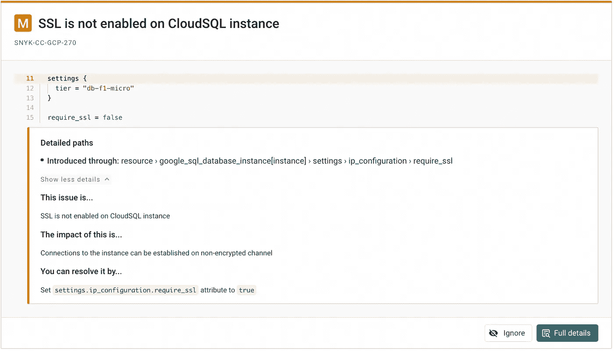
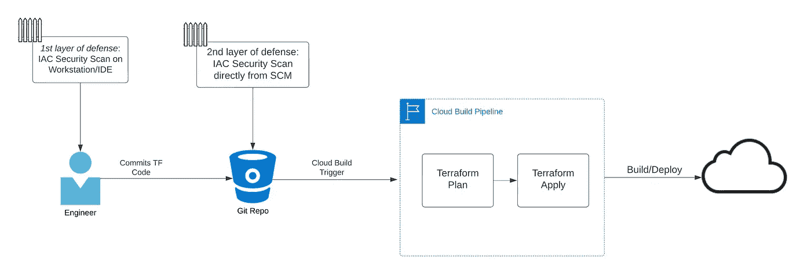
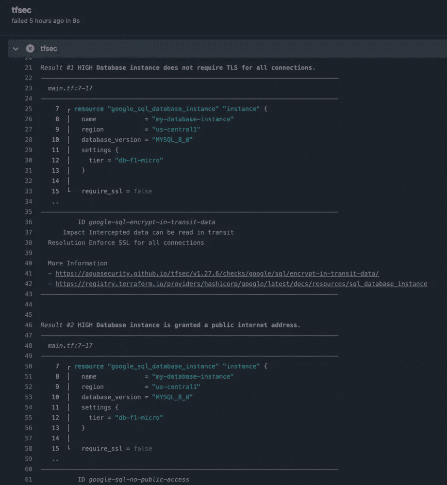
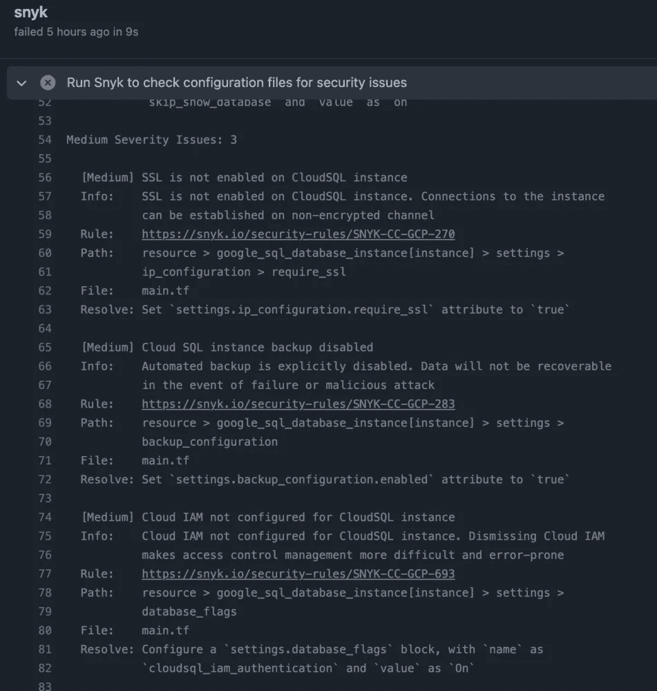
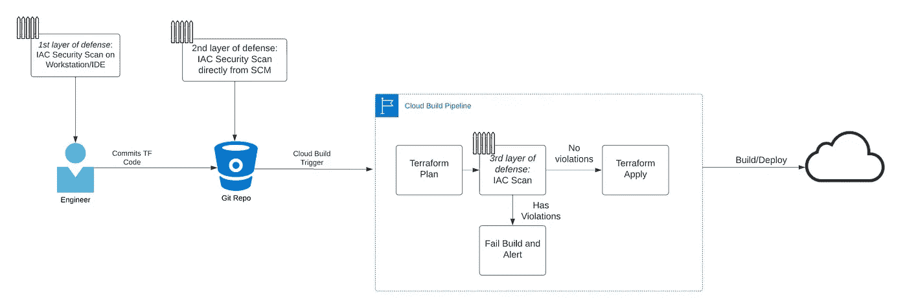

# 基础设施作为代码安全扫描的重要性

> 原文：<https://infosecwriteups.com/the-importance-of-infrastructure-as-code-security-scanning-7add9e8dbb06?source=collection_archive---------0----------------------->

来自 Pixabay 的标题

# 将基础设施用作代码而不进行安全测试的问题是

如今，大多数(如果不是所有的话)公司都看到了通过基础设施即代码(IAC)部署基础设施的价值，无论是 Terraform、AWS CDK 还是 Cloudformation、Azure RM Templates 或其他。然而，我敢打赌，并不是所有的组织都在实现或者甚至考虑为他们的 IAC 代码添加任何安全性测试。云错误配置正成为恶意实体违规的常见根本原因。对整个互联网开放防火墙的公共 S3 桶和计算实例只是工程师可以部署的许可配置的几个例子。如果你不小心的话，这些错误的配置会让你的公司损失数万亿美元。

你可能已经看过我以前的[文章](https://www.linkedin.com/pulse/how-protect-your-google-cloud-organization-from-security-santos/?trackingId=o%2BqSeu3MROeKgHUb%2BAPMrA%3D%3D)，关于谷歌云中自动修复的重要性，以及自动修复如何帮助你检测和应对通过你的安全大门的错误配置。在这篇文章中，我将后退一步，谈谈在 IAC 开发生命周期中增加安全性的重要性，以帮助在部署到云环境之前防止错误配置。

# 我们如何将基础设施扫描为错误配置的代码？

有许多工具，包括开源的、免费的和付费的，可以帮助你扫描你的 IAC 模板，找出不需要的配置。一些例子是 Aquasec 的 [tfsec](https://github.com/aquasecurity/tfsec) ，Snyk [IAC](https://snyk.io/product/infrastructure-as-code-security/) ，Palo Alto Bridgecrew 的 [Checkov](https://www.checkov.io/) ，Checkmarx 的 [KICS](https://kics.io/) ， [datree](https://github.com/datreeio/datree) ，以及随 Terraform Cloud/Enterprise 软件包提供的 Hashicorp 的 [Sentinel](https://www.terraform.io/cloud-docs/sentinel) 。所有这些工具都可以帮助我们防止 IAC 配置错误。

首先，请记住下面的工作流，它展示了一种非常简单的方法，在添加安全性之前，我们可以在云中端到端地部署 IAC。我们将讨论端到端工作流中可以集成安全性测试的三个不同领域。我们还将在不同领域使用此[回购](https://github.com/donsantos/dvtf)作为示例。

简单的 IAC 工作流程

# 在工作站(CLI、IDE 等)中本地扫描源代码。)

让我们从本地扫描源代码开始。作为一个安全组织，我们的工作是尽可能减少安全漏洞。一种方法是启用将要部署的 IAC 工程师。如果我们看一下上面的工作流程，它是从工程师开始的。我们可以为工程师提供工具，让他们能够从工作站直接扫描 IAC。Aquasec 的 tfsec 是使用命令行界面(CLI)测试 IAC 的一个很好的例子。拥有一个可以在本地扫描 IAC 的工具，工程师就可以按需运行自助扫描。通过为工程师提供像 tfsec 这样的自助服务工具，安全团队也可以从中受益，减少提交给源代码管理(SCM)工具的安全错误配置。

下面是在我的工作站的 CLI 中针对示例 Terraform repo 本地运行的 tfsec 的输出示例。

tfsec CLI 的输出

Tfsec 在显示哪些 Terraform 资源可能违反安全策略方面做得很好。在上面的例子中，我们可以看到 tfsec 选择了没有配置为需要 SSL 的 cloudsql 实例，并且它被授予了公共 internet 访问权限。这些只是安全团队不一定想要的一些控件。这些工具还提供了一些关于这些发现意味着什么的有用信息，以及如何保护资源的示例。

这个例子完成后，我们可以在工作流中指出我们可以实现第一层防御的地方，如下所示。

IAC 工作流程中的第一道防线

# 直接从你的 SCM (Github，Bitbucket，Gitlab 等)扫描源代码。)

有像 Snyk 这样的工具可以和你的配置管理工具集成。现在，Snyk 不仅仅是 IAC 的工具，它还可以用来扫描应用程序代码、工件和容器注册表。Snyk 还可以集成到持续集成工具，以及 VSCode 或 Sublime 之类的 ide 中。下面是 Snyk 可以集成的配置管理工具的片段。

Snyk 可用的 SCM 集成

使用包含易受攻击的 Terraform 代码的示例 repo，下面是 Snyk IAC 扫描的结果，Snyk 显示我们的 Google Cloud SQL 实例没有强制使用 SSL，也没有配置 IAM。Snyk 也很好地展示了这种配置的影响以及我们如何解决它。

未针对 CloudSQL 配置 Cloud IAM 的 Snyk 控制台输出

没有为 CloudSQL 启用 SSL 的 Snyk 控制台输出

将 SCM 直接集成到像 Snyk 这样的 IAC 扫描工具中有利于保护您的开发生命周期。扫描您的 SCM 增加了一层额外的安全性，可以捕获工程师可能不会通过他们的本地工作站/CLI 扫描的代码。有了这一增加，我们现在可以看到我们在工作流程中的第二层防御。

IAC 工作流程中的第二层防御

# 浏览 orchestrator (Github、Jenkins、Cloudbuild 等)中的构建步骤。)

我们现在已经讨论了端到端工作流中的两个方面，即如何为 IAC 实现安全性测试。让我们再讨论一个地方，在 IAC 部署到您的云之前，我们可以在那里添加安全性测试。

如果我们看一下部署 IAC 的工作流程，没有任何东西自动检查部署管道中的 Terraform 代码，以查看是否有我们不认可的配置。假设您的云环境中没有预防性控制，在这种情况下，Google Cloud 组织策略，当前的流程仍然允许工程师使用许可的防火墙或可公开访问的存储桶来部署计算实例。我肯定我们不希望这样。

在这里，我们可以添加一个像 tfsec 或 Snyk 这样的工具，作为一个构建步骤来扫描 terraform 中我们不想要的配置。下面的流程显示了添加一个将基础设施扫描为代码的步骤如何在部署之前防止错误配置。如果正在部署的代码有违规，我们可以创建一个步骤来使构建失败，并用从构建日志中提取的必要信息警告必要的团队。

让我们使用 Github Actions 作为针对易受攻击的 IAC 代码的示例 orchestrator。我们将使用 Snyk 和 tfsec 来扫描 Github 操作中的 IAC。Snyk 和 [tfsec](https://github.com/aquasecurity/tfsec-action) 在记录 Github 行为的例子方面都做得很好。如下所示，您可以看到构建步骤由于在部署管道期间捕获错误而失败。

tfsec Github 操作输出

Snyk Github 动作输出

您可以更进一步，为由于这些违规而导致的失败构建添加警报。

IAC 工作流程中的第三层防御

所以现在我们可以将第三层防御添加到您的 IAC 开发生命周期中。这些层对于确保 IAC 开发的安全是必不可少的，因为它们提供了安全性和安心，以确保在部署到您的技术环境之前发现错误配置。

# 那么…为什么这很重要？

像上面提到的那样，在开发的早期实现安全步骤可以帮助您防止错误配置被部署到您的技术环境中。云错误配置给公司带来了巨大的财务和声誉损失。一个例子是数据泄漏，这是一种常见的违规行为，可能是由于配置不当造成的。恶意用户可以访问可能包含私人身份信息或其他高度机密的公司信息的数据。这可能会伤害公司和其他相关人员。

Terraform 只是适合作为代码域的基础设施的一个例子。还有其他像 Azure RM，AWS Cloudformation 或 CDK，Helm Charts，dockerfiles…这个名单可以继续下去。将安全门添加到 IAC 开发生命周期中，允许您强化您的工作流，以获得额外的安全层，这有助于防止组织中的错误配置和违规行为。

# 有几件事需要注意

当您对如何部署 IAC 进行治理时，这个解决方案最有效。如果没有集中部署 IAC 的方法，那么就没有办法确保这些防御层被添加到您的环境中。至关重要的是，您的组织将如何部署 IAC 的方法集中起来，以便您可以开始实施这些控制。

如果您对在开发生命周期中增加更多的安全性感兴趣，我建议您深入了解 DevSecOps，并将安全性留给开发人员。这一概念带来了让开发人员和工程师能够用键盘操作进入你的云和基础设施的代码的想法。在开发的早期阶段实现安全性有助于组织受益，并有可能保护您免受恶意破坏。这也可能让你免于一次代价高昂的泄密。

# 关于唐

Don 是埃森哲公司的安全经理，主要负责应用安全、云安全和开发安全。他在财富 100 强公司中担任角色，负责运行云和应用程序安全评估，同时围绕客户的生态系统实施安全测试和控制。有兴趣将其部署到您的环境中吗？让我们[连线](https://www.linkedin.com/in/donsantos/)！

# 免责声明:

我的帖子反映了我自己的观点，不一定代表我的雇主埃森哲的观点。这篇博文中的信息是一般性的，没有考虑到您的 IT 生态系统和网络的具体需求，这些需求可能会有所不同，需要采取独特的措施。在决定使用上述任何工具时，您应该独立评估您的具体需求。tfsec 和 Snyk 等。工具不是埃森哲的工具。埃森哲不表示其已审查或认可这些工具，埃森哲对这些工具的使用、有效性或因使用这些工具而导致的任何中断或损失不承担任何责任。

*最初发表于*[*【https://www.linkedin.com】*](https://www.linkedin.com/pulse/importance-infrastructure-code-security-scanning-don-antonio-santos/?trackingId=DtFWYgoeRterXI53OScegA%3D%3D)*。*

## 来自 Infosec 的报道:Infosec 每天都有很多内容，很难跟上。[加入我们的每周简讯](https://weekly.infosecwriteups.com/)以 5 篇文章、4 个线程、3 个视频、2 个 GitHub Repos 和工具以及 1 个工作提醒的形式免费获取所有最新的 Infosec 趋势！