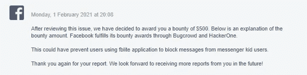
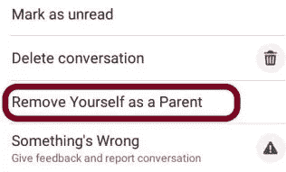

# 无敌小子

> 原文：<https://infosecwriteups.com/the-invincible-kid-7ac1ce2887c0?source=collection_archive---------1----------------------->

…

> 这篇短文写的是脸书精简版中的一个漏洞，这个漏洞使得任何人都无法阻止脸书精简版用户使用。

…

U 唱**信使小孩**；用户可以为他们的孩子创建一个消息帐户。用户也可以选择添加他们的任何脸书朋友作为孩子的父母/监护人。在此之后，他们会被自动添加为孩子的监护人之一，无需他们的同意或任何形式的邀请。然而，如果他们愿意，他们可以解除监护人的角色；使用脸书网站或脸书应用程序。但是，**在《脸书简装版》中，当添加一个孩子的监护人时，并没有这样的功能让自己脱离这个角色。**

> **>为什么这个东西会是个问题？**

**因为脸书有一项政策，家长帐户不能屏蔽自己孩子帐户的消息**。

现在，利用这两个要点，攻击者可以简单地创建一个攻击场景，在这个场景中，他可以攻击任何与他/她是朋友的用户。简单地说，他可以创建一个 Messenger Kid 帐户，并将受害者添加到孩子的家长角色中。这将允许他/她使用 kid 帐户无限制地向受害者发送消息，而不会被阻止。

即使受害者屏蔽了攻击者的真实帐户，受害者也没有办法使用脸书 Lite 屏蔽 Kid 帐户的消息。

#无敌小子。

> **再现步骤**
> ==
> 1。攻击者转到 messenger 儿童控制部分(使用 web 或应用程序)。
> 2。攻击者然后添加受害者作为孩子帐户的监护人。
> 3。受害者收到通知(用户 A 已将您添加为…的监护人。).
> 4。受害者无法摆脱这个角色。
> 5。攻击者然后使用 Messenger Kids 打开孩子的帐户，并向受害者发送消息。6。受害者试图屏蔽孩子的信息，但做不到。
> 7。受害者然后阻止攻击者从消息以及从脸书。8。攻击者仍然可以永远使用孩子的帐户向受害者发送消息，而不会被阻止或害怕被阻止。

***或者，你可以在这里看到 POC 视频*******。****

*…*

***报告线程的时间线***

> **报道—*2020 年 11 月 20 日星期五*
> 
> **预审—*2020 年 11 月 25 日，星期三*
> 
> *2020 年 11 月 26 日星期四*
> 
> *共享的附加信息—2020 年 12 月 17 日，星期四*
> 
> *要求更新—2021 年 1 月 1 日星期五*
> 
> *2021 年 2 月 1 日，星期一*

**

*脸书奖励信息*

> **固定—*2021 年 2 月 17 日星期三*

**

***脸书在 FBLite 中增加了一个新功能来解决这个问题***

> **固定确认—*2021 年 2 月 23 日星期二*
> 
> *旁路发送[可在 mbasic.facebook.com 和 m.facebook.com 生产]——2021 年 2 月 23 日星期二*
> 
> *未接受绕过[原因:对这些站点影响不大] &报告最终结束—2021 年 3 月 1 日星期一*

## ***…***

## **感谢您阅读这篇关于一个简单漏洞的文章。如果您有任何建议/疑问，我可以在* [*脸书*](https://www.facebook.com/samiparyalfb/)*/*[*insta gram*](https://www.instagram.com/samiparyal_/)*上找到您。**

## *…*