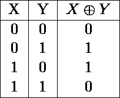
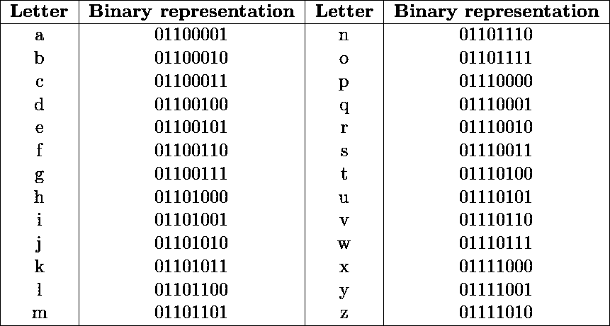
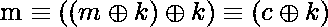
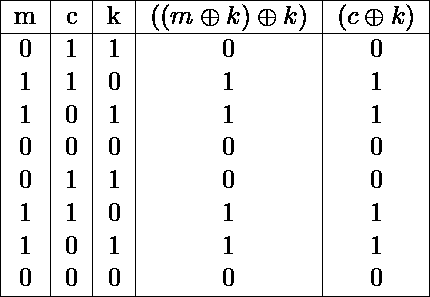

# 异或密码的制作

> 原文：<https://infosecwriteups.com/the-making-of-the-xor-cipher-794d2e6c964f?source=collection_archive---------1----------------------->

## m ≦((m⊕k)⊕k)≦( c⊕k)的数学证明

基础图片:[臀部漫画](https://www.hipcomic.com/listing/front-page-detective-11-1940-dell-one-armed-woman-female-safe-cracker-g/3754880)

# 目录一览

1.  介绍
2.  问题和解决方案
3.  异或密码的证明
4.  最后的想法
5.  承认
6.  引用的作品

# 介绍

F ellow *InfoSec 文章*投稿人 [ofer shmueli](https://medium.com/u/e0468f1e1129?source=post_page-----794d2e6c964f--------------------------------) 最近发表了一篇讨论 base64 编码的优秀介绍性文章( [Shmueli，2021](https://archive.is/EBKw2) )，我建议刚开始接触网络安全(或一般的 ICT)的人看一看。为了纪念 Shmueli 的贡献，我想我会讨论一个数学定理及其证明，它可以给我们信心，XOR 密码将总是有效。

# 问题和解决方案

对于大多数有记载的历史来说，人类总是发现自己需要将书面信息从一方传递到另一方，而不用担心某个第三方会知道它的内容。密码学是一个试图通过“将[信息]转换成非预期接收者无法理解的[一种]形式”来解决这一问题的领域( [Fruhlinger，2020](https://archive.is/fQ3hH) )。在信息时代， *XOR 密码*为更复杂的密码算法提供了基础，如 *Rijndael* 或 *Blowfish* 算法。

现代计算机以代表“开”或“关”电状态的二进制数字存储信息，这些电状态通过称为*逻辑门*的电路，该电路根据特定逻辑门的实现和布尔代数的规则来“评估”——因为缺乏更好的术语——这些电状态。

“异或”是一个按位运算符，它由给定二进制变量`X`和`Y`的下列真值表定义:

正如 Shmueli (2021) 所解释的，ASCII 字符以二进制形式存储。例如，`*`字符用二进制表示为`101010.`。掌握了计算机最终如何存储 ASCII 字符以及 XOR 运算的工作定义之后，我们可以继续演示 XOR 密码。

我想将消息“eve kissed steve yesterday”(小写，区分大小写)传输给朋友，但不希望第三方获取其中包含的信息。我会把信息写在纸上，并假设我正在和一个毫不犹豫地攻击我并强行拿走信的对手打交道。为了挫败我的对手，我将使用一个简单的异或密码来加密我的消息。

我将拿出一个我自己和我的预定接收者都知道的密钥(在这个例子中，显然没有引号)，并用它来加密消息。加密消息的过程如下:

> “先用二进制表示密钥。然后，对于未加密消息中的每个字符，用二进制表示该字符，并将未加密消息的每个位与密钥的相应位进行异或运算。—我试着用英语解释一个算法

我不太擅长解释事情😋

因此，我将举例说明。我将首先定义一个字符集，并为其分配二进制值:

ASCII 中定义的小写字母的二进制表示

***注意*** 表示*空格*字符已经映射到`0100000.`

通过 ASCII 字符到预定义字节的一致映射，我们现在可以加密消息:

***注意*** 我将密文表示为二进制，因为有些字符是不可读的(比如`00000001`代表“标题的开始”))还要注意，这里可能会有错误，我部分是手工做的😂

XOR 密码的有趣之处在于，要解密密文，只需用密钥对密文中的每个字符进行 XOR 运算，消息就会被解密。

但是这是如何工作的呢？可以用“黑魔法”来解释吗，或者这只是一种逻辑上的必然性？我打算(希望)证明后者是一种优于前者的方法。

# 异或密码的证明

我不够聪明或有足够的创造力来独自设计 XOR 密码，所以我将根据教科书[计算机科学:跨学科方法(2016，第 992-994 页)](https://isbnsearch.org/isbn/9780134076423)中显示的证明，进行一点点修改。

众所周知，数学和逻辑是计算机科学的支柱。虽然许多软件工程师可能满足于通过单元测试或模糊化来证明他们的软件是可靠的，但是在证明软件是可靠的时候，逻辑证明才是最重要的。证明既是二元的，也是最终的；他们证明数学结构是 100%正确的，不管它们是如何参数化的。Dijkstra (1988) 认为计算机科学应该像纯数学一样教授，因为证明保证了软件的可靠性。

我将从一个数学猜想开始:

设`m`为明文消息，`k`为加密密钥，`c`为加密消息。我认为:

定理

该定理指出，未加密的明文实质上等同于它本身已经用密钥进行了两次 XOR 运算，这又实质上等同于已经用密钥进行了一次 XOR 运算的加密消息。或者，换句话说，XOR 密码在使用两次时将给出一致的明文。

数学家和计算机科学家通常用真值表或代数运算来证明逻辑论点。在这篇文章中，我将使用真值表和一点推论，这将允许一个人在每一种可能的解释下显示数学陈述的结果。 [Zegarelli (2006，第 85–106 页)](https://isbnsearch.org/isbn/9780471799412)为我们提供了一种构建真值表的方法。

定理的证明

真值表的构建方法包括穷尽二元变量的所有可能的组合，然后用二元算术算出它们的解。如果被测量的逻辑语句和变量的输出在每一行中都是相同的(在我们的例子中，是构造`m`、`(m⊕k)⊕k`和`c⊕k`)，那么这个猜想就被证明了，并被授予了“定理”的称号

## 视频讨论关于异或的证明

我为感兴趣的人做了一个视频演示。在文章中，我还讨论了用二元代数来证明猜想的方法。

如果你想听我用最笨拙的方式解释 XOR 密码，看看这个:

# 最后的想法

我再次感谢 ofer shmueli 的文章，他讨论了 base64 的内部工作原理。我认为黑客可以从理论计算机科学中受益，将它作为他们主要研究方法的补充，包括修补。此外，我(希望)已经说服你，读者，在计算机的世界里，无论一个操作多么复杂，总有一个合乎逻辑的解释。

# 承认

看看我的朋友 [0UR4N05](https://medium.com/u/69be23fb2c8d?source=post_page-----794d2e6c964f--------------------------------) ，他们一直非常支持我，并且有令人惊叹的渗透测试教程。同样在精英知识黑客版块，我们有 [zprytka](https://medium.com/u/b2b0d9d0afb2?source=post_page-----794d2e6c964f--------------------------------) 和 Twitter 用户 [@krichard1212](https://twitter.com/krichard1212) 。

# 引用的作品

Dijkstra，E. W. (1988)。*论真正教计算机科学的残酷*。德克萨斯大学奥斯汀分校。2021 年 5 月 19 日检索自:[https://www.cs.utexas.edu/users/EWD/ewd10xx/EWD1036.PDF](https://www.cs.utexas.edu/users/EWD/ewd10xx/EWD1036.PDF)

Fruhlinger，J. (2020)。*什么是密码学？算法如何保持信息的秘密和安全*。CSO 在线。2021 年 5 月 19 日检索自:[https://www . csoonline . com/article/3583976/what-is-cryptography-how-algorithms-keep-information-secret-and-safe . html](https://www.csoonline.com/article/3583976/what-is-cryptography-how-algorithms-keep-information-secret-and-safe.html)

Sedgewick，r .和 Wayne，K. (2016)。*计算机科学:跨学科方法(第一版)*。艾迪森-韦斯利专业版。

Shmueli，O. (2021)。 *Base64 讲解*。信息安全报道。2021 年 5 月 19 日检索自:[https://infosecwriteups.com/base64-explained-17cd8864da02](/base64-explained-17cd8864da02)

泽加雷利博士(2006 年)。*假人逻辑(第一版)*。约翰·威利的儿子们。